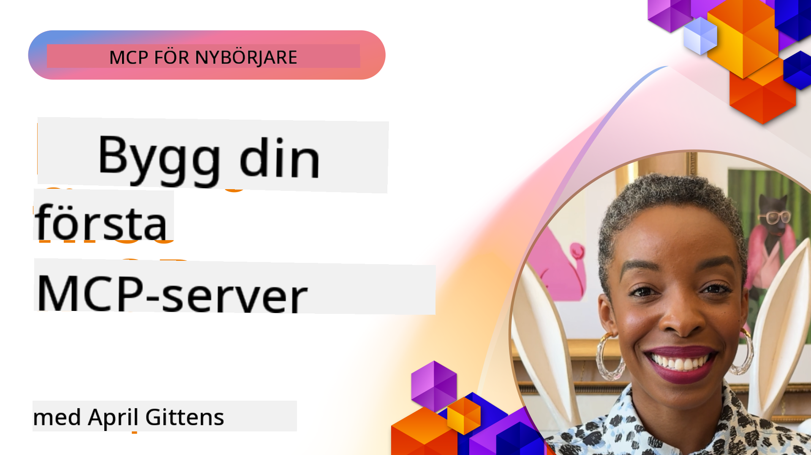

<!--
CO_OP_TRANSLATOR_METADATA:
{
  "original_hash": "1197b6dbde36773e04a5ae826557fdb9",
  "translation_date": "2025-08-26T17:50:08+00:00",
  "source_file": "03-GettingStarted/README.md",
  "language_code": "sv"
}
-->
## Komma igång  

_(Klicka på bilden ovan för att se videon för denna lektion)_

Den här sektionen består av flera lektioner:

- **1 Din första server**, i denna första lektion kommer du att lära dig hur du skapar din första server och inspekterar den med inspektionsverktyget, ett värdefullt sätt att testa och felsöka din server, [till lektionen](01-first-server/README.md)

- **2 Klient**, i denna lektion kommer du att lära dig hur du skriver en klient som kan ansluta till din server, [till lektionen](02-client/README.md)

- **3 Klient med LLM**, ett ännu bättre sätt att skriva en klient är att lägga till en LLM så att den kan "förhandla" med din server om vad den ska göra, [till lektionen](03-llm-client/README.md)

- **4 Konsumera en server GitHub Copilot Agent-läge i Visual Studio Code**. Här tittar vi på att köra vår MCP-server från Visual Studio Code, [till lektionen](04-vscode/README.md)

- **5 stdio Transport Server** stdio transport är den rekommenderade standarden för MCP-server-till-klient-kommunikation enligt den aktuella specifikationen, vilket ger säker kommunikation baserad på subprocess, [till lektionen](05-stdio-server/README.md)

- **6 HTTP Streaming med MCP (Streamable HTTP)**. Lär dig om modern HTTP-streaming, progressnotifikationer och hur du implementerar skalbara, realtids-MCP-servrar och klienter med Streamable HTTP, [till lektionen](06-http-streaming/README.md)

- **7 Utnyttja AI Toolkit för VSCode** för att konsumera och testa dina MCP-klienter och servrar, [till lektionen](07-aitk/README.md)

- **8 Testning**. Här fokuserar vi särskilt på hur vi kan testa vår server och klient på olika sätt, [till lektionen](08-testing/README.md)

- **9 Utrullning**. Detta kapitel tittar på olika sätt att distribuera dina MCP-lösningar, [till lektionen](09-deployment/README.md)

Model Context Protocol (MCP) är ett öppet protokoll som standardiserar hur applikationer tillhandahåller kontext till LLMs. Tänk på MCP som en USB-C-port för AI-applikationer - det ger ett standardiserat sätt att ansluta AI-modeller till olika datakällor och verktyg.

## Lärandemål

I slutet av denna lektion kommer du att kunna:

- Ställa in utvecklingsmiljöer för MCP i C#, Java, Python, TypeScript och JavaScript
- Bygga och distribuera grundläggande MCP-servrar med anpassade funktioner (resurser, prompts och verktyg)
- Skapa värdapplikationer som ansluter till MCP-servrar
- Testa och felsöka MCP-implementationer
- Förstå vanliga installationsutmaningar och deras lösningar
- Ansluta dina MCP-implementationer till populära LLM-tjänster

## Ställa in din MCP-miljö

Innan du börjar arbeta med MCP är det viktigt att förbereda din utvecklingsmiljö och förstå det grundläggande arbetsflödet. Denna sektion guidar dig genom de första stegen för att säkerställa en smidig start med MCP.

### Förutsättningar

Innan du dyker in i MCP-utveckling, se till att du har:

- **Utvecklingsmiljö**: För det språk du valt (C#, Java, Python, TypeScript eller JavaScript)
- **IDE/Editor**: Visual Studio, Visual Studio Code, IntelliJ, Eclipse, PyCharm eller någon modern kodredigerare
- **Paketadministratörer**: NuGet, Maven/Gradle, pip eller npm/yarn
- **API-nycklar**: För de AI-tjänster du planerar att använda i dina värdapplikationer

### Officiella SDK:er

I de kommande kapitlen kommer du att se lösningar byggda med Python, TypeScript, Java och .NET. Här är alla officiellt stödda SDK:er.

MCP tillhandahåller officiella SDK:er för flera språk:
- [C# SDK](https://github.com/modelcontextprotocol/csharp-sdk) - Underhålls i samarbete med Microsoft
- [Java SDK](https://github.com/modelcontextprotocol/java-sdk) - Underhålls i samarbete med Spring AI
- [TypeScript SDK](https://github.com/modelcontextprotocol/typescript-sdk) - Den officiella TypeScript-implementationen
- [Python SDK](https://github.com/modelcontextprotocol/python-sdk) - Den officiella Python-implementationen
- [Kotlin SDK](https://github.com/modelcontextprotocol/kotlin-sdk) - Den officiella Kotlin-implementationen
- [Swift SDK](https://github.com/modelcontextprotocol/swift-sdk) - Underhålls i samarbete med Loopwork AI
- [Rust SDK](https://github.com/modelcontextprotocol/rust-sdk) - Den officiella Rust-implementationen

## Viktiga insikter

- Att ställa in en MCP-utvecklingsmiljö är enkelt med språk-specifika SDK:er
- Att bygga MCP-servrar innebär att skapa och registrera verktyg med tydliga scheman
- MCP-klienter ansluter till servrar och modeller för att utnyttja utökade funktioner
- Testning och felsökning är avgörande för pålitliga MCP-implementationer
- Distributionsalternativ sträcker sig från lokal utveckling till molnbaserade lösningar

## Praktiska övningar

Vi har en uppsättning exempel som kompletterar övningarna du kommer att se i alla kapitel i denna sektion. Dessutom har varje kapitel sina egna övningar och uppgifter.

- [Java Kalkylator](./samples/java/calculator/README.md)
- [.Net Kalkylator](../../../03-GettingStarted/samples/csharp)
- [JavaScript Kalkylator](./samples/javascript/README.md)
- [TypeScript Kalkylator](./samples/typescript/README.md)
- [Python Kalkylator](../../../03-GettingStarted/samples/python)

## Ytterligare resurser

- [Bygg agenter med Model Context Protocol på Azure](https://learn.microsoft.com/azure/developer/ai/intro-agents-mcp)
- [Fjärr-MCP med Azure Container Apps (Node.js/TypeScript/JavaScript)](https://learn.microsoft.com/samples/azure-samples/mcp-container-ts/mcp-container-ts/)
- [.NET OpenAI MCP Agent](https://learn.microsoft.com/samples/azure-samples/openai-mcp-agent-dotnet/openai-mcp-agent-dotnet/)

## Vad händer härnäst

Nästa: [Skapa din första MCP-server](01-first-server/README.md)

---

**Ansvarsfriskrivning**:  
Detta dokument har översatts med hjälp av AI-översättningstjänsten [Co-op Translator](https://github.com/Azure/co-op-translator). Även om vi strävar efter noggrannhet, bör du vara medveten om att automatiserade översättningar kan innehålla fel eller felaktigheter. Det ursprungliga dokumentet på dess originalspråk bör betraktas som den auktoritativa källan. För kritisk information rekommenderas professionell mänsklig översättning. Vi ansvarar inte för eventuella missförstånd eller feltolkningar som uppstår vid användning av denna översättning.