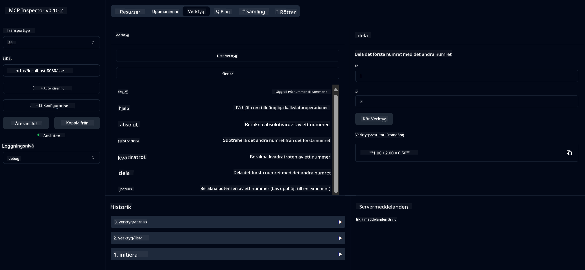

<!--
CO_OP_TRANSLATOR_METADATA:
{
  "original_hash": "13231e9951b68efd9df8c56bd5cdb27e",
  "translation_date": "2025-05-17T13:12:13+00:00",
  "source_file": "03-GettingStarted/samples/java/calculator/README.md",
  "language_code": "sv"
}
-->
# Grundläggande Kalkylator MCP-tjänst

Denna tjänst erbjuder grundläggande kalkylatoroperationer genom Model Context Protocol (MCP) med Spring Boot och WebFlux-transport. Den är utformad som ett enkelt exempel för nybörjare som lär sig om MCP-implementationer.

För mer information, se referensdokumentationen för [MCP Server Boot Starter](https://docs.spring.io/spring-ai/reference/api/mcp/mcp-server-boot-starter-docs.html).

## Översikt

Tjänsten visar:
- Stöd för SSE (Server-Sent Events)
- Automatisk verktygsregistrering med Spring AI:s `@Tool`-annotering
- Grundläggande kalkylatorfunktioner:
  - Addition, subtraktion, multiplikation, division
  - Potensberäkning och kvadratrotsberäkning
  - Modulus (rest) och absolutvärde
  - Hjälpfunktion för operationsbeskrivningar

## Funktioner

Denna kalkylatortjänst erbjuder följande funktioner:

1. **Grundläggande Aritmetiska Operationer**:
   - Addition av två tal
   - Subtraktion av ett tal från ett annat
   - Multiplikation av två tal
   - Division av ett tal med ett annat (med nollkontroll)

2. **Avancerade Operationer**:
   - Potensberäkning (upphöjning av en bas till en exponent)
   - Kvadratrotsberäkning (med kontroll av negativa tal)
   - Modulusberäkning (rest)
   - Absolutvärdesberäkning

3. **Hjälpsystem**:
   - Inbyggd hjälpfunktion som förklarar alla tillgängliga operationer

## Använda Tjänsten

Tjänsten exponerar följande API-slutpunkter genom MCP-protokollet:

- `add(a, b)`: Addera två tal
- `subtract(a, b)`: Subtrahera det andra talet från det första
- `multiply(a, b)`: Multiplicera två tal
- `divide(a, b)`: Dividera det första talet med det andra (med nollkontroll)
- `power(base, exponent)`: Beräkna ett tals potens
- `squareRoot(number)`: Beräkna kvadratroten (med kontroll av negativa tal)
- `modulus(a, b)`: Beräkna resten vid division
- `absolute(number)`: Beräkna absolutvärdet
- `help()`: Få information om tillgängliga operationer

## Testklient

En enkel testklient ingår i `com.microsoft.mcp.sample.client`-paketet. Klassen `SampleCalculatorClient` demonstrerar de tillgängliga operationerna i kalkylatortjänsten.

## Använda LangChain4j-klienten

Projektet inkluderar ett LangChain4j-exempelklient i `com.microsoft.mcp.sample.client.LangChain4jClient` som visar hur man integrerar kalkylatortjänsten med LangChain4j och GitHub-modeller:

### Förutsättningar

1. **GitHub Token Setup**:
   
   För att använda GitHubs AI-modeller (som phi-4) behöver du en personlig åtkomsttoken från GitHub:

   a. Gå till dina GitHub-kontoinställningar: https://github.com/settings/tokens
   
   b. Klicka på "Generate new token" → "Generate new token (classic)"
   
   c. Ge din token ett beskrivande namn
   
   d. Välj följande behörigheter:
      - `repo` (Full kontroll över privata repositories)
      - `read:org` (Läs org- och teammedlemskap, läs org-projekt)
      - `gist` (Skapa gists)
      - `user:email` (Åtkomst till användarens e-postadresser (endast läsning))
   
   e. Klicka på "Generate token" och kopiera din nya token
   
   f. Ställ in den som en miljövariabel:
      
      På Windows:
      ```
      set GITHUB_TOKEN=your-github-token
      ```
      
      På macOS/Linux:
      ```bash
      export GITHUB_TOKEN=your-github-token
      ```

   g. För permanent inställning, lägg till den i dina miljövariabler via systeminställningar

2. Lägg till LangChain4j GitHub-beroendet i ditt projekt (redan inkluderat i pom.xml):
   ```xml
   <dependency>
       <groupId>dev.langchain4j</groupId>
       <artifactId>langchain4j-github</artifactId>
       <version>${langchain4j.version}</version>
   </dependency>
   ```

3. Säkerställ att kalkylatorservern körs på `localhost:8080`

### Köra LangChain4j-klienten

Detta exempel demonstrerar:
- Anslutning till kalkylatorns MCP-server via SSE-transport
- Använda LangChain4j för att skapa en chattbot som utnyttjar kalkylatoroperationer
- Integrering med GitHubs AI-modeller (nu med phi-4-modellen)

Klienten skickar följande exempel förfrågningar för att demonstrera funktionaliteten:
1. Beräkna summan av två tal
2. Hitta kvadratroten av ett tal
3. Få hjälpinformation om tillgängliga kalkylatoroperationer

Kör exemplet och kontrollera konsolutmatningen för att se hur AI-modellen använder kalkylatorverktygen för att svara på förfrågningar.

### GitHub Modellkonfiguration

LangChain4j-klienten är konfigurerad att använda GitHubs phi-4-modell med följande inställningar:

```java
ChatLanguageModel model = GitHubChatModel.builder()
    .apiKey(System.getenv("GITHUB_TOKEN"))
    .timeout(Duration.ofSeconds(60))
    .modelName("phi-4")
    .logRequests(true)
    .logResponses(true)
    .build();
```

För att använda andra GitHub-modeller, ändra bara `modelName`-parametern till en annan stödd modell (t.ex. "claude-3-haiku-20240307", "llama-3-70b-8192", etc.).

## Beroenden

Projektet kräver följande nyckelberoenden:

```xml
<!-- For MCP Server -->
<dependency>
    <groupId>org.springframework.ai</groupId>
    <artifactId>spring-ai-starter-mcp-server-webflux</artifactId>
</dependency>

<!-- For LangChain4j integration -->
<dependency>
    <groupId>dev.langchain4j</groupId>
    <artifactId>langchain4j-mcp</artifactId>
    <version>${langchain4j.version}</version>
</dependency>

<!-- For GitHub models support -->
<dependency>
    <groupId>dev.langchain4j</groupId>
    <artifactId>langchain4j-github</artifactId>
    <version>${langchain4j.version}</version>
</dependency>
```

## Bygga Projektet

Bygg projektet med Maven:
```bash
./mvnw clean install -DskipTests
```

## Köra Servern

### Använda Java

```bash
java -jar target/calculator-server-0.0.1-SNAPSHOT.jar
```

### Använda MCP Inspector

MCP Inspector är ett användbart verktyg för att interagera med MCP-tjänster. För att använda det med denna kalkylatortjänst:

1. **Installera och kör MCP Inspector** i ett nytt terminalfönster:
   ```bash
   npx @modelcontextprotocol/inspector
   ```

2. **Åtkomst till webgränssnittet** genom att klicka på URL:en som visas av appen (vanligtvis http://localhost:6274)

3. **Konfigurera anslutningen**:
   - Ställ in transporttypen till "SSE"
   - Ställ in URL:en till din körande servers SSE-slutpunkt: `http://localhost:8080/sse`
   - Klicka på "Connect"

4. **Använd verktygen**:
   - Klicka på "List Tools" för att se tillgängliga kalkylatoroperationer
   - Välj ett verktyg och klicka på "Run Tool" för att utföra en operation



### Använda Docker

Projektet inkluderar en Dockerfile för containeriserad distribution:

1. **Bygg Docker-avbildningen**:
   ```bash
   docker build -t calculator-mcp-service .
   ```

2. **Kör Docker-containern**:
   ```bash
   docker run -p 8080:8080 calculator-mcp-service
   ```

Detta kommer att:
- Bygga en flerfas-Docker-avbildning med Maven 3.9.9 och Eclipse Temurin 24 JDK
- Skapa en optimerad container-avbildning
- Exponera tjänsten på port 8080
- Starta MCP-kalkylatortjänsten inuti containern

Du kan komma åt tjänsten på `http://localhost:8080` när containern körs.

## Felsökning

### Vanliga problem med GitHub-token

1. **Tokenbehörighetsproblem**: Om du får ett 403 Forbidden-fel, kontrollera att din token har rätt behörigheter enligt förutsättningarna.

2. **Token hittades inte**: Om du får ett "No API key found"-fel, säkerställ att miljövariabeln GITHUB_TOKEN är korrekt inställd.

3. **Begränsning av antal förfrågningar**: GitHub API har begränsningar för antal förfrågningar. Om du stöter på ett begränsningsfel (statuskod 429), vänta några minuter innan du försöker igen.

4. **Tokenutgång**: GitHub-token kan gå ut. Om du får autentiseringsfel efter en tid, generera en ny token och uppdatera din miljövariabel.

Om du behöver ytterligare hjälp, kolla [LangChain4j-dokumentationen](https://github.com/langchain4j/langchain4j) eller [GitHub API-dokumentationen](https://docs.github.com/en/rest).

**Ansvarsfriskrivning**:  
Detta dokument har översatts med hjälp av AI-översättningstjänsten [Co-op Translator](https://github.com/Azure/co-op-translator). Vi strävar efter noggrannhet, men var medveten om att automatiska översättningar kan innehålla fel eller felaktigheter. Det ursprungliga dokumentet på dess modersmål bör betraktas som den auktoritativa källan. För kritisk information rekommenderas professionell mänsklig översättning. Vi ansvarar inte för eventuella missförstånd eller misstolkningar som uppstår vid användning av denna översättning.