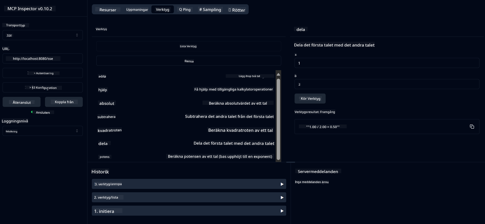

<!--
CO_OP_TRANSLATOR_METADATA:
{
  "original_hash": "13231e9951b68efd9df8c56bd5cdb27e",
  "translation_date": "2025-07-13T22:27:29+00:00",
  "source_file": "03-GettingStarted/samples/java/calculator/README.md",
  "language_code": "sv"
}
-->
# Basic Calculator MCP Service

Denna tjänst tillhandahåller grundläggande kalkylatoroperationer via Model Context Protocol (MCP) med Spring Boot och WebFlux-transport. Den är utformad som ett enkelt exempel för nybörjare som vill lära sig om MCP-implementationer.

För mer information, se referensdokumentationen för [MCP Server Boot Starter](https://docs.spring.io/spring-ai/reference/api/mcp/mcp-server-boot-starter-docs.html).

## Översikt

Tjänsten visar upp:
- Stöd för SSE (Server-Sent Events)
- Automatisk verktygsregistrering med Spring AI:s `@Tool`-annotering
- Grundläggande kalkylatorfunktioner:
  - Addition, subtraktion, multiplikation, division
  - Potensberäkning och kvadratrot
  - Modulus (rest) och absolutvärde
  - Hjälpfunktion för beskrivning av operationer

## Funktioner

Denna kalkylatortjänst erbjuder följande möjligheter:

1. **Grundläggande aritmetiska operationer**:
   - Addition av två tal
   - Subtraktion av ett tal från ett annat
   - Multiplikation av två tal
   - Division av ett tal med ett annat (med kontroll för division med noll)

2. **Avancerade operationer**:
   - Potensberäkning (upphöjning av bas till exponent)
   - Kvadratrotberäkning (med kontroll för negativa tal)
   - Modulusberäkning (rest vid division)
   - Beräkning av absolutvärde

3. **Hjälpsystem**:
   - Inbyggd hjälpfunktion som förklarar alla tillgängliga operationer

## Använda tjänsten

Tjänsten exponerar följande API-endpoints via MCP-protokollet:

- `add(a, b)`: Addera två tal
- `subtract(a, b)`: Subtrahera det andra talet från det första
- `multiply(a, b)`: Multiplicera två tal
- `divide(a, b)`: Dividera det första talet med det andra (med kontroll för noll)
- `power(base, exponent)`: Beräkna potens av ett tal
- `squareRoot(number)`: Beräkna kvadratroten (med kontroll för negativa tal)
- `modulus(a, b)`: Beräkna resten vid division
- `absolute(number)`: Beräkna absolutvärdet
- `help()`: Hämta information om tillgängliga operationer

## Testklient

En enkel testklient finns i paketet `com.microsoft.mcp.sample.client`. Klassen `SampleCalculatorClient` visar de tillgängliga operationerna i kalkylatortjänsten.

## Använda LangChain4j-klienten

Projektet inkluderar ett exempel på LangChain4j-klient i `com.microsoft.mcp.sample.client.LangChain4jClient` som visar hur man integrerar kalkylatortjänsten med LangChain4j och GitHub-modeller:

### Förutsättningar

1. **GitHub Token-inställning**:
   
   För att använda GitHubs AI-modeller (som phi-4) behöver du en personlig åtkomsttoken från GitHub:

   a. Gå till dina GitHub-kontoinställningar: https://github.com/settings/tokens
   
   b. Klicka på "Generate new token" → "Generate new token (classic)"
   
   c. Ge din token ett beskrivande namn
   
   d. Välj följande behörigheter:
      - `repo` (Full kontroll över privata repositories)
      - `read:org` (Läsa organisation och team-medlemskap, läsa organisationsprojekt)
      - `gist` (Skapa gists)
      - `user:email` (Åtkomst till användarens e-postadresser (endast läs))
   
   e. Klicka på "Generate token" och kopiera din nya token
   
   f. Sätt den som en miljövariabel:
      
      På Windows:
      ```
      set GITHUB_TOKEN=your-github-token
      ```
      
      På macOS/Linux:
      ```bash
      export GITHUB_TOKEN=your-github-token
      ```

   g. För permanent inställning, lägg till den i dina miljövariabler via systeminställningarna

2. Lägg till LangChain4j GitHub-dependency i ditt projekt (redan inkluderad i pom.xml):
   ```xml
   <dependency>
       <groupId>dev.langchain4j</groupId>
       <artifactId>langchain4j-github</artifactId>
       <version>${langchain4j.version}</version>
   </dependency>
   ```

3. Se till att kalkylatorsservern körs på `localhost:8080`

### Köra LangChain4j-klienten

Detta exempel visar:
- Anslutning till kalkylatorns MCP-server via SSE-transport
- Användning av LangChain4j för att skapa en chattbot som använder kalkylatoroperationer
- Integration med GitHub AI-modeller (nu med phi-4-modellen)

Klienten skickar följande exempel-frågor för att demonstrera funktionaliteten:
1. Beräkna summan av två tal
2. Hitta kvadratroten av ett tal
3. Få hjälpinfo om tillgängliga kalkylatoroperationer

Kör exemplet och kontrollera konsolutdata för att se hur AI-modellen använder kalkylatorverktygen för att svara på frågor.

### GitHub-modellkonfiguration

LangChain4j-klienten är konfigurerad att använda GitHubs phi-4-modell med följande inställningar:

```java
ChatLanguageModel model = GitHubChatModel.builder()
    .apiKey(System.getenv("GITHUB_TOKEN"))
    .timeout(Duration.ofSeconds(60))
    .modelName("phi-4")
    .logRequests(true)
    .logResponses(true)
    .build();
```

För att använda andra GitHub-modeller, ändra bara `modelName`-parametern till en annan stödd modell (t.ex. "claude-3-haiku-20240307", "llama-3-70b-8192", osv.).

## Beroenden

Projektet kräver följande viktiga beroenden:

```xml
<!-- For MCP Server -->
<dependency>
    <groupId>org.springframework.ai</groupId>
    <artifactId>spring-ai-starter-mcp-server-webflux</artifactId>
</dependency>

<!-- For LangChain4j integration -->
<dependency>
    <groupId>dev.langchain4j</groupId>
    <artifactId>langchain4j-mcp</artifactId>
    <version>${langchain4j.version}</version>
</dependency>

<!-- For GitHub models support -->
<dependency>
    <groupId>dev.langchain4j</groupId>
    <artifactId>langchain4j-github</artifactId>
    <version>${langchain4j.version}</version>
</dependency>
```

## Bygga projektet

Bygg projektet med Maven:
```bash
./mvnw clean install -DskipTests
```

## Köra servern

### Med Java

```bash
java -jar target/calculator-server-0.0.1-SNAPSHOT.jar
```

### Med MCP Inspector

MCP Inspector är ett användbart verktyg för att interagera med MCP-tjänster. För att använda det med denna kalkylatortjänst:

1. **Installera och starta MCP Inspector** i ett nytt terminalfönster:
   ```bash
   npx @modelcontextprotocol/inspector
   ```

2. **Öppna webbgränssnittet** genom att klicka på URL:en som visas av appen (vanligtvis http://localhost:6274)

3. **Konfigurera anslutningen**:
   - Sätt transporttypen till "SSE"
   - Ange URL till din körande servers SSE-endpoint: `http://localhost:8080/sse`
   - Klicka på "Connect"

4. **Använd verktygen**:
   - Klicka på "List Tools" för att se tillgängliga kalkylatoroperationer
   - Välj ett verktyg och klicka på "Run Tool" för att köra en operation



### Med Docker

Projektet innehåller en Dockerfile för containeriserad distribution:

1. **Bygg Docker-imagen**:
   ```bash
   docker build -t calculator-mcp-service .
   ```

2. **Kör Docker-containern**:
   ```bash
   docker run -p 8080:8080 calculator-mcp-service
   ```

Detta kommer att:
- Bygga en multi-stage Docker-image med Maven 3.9.9 och Eclipse Temurin 24 JDK
- Skapa en optimerad container-image
- Exponera tjänsten på port 8080
- Starta MCP kalkylatortjänsten inuti containern

Du kan nå tjänsten på `http://localhost:8080` när containern körs.

## Felsökning

### Vanliga problem med GitHub-token

1. **Token-behörighetsproblem**: Om du får ett 403 Forbidden-fel, kontrollera att din token har rätt behörigheter enligt förutsättningarna.

2. **Token hittades inte**: Om du får ett "No API key found"-fel, se till att miljövariabeln GITHUB_TOKEN är korrekt satt.

3. **Begränsning av anrop**: GitHub API har begränsningar för antal anrop. Om du får ett fel med statuskod 429, vänta några minuter innan du försöker igen.

4. **Token har gått ut**: GitHub-tokens kan löpa ut. Om du får autentiseringsfel efter en tid, skapa en ny token och uppdatera din miljövariabel.

Om du behöver mer hjälp, se [LangChain4j-dokumentationen](https://github.com/langchain4j/langchain4j) eller [GitHub API-dokumentationen](https://docs.github.com/en/rest).

**Ansvarsfriskrivning**:  
Detta dokument har översatts med hjälp av AI-översättningstjänsten [Co-op Translator](https://github.com/Azure/co-op-translator). Även om vi strävar efter noggrannhet, vänligen observera att automatiska översättningar kan innehålla fel eller brister. Det ursprungliga dokumentet på dess modersmål bör betraktas som den auktoritativa källan. För kritisk information rekommenderas professionell mänsklig översättning. Vi ansvarar inte för eventuella missförstånd eller feltolkningar som uppstår vid användning av denna översättning.