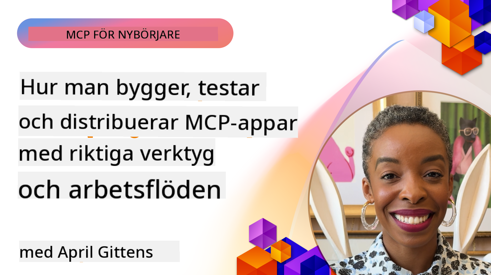
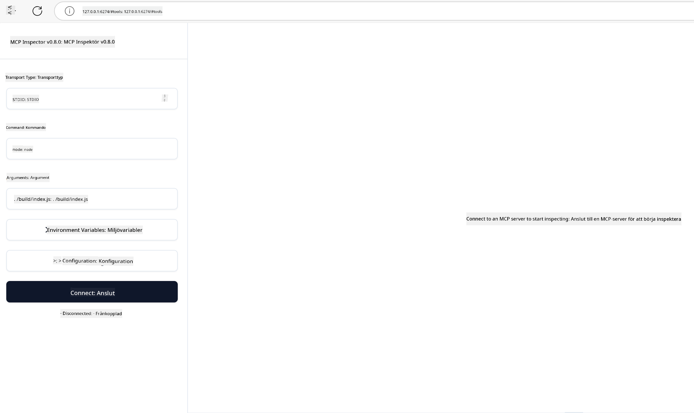

<!--
CO_OP_TRANSLATOR_METADATA:
{
  "original_hash": "83efa75a69bc831277263a6f1ae53669",
  "translation_date": "2025-08-18T14:46:39+00:00",
  "source_file": "04-PracticalImplementation/README.md",
  "language_code": "sv"
}
-->
# Praktisk Implementering

[](https://youtu.be/vCN9-mKBDfQ)

_(Klicka på bilden ovan för att se videon för denna lektion)_

Praktisk implementering är där kraften i Model Context Protocol (MCP) blir påtaglig. Även om det är viktigt att förstå teorin och arkitekturen bakom MCP, uppstår det verkliga värdet när du tillämpar dessa koncept för att bygga, testa och distribuera lösningar som löser verkliga problem. Detta kapitel överbryggar klyftan mellan konceptuell kunskap och praktisk utveckling och guidar dig genom processen att förverkliga MCP-baserade applikationer.

Oavsett om du utvecklar intelligenta assistenter, integrerar AI i affärsarbetsflöden eller bygger skräddarsydda verktyg för databehandling, erbjuder MCP en flexibel grund. Dess språkoberoende design och officiella SDK:er för populära programmeringsspråk gör det tillgängligt för en bred skara utvecklare. Genom att använda dessa SDK:er kan du snabbt skapa prototyper, iterera och skala dina lösningar över olika plattformar och miljöer.

I de följande avsnitten hittar du praktiska exempel, exempel på kod och distributionsstrategier som visar hur man implementerar MCP i C#, Java med Spring, TypeScript, JavaScript och Python. Du kommer också att lära dig hur man felsöker och testar MCP-servrar, hanterar API:er och distribuerar lösningar till molnet med Azure. Dessa praktiska resurser är utformade för att påskynda ditt lärande och hjälpa dig att bygga robusta, produktionsklara MCP-applikationer med självförtroende.

## Översikt

Denna lektion fokuserar på de praktiska aspekterna av MCP-implementering över flera programmeringsspråk. Vi kommer att utforska hur man använder MCP SDK:er i C#, Java med Spring, TypeScript, JavaScript och Python för att bygga robusta applikationer, felsöka och testa MCP-servrar samt skapa återanvändbara resurser, prompts och verktyg.

## Lärandemål

I slutet av denna lektion kommer du att kunna:

- Implementera MCP-lösningar med hjälp av officiella SDK:er i olika programmeringsspråk
- Systematiskt felsöka och testa MCP-servrar
- Skapa och använda serverfunktioner (Resurser, Prompts och Verktyg)
- Designa effektiva MCP-arbetsflöden för komplexa uppgifter
- Optimera MCP-implementeringar för prestanda och tillförlitlighet

## Officiella SDK-resurser

Model Context Protocol erbjuder officiella SDK:er för flera språk:

- [C# SDK](https://github.com/modelcontextprotocol/csharp-sdk)
- [Java med Spring SDK](https://github.com/modelcontextprotocol/java-sdk) **Obs:** kräver beroende av [Project Reactor](https://projectreactor.io). (Se [diskussionsfråga 246](https://github.com/orgs/modelcontextprotocol/discussions/246).)
- [TypeScript SDK](https://github.com/modelcontextprotocol/typescript-sdk)
- [Python SDK](https://github.com/modelcontextprotocol/python-sdk)
- [Kotlin SDK](https://github.com/modelcontextprotocol/kotlin-sdk)

## Arbeta med MCP SDK:er

Detta avsnitt ger praktiska exempel på hur man implementerar MCP i flera programmeringsspråk. Du kan hitta exempel på kod i `samples`-katalogen organiserad efter språk.

### Tillgängliga Exempel

Förrådet innehåller [exempelimplementeringar](../../../04-PracticalImplementation/samples) på följande språk:

- [C#](./samples/csharp/README.md)
- [Java med Spring](./samples/java/containerapp/README.md)
- [TypeScript](./samples/typescript/README.md)
- [JavaScript](./samples/javascript/README.md)
- [Python](./samples/python/README.md)

Varje exempel demonstrerar viktiga MCP-koncept och implementeringsmönster för det specifika språket och ekosystemet.

## Centrala Serverfunktioner

MCP-servrar kan implementera valfri kombination av dessa funktioner:

### Resurser

Resurser tillhandahåller kontext och data för användaren eller AI-modellen att använda:

- Dokumentförråd
- Kunskapsbaser
- Strukturerade datakällor
- Filsystem

### Prompts

Prompts är mallade meddelanden och arbetsflöden för användare:

- Fördefinierade konversationsmallar
- Guidad interaktionsmönster
- Specialiserade dialogstrukturer

### Verktyg

Verktyg är funktioner som AI-modellen kan utföra:

- Databehandlingsverktyg
- Integrationer med externa API:er
- Beräkningskapaciteter
- Sökfunktionalitet

## Exempelimplementeringar: C#-implementering

Det officiella C# SDK-förrådet innehåller flera exempelimplementeringar som demonstrerar olika aspekter av MCP:

- **Grundläggande MCP-klient**: Enkelt exempel som visar hur man skapar en MCP-klient och anropar verktyg
- **Grundläggande MCP-server**: Minimal serverimplementering med grundläggande verktygsregistrering
- **Avancerad MCP-server**: Fullfjädrad server med verktygsregistrering, autentisering och felhantering
- **ASP.NET-integration**: Exempel som demonstrerar integration med ASP.NET Core
- **Mönster för verktygsimplementering**: Olika mönster för att implementera verktyg med olika komplexitetsnivåer

C# MCP SDK är i förhandsvisning och API:er kan ändras. Vi kommer kontinuerligt att uppdatera denna blogg i takt med att SDK:n utvecklas.

### Viktiga Funktioner

- [C# MCP Nuget ModelContextProtocol](https://www.nuget.org/packages/ModelContextProtocol)
- Bygga din [första MCP-server](https://devblogs.microsoft.com/dotnet/build-a-model-context-protocol-mcp-server-in-csharp/).

För kompletta C#-implementeringsexempel, besök [officiella C# SDK-exempelförrådet](https://github.com/modelcontextprotocol/csharp-sdk)

## Exempelimplementering: Java med Spring-implementering

Java med Spring SDK erbjuder robusta MCP-implementeringsalternativ med företagsklassade funktioner.

### Viktiga Funktioner

- Integration med Spring Framework
- Stark typkontroll
- Stöd för reaktiv programmering
- Omfattande felhantering

För ett komplett Java med Spring-implementeringsexempel, se [Java med Spring-exempel](samples/java/containerapp/README.md) i exempelkatalogen.

## Exempelimplementering: JavaScript-implementering

JavaScript SDK erbjuder ett lättviktigt och flexibelt tillvägagångssätt för MCP-implementering.

### Viktiga Funktioner

- Stöd för Node.js och webbläsare
- Promise-baserat API
- Enkel integration med Express och andra ramverk
- Stöd för WebSocket för streaming

För ett komplett JavaScript-implementeringsexempel, se [JavaScript-exempel](samples/javascript/README.md) i exempelkatalogen.

## Exempelimplementering: Python-implementering

Python SDK erbjuder ett Pythoniskt tillvägagångssätt för MCP-implementering med utmärkta integrationer för ML-ramverk.

### Viktiga Funktioner

- Stöd för async/await med asyncio
- Integration med FastAPI
- Enkel verktygsregistrering
- Inbyggd integration med populära ML-bibliotek

För ett komplett Python-implementeringsexempel, se [Python-exempel](samples/python/README.md) i exempelkatalogen.

## API-hantering

Azure API Management är ett utmärkt svar på hur vi kan säkra MCP-servrar. Idén är att placera en Azure API Management-instans framför din MCP-server och låta den hantera funktioner som:

- Hastighetsbegränsning
- Tokenhantering
- Övervakning
- Lastbalansering
- Säkerhet

### Azure-exempel

Här är ett Azure-exempel som gör just detta, dvs. [skapar en MCP-server och säkrar den med Azure API Management](https://github.com/Azure-Samples/remote-mcp-apim-functions-python).

Se hur auktorisationsflödet sker i bilden nedan:


I bilden ovan sker följande:

- Autentisering/auktorisering sker med hjälp av Microsoft Entra.
- Azure API Management fungerar som en gateway och använder policies för att styra och hantera trafik.
- Azure Monitor loggar alla förfrågningar för vidare analys.

#### Auktorisationsflöde

Låt oss titta närmare på auktorisationsflödet:


#### MCP-auktorisationsspecifikation

Läs mer om [MCP-auktorisationsspecifikationen](https://modelcontextprotocol.io/specification/2025-03-26/basic/authorization#2-10-third-party-authorization-flow)

## Distribuera Remote MCP-server till Azure

Låt oss se om vi kan distribuera exemplet vi nämnde tidigare:

1. Klona förrådet

    ```bash
    git clone https://github.com/Azure-Samples/remote-mcp-apim-functions-python.git
    cd remote-mcp-apim-functions-python
    ```

1. Registrera `Microsoft.App` resursleverantör.

   - Om du använder Azure CLI, kör `az provider register --namespace Microsoft.App --wait`.
   - Om du använder Azure PowerShell, kör `Register-AzResourceProvider -ProviderNamespace Microsoft.App`. Kör sedan `(Get-AzResourceProvider -ProviderNamespace Microsoft.App).RegistrationState` efter en stund för att kontrollera om registreringen är klar.

1. Kör detta [azd](https://aka.ms/azd)-kommando för att tillhandahålla API-hanteringstjänsten, funktionsappen (med kod) och alla andra nödvändiga Azure-resurser

    ```shell
    azd up
    ```

    Detta kommando bör distribuera alla molnresurser på Azure.

### Testa din server med MCP Inspector

1. I ett **nytt terminalfönster**, installera och kör MCP Inspector

    ```shell
    npx @modelcontextprotocol/inspector
    ```

    Du bör se ett gränssnitt som liknar:

    

1. CTRL-klicka för att ladda MCP Inspector-webbappen från URL:en som visas av appen (t.ex. [http://127.0.0.1:6274/#resources](http://127.0.0.1:6274/#resources))
1. Ställ in transporttypen till `SSE`
1. Ställ in URL:en till din körande API Management SSE-slutpunkt som visas efter `azd up` och **Anslut**:

    ```shell
    https://<apim-servicename-from-azd-output>.azure-api.net/mcp/sse
    ```

1. **Lista Verktyg**. Klicka på ett verktyg och **Kör Verktyg**.

Om alla steg har fungerat bör du nu vara ansluten till MCP-servern och ha kunnat anropa ett verktyg.

## MCP-servrar för Azure

[Remote-mcp-functions](https://github.com/Azure-Samples/remote-mcp-functions-dotnet): Denna uppsättning förråd är snabbstartsmallar för att bygga och distribuera anpassade fjärr-MCP (Model Context Protocol)-servrar med hjälp av Azure Functions med Python, C# .NET eller Node/TypeScript.

Exemplen erbjuder en komplett lösning som gör det möjligt för utvecklare att:

- Bygga och köra lokalt: Utveckla och felsöka en MCP-server på en lokal maskin
- Distribuera till Azure: Enkelt distribuera till molnet med ett enkelt `azd up`-kommando
- Ansluta från klienter: Ansluta till MCP-servern från olika klienter inklusive VS Codes Copilot-agentläge och MCP Inspector-verktyget

### Viktiga Funktioner

- Säkerhet som standard: MCP-servern är säkrad med nycklar och HTTPS
- Autentiseringsalternativ: Stödjer OAuth med inbyggd autentisering och/eller API Management
- Nätverksisolering: Möjliggör nätverksisolering med Azure Virtual Networks (VNET)
- Serverlös arkitektur: Utnyttjar Azure Functions för skalbar, händelsedriven exekvering
- Lokal utveckling: Omfattande stöd för lokal utveckling och felsökning
- Enkel distribution: Strömlinjeformad distributionsprocess till Azure

Förrådet inkluderar alla nödvändiga konfigurationsfiler, källkod och infrastrukturbeskrivningar för att snabbt komma igång med en produktionsklar MCP-serverimplementering.

- [Azure Remote MCP Functions Python](https://github.com/Azure-Samples/remote-mcp-functions-python) - Exempelimplementering av MCP med Azure Functions och Python

- [Azure Remote MCP Functions .NET](https://github.com/Azure-Samples/remote-mcp-functions-dotnet) - Exempelimplementering av MCP med Azure Functions och C# .NET

- [Azure Remote MCP Functions Node/Typescript](https://github.com/Azure-Samples/remote-mcp-functions-typescript) - Exempelimplementering av MCP med Azure Functions och Node/TypeScript.

## Viktiga Insikter

- MCP SDK:er tillhandahåller språksspecifika verktyg för att implementera robusta MCP-lösningar
- Felsöknings- och testprocessen är avgörande för tillförlitliga MCP-applikationer
- Återanvändbara promptmallar möjliggör konsekventa AI-interaktioner
- Välutformade arbetsflöden kan orkestrera komplexa uppgifter med flera verktyg
- Implementering av MCP-lösningar kräver hänsyn till säkerhet, prestanda och felhantering

## Övning

Designa ett praktiskt MCP-arbetsflöde som löser ett verkligt problem inom ditt område:

1. Identifiera 3-4 verktyg som skulle vara användbara för att lösa detta problem
2. Skapa ett arbetsflödesdiagram som visar hur dessa verktyg interagerar
3. Implementera en grundläggande version av ett av verktygen med ditt föredragna språk
4. Skapa en promptmall som hjälper modellen att effektivt använda ditt verktyg

## Ytterligare Resurser

---

Nästa: [Avancerade Ämnen](../05-AdvancedTopics/README.md)

**Ansvarsfriskrivning**:  
Detta dokument har översatts med hjälp av AI-översättningstjänsten [Co-op Translator](https://github.com/Azure/co-op-translator). Även om vi strävar efter noggrannhet, vänligen notera att automatiska översättningar kan innehålla fel eller felaktigheter. Det ursprungliga dokumentet på dess originalspråk bör betraktas som den auktoritativa källan. För kritisk information rekommenderas professionell mänsklig översättning. Vi ansvarar inte för eventuella missförstånd eller feltolkningar som uppstår vid användning av denna översättning.