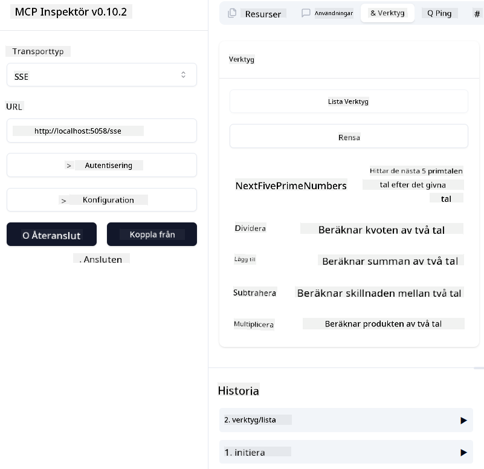
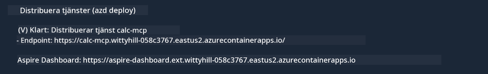

<!--
CO_OP_TRANSLATOR_METADATA:
{
  "original_hash": "5020a3e1a1c7f30c00f9e37f1fa208e3",
  "translation_date": "2025-05-17T14:09:10+00:00",
  "source_file": "04-PracticalImplementation/samples/csharp/README.md",
  "language_code": "sv"
}
-->
# Exempel

Det tidigare exemplet visar hur man använder ett lokalt .NET-projekt med typen `sdio`. Och hur man kör servern lokalt i en container. Detta är en bra lösning i många situationer. Men det kan vara användbart att ha servern igång på distans, som i en molnmiljö. Det är här typen `http` kommer in.

När man tittar på lösningen i mappen `04-PracticalImplementation` kan det verka mycket mer komplext än det tidigare. Men i verkligheten är det inte så. Om du tittar noga på projektet `src/mcpserver/mcpserver.csproj` kommer du att se att det mestadels är samma kod som i det tidigare exemplet. Den enda skillnaden är att vi använder ett annat bibliotek `ModelContextProtocol.AspNetCore` för att hantera HTTP-förfrågningar. Och vi ändrar metoden `IsPrime` för att göra den privat, bara för att visa att du kan ha privata metoder i din kod. Resten av koden är densamma som tidigare.

De andra projekten kommer från [.NET Aspire](https://learn.microsoft.com/dotnet/aspire/get-started/aspire-overview). Att ha .NET Aspire i lösningen kommer att förbättra utvecklarens erfarenhet under utveckling och testning och hjälpa till med observabilitet. Det är inte nödvändigt för att köra servern, men det är en bra praxis att ha det i din lösning.

## Starta servern lokalt

1. Från VS Code (med C# DevKit-tillägget), öppna lösningen `04-PracticalImplementation\samples\csharp\src\Calculator-chap4.sln`.
2. Tryck på `F5` för att starta servern. Det borde starta en webbläsare med .NET Aspire dashboard.

eller

1. Från en terminal, navigera till mappen `04-PracticalImplementation\samples\csharp\src`
2. Kör följande kommando för att starta servern:
   ```bash
    dotnet run --project .\AppHost
   ```

3. Från Dashboard, notera `http` URL. Det borde vara något som `http://localhost:5058/`.

## Test `SSE` med ModelContext Protocol Inspector

Om du har Node.js 22.7.5 och högre, kan du använda ModelContext Protocol Inspector för att testa din server.

Starta servern och kör följande kommando i en terminal:

```bash
npx @modelcontextprotocol/inspector@latest
```



- Välj `SSE` as the Transport type. SSE stand for Server-Sent Events. 
- In the Url field, enter the URL of the server noted earlier,and append `/sse`. Det borde vara `http` (inte `https`) something like `http://localhost:5058/sse`.
- select the Connect button.

A nice thing about the Inspector is that it provide a nice visibility on what is happening.

- Try listing the availables tools
- Try some of them, it should works just like before.


## Test `SSE` with Github Copilot Chat in VS Code

To use the `SSE` transport with Github Copilot Chat, change the configuration of the `mcp-calc` servern skapad tidigare för att se ut så här:

```json
"mcp-calc": {
    "type": "sse",
    "url": "http://localhost:5058/sse"
}
```

Gör några tester:
- Fråga efter de 3 primtalen efter 6780. Notera hur Copilot kommer att använda de nya verktygen `NextFivePrimeNumbers` och bara returnera de första 3 primtalen.
- Fråga efter de 7 primtalen efter 111, för att se vad som händer.

# Distribuera servern till Azure

Låt oss distribuera servern till Azure så fler kan använda den.

Från en terminal, navigera till mappen `04-PracticalImplementation\samples\csharp\src` och kör följande kommando:

```bash
azd init
```

Detta kommer att skapa några filer lokalt för att spara konfigurationen av Azure-resurser och din Infrastruktur som kod (IaC).

Kör sedan följande kommando för att distribuera servern till Azure:

```bash
azd up
```

När distributionen är klar, bör du se ett meddelande som detta:



Navigera till Aspire dashboard och notera `HTTP` URL för att använda den i MCP Inspector och i Github Copilot Chat.

## Vad händer härnäst?

Vi testar olika transporttyper och testverktyg och vi distribuerar även vår MCP-server till Azure. Men vad händer om vår server behöver tillgång till privata resurser? Till exempel, en databas eller ett privat API? I nästa kapitel kommer vi att se hur vi kan förbättra säkerheten på vår server.

**Ansvarsfriskrivning**:  
Detta dokument har översatts med hjälp av AI-översättningstjänsten [Co-op Translator](https://github.com/Azure/co-op-translator). Även om vi strävar efter noggrannhet, var medveten om att automatiserade översättningar kan innehålla fel eller inexaktheter. Det ursprungliga dokumentet på dess modersmål bör betraktas som den auktoritativa källan. För kritisk information rekommenderas professionell mänsklig översättning. Vi ansvarar inte för eventuella missförstånd eller feltolkningar som uppstår vid användning av denna översättning.