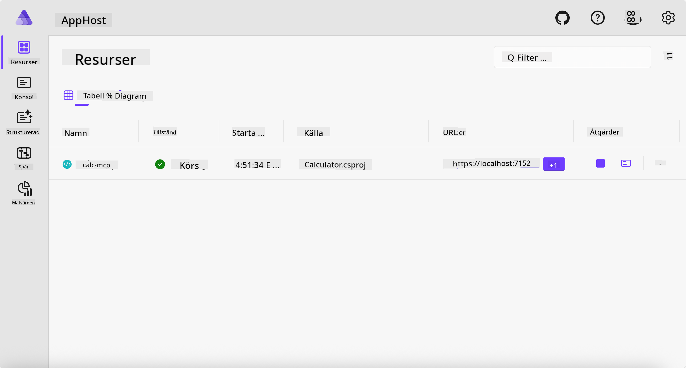
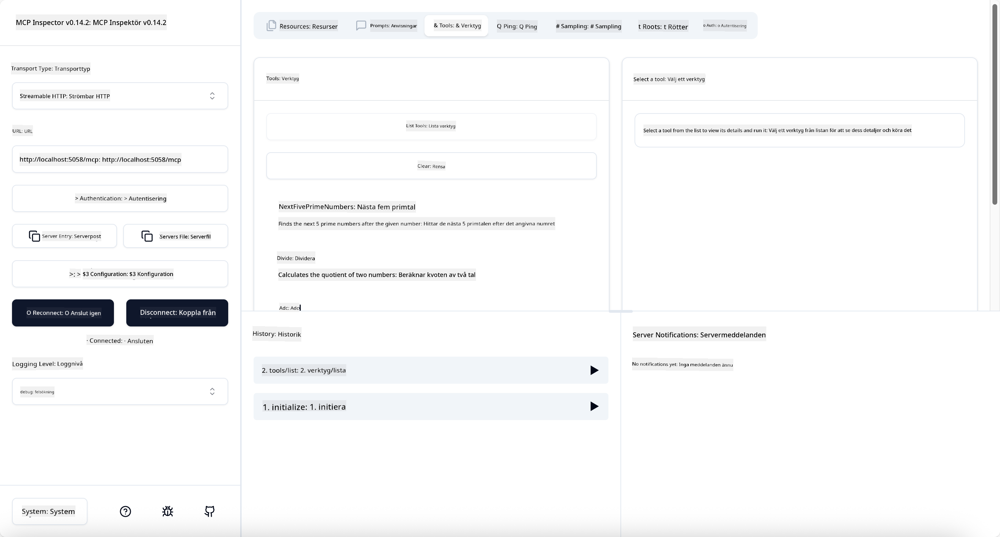
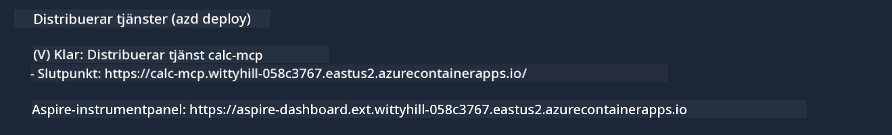

<!--
CO_OP_TRANSLATOR_METADATA:
{
  "original_hash": "0bc7bd48f55f1565f1d95ccb2c16f728",
  "translation_date": "2025-07-13T23:07:22+00:00",
  "source_file": "04-PracticalImplementation/samples/csharp/README.md",
  "language_code": "sv"
}
-->
# Exempel

Det föregående exemplet visar hur man använder ett lokalt .NET-projekt med typen `stdio`. Och hur man kör servern lokalt i en container. Detta är en bra lösning i många situationer. Men det kan vara användbart att ha servern igång på distans, till exempel i en molnmiljö. Det är här typen `http` kommer in i bilden.

Om man tittar på lösningen i mappen `04-PracticalImplementation` kan det se mycket mer komplext ut än det föregående exemplet. Men i verkligheten är det inte det. Om du tittar noga på projektet `src/Calculator` kommer du att se att det till största delen är samma kod som i det tidigare exemplet. Den enda skillnaden är att vi använder ett annat bibliotek, `ModelContextProtocol.AspNetCore`, för att hantera HTTP-förfrågningarna. Och vi ändrar metoden `IsPrime` till att vara privat, bara för att visa att du kan ha privata metoder i din kod. Resten av koden är densamma som tidigare.

De andra projekten kommer från [.NET Aspire](https://learn.microsoft.com/dotnet/aspire/get-started/aspire-overview). Att ha .NET Aspire i lösningen förbättrar utvecklarens upplevelse under utveckling och testning och hjälper till med observabilitet. Det är inte nödvändigt för att köra servern, men det är en god vana att ha det i din lösning.

## Starta servern lokalt

1. Från VS Code (med C# DevKit-tillägget), navigera till katalogen `04-PracticalImplementation/samples/csharp`.
1. Kör följande kommando för att starta servern:

   ```bash
    dotnet watch run --project ./src/AppHost
   ```

1. När en webbläsare öppnar .NET Aspire-dashboarden, notera `http`-URL:en. Den bör vara något i stil med `http://localhost:5058/`.

   

## Testa Streamable HTTP med MCP Inspector

Om du har Node.js 22.7.5 eller senare kan du använda MCP Inspector för att testa din server.

Starta servern och kör följande kommando i en terminal:

```bash
npx @modelcontextprotocol/inspector http://localhost:5058
```



- Välj `Streamable HTTP` som transporttyp.
- I fältet Url, ange den URL för servern som noterades tidigare och lägg till `/mcp`. Det ska vara `http` (inte `https`), något i stil med `http://localhost:5058/mcp`.
- Klicka på Connect-knappen.

En fördel med Inspector är att den ger bra insyn i vad som händer.

- Försök lista de tillgängliga verktygen
- Testa några av dem, det ska fungera precis som tidigare.

## Testa MCP Server med GitHub Copilot Chat i VS Code

För att använda Streamable HTTP-transporten med GitHub Copilot Chat, ändra konfigurationen för `calc-mcp`-servern som skapades tidigare så att den ser ut så här:

```jsonc
// .vscode/mcp.json
{
  "servers": {
    "calc-mcp": {
      "type": "http",
      "url": "http://localhost:5058/mcp"
    }
  }
}
```

Gör några tester:

- Be om "3 prime numbers after 6780". Notera hur Copilot använder de nya verktygen `NextFivePrimeNumbers` och bara returnerar de första 3 primtalen.
- Be om "7 prime numbers after 111" för att se vad som händer.
- Be om "John has 24 lollies and wants to distribute them all to his 3 kids. How many lollies does each kid have?" för att se vad som händer.

## Distribuera servern till Azure

Låt oss distribuera servern till Azure så att fler kan använda den.

Från en terminal, navigera till mappen `04-PracticalImplementation/samples/csharp` och kör följande kommando:

```bash
azd up
```

När distributionen är klar bör du se ett meddelande som detta:



Ta URL:en och använd den i MCP Inspector och i GitHub Copilot Chat.

```jsonc
// .vscode/mcp.json
{
  "servers": {
    "calc-mcp": {
      "type": "http",
      "url": "https://calc-mcp.gentleriver-3977fbcf.australiaeast.azurecontainerapps.io/mcp"
    }
  }
}
```

## Vad händer härnäst?

Vi har testat olika transporttyper och testverktyg. Vi har också distribuerat din MCP-server till Azure. Men vad händer om vår server behöver åtkomst till privata resurser? Till exempel en databas eller ett privat API? I nästa kapitel kommer vi att se hur vi kan förbättra säkerheten för vår server.

**Ansvarsfriskrivning**:  
Detta dokument har översatts med hjälp av AI-översättningstjänsten [Co-op Translator](https://github.com/Azure/co-op-translator). Även om vi strävar efter noggrannhet, vänligen observera att automatiska översättningar kan innehålla fel eller brister. Det ursprungliga dokumentet på dess modersmål bör betraktas som den auktoritativa källan. För kritisk information rekommenderas professionell mänsklig översättning. Vi ansvarar inte för några missförstånd eller feltolkningar som uppstår vid användning av denna översättning.