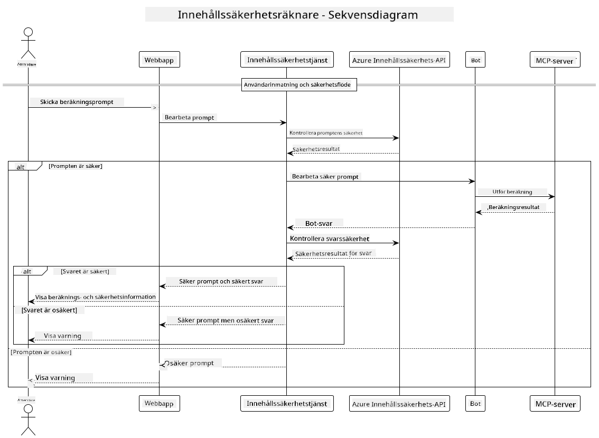

<!--
CO_OP_TRANSLATOR_METADATA:
{
  "original_hash": "e5ea5e7582f70008ea9bec3b3820f20a",
  "translation_date": "2025-07-13T23:16:56+00:00",
  "source_file": "04-PracticalImplementation/samples/java/containerapp/README.md",
  "language_code": "sv"
}
-->
## Systemarkitektur

Det här projektet visar en webbapplikation som använder innehållssäkerhetskontroll innan användarens prompt skickas vidare till en kalkylatortjänst via Model Context Protocol (MCP).



### Så fungerar det

1. **Användarinmatning**: Användaren skriver in en beräkningsprompt i webbgränssnittet  
2. **Innehållssäkerhetskontroll (Inmatning)**: Prompten analyseras av Azure Content Safety API  
3. **Säkerhetsbeslut (Inmatning)**:  
   - Om innehållet är säkert (allvarlighetsgrad < 2 i alla kategorier) går det vidare till kalkylatorn  
   - Om innehållet flaggas som potentiellt skadligt stoppas processen och en varning returneras  
4. **Integration med kalkylatorn**: Säker innehåll bearbetas av LangChain4j, som kommunicerar med MCP-kalkylatorservern  
5. **Innehållssäkerhetskontroll (Utmatning)**: Botens svar analyseras av Azure Content Safety API  
6. **Säkerhetsbeslut (Utmatning)**:  
   - Om botsvaret är säkert visas det för användaren  
   - Om botsvaret flaggas som potentiellt skadligt ersätts det med en varning  
7. **Svar**: Resultaten (om säkra) visas för användaren tillsammans med båda säkerhetsanalyserna

## Använda Model Context Protocol (MCP) med kalkylatortjänster

Det här projektet visar hur man använder Model Context Protocol (MCP) för att anropa kalkylatorns MCP-tjänster från LangChain4j. Implementeringen använder en lokal MCP-server som körs på port 8080 för att tillhandahålla kalkylatorfunktioner.

### Konfigurera Azure Content Safety Service

Innan du använder innehållssäkerhetsfunktionerna behöver du skapa en Azure Content Safety-tjänstresurs:

1. Logga in på [Azure Portal](https://portal.azure.com)  
2. Klicka på "Create a resource" och sök efter "Content Safety"  
3. Välj "Content Safety" och klicka på "Create"  
4. Ange ett unikt namn för din resurs  
5. Välj din prenumeration och resursgrupp (eller skapa en ny)  
6. Välj en stödd region (kolla [Region availability](https://azure.microsoft.com/en-us/global-infrastructure/services/?products=cognitive-services) för detaljer)  
7. Välj en lämplig prissättningsnivå  
8. Klicka på "Create" för att distribuera resursen  
9. När distributionen är klar, klicka på "Go to resource"  
10. I vänstra panelen, under "Resource Management", välj "Keys and Endpoint"  
11. Kopiera någon av nycklarna och endpoint-URL:en för användning i nästa steg

### Konfigurera miljövariabler

Sätt miljövariabeln `GITHUB_TOKEN` för autentisering av GitHub-modeller:  
```sh
export GITHUB_TOKEN=<your_github_token>
```

För innehållssäkerhetsfunktionerna, sätt:  
```sh
export CONTENT_SAFETY_ENDPOINT=<your_content_safety_endpoint>
export CONTENT_SAFETY_KEY=<your_content_safety_key>
```

Dessa miljövariabler används av applikationen för att autentisera mot Azure Content Safety-tjänsten. Om dessa variabler inte är satta kommer applikationen använda platshållarvärden för demonstrationssyfte, men innehållssäkerhetsfunktionerna kommer inte att fungera korrekt.

### Starta Calculator MCP-servern

Innan du kör klienten behöver du starta kalkylatorns MCP-server i SSE-läge på localhost:8080.

## Projektbeskrivning

Det här projektet visar integrationen av Model Context Protocol (MCP) med LangChain4j för att anropa kalkylatortjänster. Viktiga funktioner inkluderar:

- Använda MCP för att koppla upp mot en kalkylatortjänst för grundläggande matematiska operationer  
- Dubbel lager av innehållssäkerhetskontroll på både användarprompter och botsvar  
- Integration med GitHubs gpt-4.1-nano-modell via LangChain4j  
- Användning av Server-Sent Events (SSE) för MCP-transport

## Innehållssäkerhetsintegration

Projektet inkluderar omfattande innehållssäkerhetsfunktioner för att säkerställa att både användarinmatningar och systemets svar är fria från skadligt innehåll:

1. **Inmatningskontroll**: Alla användarprompter analyseras för skadliga innehållskategorier som hatpropaganda, våld, självskada och sexuellt innehåll innan de bearbetas.  

2. **Utmatningskontroll**: Även när potentiellt okensurerade modeller används kontrollerar systemet alla genererade svar genom samma innehållssäkerhetsfilter innan de visas för användaren.

Denna dubbla kontroll säkerställer att systemet förblir säkert oavsett vilken AI-modell som används, och skyddar användarna från både skadliga inmatningar och potentiellt problematiska AI-genererade svar.

## Webbklient

Applikationen inkluderar ett användarvänligt webbgränssnitt som låter användare interagera med Content Safety Calculator-systemet:

### Funktioner i webbgränssnittet

- Enkel och intuitiv formulär för att skriva in beräkningsprompter  
- Dubbel lager av innehållssäkerhetsvalidering (inmatning och utmatning)  
- Realtidsfeedback om promptens och svarets säkerhet  
- Färgkodade säkerhetsindikatorer för enkel tolkning  
- Ren och responsiv design som fungerar på olika enheter  
- Exempel på säkra promter för att vägleda användare

### Använda webbklienten

1. Starta applikationen:  
   ```sh
   mvn spring-boot:run
   ```

2. Öppna din webbläsare och gå till `http://localhost:8087`  

3. Skriv in en beräkningsprompt i det angivna textfältet (t.ex. "Calculate the sum of 24.5 and 17.3")  

4. Klicka på "Submit" för att bearbeta din förfrågan  

5. Se resultaten, som inkluderar:  
   - Innehållssäkerhetsanalys av din prompt  
   - Det beräknade resultatet (om prompten var säker)  
   - Innehållssäkerhetsanalys av botens svar  
   - Eventuella säkerhetsvarningar om antingen inmatningen eller utmatningen flaggades

Webbklienten hanterar automatiskt båda innehållssäkerhetskontrollerna och säkerställer att alla interaktioner är säkra och lämpliga oavsett vilken AI-modell som används.

**Ansvarsfriskrivning**:  
Detta dokument har översatts med hjälp av AI-översättningstjänsten [Co-op Translator](https://github.com/Azure/co-op-translator). Även om vi strävar efter noggrannhet, vänligen observera att automatiska översättningar kan innehålla fel eller brister. Det ursprungliga dokumentet på dess modersmål bör betraktas som den auktoritativa källan. För kritisk information rekommenderas professionell mänsklig översättning. Vi ansvarar inte för några missförstånd eller feltolkningar som uppstår till följd av användningen av denna översättning.