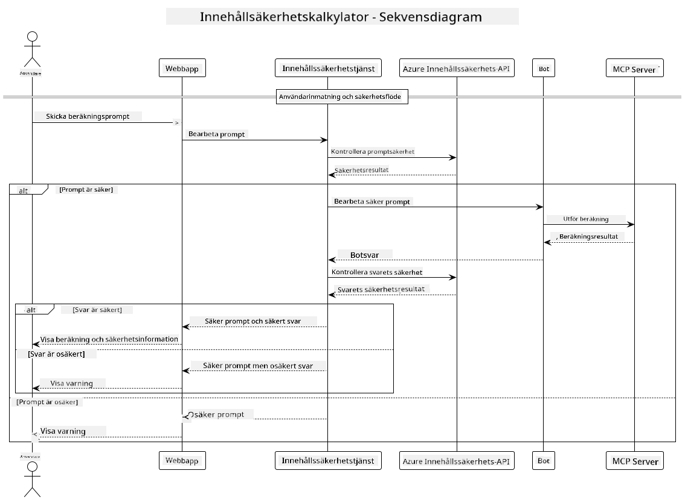

<!--
CO_OP_TRANSLATOR_METADATA:
{
  "original_hash": "e5ea5e7582f70008ea9bec3b3820f20a",
  "translation_date": "2025-05-17T14:27:24+00:00",
  "source_file": "04-PracticalImplementation/samples/java/containerapp/README.md",
  "language_code": "sv"
}
-->
## Systemarkitektur

Detta projekt demonstrerar en webbapplikation som använder innehållssäkerhetskontroll innan användarens instruktioner skickas till en kalkylatortjänst via Model Context Protocol (MCP).



### Hur det fungerar

1. **Användarinmatning**: Användaren anger en beräkningsinstruktion i webbgränssnittet
2. **Innehållssäkerhetsscreening (Inmatning)**: Instruktionen analyseras av Azure Content Safety API
3. **Säkerhetsbeslut (Inmatning)**:
   - Om innehållet är säkert (allvarlighetsgrad < 2 i alla kategorier) går det vidare till kalkylatorn
   - Om innehållet flaggas som potentiellt skadligt stoppas processen och en varning returneras
4. **Kalkylatorintegration**: Säkert innehåll bearbetas av LangChain4j, som kommunicerar med MCP-kalkylatorservern
5. **Innehållssäkerhetsscreening (Utmatning)**: Botens svar analyseras av Azure Content Safety API
6. **Säkerhetsbeslut (Utmatning)**:
   - Om botsvaret är säkert visas det för användaren
   - Om botsvaret flaggas som potentiellt skadligt ersätts det med en varning
7. **Svar**: Resultaten (om säkra) visas för användaren tillsammans med båda säkerhetsanalyserna

## Använda Model Context Protocol (MCP) med kalkylatortjänster

Detta projekt demonstrerar hur man använder Model Context Protocol (MCP) för att anropa kalkylator-MCP-tjänster från LangChain4j. Implementeringen använder en lokal MCP-server som körs på port 8080 för att tillhandahålla kalkylatoroperationer.

### Ställa in Azure Content Safety Service

Innan du använder innehållssäkerhetsfunktionerna behöver du skapa en Azure Content Safety-tjänstresurs:

1. Logga in på [Azure Portal](https://portal.azure.com)
2. Klicka på "Skapa en resurs" och sök efter "Content Safety"
3. Välj "Content Safety" och klicka på "Skapa"
4. Ange ett unikt namn för din resurs
5. Välj din prenumeration och resursgrupp (eller skapa en ny)
6. Välj en stödd region (kontrollera [Region tillgänglighet](https://azure.microsoft.com/en-us/global-infrastructure/services/?products=cognitive-services) för detaljer)
7. Välj en lämplig prissättningsnivå
8. Klicka på "Skapa" för att distribuera resursen
9. När distributionen är klar, klicka på "Gå till resurs"
10. I vänsterpanelen, under "Resurshantering", välj "Nycklar och slutpunkt"
11. Kopiera någon av nycklarna och slutpunktens URL för användning i nästa steg

### Konfigurera miljövariabler

Ställ in `GITHUB_TOKEN` miljövariabeln för GitHub-modellernas autentisering:
```sh
export GITHUB_TOKEN=<your_github_token>
```

För innehållssäkerhetsfunktioner, ställ in:
```sh
export CONTENT_SAFETY_ENDPOINT=<your_content_safety_endpoint>
export CONTENT_SAFETY_KEY=<your_content_safety_key>
```

Dessa miljövariabler används av applikationen för att autentisera med Azure Content Safety-tjänsten. Om dessa variabler inte är inställda kommer applikationen att använda platshållarvärden för demonstrationsändamål, men innehållssäkerhetsfunktionerna kommer inte att fungera korrekt.

### Starta kalkylator-MCP-servern

Innan du kör klienten behöver du starta kalkylator-MCP-servern i SSE-läge på localhost:8080.

## Projektbeskrivning

Detta projekt demonstrerar integrationen av Model Context Protocol (MCP) med LangChain4j för att anropa kalkylatortjänster. Nyckelfunktioner inkluderar:

- Använda MCP för att ansluta till en kalkylatortjänst för grundläggande matematiska operationer
- Dubbellagers innehållssäkerhetskontroll på både användarinstruktioner och botsvar
- Integration med GitHubs gpt-4.1-nano-modell via LangChain4j
- Använda Server-Sent Events (SSE) för MCP-transport

## Innehållssäkerhetsintegration

Projektet inkluderar omfattande innehållssäkerhetsfunktioner för att säkerställa att både användarinmatningar och systemsvar är fria från skadligt innehåll:

1. **Inmatningsscreening**: Alla användarinstruktioner analyseras för skadliga innehållskategorier som hatpropaganda, våld, självskada och sexuellt innehåll innan bearbetning.

2. **Utmatningsscreening**: Även när potentiellt ocensurerade modeller används, kontrollerar systemet alla genererade svar genom samma innehållssäkerhetsfilter innan de visas för användaren.

Detta dubbellagers tillvägagångssätt säkerställer att systemet förblir säkert oavsett vilken AI-modell som används, och skyddar användare från både skadliga inmatningar och potentiellt problematiska AI-genererade utmatningar.

## Webbklient

Applikationen inkluderar ett användarvänligt webbgränssnitt som tillåter användare att interagera med Content Safety Calculator-systemet:

### Webbgränssnittsfunktioner

- Enkel, intuitiv form för att ange beräkningsinstruktioner
- Dubbellagers innehållssäkerhetsvalidering (inmatning och utmatning)
- Realtidsfeedback på instruktionens och svarets säkerhet
- Färgkodade säkerhetsindikatorer för enkel tolkning
- Ren, responsiv design som fungerar på olika enheter
- Exempel på säkra instruktioner för att vägleda användare

### Använda webbklienten

1. Starta applikationen:
   ```sh
   mvn spring-boot:run
   ```

2. Öppna din webbläsare och navigera till `http://localhost:8087`

3. Ange en beräkningsinstruktion i det angivna textfältet (t.ex. "Beräkna summan av 24.5 och 17.3")

4. Klicka på "Skicka" för att bearbeta din förfrågan

5. Visa resultaten, som kommer att inkludera:
   - Innehållssäkerhetsanalys av din instruktion
   - Det beräknade resultatet (om instruktionen var säker)
   - Innehållssäkerhetsanalys av botsvaret
   - Eventuella säkerhetsvarningar om antingen inmatningen eller utmatningen flaggades

Webbklienten hanterar automatiskt båda innehållssäkerhetsverifieringsprocesserna, vilket säkerställer att alla interaktioner är säkra och lämpliga oavsett vilken AI-modell som används.

**Ansvarsfriskrivning**:  
Detta dokument har översatts med hjälp av AI-översättningstjänsten [Co-op Translator](https://github.com/Azure/co-op-translator). Även om vi strävar efter noggrannhet, var medveten om att automatiserade översättningar kan innehålla fel eller felaktigheter. Det ursprungliga dokumentet på dess modersmål bör betraktas som den auktoritativa källan. För kritisk information rekommenderas professionell mänsklig översättning. Vi ansvarar inte för eventuella missförstånd eller misstolkningar som uppstår vid användning av denna översättning.