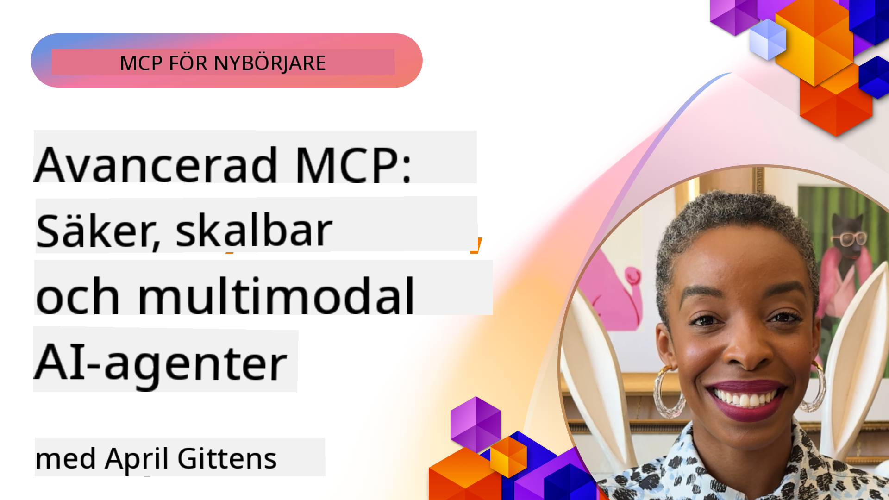

<!--
CO_OP_TRANSLATOR_METADATA:
{
  "original_hash": "d204bc94ea6027d06a703b21b711ca57",
  "translation_date": "2025-08-18T14:48:28+00:00",
  "source_file": "05-AdvancedTopics/README.md",
  "language_code": "sv"
}
-->
# Avancerade ämnen inom MCP

_(Klicka på bilden ovan för att se videon för denna lektion)_

Detta kapitel täcker en rad avancerade ämnen inom implementering av Model Context Protocol (MCP), inklusive multimodal integration, skalbarhet, säkerhetsbästa praxis och företagsintegration. Dessa ämnen är avgörande för att bygga robusta och produktionsklara MCP-applikationer som kan möta kraven från moderna AI-system.

## Översikt

Denna lektion utforskar avancerade koncept inom implementering av Model Context Protocol, med fokus på multimodal integration, skalbarhet, säkerhetsbästa praxis och företagsintegration. Dessa ämnen är viktiga för att bygga MCP-applikationer av produktionskvalitet som kan hantera komplexa krav i företagsmiljöer.

## Lärandemål

Efter denna lektion kommer du att kunna:

- Implementera multimodala funktioner inom MCP-ramverk
- Designa skalbara MCP-arkitekturer för högbelastningsscenarier
- Tillämpa säkerhetsbästa praxis i linje med MCP:s säkerhetsprinciper
- Integrera MCP med företags-AI-system och ramverk
- Optimera prestanda och tillförlitlighet i produktionsmiljöer

## Lektioner och exempelprojekt

| Länk | Titel | Beskrivning |
|------|-------|-------------|
| [5.1 Integration med Azure](./mcp-integration/README.md) | Integrera med Azure | Lär dig hur du integrerar din MCP-server på Azure |
| [5.2 Multimodalt exempel](./mcp-multi-modality/README.md) | MCP Multimodala exempel | Exempel för ljud, bild och multimodala svar |
| [5.3 MCP OAuth2-exempel](../../../05-AdvancedTopics/mcp-oauth2-demo) | MCP OAuth2 Demo | Minimal Spring Boot-app som visar OAuth2 med MCP, både som auktorisations- och resursserver. Demonstrerar säker tokenutgivning, skyddade slutpunkter, Azure Container Apps-distribution och API-hanteringsintegration. |
| [5.4 Root Contexts](./mcp-root-contexts/README.md) | Root contexts | Lär dig mer om root contexts och hur du implementerar dem |
| [5.5 Routing](./mcp-routing/README.md) | Routing | Lär dig olika typer av routing |
| [5.6 Sampling](./mcp-sampling/README.md) | Sampling | Lär dig att arbeta med sampling |
| [5.7 Skalning](./mcp-scaling/README.md) | Skalning | Lär dig om skalning |
| [5.8 Säkerhet](./mcp-security/README.md) | Säkerhet | Säkra din MCP-server |
| [5.9 Webbsökningsexempel](./web-search-mcp/README.md) | Webbsökning MCP | Python MCP-server och klient som integrerar med SerpAPI för realtidswebb, nyheter, produktsökning och Q&A. Demonstrerar multiverktygsorkestrering, extern API-integration och robust felhantering. |
| [5.10 Realtidsströmning](./mcp-realtimestreaming/README.md) | Strömning | Realtidsdataströmning har blivit avgörande i dagens datadrivna värld, där företag och applikationer kräver omedelbar tillgång till information för att fatta snabba beslut. |
| [5.11 Realtidswebbsökning](./mcp-realtimesearch/README.md) | Webbsökning | Realtidswebbsökning visar hur MCP omvandlar realtidswebbsökning genom att tillhandahålla ett standardiserat tillvägagångssätt för kontexthantering över AI-modeller, sökmotorer och applikationer. |
| [5.12 Entra ID-autentisering för Model Context Protocol-servrar](./mcp-security-entra/README.md) | Entra ID-autentisering | Microsoft Entra ID erbjuder en robust molnbaserad lösning för identitets- och åtkomsthantering, som hjälper till att säkerställa att endast auktoriserade användare och applikationer kan interagera med din MCP-server. |
| [5.13 Azure AI Foundry Agent Integration](./mcp-foundry-agent-integration/README.md) | Azure AI Foundry Integration | Lär dig hur du integrerar Model Context Protocol-servrar med Azure AI Foundry-agenter, vilket möjliggör kraftfull verktygsorkestrering och företags-AI-funktioner med standardiserade anslutningar till externa datakällor. |
| [5.14 Kontextteknik](./mcp-contextengineering/README.md) | Kontextteknik | Framtida möjligheter med kontextteknik för MCP-servrar, inklusive kontextoptimering, dynamisk kontexthantering och strategier för effektiv promptteknik inom MCP-ramverk. |

## Ytterligare referenser

För den mest aktuella informationen om avancerade MCP-ämnen, se:
- [MCP-dokumentation](https://modelcontextprotocol.io/)
- [MCP-specifikation](https://spec.modelcontextprotocol.io/)
- [GitHub-repository](https://github.com/modelcontextprotocol)

## Viktiga insikter

- Multimodala MCP-implementeringar utökar AI-funktioner bortom textbearbetning
- Skalbarhet är avgörande för företagsdistributioner och kan hanteras genom horisontell och vertikal skalning
- Omfattande säkerhetsåtgärder skyddar data och säkerställer korrekt åtkomstkontroll
- Företagsintegration med plattformar som Azure OpenAI och Microsoft AI Foundry förbättrar MCP-funktioner
- Avancerade MCP-implementeringar gynnas av optimerade arkitekturer och noggrann resursförvaltning

## Övning

Designa en MCP-implementering av företagsklass för ett specifikt användningsfall:

1. Identifiera multimodala krav för ditt användningsfall
2. Skissera de säkerhetskontroller som behövs för att skydda känslig data
3. Designa en skalbar arkitektur som kan hantera varierande belastning
4. Planera integrationspunkter med företags-AI-system
5. Dokumentera potentiella prestandaflaskhalsar och åtgärdsstrategier

## Ytterligare resurser

- [Azure OpenAI-dokumentation](https://learn.microsoft.com/en-us/azure/ai-services/openai/)
- [Microsoft AI Foundry-dokumentation](https://learn.microsoft.com/en-us/ai-services/)

---

## Vad händer härnäst

- [5.1 MCP Integration](./mcp-integration/README.md)

**Ansvarsfriskrivning**:  
Detta dokument har översatts med hjälp av AI-översättningstjänsten [Co-op Translator](https://github.com/Azure/co-op-translator). Även om vi strävar efter noggrannhet, vänligen notera att automatiska översättningar kan innehålla fel eller felaktigheter. Det ursprungliga dokumentet på dess originalspråk bör betraktas som den auktoritativa källan. För kritisk information rekommenderas professionell mänsklig översättning. Vi ansvarar inte för eventuella missförstånd eller feltolkningar som uppstår vid användning av denna översättning.