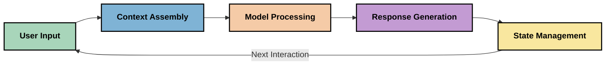
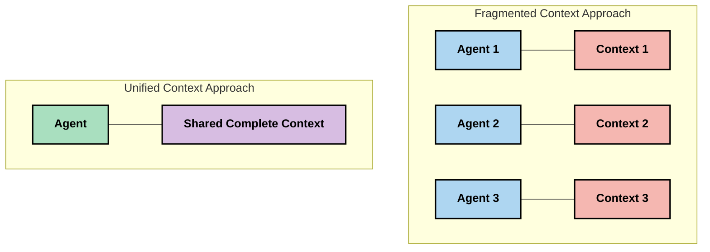
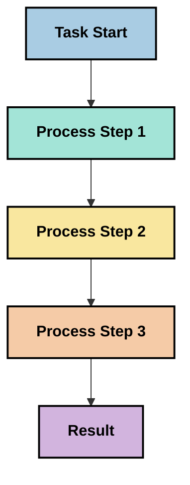
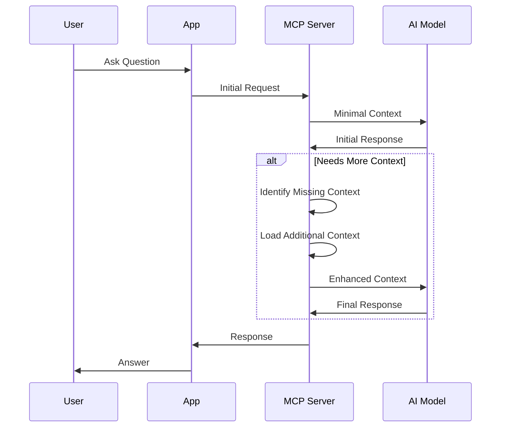
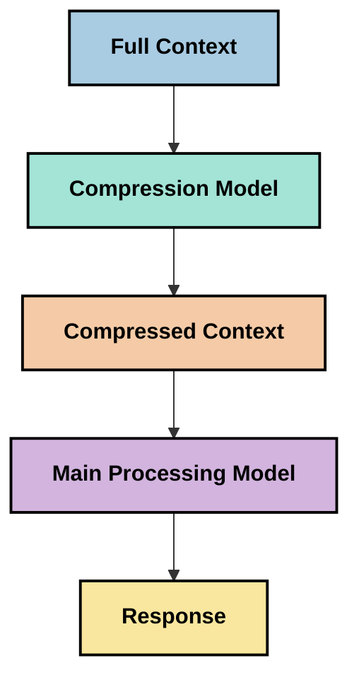

<!--
CO_OP_TRANSLATOR_METADATA:
{
  "original_hash": "fd169ca3071b81b5ee282e194bc823df",
  "translation_date": "2025-09-15T20:33:04+00:00",
  "source_file": "05-AdvancedTopics/mcp-contextengineering/README.md",
  "language_code": "sv"
}
-->
# Kontextteknik: Ett framväxande koncept inom MCP-ekosystemet

## Översikt

Kontextteknik är ett framväxande koncept inom AI-området som utforskar hur information struktureras, levereras och upprätthålls under interaktioner mellan klienter och AI-tjänster. När Model Context Protocol (MCP)-ekosystemet utvecklas blir det allt viktigare att förstå hur man effektivt hanterar kontext. Denna modul introducerar konceptet kontextteknik och utforskar dess potentiella tillämpningar i MCP-implementeringar.

## Lärandemål

I slutet av denna modul kommer du att kunna:

- Förstå det framväxande konceptet kontextteknik och dess potentiella roll i MCP-applikationer
- Identifiera nyckelutmaningar i kontexthantering som MCP-protokollets design adresserar
- Utforska tekniker för att förbättra modellprestanda genom bättre kontexthantering
- Överväga metoder för att mäta och utvärdera kontextens effektivitet
- Tillämpa dessa framväxande koncept för att förbättra AI-upplevelser genom MCP-ramverket

## Introduktion till kontextteknik

Kontextteknik är ett framväxande koncept som fokuserar på den medvetna designen och hanteringen av informationsflödet mellan användare, applikationer och AI-modeller. Till skillnad från etablerade områden som promptteknik håller kontextteknik fortfarande på att definieras av praktiker som arbetar för att lösa de unika utmaningarna med att ge AI-modeller rätt information vid rätt tidpunkt.

När stora språkmodeller (LLMs) har utvecklats har vikten av kontext blivit alltmer uppenbar. Kvaliteten, relevansen och strukturen av den kontext vi tillhandahåller påverkar direkt modellens resultat. Kontextteknik utforskar detta förhållande och strävar efter att utveckla principer för effektiv kontexthantering.

> "År 2025 är modellerna där ute extremt intelligenta. Men även den smartaste människan kommer inte att kunna utföra sitt jobb effektivt utan kontexten av vad de blir ombedda att göra... 'Kontextteknik' är nästa nivå av promptteknik. Det handlar om att göra detta automatiskt i ett dynamiskt system." — Walden Yan, Cognition AI

Kontextteknik kan omfatta:

1. **Kontextval**: Att avgöra vilken information som är relevant för en viss uppgift
2. **Kontextstrukturering**: Att organisera information för att maximera modellens förståelse
3. **Kontextleverans**: Att optimera hur och när information skickas till modeller
4. **Kontextunderhåll**: Att hantera kontextens tillstånd och utveckling över tid
5. **Kontextevaluering**: Att mäta och förbättra kontextens effektivitet

Dessa fokusområden är särskilt relevanta för MCP-ekosystemet, som tillhandahåller ett standardiserat sätt för applikationer att ge kontext till LLMs.

## Perspektivet kring kontextens resa

Ett sätt att visualisera kontextteknik är att följa resan som information tar genom ett MCP-system:



### Nyckelstadier i kontextens resa:

1. **Användarinmatning**: Råinformation från användaren (text, bilder, dokument)
2. **Kontextsammanställning**: Kombinera användarinmatning med systemkontext, konversationshistorik och annan hämtad information
3. **Modellbearbetning**: AI-modellen bearbetar den sammanställda kontexten
4. **Svarsgenerering**: Modellen producerar resultat baserat på den tillhandahållna kontexten
5. **Tillståndshantering**: Systemet uppdaterar sitt interna tillstånd baserat på interaktionen

Detta perspektiv belyser den dynamiska naturen av kontext i AI-system och väcker viktiga frågor om hur man bäst hanterar information i varje steg.

## Framväxande principer inom kontextteknik

När området kontextteknik tar form börjar vissa tidiga principer att framträda från praktiker. Dessa principer kan hjälpa till att informera MCP-implementeringsval:

### Princip 1: Dela kontext fullständigt

Kontext bör delas fullständigt mellan alla komponenter i ett system snarare än att fragmenteras över flera agenter eller processer. När kontext är distribuerad kan beslut som fattas i en del av systemet komma i konflikt med beslut som fattas någon annanstans.



I MCP-applikationer föreslår detta att designa system där kontext flödar sömlöst genom hela pipeline snarare än att vara uppdelad.

### Princip 2: Erkänn att handlingar bär på implicita beslut

Varje handling en modell utför innefattar implicita beslut om hur kontexten ska tolkas. När flera komponenter agerar på olika kontexter kan dessa implicita beslut komma i konflikt, vilket leder till inkonsekventa resultat.

Denna princip har viktiga implikationer för MCP-applikationer:
- Föredra linjär bearbetning av komplexa uppgifter framför parallell bearbetning med fragmenterad kontext
- Säkerställ att alla beslutsställen har tillgång till samma kontextinformation
- Designa system där senare steg kan se hela kontexten av tidigare beslut

### Princip 3: Balansera kontextdjup med fönsterbegränsningar

När konversationer och processer blir längre överflödar kontextfönster till slut. Effektiv kontextteknik utforskar metoder för att hantera denna spänning mellan omfattande kontext och tekniska begränsningar.

Potentiella metoder som utforskas inkluderar:
- Kontextkomprimering som bibehåller väsentlig information samtidigt som tokenanvändningen minskar
- Progressiv laddning av kontext baserat på relevans för aktuella behov
- Sammanfattning av tidigare interaktioner samtidigt som nyckelbeslut och fakta bevaras

## Kontextutmaningar och MCP-protokollets design

Model Context Protocol (MCP) designades med en medvetenhet om de unika utmaningarna med kontexthantering. Att förstå dessa utmaningar hjälper till att förklara nyckelaspekter av MCP-protokollets design:

### Utmaning 1: Begränsningar i kontextfönster
De flesta AI-modeller har fasta kontextfönsterstorlekar, vilket begränsar hur mycket information de kan bearbeta samtidigt.

**MCP-designsvar:** 
- Protokollet stöder strukturerad, resursbaserad kontext som kan refereras effektivt
- Resurser kan pagineras och laddas progressivt

### Utmaning 2: Relevansbestämning
Att avgöra vilken information som är mest relevant att inkludera i kontexten är svårt.

**MCP-designsvar:**
- Flexibla verktyg möjliggör dynamisk hämtning av information baserat på behov
- Strukturerade prompts möjliggör konsekvent kontextorganisation

### Utmaning 3: Kontextpersistens
Att hantera tillstånd över interaktioner kräver noggrann spårning av kontext.

**MCP-designsvar:**
- Standardiserad sessionshantering
- Tydligt definierade interaktionsmönster för kontextutveckling

### Utmaning 4: Multimodal kontext
Olika typer av data (text, bilder, strukturerad data) kräver olika hantering.

**MCP-designsvar:**
- Protokolldesignen rymmer olika innehållstyper
- Standardiserad representation av multimodal information

### Utmaning 5: Säkerhet och integritet
Kontext innehåller ofta känslig information som måste skyddas.

**MCP-designsvar:**
- Tydliga gränser mellan klient- och serveransvar
- Lokala bearbetningsalternativ för att minimera dataexponering

Att förstå dessa utmaningar och hur MCP adresserar dem ger en grund för att utforska mer avancerade tekniker inom kontextteknik.

## Framväxande metoder inom kontextteknik

När området kontextteknik utvecklas framträder flera lovande metoder. Dessa representerar aktuellt tänkande snarare än etablerade bästa praxis och kommer sannolikt att utvecklas när vi får mer erfarenhet av MCP-implementeringar.

### 1. Enkeltrådad linjär bearbetning

I kontrast till multi-agent-arkitekturer som distribuerar kontext finner vissa praktiker att enkeltrådad linjär bearbetning ger mer konsekventa resultat. Detta överensstämmer med principen om att upprätthålla enhetlig kontext.



Även om denna metod kan verka mindre effektiv än parallell bearbetning, ger den ofta mer sammanhängande och tillförlitliga resultat eftersom varje steg bygger på en fullständig förståelse av tidigare beslut.

### 2. Kontextuppdelning och prioritering

Att dela upp stora kontexter i hanterbara delar och prioritera det som är mest viktigt.

```python
# Conceptual Example: Context Chunking and Prioritization
def process_with_chunked_context(documents, query):
    # 1. Break documents into smaller chunks
    chunks = chunk_documents(documents)
    
    # 2. Calculate relevance scores for each chunk
    scored_chunks = [(chunk, calculate_relevance(chunk, query)) for chunk in chunks]
    
    # 3. Sort chunks by relevance score
    sorted_chunks = sorted(scored_chunks, key=lambda x: x[1], reverse=True)
    
    # 4. Use the most relevant chunks as context
    context = create_context_from_chunks([chunk for chunk, score in sorted_chunks[:5]])
    
    # 5. Process with the prioritized context
    return generate_response(context, query)
```

Konceptet ovan illustrerar hur vi kan dela upp stora dokument i hanterbara delar och välja endast de mest relevanta delarna för kontext. Denna metod kan hjälpa till att arbeta inom kontextfönsterbegränsningar samtidigt som stora kunskapsbaser utnyttjas.

### 3. Progressiv kontextladdning

Att ladda kontext progressivt vid behov snarare än allt på en gång.



Progressiv kontextladdning börjar med minimal kontext och expanderar endast när det behövs. Detta kan avsevärt minska tokenanvändningen för enkla frågor samtidigt som förmågan att hantera komplexa frågor bibehålls.

### 4. Kontextkomprimering och sammanfattning

Att minska kontextstorleken samtidigt som väsentlig information bevaras.



Kontextkomprimering fokuserar på:
- Att ta bort redundant information
- Att sammanfatta lång innehåll
- Att extrahera nyckelfakta och detaljer
- Att bevara kritiska kontextelement
- Att optimera för tokeneffektivitet

Denna metod kan vara särskilt värdefull för att upprätthålla långa konversationer inom kontextfönster eller för att effektivt bearbeta stora dokument. Vissa praktiker använder specialiserade modeller specifikt för kontextkomprimering och sammanfattning av konversationshistorik.

## Utforskande överväganden inom kontextteknik

När vi utforskar det framväxande området kontextteknik finns det flera överväganden som är värda att ha i åtanke när man arbetar med MCP-implementeringar. Dessa är inte föreskrivande bästa praxis utan snarare områden för utforskning som kan ge förbättringar i ditt specifika användningsfall.

### Tänk på dina kontextmål

Innan du implementerar komplexa lösningar för kontexthantering, formulera tydligt vad du försöker uppnå:
- Vilken specifik information behöver modellen för att lyckas?
- Vilken information är väsentlig kontra kompletterande?
- Vilka är dina prestandabegränsningar (latens, tokenbegränsningar, kostnader)?

### Utforska lagerbaserade kontextmetoder

Vissa praktiker har framgång med kontext som är organiserad i konceptuella lager:
- **Kärnlager**: Väsentlig information som modellen alltid behöver
- **Situationslager**: Kontext specifik för den aktuella interaktionen
- **Stödlager**: Ytterligare information som kan vara användbar
- **Reservlager**: Information som endast nås vid behov

### Undersök hämtningstrategier

Effektiviteten av din kontext beror ofta på hur du hämtar information:
- Semantisk sökning och inbäddningar för att hitta konceptuellt relevant information
- Nyckelordsbaserad sökning för specifika faktauppgifter
- Hybridmetoder som kombinerar flera hämtningstekniker
- Metadatafiltrering för att begränsa omfattningen baserat på kategorier, datum eller källor

### Experimentera med kontextsammanhang

Strukturen och flödet av din kontext kan påverka modellens förståelse:
- Att gruppera relaterad information tillsammans
- Att använda konsekvent formatering och organisation
- Att upprätthålla logisk eller kronologisk ordning där det är lämpligt
- Att undvika motsägelsefull information

### Väg för- och nackdelar med multi-agent-arkitekturer

Även om multi-agent-arkitekturer är populära i många AI-ramverk, medför de betydande utmaningar för kontexthantering:
- Kontextfragmentering kan leda till inkonsekventa beslut mellan agenter
- Parallell bearbetning kan introducera konflikter som är svåra att lösa
- Kommunikationsöverhead mellan agenter kan motverka prestandaförbättringar
- Komplex tillståndshantering krävs för att upprätthålla sammanhang

I många fall kan en enkel-agent-metod med omfattande kontexthantering ge mer tillförlitliga resultat än flera specialiserade agenter med fragmenterad kontext.

### Utveckla utvärderingsmetoder

För att förbättra kontextteknik över tid, överväg hur du ska mäta framgång:
- A/B-testning av olika kontextstrukturer
- Övervakning av tokenanvändning och svarstider
- Spårning av användartillfredsställelse och uppgiftsavslutningsfrekvenser
- Analys av när och varför kontextstrategier misslyckas

Dessa överväganden representerar aktiva områden för utforskning inom kontextteknik. När området mognar kommer mer definitiva mönster och praxis sannolikt att framträda.

## Mäta kontextens effektivitet: En utvecklande ram

När kontextteknik framträder som ett koncept börjar praktiker utforska hur vi kan mäta dess effektivitet. Ingen etablerad ram finns ännu, men olika mått övervägs som kan hjälpa till att vägleda framtida arbete.

### Potentiella mätområden

#### 1. Effektivitet i inmatning

- **Kontext-till-svar-förhållande**: Hur mycket kontext behövs i förhållande till svarstorleken?
- **Tokenutnyttjande**: Vilken procentandel av tillhandahållna kontexttokens verkar påverka svaret?
- **Kontextreduktion**: Hur effektivt kan vi komprimera råinformation?

#### 2. Prestandaöverväganden

- **Latenspåverkan**: Hur påverkar kontexthantering svarstiden?
- **Tokenekonomi**: Optimerar vi tokenanvändningen effektivt?
- **Hämtningsprecision**: Hur relevant är den hämtade informationen?
- **Resursutnyttjande**: Vilka beräkningsresurser krävs?

#### 3. Kvalitetsöverväganden

- **Svarens relevans**: Hur väl adresserar svaret frågan?
- **Faktuell noggrannhet**: Förbättrar kontexthantering faktakorrektheten?
- **Konsekvens**: Är svaren konsekventa över liknande frågor?
- **Hallucinationsfrekvens**: Minskar bättre kontext modellens hallucinationer?

#### 4. Användarupplevelseöverväganden

- **Uppföljningsfrekvens**: Hur ofta behöver användare förtydliganden?
- **Uppgiftsavslutning**: Lyckas användare med att uppnå sina mål?
- **Tillfredsställelseindikatorer**: Hur betygsätter användare sin upplevelse?

### Utforskande metoder för mätning

När du experimenterar med kontextteknik i MCP-implementeringar, överväg dessa utforskande metoder:

1. **Jämförelser med baslinjer**: Etablera en baslinje med enkla kontextmetoder innan du testar mer sofistikerade metoder

2. **Inkrementella förändringar**: Ändra en aspekt av kontexthantering i taget för att isolera dess effekter

3. **Användarcentrerad utvärdering**: Kombinera kvantitativa mått med kvalitativ användarfeedback

4. **Felanalys**: Undersök fall där kontextstrategier misslyckas för att förstå potentiella förbättringar

5. **Multidimensionell bedömning**: Överväg avvägningar mellan effektivitet, kvalitet och användarupplevelse

Denna experimentella, mångfacetterade metod för mätning överensstämmer med det framväxande området kontextteknik.

## Avslutande tankar

Kontextteknik är ett framväxande område för utforskning som kan visa sig vara centralt för effektiva MCP-applikationer. Genom att noggrant överväga hur information flödar genom ditt system kan du potentiellt skapa AI-upplevelser som är mer effektiva, korrekta och värdefulla för användare.

De tekniker och metoder som beskrivs i denna modul representerar tidigt tänkande inom detta område, inte etablerade praxis. Kontextteknik kan utvecklas till en mer definierad disciplin när AI-förmågor utvecklas och vår förståelse fördjupas. För närvarande verkar experimentering kombinerat med noggrann mätning vara den mest produktiva metoden.

## Potentiella framtida riktningar

Området kontextteknik är fortfarande i sina tidiga stadier, men flera lovande riktningar framträder:

- Principer för kontextteknik kan ha betydande påverkan på modellprestanda, effektivitet
- [Model Context Protocol Website](https://modelcontextprotocol.io/)
- [Model Context Protocol Specification](https://github.com/modelcontextprotocol/modelcontextprotocol)
- [MCP Dokumentation](https://modelcontextprotocol.io/docs)
- [MCP C# SDK](https://github.com/modelcontextprotocol/csharp-sdk)
- [MCP Python SDK](https://github.com/modelcontextprotocol/python-sdk)
- [MCP TypeScript SDK](https://github.com/modelcontextprotocol/typescript-sdk)
- [MCP Inspector](https://github.com/modelcontextprotocol/inspector) - Visuellt testverktyg för MCP-servrar

### Artiklar om Context Engineering
- [Bygg inte Multi-Agents: Principer för Context Engineering](https://cognition.ai/blog/dont-build-multi-agents) - Walden Yans insikter om principer för context engineering
- [En praktisk guide till att bygga agenter](https://cdn.openai.com/business-guides-and-resources/a-practical-guide-to-building-agents.pdf) - OpenAIs guide för effektiv agentdesign
- [Bygga effektiva agenter](https://www.anthropic.com/engineering/building-effective-agents) - Anthropics metod för agentutveckling

### Relaterad forskning
- [Dynamisk hämtning för stora språkmodeller](https://arxiv.org/abs/2310.01487) - Forskning om dynamiska hämtningstekniker
- [Vilse i mitten: Hur språkmodeller använder långa kontexter](https://arxiv.org/abs/2307.03172) - Viktig forskning om mönster för kontextbearbetning
- [Hierarkisk textbaserad bildgenerering med CLIP Latents](https://arxiv.org/abs/2204.06125) - DALL-E 2-papper med insikter om kontextstrukturering
- [Utforska kontextens roll i arkitekturer för stora språkmodeller](https://aclanthology.org/2023.findings-emnlp.124/) - Ny forskning om kontexthantering
- [Multi-Agent Samarbete: En översikt](https://arxiv.org/abs/2304.03442) - Forskning om system med flera agenter och deras utmaningar

### Ytterligare resurser
- [Tekniker för optimering av kontextfönster](https://learn.microsoft.com/en-us/azure/ai-services/openai/concepts/context-window)
- [Avancerade RAG-tekniker](https://www.microsoft.com/en-us/research/blog/retrieval-augmented-generation-rag-and-frontier-models/)
- [Semantic Kernel Dokumentation](https://github.com/microsoft/semantic-kernel)
- [AI Toolkit för kontexthantering](https://github.com/microsoft/aitoolkit)

## Vad händer härnäst

- [5.15 MCP Anpassad Transport](../mcp-transport/README.md)

---

**Ansvarsfriskrivning**:  
Detta dokument har översatts med hjälp av AI-översättningstjänsten [Co-op Translator](https://github.com/Azure/co-op-translator). Även om vi strävar efter noggrannhet, bör du vara medveten om att automatiserade översättningar kan innehålla fel eller felaktigheter. Det ursprungliga dokumentet på dess originalspråk bör betraktas som den auktoritativa källan. För kritisk information rekommenderas professionell mänsklig översättning. Vi ansvarar inte för eventuella missförstånd eller feltolkningar som uppstår vid användning av denna översättning.