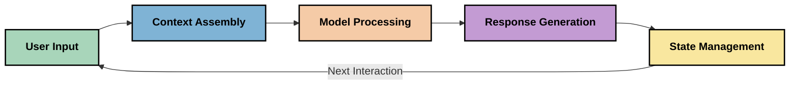
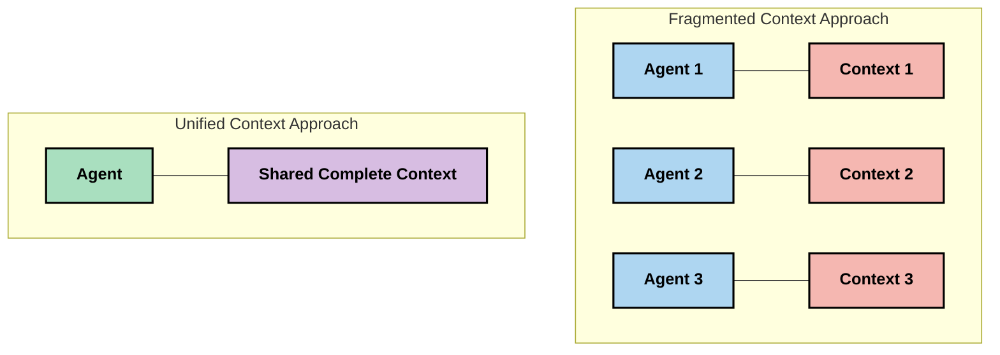
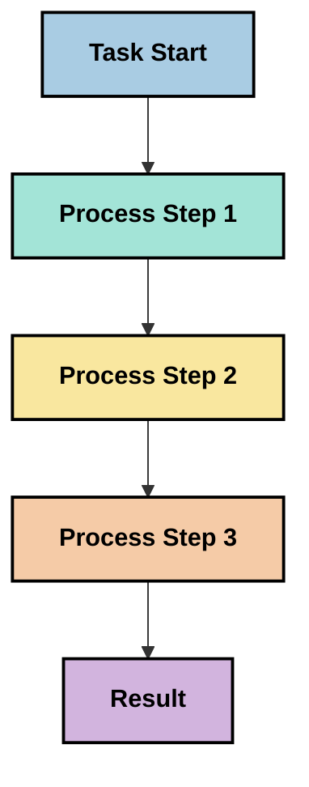
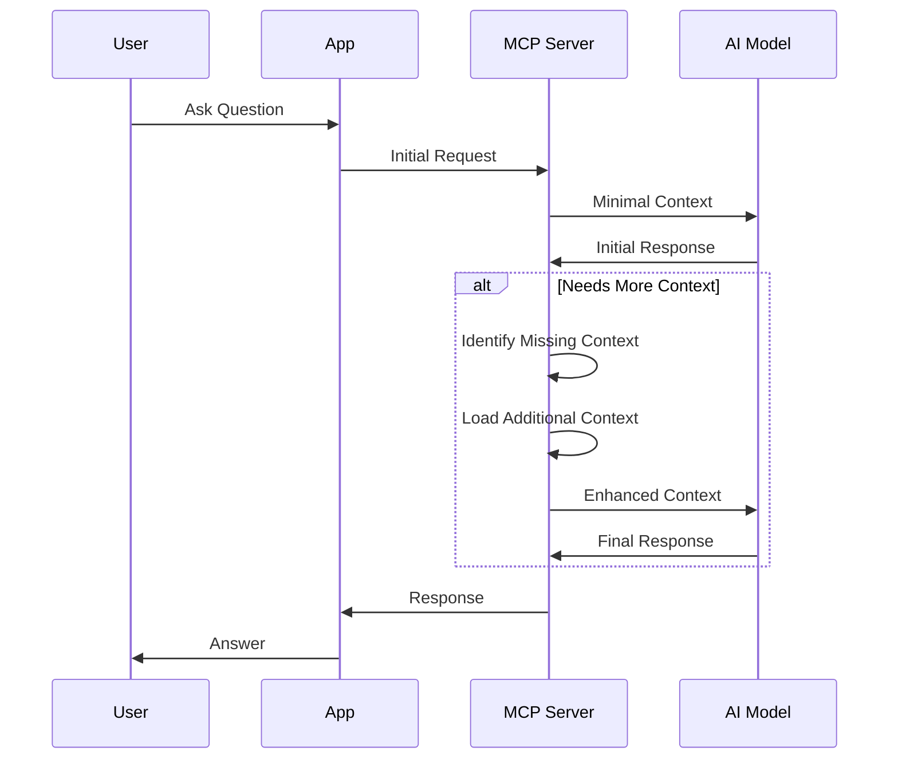
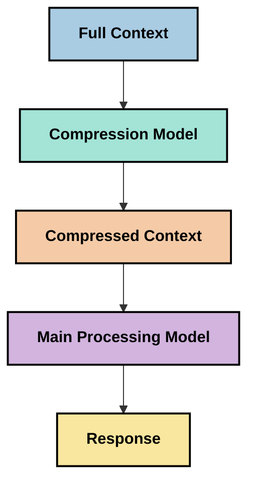

<!--
CO_OP_TRANSLATOR_METADATA:
{
  "original_hash": "5762e8e74dd99d8b7dbb31e69a82561e",
  "translation_date": "2025-07-17T08:32:42+00:00",
  "source_file": "05-AdvancedTopics/mcp-contextengineering/README.md",
  "language_code": "sv"
}
-->
# Context Engineering: Ett framväxande koncept inom MCP-ekosystemet

## Översikt

Context engineering är ett framväxande koncept inom AI-området som undersöker hur information struktureras, levereras och underhålls under interaktioner mellan klienter och AI-tjänster. I takt med att Model Context Protocol (MCP)-ekosystemet utvecklas blir förståelsen för hur man effektivt hanterar kontext allt viktigare. Denna modul introducerar begreppet context engineering och utforskar dess potentiella tillämpningar i MCP-implementationer.

## Lärandemål

Efter denna modul kommer du att kunna:

- Förstå det framväxande konceptet context engineering och dess potentiella roll i MCP-applikationer
- Identifiera viktiga utmaningar i kontexthantering som MCP-protokollets design adresserar
- Utforska tekniker för att förbättra modellens prestanda genom bättre kontexthantering
- Överväga metoder för att mäta och utvärdera kontextens effektivitet
- Tillämpa dessa framväxande koncept för att förbättra AI-upplevelser genom MCP-ramverket

## Introduktion till Context Engineering

Context engineering är ett framväxande koncept som fokuserar på medveten design och hantering av informationsflödet mellan användare, applikationer och AI-modeller. Till skillnad från etablerade områden som prompt engineering definieras context engineering fortfarande av praktiker som arbetar för att lösa de unika utmaningarna med att förse AI-modeller med rätt information vid rätt tidpunkt.

I takt med att stora språkmodeller (LLMs) har utvecklats har vikten av kontext blivit allt tydligare. Kvaliteten, relevansen och strukturen på den kontext vi tillhandahåller påverkar direkt modellens resultat. Context engineering undersöker detta samband och strävar efter att utveckla principer för effektiv kontexthantering.

> "År 2025 är modellerna där ute extremt intelligenta. Men även den smartaste människan kan inte göra sitt jobb effektivt utan kontexten för vad de blir ombedda att göra... 'Context engineering' är nästa nivå av prompt engineering. Det handlar om att göra detta automatiskt i ett dynamiskt system." — Walden Yan, Cognition AI

Context engineering kan omfatta:

1. **Context Selection**: Att avgöra vilken information som är relevant för en given uppgift
2. **Context Structuring**: Att organisera information för att maximera modellens förståelse
3. **Context Delivery**: Att optimera hur och när information skickas till modeller
4. **Context Maintenance**: Att hantera tillstånd och kontextens utveckling över tid
5. **Context Evaluation**: Att mäta och förbättra kontextens effektivitet

Dessa fokusområden är särskilt relevanta för MCP-ekosystemet, som erbjuder ett standardiserat sätt för applikationer att tillhandahålla kontext till LLMs.

## Perspektivet: Kontextens resa

Ett sätt att visualisera context engineering är att följa den resa informationen gör genom ett MCP-system:



### Viktiga steg i kontextresan:

1. **User Input**: Rå information från användaren (text, bilder, dokument)
2. **Context Assembly**: Kombinera användarinput med systemkontext, konversationshistorik och annan hämtad information
3. **Model Processing**: AI-modellen bearbetar den sammansatta kontexten
4. **Response Generation**: Modellen producerar svar baserat på den tillhandahållna kontexten
5. **State Management**: Systemet uppdaterar sitt interna tillstånd baserat på interaktionen

Detta perspektiv belyser kontextens dynamiska natur i AI-system och väcker viktiga frågor om hur man bäst hanterar information i varje steg.

## Framväxande principer inom Context Engineering

När området context engineering tar form börjar några tidiga principer framträda från praktiker. Dessa principer kan hjälpa till att informera val i MCP-implementationer:

### Princip 1: Dela kontext fullständigt

Kontext bör delas fullständigt mellan alla systemkomponenter istället för att fragmenteras över flera agenter eller processer. När kontext är utspridd kan beslut som fattas i en del av systemet stå i konflikt med beslut som fattas någon annanstans.



I MCP-applikationer antyder detta att designa system där kontext flödar sömlöst genom hela kedjan istället för att vara uppdelad i separata delar.

### Princip 2: Erkänn att handlingar bär på implicita beslut

Varje handling en modell utför innefattar implicita beslut om hur kontexten ska tolkas. När flera komponenter agerar på olika kontexter kan dessa implicita beslut komma i konflikt, vilket leder till inkonsekventa resultat.

Denna princip har viktiga konsekvenser för MCP-applikationer:
- Föredra linjär bearbetning av komplexa uppgifter framför parallell exekvering med fragmenterad kontext
- Säkerställ att alla beslutsfattande punkter har tillgång till samma kontextuella information
- Designa system där senare steg kan se hela kontexten från tidigare beslut

### Princip 3: Balansera kontextdjup med fönsterbegränsningar

När konversationer och processer blir längre överskrids så småningom kontextfönstrens kapacitet. Effektiv context engineering utforskar metoder för att hantera spänningen mellan omfattande kontext och tekniska begränsningar.

Potentiella metoder som utforskas inkluderar:
- Kontextkomprimering som behåller väsentlig information samtidigt som tokenanvändningen minskas
- Progressiv inläsning av kontext baserat på relevans för aktuella behov
- Sammanfattning av tidigare interaktioner samtidigt som viktiga beslut och fakta bevaras

## Kontextutmaningar och MCP-protokollets design

Model Context Protocol (MCP) designades med insikt om de unika utmaningarna i kontexthantering. Att förstå dessa utmaningar hjälper till att förklara viktiga aspekter av MCP-protokollets design:

### Utmaning 1: Begränsningar i kontextfönster
De flesta AI-modeller har fasta storlekar på kontextfönster, vilket begränsar hur mycket information de kan bearbeta samtidigt.

**MCP:s designlösning:**  
- Protokollet stödjer strukturerad, resursbaserad kontext som kan refereras effektivt  
- Resurser kan pagineras och laddas progressivt

### Utmaning 2: Bestämning av relevans
Att avgöra vilken information som är mest relevant att inkludera i kontext är svårt.

**MCP:s designlösning:**  
- Flexibla verktyg möjliggör dynamisk hämtning av information baserat på behov  
- Strukturerade prompts möjliggör konsekvent kontextorganisation

### Utmaning 3: Kontextpersistens
Att hantera tillstånd över interaktioner kräver noggrann spårning av kontext.

**MCP:s designlösning:**  
- Standardiserad sessionshantering  
- Tydligt definierade interaktionsmönster för kontextutveckling

### Utmaning 4: Multimodal kontext
Olika typer av data (text, bilder, strukturerad data) kräver olika hantering.

**MCP:s designlösning:**  
- Protokollets design rymmer olika innehållstyper  
- Standardiserad representation av multimodal information

### Utmaning 5: Säkerhet och integritet
Kontext innehåller ofta känslig information som måste skyddas.

**MCP:s designlösning:**  
- Tydliga gränser mellan klient- och serveransvar  
- Lokala bearbetningsalternativ för att minimera dataexponering

Att förstå dessa utmaningar och hur MCP adresserar dem ger en grund för att utforska mer avancerade tekniker inom context engineering.

## Framväxande metoder inom Context Engineering

När området context engineering utvecklas framträder flera lovande metoder. Dessa representerar aktuell tankegång snarare än etablerade bästa praxis och kommer sannolikt att utvecklas i takt med att vi får mer erfarenhet av MCP-implementationer.

### 1. Enkeltrådad linjär bearbetning

I kontrast till multi-agent-arkitekturer som distribuerar kontext, upptäcker vissa praktiker att enkeltrådad linjär bearbetning ger mer konsekventa resultat. Detta stämmer överens med principen om att upprätthålla en enhetlig kontext.



Även om denna metod kan verka mindre effektiv än parallell bearbetning, ger den ofta mer sammanhängande och pålitliga resultat eftersom varje steg bygger på en fullständig förståelse av tidigare beslut.

### 2. Kontextuppdelning och prioritering

Att dela upp stora kontexter i hanterbara delar och prioritera det viktigaste.

```python
# Conceptual Example: Context Chunking and Prioritization
def process_with_chunked_context(documents, query):
    # 1. Break documents into smaller chunks
    chunks = chunk_documents(documents)
    
    # 2. Calculate relevance scores for each chunk
    scored_chunks = [(chunk, calculate_relevance(chunk, query)) for chunk in chunks]
    
    # 3. Sort chunks by relevance score
    sorted_chunks = sorted(scored_chunks, key=lambda x: x[1], reverse=True)
    
    # 4. Use the most relevant chunks as context
    context = create_context_from_chunks([chunk for chunk, score in sorted_chunks[:5]])
    
    # 5. Process with the prioritized context
    return generate_response(context, query)
```

Konceptet ovan illustrerar hur vi kan dela upp stora dokument i hanterbara delar och välja ut endast de mest relevanta delarna för kontext. Denna metod kan hjälpa till att arbeta inom kontextfönstrets begränsningar samtidigt som stora kunskapsbaser utnyttjas.

### 3. Progressiv inläsning av kontext

Att ladda kontext successivt efter behov istället för allt på en gång.



Progressiv inläsning av kontext börjar med minimal kontext och utökas endast när det behövs. Detta kan avsevärt minska tokenanvändningen för enkla frågor samtidigt som förmågan att hantera komplexa frågor bibehålls.

### 4. Kontextkomprimering och sammanfattning

Att minska kontextens storlek samtidigt som väsentlig information bevaras.



Kontextkomprimering fokuserar på:  
- Att ta bort redundant information  
- Att sammanfatta omfattande innehåll  
- Att extrahera nyckelfakta och detaljer  
- Att bevara kritiska kontextelement  
- Att optimera för token-effektivitet

Denna metod kan vara särskilt värdefull för att upprätthålla långa konversationer inom kontextfönster eller för att effektivt bearbeta stora dokument. Vissa praktiker använder specialiserade modeller specifikt för kontextkomprimering och sammanfattning av konversationshistorik.

## Explorativa överväganden inom Context Engineering

När vi utforskar det framväxande området context engineering finns flera överväganden att ha i åtanke vid arbete med MCP-implementationer. Dessa är inte föreskrivande bästa praxis utan snarare områden för utforskning som kan leda till förbättringar i ditt specifika användningsfall.

### Tänk på dina kontextmål

Innan du implementerar komplexa lösningar för kontexthantering, formulera tydligt vad du vill uppnå:  
- Vilken specifik information behöver modellen för att lyckas?  
- Vilken information är väsentlig respektive kompletterande?  
- Vilka är dina prestandabegränsningar (latens, tokenbegränsningar, kostnader)?

### Utforska lagerbaserade kontextmetoder

Vissa praktiker har framgång med kontext arrangerad i konceptuella lager:  
- **Kärnlager**: Väsentlig information som modellen alltid behöver  
- **Situationslager**: Kontext specifik för den aktuella interaktionen  
- **Stödlager**: Ytterligare information som kan vara hjälpsam  
- **Reservlager**: Information som endast nås vid behov

### Undersök hämtstrategier

Kontextens effektivitet beror ofta på hur du hämtar information:  
- Semantisk sökning och embeddings för att hitta konceptuellt relevant information  
- Nyckelordsbaserad sökning för specifika faktauppgifter  
- Hybridmetoder som kombinerar flera hämtmetoder  
- Metadatafiltrering för att begränsa omfattningen baserat på kategorier, datum eller källor

### Experimentera med kontextkoherens

Strukturen och flödet i din kontext kan påverka modellens förståelse:  
- Gruppera relaterad information tillsammans  
- Använd konsekvent formatering och organisation  
- Behåll logisk eller kronologisk ordning där det är lämpligt  
- Undvik motstridig information

### Väg för- och nackdelar med multi-agent-arkitekturer

Även om multi-agent-arkitekturer är populära i många AI-ramverk, medför de betydande utmaningar för kontexthantering:  
- Kontextfragmentering kan leda till inkonsekventa beslut mellan agenter  
- Parallell bearbetning kan skapa konflikter som är svåra att lösa  
- Kommunikationsöverhead mellan agenter kan motverka prestandavinster  
- Komplex tillståndshantering krävs för att upprätthålla koherens

I många fall kan en enkelagentlösning med omfattande kontexthantering ge mer pålitliga resultat än flera specialiserade agenter med fragmenterad kontext.

### Utveckla utvärderingsmetoder

För att förbättra context engineering över tid, fundera på hur du ska mäta framgång:  
- A/B-testning av olika kontextstrukturer  
- Övervakning av tokenanvändning och svarstider  
- Spårning av användartillfredsställelse och uppgiftsfullföljande  
- Analys av när och varför kontextstrategier misslyckas

Dessa överväganden representerar aktiva utforskningsområden inom context engineering. När området mognar kommer mer definitiva mönster och metoder sannolikt att framträda.

## Att mäta kontextens effektivitet: Ett utvecklande ramverk

När context engineering växer fram som koncept börjar praktiker utforska hur vi kan mäta dess effektivitet. Det finns ännu inget etablerat ramverk, men olika mått övervägs som kan hjälpa till att styra framtida arbete.

### Potentiella mätområden

#### 1. Effektivitet i input

- **Context-to-Response Ratio**: Hur mycket kontext behövs i förhållande till svarsstorleken?  
- **Tokenanvändning**: Vilken andel av de tillhandahållna kontexttokens verkar påverka svaret?  
- **Kontextreduktion**: Hur effektivt kan vi komprimera rå information?

#### 2. Prestanda

- **Latenspåverkan**: Hur påverkar kontexthantering svarstiden?  
- **Tokenekonomi**: Optimerar vi tokenanvändningen effektivt?  
- **Precision i hämtning**: Hur relevant är den hämtade informationen?  
- **Resursanvändning**: Vilka beräkningsresurser krävs?

#### 3. Kvalitet

- **Svarens relevans**: Hur väl svarar svaret på frågan?  
- **Faktuell korrekthet**: Förbättrar kontexthantering faktakorrektheten?  
- **Konsistens**: Är svaren konsekventa över liknande frågor?  
- **Hallucineringsfrekvens**: Minskar bättre kontext modellens hallucinationer?

#### 4. Användarupplevelse

- **Uppföljningsfrekvens**: Hur ofta behöver användare förtydliganden?  
- **Uppgiftsfullföljande**: Lyckas användare uppnå sina mål?  
- **Tillfredsställelseindikatorer**: Hur bedömer användare sin upplevelse?

### Explorativa mätmetoder

När du experimenterar med context engineering i MCP-implementationer, överväg dessa explorativa metoder:

1. **Baslinjejämförelser**: Etablera en baslinje med enkla kontextmetoder innan du testar mer avancerade  
2. **Inkrementella förändringar**: Ändra en aspekt av kontexthanteringen i taget för att isolera effekter  
3. **Användarcentrerad utvärdering**: Kombinera kvantitativa mått med kvalitativ användarfeedback  
4. **Felanalys**: Undersök fall där kontextstrategier misslyckas för att förstå möjliga förbättringar  
5. **Multidimensionell bedömning**: Väg avvägningar mellan effektivitet, kvalitet och användarupplevelse

Denna experimentella, mångfacetterade mätmetod stämmer väl överens med context engineerings framväxande karaktär.

## Avslutande tankar

Context engineering är ett framväxande område som kan bli centralt för effektiva MCP-applikationer. Genom att noggrant överväga hur information flödar genom ditt system kan du potentiellt skapa AI-upplevelser som är mer effektiva, korrekta och värdefulla för användare.

De tekniker och metoder som beskrivs i denna modul representerar tidiga tankar inom området, inte etablerade metoder. Context engineering kan utvecklas till en mer definierad disciplin i takt med att AI-kapaciteter förbättras och vår förståelse fördjupas. För tillfället verkar experimenterande kombinerat med noggrann mätning vara det mest produktiva tillvägagångssättet.

## Potentiella framtida riktningar

Context engineering är fortfarande i sin linda, men flera lovande riktningar framträder:

- Principer för context engineering kan ha stor påverkan på modellprestanda, effektivitet, användarupplevelse och tillförlitlighet  
- Enkeltrådade metoder med omfattande kontexthantering kan överträffa multi-agent-arkitekturer i många användningsfall  
- Specialiserade modeller för kontextkomprimering kan bli standardkomponenter i AI-pipelines  
- Spänningen mellan kontextens fullständighet och tokenbegränsningar kommer sannolikt att driva innovation inom kontexthantering  
- När modeller blir bättre på effektiv, mänsklig liknande kommunikation kan verkligt multi-agent-samarbete bli mer genomförbart  
- MCP-implementationer kan utvecklas för att standardisera kontexthanteringsmönster som framträder
- [Model Context Protocol Website](https://modelcontextprotocol.io/)
- [Model Context Protocol Specification](https://github.com/modelcontextprotocol/modelcontextprotocol)
- [MCP Documentation](https://modelcontextprotocol.io/docs)
- [MCP C# SDK](https://github.com/modelcontextprotocol/csharp-sdk)
- [MCP Python SDK](https://github.com/modelcontextprotocol/python-sdk)
- [MCP TypeScript SDK](https://github.com/modelcontextprotocol/typescript-sdk)
- [MCP Inspector](https://github.com/modelcontextprotocol/inspector) - Visuellt testverktyg för MCP-servrar

### Artiklar om Context Engineering
- [Don't Build Multi-Agents: Principles of Context Engineering](https://cognition.ai/blog/dont-build-multi-agents) - Walden Yans insikter om principer för context engineering
- [A Practical Guide to Building Agents](https://cdn.openai.com/business-guides-and-resources/a-practical-guide-to-building-agents.pdf) - OpenAIs guide för effektiv agentdesign
- [Building Effective Agents](https://www.anthropic.com/engineering/building-effective-agents) - Anthropics synsätt på agentutveckling

### Relaterad forskning
- [Dynamic Retrieval Augmentation for Large Language Models](https://arxiv.org/abs/2310.01487) - Forskning om dynamiska sökmetoder
- [Lost in the Middle: How Language Models Use Long Contexts](https://arxiv.org/abs/2307.03172) - Viktig forskning om mönster i kontextbearbetning
- [Hierarchical Text-Conditioned Image Generation with CLIP Latents](https://arxiv.org/abs/2204.06125) - DALL-E 2-artikel med insikter om kontextstrukturering
- [Exploring the Role of Context in Large Language Model Architectures](https://aclanthology.org/2023.findings-emnlp.124/) - Ny forskning om hantering av kontext
- [Multi-Agent Collaboration: A Survey](https://arxiv.org/abs/2304.03442) - Forskning om multi-agent-system och deras utmaningar

### Ytterligare resurser
- [Context Window Optimization Techniques](https://learn.microsoft.com/en-us/azure/ai-services/openai/concepts/context-window)
- [Advanced RAG Techniques](https://www.microsoft.com/en-us/research/blog/retrieval-augmented-generation-rag-and-frontier-models/)
- [Semantic Kernel Documentation](https://github.com/microsoft/semantic-kernel)
- [AI Toolkit for Context Management](https://github.com/microsoft/aitoolkit)

## Vad händer härnäst
- [6. Community Contributions](../../06-CommunityContributions/README.md)

**Ansvarsfriskrivning**:  
Detta dokument har översatts med hjälp av AI-översättningstjänsten [Co-op Translator](https://github.com/Azure/co-op-translator). Även om vi strävar efter noggrannhet, vänligen observera att automatiska översättningar kan innehålla fel eller brister. Det ursprungliga dokumentet på dess modersmål bör betraktas som den auktoritativa källan. För kritisk information rekommenderas professionell mänsklig översättning. Vi ansvarar inte för några missförstånd eller feltolkningar som uppstår vid användning av denna översättning.