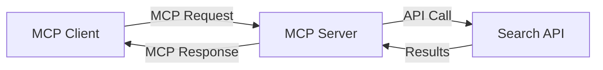
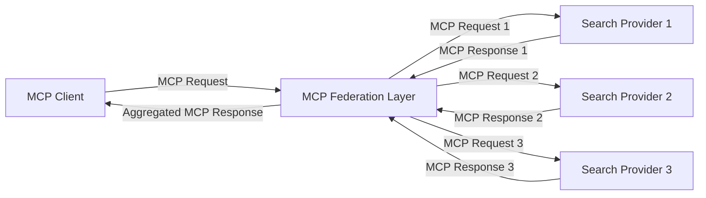
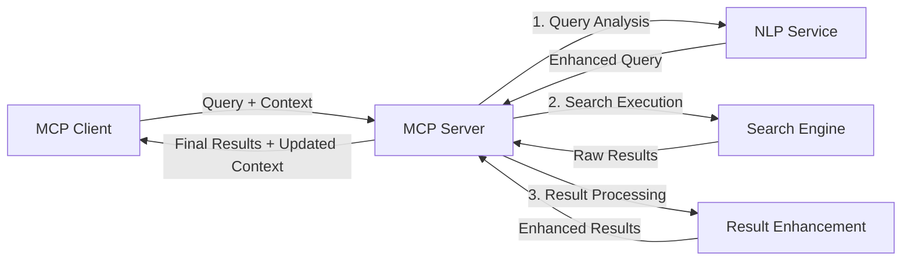

<!--
CO_OP_TRANSLATOR_METADATA:
{
  "original_hash": "16bef2c93c6a86d4ca6a8ce9e120e384",
  "translation_date": "2025-06-13T02:49:00+00:00",
  "source_file": "05-AdvancedTopics/mcp-realtimesearch/README.md",
  "language_code": "sv"
}
-->
## Ansvarsfriskrivning för kodexempel

> **Viktig notering**: Kodexemplen nedan visar integrationen av Model Context Protocol (MCP) med webbsearchfunktionalitet. Även om de följer mönster och strukturer från de officiella MCP SDK:erna har de förenklats för utbildningsändamål.
> 
> Dessa exempel visar:
> 
> 1. **Python-implementering**: En FastMCP-server som tillhandahåller ett webbsearchverktyg och kopplar till en extern sök-API. Detta exempel demonstrerar korrekt livscykelhantering, kontexthantering och verktygsimplementering enligt mönster från [officiella MCP Python SDK](https://github.com/modelcontextprotocol/python-sdk). Servern använder den rekommenderade Streamable HTTP-transporten som ersatt den äldre SSE-transporten för produktionsdistributioner.
> 
> 2. **JavaScript-implementering**: En TypeScript/JavaScript-implementering som använder FastMCP-mönstret från [officiella MCP TypeScript SDK](https://github.com/modelcontextprotocol/typescript-sdk) för att skapa en sökserver med korrekta verktygsdefinitioner och klientanslutningar. Den följer de senaste rekommenderade mönstren för sessionshantering och kontextbevarande.
> 
> Dessa exempel kräver ytterligare felhantering, autentisering och specifik API-integrationskod för produktionsanvändning. De visade sök-API-endpunkterna (`https://api.search-service.example/search`) är platshållare och måste ersättas med faktiska söktjänstendpunkter.
> 
> För fullständiga implementationsdetaljer och de senaste tillvägagångssätten, se [officiella MCP-specifikationen](https://spec.modelcontextprotocol.io/) och SDK-dokumentationen.

## Kärnkoncept

### Model Context Protocol (MCP) ramverket

I grunden tillhandahåller Model Context Protocol ett standardiserat sätt för AI-modeller, applikationer och tjänster att utbyta kontext. Inom realtidswebbsearch är detta ramverk avgörande för att skapa sammanhängande sökupplevelser med flera steg. Viktiga komponenter inkluderar:

1. **Klient-server-arkitektur**: MCP etablerar en tydlig separation mellan sökklienter (begärande) och sökservrar (tillhandahållare), vilket möjliggör flexibla distributionsmodeller.

2. **JSON-RPC-kommunikation**: Protokollet använder JSON-RPC för meddelandeutbyte, vilket gör det kompatibelt med webteknologier och enkelt att implementera över olika plattformar.

3. **Kontexthantering**: MCP definierar strukturerade metoder för att bevara, uppdatera och utnyttja sökkontext över flera interaktioner.

4. **Verktygsdefinitioner**: Sökfunktioner exponeras som standardiserade verktyg med väldefinierade parametrar och returvärden.

5. **Streamingstöd**: Protokollet stödjer strömmande resultat, vilket är avgörande för realtidssearch där resultat kan komma successivt.

### Integrationsmönster för webbsearch

När MCP integreras med webbsearch framträder flera mönster:

#### 1. Direkt integration med sökleverantör

I detta mönster kopplar MCP-servern direkt till en eller flera sök-API:er, översätter MCP-förfrågningar till API-specifika anrop och formaterar resultaten som MCP-svar.

#### 2. Federerad sökning med kontextbevarande

Detta mönster distribuerar sökfrågor över flera MCP-kompatibla sökleverantörer, som var och en kan specialisera sig på olika typer av innehåll eller sökfunktioner, samtidigt som en enhetlig kontext upprätthålls.

#### 3. Kontextförstärkt sökkedja

I detta mönster delas sökprocessen upp i flera steg, där kontext berikas vid varje steg, vilket resulterar i successivt mer relevanta resultat.

### Sökkontextkomponenter

I MCP-baserad webbsearch inkluderar kontext vanligtvis:

- **Frågehistorik**: Tidigare sökfrågor i sessionen
- **Användarpreferenser**: Språk, region, inställningar för säkert sök
- **Interaktionshistorik**: Vilka resultat som klickats på, tid spenderad på resultat
- **Sökparametrar**: Filter, sorteringsordning och andra sökmodifierare
- **Domänkunskap**: Ämnesspecifik kontext relevant för sökningen
- **Tidsmässig kontext**: Tidsbaserade relevansfaktorer
- **Källpreferenser**: Betrodda eller föredragna informationskällor

## Användningsfall och tillämpningar

### Forskning och informationsinsamling

MCP förbättrar forskningsarbetsflöden genom att:

- Bevara forskningskontext över söksessioner
- Möjliggöra mer sofistikerade och kontextuellt relevanta frågor
- Stödja federerad sökning över flera källor
- Underlätta kunskapsutvinning från sökresultat

### Realtidsnyheter och trendövervakning

MCP-drivna sökfunktioner erbjuder fördelar för nyhetsövervakning:

- Nära realtidsupptäckt av nya nyhetshändelser
- Kontextuell filtrering av relevant information
- Ämnes- och entitetsuppföljning över flera källor
- Personliga nyhetsaviseringar baserade på användarkontext

### AI-förstärkt surfning och forskning

MCP skapar nya möjligheter för AI-förstärkt surfning:

- Kontextuella sökförslag baserade på aktuell webbläsaraktivitet
- Sömlös integration av webbsearch med LLM-drivna assistenter
- Flerstegs sökförfining med bibehållen kontext
- Förbättrad faktakontroll och informationsverifiering

## Framtida trender och innovationer

### MCP:s utveckling inom webbsearch

Framöver förväntas MCP utvecklas för att hantera:

- **Multimodal sökning**: Integrera text-, bild-, ljud- och videosökning med bevarad kontext
- **Decentraliserad sökning**: Stödja distribuerade och federerade sökekosystem
- **Söksekretess**: Kontextmedvetna sekretessbevarande sökmetoder
- **Frågeförståelse**: Djup semantisk analys av naturliga språksökfrågor

### Potentiella teknologiska framsteg

Framväxande teknologier som kommer forma MCP-sökningens framtid:

1. **Neurala sökarkitekturer**: Inbäddningsbaserade söksystem optimerade för MCP
2. **Personlig sökkontext**: Inlärning av individuella användares sökmönster över tid
3. **Kunskapsgrafintegration**: Kontextuell sökning förbättrad med ämnesspecifika kunskapsgrafer
4. **Tvärmodal kontext**: Bibehålla kontext över olika sökmodaliteter

## Praktiska övningar

### Övning 1: Sätta upp en grundläggande MCP-sökkedja

I denna övning lär du dig att:
- Konfigurera en grundläggande MCP-sökmiljö
- Implementera kontexthanterare för webbsearch
- Testa och validera kontextbevarande över sökiterationer

### Övning 2: Bygga en forskningsassistent med MCP-sökning

Skapa en komplett applikation som:
- Bearbetar forskningsfrågor i naturligt språk
- Utför kontextmedvetna webbsearcher
- Syntetiserar information från flera källor
- Presenterar organiserade forskningsresultat

### Övning 3: Implementera federerad sökning med MCP

Avancerad övning som täcker:
- Kontextmedveten frågefördelning till flera sökmotorer
- Resultatrankning och aggregering
- Kontextuell deduplicering av sökresultat
- Hantering av källspecifik metadata

## Ytterligare resurser

- [Model Context Protocol Specification](https://spec.modelcontextprotocol.io/) - Officiell MCP-specifikation och detaljerad protokoll-dokumentation
- [Model Context Protocol Documentation](https://modelcontextprotocol.io/) - Detaljerade handledningar och implementationsguider
- [MCP Python SDK](https://github.com/modelcontextprotocol/python-sdk) - Officiell Python-implementation av MCP-protokollet
- [MCP TypeScript SDK](https://github.com/modelcontextprotocol/typescript-sdk) - Officiell TypeScript-implementation av MCP-protokollet
- [MCP Reference Servers](https://github.com/modelcontextprotocol/servers) - Referensimplementationer av MCP-servrar
- [Bing Web Search API Documentation](https://learn.microsoft.com/en-us/bing/search-apis/bing-web-search/overview) - Microsofts webbsearch-API
- [Google Custom Search JSON API](https://developers.google.com/custom-search/v1/overview) - Googles programmerbara sökmotor
- [SerpAPI Documentation](https://serpapi.com/search-api) - API för sökmotorresultatsidor
- [Meilisearch Documentation](https://www.meilisearch.com/docs) - Öppen källkod sökmotor
- [Elasticsearch Documentation](https://www.elastic.co/guide/index.html) - Distribuerad sök- och analysmotor
- [LangChain Documentation](https://python.langchain.com/docs/get_started/introduction) - Bygga applikationer med LLM:er

## Inlärningsmål

Genom att slutföra denna modul kommer du att kunna:

- Förstå grunderna i realtidswebbsearch och dess utmaningar
- Förklara hur Model Context Protocol (MCP) förbättrar realtidswebbsearch-funktioner
- Implementera MCP-baserade söklösningar med populära ramverk och API:er
- Designa och distribuera skalbara, högpresterande sökarkitekturer med MCP
- Tillämpa MCP-koncept på olika användningsfall inklusive semantisk sökning, forskningsassistans och AI-förstärkt surfning
- Utvärdera framväxande trender och framtida innovationer inom MCP-baserad sökteknologi

### Överväganden kring tillit och säkerhet

När du implementerar MCP-baserade webbsearchlösningar, tänk på dessa viktiga principer från MCP-specifikationen:

1. **Användarsamtycke och kontroll**: Användare måste uttryckligen samtycka till och förstå all dataåtkomst och operationer. Detta är särskilt viktigt för webbsearch-implementationer som kan komma åt externa datakällor.

2. **Datasekretess**: Säkerställ korrekt hantering av sökfrågor och resultat, särskilt när de kan innehålla känslig information. Implementera lämpliga åtkomstkontroller för att skydda användardata.

3. **Verktygssäkerhet**: Implementera korrekt auktorisering och validering för sökverktyg, eftersom de kan innebära säkerhetsrisker genom godtycklig kodexekvering. Beskrivningar av verktygsbeteende bör betraktas som opålitliga om de inte kommer från en betrodd server.

4. **Tydlig dokumentation**: Ge klar dokumentation om kapabiliteter, begränsningar och säkerhetsaspekter för din MCP-baserade sökimplementation, enligt riktlinjer i MCP-specifikationen.

5. **Robusta samtyckesflöden**: Bygg robusta samtyckes- och auktoriseringsflöden som tydligt förklarar vad varje verktyg gör innan det godkänns, särskilt för verktyg som interagerar med externa webbresurser.

För fullständiga detaljer om MCP:s säkerhets- och tillitsöverväganden, se [officiell dokumentation](https://modelcontextprotocol.io/specification/2025-03-26#security-and-trust-%26-safety).

## Vad händer härnäst

- [6. Community Contributions](../../06-CommunityContributions/README.md)

**Ansvarsfriskrivning**:  
Detta dokument har översatts med hjälp av AI-översättningstjänsten [Co-op Translator](https://github.com/Azure/co-op-translator). Även om vi strävar efter noggrannhet, vänligen observera att automatiska översättningar kan innehålla fel eller brister. Det ursprungliga dokumentet på dess modersmål bör betraktas som den auktoritativa källan. För viktig information rekommenderas professionell mänsklig översättning. Vi ansvarar inte för några missförstånd eller feltolkningar som uppstår vid användning av denna översättning.