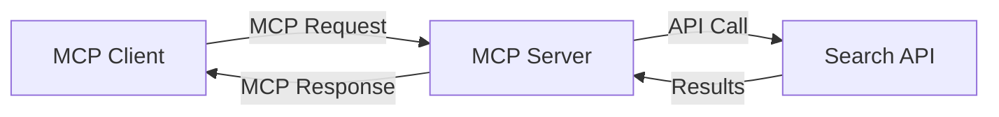
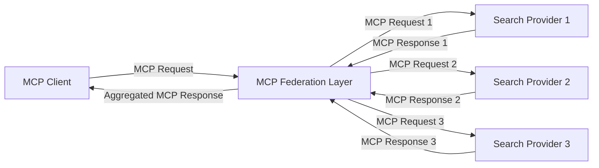
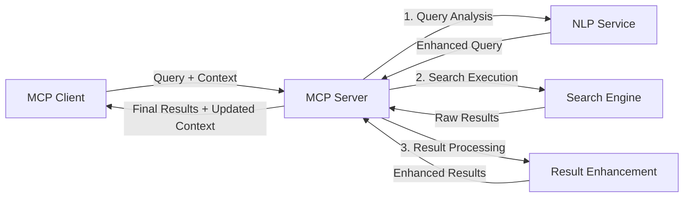

<!--
CO_OP_TRANSLATOR_METADATA:
{
  "original_hash": "eb12652eb7bd17f2193b835a344425c6",
  "translation_date": "2025-06-26T14:04:45+00:00",
  "source_file": "05-AdvancedTopics/mcp-realtimesearch/README.md",
  "language_code": "sv"
}
-->
## Ansvarsfriskrivning för kodexempel

> **Viktig notering**: Kodexemplen nedan visar hur Model Context Protocol (MCP) kan integreras med webbsökfunktionalitet. Även om de följer mönstren och strukturerna i de officiella MCP SDK:erna, har de förenklats för utbildningsändamål.
> 
> Dessa exempel visar:
> 
> 1. **Python-implementation**: En FastMCP-server som tillhandahåller ett webbsökverktyg och kopplar till ett externt sök-API. Exemplet demonstrerar korrekt hantering av livscykel, kontexthantering och verktygsimplementation enligt mönstren i [officiella MCP Python SDK](https://github.com/modelcontextprotocol/python-sdk). Servern använder den rekommenderade Streamable HTTP-transporten som ersatt den äldre SSE-transporten för produktionsmiljöer.
> 
> 2. **JavaScript-implementation**: En TypeScript/JavaScript-implementation som använder FastMCP-mönstret från [officiella MCP TypeScript SDK](https://github.com/modelcontextprotocol/typescript-sdk) för att skapa en sökserver med korrekta verktygsdefinitioner och klientanslutningar. Den följer de senaste rekommenderade mönstren för sessionshantering och kontextbevarande.
> 
> Dessa exempel kräver ytterligare felhantering, autentisering och specifik API-integration för produktionsbruk. De visade sök-API-endpoints (`https://api.search-service.example/search`) är platshållare och måste ersättas med faktiska söktjänstendpoints.
> 
> För fullständiga implementationsdetaljer och de senaste metoderna, vänligen se [officiella MCP-specifikationen](https://spec.modelcontextprotocol.io/) och SDK-dokumentationen.

## Kärnkoncept

### Model Context Protocol (MCP)-ramverket

I grunden erbjuder Model Context Protocol ett standardiserat sätt för AI-modeller, applikationer och tjänster att utbyta kontext. Inom realtidswebbsök är detta ramverk avgörande för att skapa sammanhängande sökupplevelser med flera vändor. Nyckelkomponenter inkluderar:

1. **Klient-server-arkitektur**: MCP etablerar en tydlig separation mellan sökklienter (förfrågare) och sökservrar (leverantörer), vilket möjliggör flexibla distributionsmodeller.

2. **JSON-RPC-kommunikation**: Protokollet använder JSON-RPC för meddelandeutbyte, vilket gör det kompatibelt med webteknologier och enkelt att implementera på olika plattformar.

3. **Kontexthantering**: MCP definierar strukturerade metoder för att bevara, uppdatera och utnyttja sökkontext över flera interaktioner.

4. **Verktygsdefinitioner**: Sökkapaciteter exponeras som standardiserade verktyg med väldefinierade parametrar och returvärden.

5. **Streamingstöd**: Protokollet stödjer strömmande resultat, vilket är nödvändigt för realtidssök där resultat kan komma successivt.

### Mönster för integration av webbsök

Vid integration av MCP med webbsök framträder flera mönster:

#### 1. Direkt integration med sökleverantör

I detta mönster kommunicerar MCP-servern direkt med en eller flera sök-API:er, översätter MCP-förfrågningar till API-specifika anrop och formaterar resultaten som MCP-svar.

#### 2. Federerad sökning med kontextbevarande

Detta mönster distribuerar sökfrågor över flera MCP-kompatibla sökleverantörer, där varje kan specialisera sig på olika typer av innehåll eller sökkapaciteter, samtidigt som en enhetlig kontext bibehålls.

#### 3. Kontextförstärkt sökkedja

Här delas sökprocessen upp i flera steg där kontext berikas vid varje steg, vilket resulterar i successivt mer relevanta resultat.

### Komponenter i sökkontext

I MCP-baserad webbsök inkluderar kontext vanligtvis:

- **Frågehistorik**: Tidigare sökfrågor i sessionen
- **Användarpreferenser**: Språk, region, säker sökning-inställningar
- **Interaktionshistorik**: Vilka resultat som klickats på, tid spenderad på resultat
- **Sökparametrar**: Filter, sorteringsordningar och andra sökmodifierare
- **Domänkunskap**: Ämnesspecifik kontext relevant för sökningen
- **Tidsmässig kontext**: Tidsbaserade relevansfaktorer
- **Källpreferenser**: Betrodda eller föredragna informationskällor

## Användningsområden och tillämpningar

### Forskning och informationsinsamling

MCP förbättrar forskningsarbetsflöden genom att:

- Bevara forskningskontext över söksessioner
- Möjliggöra mer avancerade och kontextuellt relevanta frågor
- Stödja multi-källa federerad sökning
- Underlätta kunskapsutvinning från sökresultat

### Realtidsnyheter och trendövervakning

MCP-drivna sökningar erbjuder fördelar för nyhetsövervakning:

- Nära realtidsupptäckt av nya nyhetshändelser
- Kontextuell filtrering av relevant information
- Spårning av ämnen och entiteter över flera källor
- Personliga nyhetsaviseringar baserade på användarkontext

### AI-förstärkt surfning och forskning

MCP skapar nya möjligheter för AI-förstärkt surfning:

- Kontextuella sökförslag baserade på aktuell webbläsaraktivitet
- Sömlös integration av webbsök med LLM-drivna assistenter
- Sökförfining i flera steg med bibehållen kontext
- Förbättrad faktakontroll och verifiering av information

## Framtida trender och innovationer

### MCP:s utveckling inom webbsök

Framöver förväntas MCP utvecklas för att hantera:

- **Multimodal sökning**: Integrering av text-, bild-, ljud- och videosökning med bevarad kontext
- **Decentraliserad sökning**: Stöd för distribuerade och federerade sökekosystem
- **Söksekretess**: Kontextmedvetna sekretessbevarande sökmetoder
- **Frågeförståelse**: Djup semantisk tolkning av naturliga språkfrågor

### Möjliga tekniska framsteg

Framväxande teknologier som kommer forma MCP-sökningens framtid:

1. **Neurala sökarkitekturer**: Inbäddningsbaserade söksystem optimerade för MCP
2. **Personlig sökkontext**: Inlärning av individuella användares sökmönster över tid
3. **Kunskapsgrafintegration**: Kontextuell sökning förbättrad med domänspecifika kunskapsgrafer
4. **Tvärmodal kontext**: Bibehållande av kontext över olika sökmodaliteter

## Praktiska övningar

### Övning 1: Sätta upp en grundläggande MCP-sökkedja

I denna övning lär du dig att:
- Konfigurera en grundläggande MCP-sökmiljö
- Implementera kontexthanterare för webbsök
- Testa och validera kontextbevarande över sökiterationer

### Övning 2: Bygga en forskningsassistent med MCP-sökning

Skapa en komplett applikation som:
- Bearbetar naturliga språkfrågor för forskning
- Utför kontextmedvetna webbsökningar
- Syntetiserar information från flera källor
- Presenterar organiserade forskningsresultat

### Övning 3: Implementera multi-källa federerad sökning med MCP

Avancerad övning som täcker:
- Kontextmedveten frågedistribution till flera sökmotorer
- Resultatrankning och aggregering
- Kontextuell deduplicering av sökresultat
- Hantering av källspecifik metadata

## Ytterligare resurser

- [Model Context Protocol Specification](https://spec.modelcontextprotocol.io/) – Officiell MCP-specifikation och detaljerad protokoll-dokumentation
- [Model Context Protocol Documentation](https://modelcontextprotocol.io/) – Utförliga guider och implementationsinstruktioner
- [MCP Python SDK](https://github.com/modelcontextprotocol/python-sdk) – Officiell Python-implementation av MCP-protokollet
- [MCP TypeScript SDK](https://github.com/modelcontextprotocol/typescript-sdk) – Officiell TypeScript-implementation av MCP-protokollet
- [MCP Reference Servers](https://github.com/modelcontextprotocol/servers) – Referensimplementationer av MCP-servrar
- [Bing Web Search API Documentation](https://learn.microsoft.com/en-us/bing/search-apis/bing-web-search/overview) – Microsofts webbsöks-API
- [Google Custom Search JSON API](https://developers.google.com/custom-search/v1/overview) – Googles programmerbara sökmotor
- [SerpAPI Documentation](https://serpapi.com/search-api) – API för sökmotorsresultatsidor
- [Meilisearch Documentation](https://www.meilisearch.com/docs) – Öppen källkods sökmotor
- [Elasticsearch Documentation](https://www.elastic.co/guide/index.html) – Distribuerad sök- och analysmotor
- [LangChain Documentation](https://python.langchain.com/docs/get_started/introduction) – Bygga applikationer med LLMs

## Lärandemål

Efter att ha genomfört denna modul kommer du att kunna:

- Förstå grunderna i realtidswebbsök och dess utmaningar
- Förklara hur Model Context Protocol (MCP) förbättrar realtidswebbsök
- Implementera MCP-baserade söklösningar med populära ramverk och API:er
- Designa och driftsätta skalbara, högpresterande sökarkitekturer med MCP
- Tillämpa MCP-koncept på olika användningsfall inklusive semantisk sökning, forskningsassistans och AI-förstärkt surfning
- Utvärdera nya trender och framtida innovationer inom MCP-baserad sökteknologi

### Överväganden kring förtroende och säkerhet

När du implementerar MCP-baserade webbsöklösningar, kom ihåg dessa viktiga principer från MCP-specifikationen:

1. **Användarsamtycke och kontroll**: Användare måste uttryckligen samtycka till och förstå all dataåtkomst och alla operationer. Detta är särskilt viktigt för webbsöksimplementationer som kan komma åt externa datakällor.

2. **Datasekretess**: Säkerställ korrekt hantering av sökfrågor och resultat, särskilt när de kan innehålla känslig information. Implementera lämpliga åtkomstkontroller för att skydda användardata.

3. **Verktygssäkerhet**: Implementera korrekt auktorisation och validering för sökverktyg, eftersom de kan innebära säkerhetsrisker genom godtycklig kodkörning. Beskrivningar av verktygsbeteende bör betraktas som opålitliga om de inte kommer från en betrodd server.

4. **Tydlig dokumentation**: Ge tydlig dokumentation om kapabiliteter, begränsningar och säkerhetsaspekter för din MCP-baserade sökimplementation, enligt riktlinjer i MCP-specifikationen.

5. **Robusta samtyckesflöden**: Bygg robusta samtycke- och auktorisationsflöden som tydligt förklarar vad varje verktyg gör innan användning tillåts, särskilt för verktyg som interagerar med externa webbresurser.

För fullständiga detaljer om MCP:s säkerhet och förtroendeaspekter, se [officiell dokumentation](https://modelcontextprotocol.io/specification/2025-03-26#security-and-trust-%26-safety).

## Vad händer härnäst

- [5.11 Entra ID-autentisering för Model Context Protocol-servrar](../mcp-security-entra/README.md)

**Ansvarsfriskrivning**:  
Detta dokument har översatts med hjälp av AI-översättningstjänsten [Co-op Translator](https://github.com/Azure/co-op-translator). Även om vi strävar efter noggrannhet, vänligen var medveten om att automatiska översättningar kan innehålla fel eller brister. Det ursprungliga dokumentet på dess modersmål bör betraktas som den auktoritativa källan. För kritisk information rekommenderas professionell mänsklig översättning. Vi ansvarar inte för några missförstånd eller feltolkningar som uppstår vid användning av denna översättning.