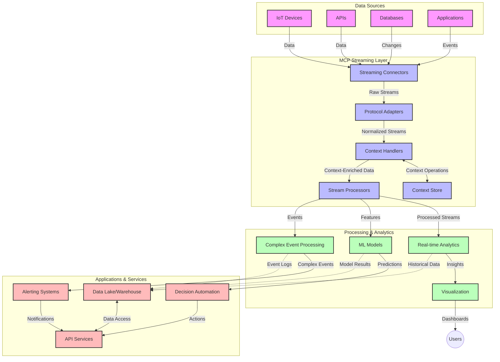

<!--
CO_OP_TRANSLATOR_METADATA:
{
  "original_hash": "b41174ac781ebf228b2043cbdfc09105",
  "translation_date": "2025-06-12T00:35:39+00:00",
  "source_file": "05-AdvancedTopics/mcp-realtimestreaming/README.md",
  "language_code": "sv"
}
-->
# Model Context Protocol för Realtidsdataströmning

## Översikt

Realtidsdataströmning har blivit avgörande i dagens datadrivna värld, där företag och applikationer kräver omedelbar tillgång till information för att fatta snabba beslut. Model Context Protocol (MCP) representerar ett betydande framsteg i att optimera dessa realtidsströmmande processer, förbättra databehandlingens effektivitet, bibehålla kontextuell integritet och höja den övergripande systemprestandan.

Detta modul utforskar hur MCP förändrar realtidsdataströmning genom att erbjuda ett standardiserat tillvägagångssätt för kontexthantering över AI-modeller, strömningsplattformar och applikationer.

## Introduktion till Realtidsdataströmning

Realtidsdataströmning är ett teknologiskt paradigm som möjliggör kontinuerlig överföring, bearbetning och analys av data i takt med att den genereras, vilket gör att system kan reagera omedelbart på ny information. Till skillnad från traditionell batchbearbetning som arbetar med statiska dataset, behandlar strömning data i rörelse och levererar insikter och åtgärder med minimal fördröjning.

### Kärnkoncept för Realtidsdataströmning:

- **Kontinuerligt Dataflöde**: Data behandlas som en oavbruten, aldrig sinande ström av händelser eller poster.
- **Låg Latens i Bearbetning**: System är utformade för att minimera tiden mellan datagenerering och bearbetning.
- **Skalbarhet**: Strömningsarkitekturer måste hantera varierande datavolymer och hastigheter.
- **Felresistens**: System behöver vara tåliga mot fel för att säkerställa oavbrutet dataflöde.
- **Stateful Bearbetning**: Att behålla kontext över händelser är avgörande för meningsfull analys.

### Model Context Protocol och Realtidsströmning

Model Context Protocol (MCP) tar itu med flera viktiga utmaningar i realtidsströmmande miljöer:

1. **Kontextuell Kontinuitet**: MCP standardiserar hur kontext upprätthålls över distribuerade strömningskomponenter, vilket säkerställer att AI-modeller och bearbetningsnoder har tillgång till relevant historisk och miljömässig kontext.

2. **Effektiv State Management**: Genom att erbjuda strukturerade mekanismer för kontextöverföring minskar MCP belastningen av statehantering i strömningspipelines.

3. **Interoperabilitet**: MCP skapar ett gemensamt språk för kontextdelning mellan olika strömningsteknologier och AI-modeller, vilket möjliggör mer flexibla och utbyggbara arkitekturer.

4. **Strömningsoptimerad Kontext**: MCP-implementationer kan prioritera vilka kontextelement som är mest relevanta för realtidsbeslut, vilket optimerar både prestanda och noggrannhet.

5. **Adaptiv Bearbetning**: Med korrekt kontexthantering genom MCP kan strömningssystem dynamiskt justera bearbetningen baserat på föränderliga förhållanden och mönster i data.

I moderna applikationer, från IoT-sensornätverk till finansiella handelsplattformar, möjliggör integrationen av MCP med strömningsteknologier mer intelligent, kontextmedveten bearbetning som kan reagera lämpligt på komplexa, föränderliga situationer i realtid.

## Lärandemål

Efter denna lektion kommer du att kunna:

- Förstå grunderna i realtidsdataströmning och dess utmaningar
- Förklara hur Model Context Protocol (MCP) förbättrar realtidsdataströmning
- Implementera MCP-baserade strömningslösningar med populära ramverk som Kafka och Pulsar
- Designa och distribuera felresistenta, högpresterande strömningsarkitekturer med MCP
- Tillämpa MCP-koncept på IoT, finansiell handel och AI-driven analys
- Utvärdera nya trender och framtida innovationer inom MCP-baserade strömningsteknologier

### Definition och Betydelse

Realtidsdataströmning innebär kontinuerlig generering, bearbetning och leverans av data med minimal fördröjning. Till skillnad från batchbearbetning, där data samlas in och bearbetas i grupper, behandlas strömmande data inkrementellt när den anländer, vilket möjliggör omedelbara insikter och åtgärder.

Viktiga egenskaper för realtidsdataströmning inkluderar:

- **Låg Latens**: Bearbetning och analys av data inom millisekunder till sekunder
- **Kontinuerligt Flöde**: Oavbrutna dataflöden från olika källor
- **Omedelbar Bearbetning**: Analysera data i takt med att den anländer istället för i batcher
- **Händelsestyrd Arkitektur**: Reagera på händelser när de inträffar

### Utmaningar i Traditionell Dataströmning

Traditionella metoder för dataströmning möter flera begränsningar:

1. **Kontextförlust**: Svårigheter att bibehålla kontext över distribuerade system
2. **Skalbarhetsproblem**: Utmaningar i att skala för att hantera stora datavolymer och hög hastighet
3. **Integrationskomplexitet**: Problem med interoperabilitet mellan olika system
4. **Latenshantering**: Balans mellan genomströmning och bearbetningstid
5. **Datakonsistens**: Säkerställa datanoggrannhet och fullständighet över strömmen

## Förstå Model Context Protocol (MCP)

### Vad är MCP?

Model Context Protocol (MCP) är ett standardiserat kommunikationsprotokoll utformat för att underlätta effektiv interaktion mellan AI-modeller och applikationer. I kontexten av realtidsdataströmning erbjuder MCP en ram för:

- Att bevara kontext genom hela datapipelinen
- Standardisering av datautbytesformat
- Optimering av överföring av stora dataset
- Förbättrad kommunikation mellan modell-till-modell och modell-till-applikation

### Kärnkomponenter och Arkitektur

MCP-arkitekturen för realtidsströmning består av flera viktiga komponenter:

1. **Context Handlers**: Hanterar och upprätthåller kontextuell information genom strömningspipen
2. **Stream Processors**: Bearbetar inkommande dataströmmar med kontextmedvetna tekniker
3. **Protocol Adapters**: Omvandlar mellan olika strömningsprotokoll samtidigt som kontext bevaras
4. **Context Store**: Effektivt lagrar och hämtar kontextuell information
5. **Streaming Connectors**: Ansluter till olika strömningsplattformar (Kafka, Pulsar, Kinesis, etc.)



### Hur MCP Förbättrar Realtidsdatahantering

MCP hanterar traditionella strömningsutmaningar genom:

- **Kontextuell Integritet**: Bibehåller relationer mellan datapunkter över hela pipelinen
- **Optimerad Överföring**: Minskar redundans i datautbyte genom intelligent kontexthantering
- **Standardiserade Gränssnitt**: Tillhandahåller konsekventa API:er för strömningskomponenter
- **Minskad Latens**: Minimerar bearbetningskostnader genom effektiv kontexthantering
- **Förbättrad Skalbarhet**: Stöder horisontell skalning samtidigt som kontext bevaras

## Integration och Implementering

Realtidsdataströmningssystem kräver noggrann arkitekturdesign och implementering för att bibehålla både prestanda och kontextuell integritet. Model Context Protocol erbjuder ett standardiserat tillvägagångssätt för att integrera AI-modeller och strömningsteknologier, vilket möjliggör mer sofistikerade, kontextmedvetna bearbetningspipelines.

### Översikt av MCP-integration i Strömningsarkitekturer

Att implementera MCP i realtidsströmningsmiljöer innebär flera viktiga överväganden:

1. **Kontextserialisering och Transport**: MCP erbjuder effektiva mekanismer för kodning av kontextuell information inom strömningsdatapaket, vilket säkerställer att viktig kontext följer med data genom hela bearbetningspipen. Detta inkluderar standardiserade serialiseringsformat optimerade för strömningstransport.

2. **Stateful Stream Processing**: MCP möjliggör mer intelligent stateful bearbetning genom att upprätthålla konsekvent kontextrepresentation över bearbetningsnoder. Detta är särskilt värdefullt i distribuerade strömningsarkitekturer där statehantering traditionellt är utmanande.

3. **Event-Time vs. Processing-Time**: MCP-implementationer i strömningssystem måste hantera den vanliga utmaningen att särskilja när händelser inträffade och när de bearbetas. Protokollet kan inkludera temporär kontext som bevarar event-time-semantik.

4. **Backpressure-hantering**: Genom att standardisera kontexthantering hjälper MCP till att hantera backpressure i strömningssystem, vilket gör att komponenter kan kommunicera sina bearbetningskapaciteter och justera flödet därefter.

5. **Context Windowing och Aggregation**: MCP underlättar mer avancerade windowing-operationer genom att tillhandahålla strukturerade representationer av temporär och relationell kontext, vilket möjliggör mer meningsfulla aggregeringar över händelseströmmar.

6. **Exactly-Once Processing**: I strömningssystem som kräver exactly-once-semantik kan MCP inkludera bearbetningsmetadata för att hjälpa till att spåra och verifiera bearbetningsstatus över distribuerade komponenter.

Implementeringen av MCP över olika strömningsteknologier skapar ett enhetligt tillvägagångssätt för kontexthantering, vilket minskar behovet av skräddarsydd integrationskod samtidigt som systemets förmåga att bibehålla meningsfull kontext när data flödar genom pipelinen förbättras.

### MCP i Olika Dataströmningsramverk

Dessa exempel följer den aktuella MCP-specifikationen som fokuserar på ett JSON-RPC-baserat protokoll med distinkta transportmekanismer. Koden visar hur du kan implementera egna transporter som integrerar strömningsplattformar som Kafka och Pulsar samtidigt som full kompatibilitet med MCP-protokollet bibehålls.

Exemplen är utformade för att visa hur strömningsplattformar kan integreras med MCP för att möjliggöra realtidsdatabearbetning samtidigt som den kontextuella medvetenheten som är central för MCP bevaras. Detta tillvägagångssätt säkerställer att kodexemplen korrekt speglar MCP-specifikationens aktuella status per juni 2025.

MCP kan integreras med populära strömningsramverk inklusive:

#### Apache Kafka-integration

```python
import asyncio
import json
from typing import Dict, Any, Optional
from confluent_kafka import Consumer, Producer, KafkaError
from mcp.client import Client, ClientCapabilities
from mcp.core.message import JsonRpcMessage
from mcp.core.transports import Transport

# Custom transport class to bridge MCP with Kafka
class KafkaMCPTransport(Transport):
    def __init__(self, bootstrap_servers: str, input_topic: str, output_topic: str):
        self.bootstrap_servers = bootstrap_servers
        self.input_topic = input_topic
        self.output_topic = output_topic
        self.producer = Producer({'bootstrap.servers': bootstrap_servers})
        self.consumer = Consumer({
            'bootstrap.servers': bootstrap_servers,
            'group.id': 'mcp-client-group',
            'auto.offset.reset': 'earliest'
        })
        self.message_queue = asyncio.Queue()
        self.running = False
        self.consumer_task = None
        
    async def connect(self):
        """Connect to Kafka and start consuming messages"""
        self.consumer.subscribe([self.input_topic])
        self.running = True
        self.consumer_task = asyncio.create_task(self._consume_messages())
        return self
        
    async def _consume_messages(self):
        """Background task to consume messages from Kafka and queue them for processing"""
        while self.running:
            try:
                msg = self.consumer.poll(1.0)
                if msg is None:
                    await asyncio.sleep(0.1)
                    continue
                
                if msg.error():
                    if msg.error().code() == KafkaError._PARTITION_EOF:
                        continue
                    print(f"Consumer error: {msg.error()}")
                    continue
                
                # Parse the message value as JSON-RPC
                try:
                    message_str = msg.value().decode('utf-8')
                    message_data = json.loads(message_str)
                    mcp_message = JsonRpcMessage.from_dict(message_data)
                    await self.message_queue.put(mcp_message)
                except Exception as e:
                    print(f"Error parsing message: {e}")
            except Exception as e:
                print(f"Error in consumer loop: {e}")
                await asyncio.sleep(1)
    
    async def read(self) -> Optional[JsonRpcMessage]:
        """Read the next message from the queue"""
        try:
            message = await self.message_queue.get()
            return message
        except Exception as e:
            print(f"Error reading message: {e}")
            return None
    
    async def write(self, message: JsonRpcMessage) -> None:
        """Write a message to the Kafka output topic"""
        try:
            message_json = json.dumps(message.to_dict())
            self.producer.produce(
                self.output_topic,
                message_json.encode('utf-8'),
                callback=self._delivery_report
            )
            self.producer.poll(0)  # Trigger callbacks
        except Exception as e:
            print(f"Error writing message: {e}")
    
    def _delivery_report(self, err, msg):
        """Kafka producer delivery callback"""
        if err is not None:
            print(f'Message delivery failed: {err}')
        else:
            print(f'Message delivered to {msg.topic()} [{msg.partition()}]')
    
    async def close(self) -> None:
        """Close the transport"""
        self.running = False
        if self.consumer_task:
            self.consumer_task.cancel()
            try:
                await self.consumer_task
            except asyncio.CancelledError:
                pass
        self.consumer.close()
        self.producer.flush()

# Example usage of the Kafka MCP transport
async def kafka_mcp_example():
    # Create MCP client with Kafka transport
    client = Client(
        {"name": "kafka-mcp-client", "version": "1.0.0"},
        ClientCapabilities({})
    )
    
    # Create and connect the Kafka transport
    transport = KafkaMCPTransport(
        bootstrap_servers="localhost:9092",
        input_topic="mcp-responses",
        output_topic="mcp-requests"
    )
    
    await client.connect(transport)
    
    try:
        # Initialize the MCP session
        await client.initialize()
        
        # Example of executing a tool via MCP
        response = await client.execute_tool(
            "process_data",
            {
                "data": "sample data",
                "metadata": {
                    "source": "sensor-1",
                    "timestamp": "2025-06-12T10:30:00Z"
                }
            }
        )
        
        print(f"Tool execution response: {response}")
        
        # Clean shutdown
        await client.shutdown()
    finally:
        await transport.close()

# Run the example
if __name__ == "__main__":
    asyncio.run(kafka_mcp_example())
```

#### Apache Pulsar-implementation

```python
import asyncio
import json
import pulsar
from typing import Dict, Any, Optional
from mcp.core.message import JsonRpcMessage
from mcp.core.transports import Transport
from mcp.server import Server, ServerOptions
from mcp.server.tools import Tool, ToolExecutionContext, ToolMetadata

# Create a custom MCP transport that uses Pulsar
class PulsarMCPTransport(Transport):
    def __init__(self, service_url: str, request_topic: str, response_topic: str):
        self.service_url = service_url
        self.request_topic = request_topic
        self.response_topic = response_topic
        self.client = pulsar.Client(service_url)
        self.producer = self.client.create_producer(response_topic)
        self.consumer = self.client.subscribe(
            request_topic,
            "mcp-server-subscription",
            consumer_type=pulsar.ConsumerType.Shared
        )
        self.message_queue = asyncio.Queue()
        self.running = False
        self.consumer_task = None
    
    async def connect(self):
        """Connect to Pulsar and start consuming messages"""
        self.running = True
        self.consumer_task = asyncio.create_task(self._consume_messages())
        return self
    
    async def _consume_messages(self):
        """Background task to consume messages from Pulsar and queue them for processing"""
        while self.running:
            try:
                # Non-blocking receive with timeout
                msg = self.consumer.receive(timeout_millis=500)
                
                # Process the message
                try:
                    message_str = msg.data().decode('utf-8')
                    message_data = json.loads(message_str)
                    mcp_message = JsonRpcMessage.from_dict(message_data)
                    await self.message_queue.put(mcp_message)
                    
                    # Acknowledge the message
                    self.consumer.acknowledge(msg)
                except Exception as e:
                    print(f"Error processing message: {e}")
                    # Negative acknowledge if there was an error
                    self.consumer.negative_acknowledge(msg)
            except Exception as e:
                # Handle timeout or other exceptions
                await asyncio.sleep(0.1)
    
    async def read(self) -> Optional[JsonRpcMessage]:
        """Read the next message from the queue"""
        try:
            message = await self.message_queue.get()
            return message
        except Exception as e:
            print(f"Error reading message: {e}")
            return None
    
    async def write(self, message: JsonRpcMessage) -> None:
        """Write a message to the Pulsar output topic"""
        try:
            message_json = json.dumps(message.to_dict())
            self.producer.send(message_json.encode('utf-8'))
        except Exception as e:
            print(f"Error writing message: {e}")
    
    async def close(self) -> None:
        """Close the transport"""
        self.running = False
        if self.consumer_task:
            self.consumer_task.cancel()
            try:
                await self.consumer_task
            except asyncio.CancelledError:
                pass
        self.consumer.close()
        self.producer.close()
        self.client.close()

# Define a sample MCP tool that processes streaming data
@Tool(
    name="process_streaming_data",
    description="Process streaming data with context preservation",
    metadata=ToolMetadata(
        required_capabilities=["streaming"]
    )
)
async def process_streaming_data(
    ctx: ToolExecutionContext,
    data: str,
    source: str,
    priority: str = "medium"
) -> Dict[str, Any]:
    """
    Process streaming data while preserving context
    
    Args:
        ctx: Tool execution context
        data: The data to process
        source: The source of the data
        priority: Priority level (low, medium, high)
        
    Returns:
        Dict containing processed results and context information
    """
    # Example processing that leverages MCP context
    print(f"Processing data from {source} with priority {priority}")
    
    # Access conversation context from MCP
    conversation_id = ctx.conversation_id if hasattr(ctx, 'conversation_id') else "unknown"
    
    # Return results with enhanced context
    return {
        "processed_data": f"Processed: {data}",
        "context": {
            "conversation_id": conversation_id,
            "source": source,
            "priority": priority,
            "processing_timestamp": ctx.get_current_time_iso()
        }
    }

# Example MCP server implementation using Pulsar transport
async def run_mcp_server_with_pulsar():
    # Create MCP server
    server = Server(
        {"name": "pulsar-mcp-server", "version": "1.0.0"},
        ServerOptions(
            capabilities={"streaming": True}
        )
    )
    
    # Register our tool
    server.register_tool(process_streaming_data)
    
    # Create and connect Pulsar transport
    transport = PulsarMCPTransport(
        service_url="pulsar://localhost:6650",
        request_topic="mcp-requests",
        response_topic="mcp-responses"
    )
    
    try:
        # Start the server with the Pulsar transport
        await server.run(transport)
    finally:
        await transport.close()

# Run the server
if __name__ == "__main__":
    asyncio.run(run_mcp_server_with_pulsar())
```

### Bästa Praxis för Utrullning

När du implementerar MCP för realtidsströmning:

1. **Designa för Felresistens**:
   - Implementera korrekt felhantering
   - Använd dead-letter-köer för misslyckade meddelanden
   - Designa idempotenta processorer

2. **Optimera för Prestanda**:
   - Konfigurera lämpliga buffertstorlekar
   - Använd batchning där det är lämpligt
   - Implementera backpressure-mekanismer

3. **Övervaka och Observera**:
   - Följ upp strömningsbearbetningsmetrik
   - Övervaka kontextpropagering
   - Sätt upp larm för avvikelser

4. **Säkra Dina Strömmar**:
   - Implementera kryptering för känslig data
   - Använd autentisering och auktorisering
   - Tillämpa korrekta åtkomstkontroller

### MCP i IoT och Edge Computing

MCP förbättrar IoT-strömning genom att:

- Bevara enhetskontext genom bearbetningspipen
- Möjliggöra effektiv edge-till-moln-dataströmning
- Stödja realtidsanalys av IoT-dataströmmar
- Underlätta enhet-till-enhet-kommunikation med kontext

Exempel: Sensor-nätverk för smarta städer  
```
Sensors → Edge Gateways → MCP Stream Processors → Real-time Analytics → Automated Responses
```

### Roll i Finansiella Transaktioner och Högfrekvenshandel

MCP ger betydande fördelar för finansiell dataströmning:

- Ultra-låg latens vid handelsbeslut
- Bibehållande av transaktionskontext genom hela bearbetningen
- Stöd för komplex händelsebearbetning med kontextmedvetenhet
- Säkerställande av datakonsistens över distribuerade handelssystem

### Förbättring av AI-driven Dataanalys

MCP skapar nya möjligheter för strömningsanalys:

- Realtidsträning och inferens av modeller
- Kontinuerligt lärande från strömmande data
- Kontextmedveten funktionsutvinning
- Flermodellsinferenspipelines med bevarad kontext

## Framtida Trender och Innovationer

### MCP:s Utveckling i Realtidsmiljöer

Framöver förväntar vi oss att MCP utvecklas för att hantera:

- **Integration med Kvantdatorer**: Förberedelser för kvantbaserade strömningssystem
- **Edge-native Bearbetning**: Flytta mer kontextmedveten bearbetning till edge-enheter
- **Autonom Strömningshantering**: Självoptimerande strömningspipelines
- **Federerad Strömning**: Distribuerad bearbetning med bibehållen integritet

### Potentiella Teknologiska Framsteg

Framväxande teknologier som kommer att forma MCP-strömningens framtid:

1. **AI-optimerade Strömningsprotokoll**: Skräddarsydda protokoll designade specifikt för AI-arbetsbelastningar
2. **Neuromorfisk Databehandling**: Hjärninspirerad databehandling för strömningsbearbetning
3. **Serverlös Strömning**: Händelsestyrd, skalbar strömning utan infrastrukturhantering
4. **Distribuerade Kontextlager**: Globalt distribuerad men ändå högkonsistent kontexthantering

## Praktiska Övningar

### Övning 1: Sätta upp en Grundläggande MCP-strömningspipeline

I denna övning lär du dig att:
- Konfigurera en grundläggande MCP-strömningsmiljö
- Implementera kontexthanterare för strömningsbearbetning
- Testa och validera kontextbevarande

### Övning 2: Bygga en Realtidsanalysdashboard

Skapa en komplett applikation som:
- Tar emot strömmande data med MCP
- Bearbetar strömmen samtidigt som kontext bevaras
- Visualiserar resultat i realtid

### Övning 3: Implementera Avancerad Händelsebearbetning med MCP

Avancerad övning som täcker:
- Mönsterigenkänning i strömmar
- Kontextuell korrelation över flera strömmar
- Generera komplexa händelser med bevarad kontext

## Ytterligare Resurser

- [Model Context Protocol Specification](https://github.com/modelcontextprotocol) - Officiell MCP-specifikation och dokumentation  
- [Apache Kafka Documentation](https://kafka.apache.org/documentation/) - Lär dig om Kafka för strömningsbearbetning  
- [Apache Pulsar](https://pulsar.apache.org/) - Enhetlig meddelande- och strömningsplattform  
- [Streaming Systems: The What, Where, When, and How of Large-Scale Data Processing](https://www.oreilly.com/library/view/streaming-systems/9781491983867/) - Omfattande bok om strömningsarkitekturer  
- [Microsoft Azure Event Hubs](https://learn.microsoft.com/azure/event-hubs/event-hubs-about) - Hanterad tjänst för händelseströmning  
- [MLflow Documentation](https://mlflow.org/docs/latest/index.html) - För ML-modellspårning och distribution  
- [Real-Time Analytics with Apache Storm](https://storm.apache.org/releases/current/index.html) - Ramverk för realtidsberäkningar  
- [Flink ML](https://nightlies.apache.org/flink/flink-ml-docs-master/) - Maskininlärningsbibliotek för Apache Flink  
- [LangChain Documentation](https://python.langchain.com/docs/get_started/introduction) - Bygga applikationer med LLMs

## Läranderesultat

Genom att slutföra denna modul kommer du att kunna:

- Förstå grunderna i realtidsdataströmning och dess utmaningar  
- Förklara hur Model Context Protocol (MCP) förbättrar realtidsdataströmning  
- Implementera MCP-baserade strömningslösningar med populära ramverk som Kafka och Pulsar  
- Designa och distribuera felresistenta, högpresterande strömningsarkitekturer med MCP  
- Tillämpa MCP-koncept på IoT, finansiell handel och AI-driven analys  
- Utvärdera nya trender och framtida innovationer inom MCP-baserade strömningsteknologier

## Vad

**Ansvarsfriskrivning**:  
Detta dokument har översatts med hjälp av AI-översättningstjänsten [Co-op Translator](https://github.com/Azure/co-op-translator). Även om vi strävar efter noggrannhet, vänligen var medveten om att automatiska översättningar kan innehålla fel eller brister. Det ursprungliga dokumentet på dess modersmål bör betraktas som den auktoritativa källan. För kritisk information rekommenderas professionell mänsklig översättning. Vi ansvarar inte för eventuella missförstånd eller feltolkningar som uppstår vid användning av denna översättning.