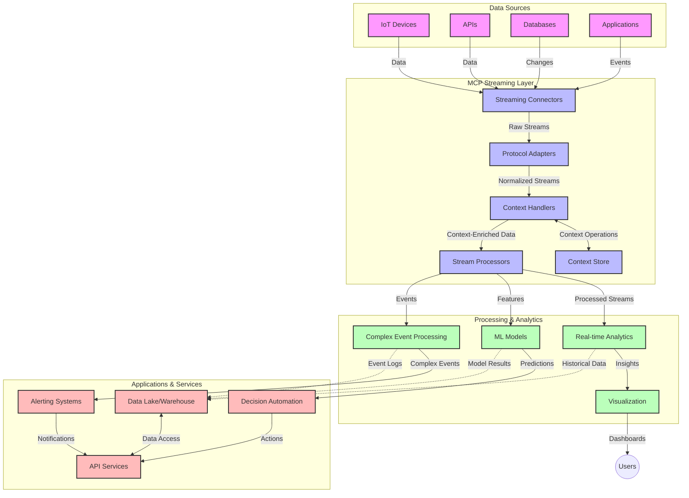

<!--
CO_OP_TRANSLATOR_METADATA:
{
  "original_hash": "68c518dbff8a3b127ed2aa934054c56c",
  "translation_date": "2025-06-11T17:18:04+00:00",
  "source_file": "05-AdvancedTopics/mcp-realtimestreaming/README.md",
  "language_code": "sv"
}
-->
# Model Context Protocol för Realtidsdataströmning

## Översikt

Realtidsdataströmning har blivit avgörande i dagens datadrivna värld, där företag och applikationer behöver omedelbar tillgång till information för att fatta snabba beslut. Model Context Protocol (MCP) representerar ett stort framsteg i att optimera dessa realtidsströmmande processer, förbättra datahanteringseffektiviteten, bibehålla kontextuell integritet och höja systemets totala prestanda.

Denna modul utforskar hur MCP förändrar realtidsdataströmning genom att erbjuda en standardiserad metod för kontexthantering över AI-modeller, strömmande plattformar och applikationer.

## Introduktion till Realtidsdataströmning

Realtidsdataströmning är ett teknologiskt paradigm som möjliggör kontinuerlig överföring, bearbetning och analys av data i samma ögonblick som den genereras, vilket låter system reagera omedelbart på ny information. Till skillnad från traditionell batchbearbetning som arbetar med statiska dataset, behandlar strömning data i rörelse och levererar insikter och åtgärder med minimal fördröjning.

### Kärnkoncept för Realtidsdataströmning:

- **Kontinuerligt dataflöde**: Data bearbetas som en oavbruten, ständigt pågående ström av händelser eller poster.
- **Låg latens i bearbetning**: System är utformade för att minimera tiden mellan datagenerering och bearbetning.
- **Skalbarhet**: Strömningsarkitekturer måste hantera varierande datavolymer och hastigheter.
- **Felresistens**: System behöver vara robusta mot fel för att säkerställa oavbrutet dataflöde.
- **Stateful bearbetning**: Att bibehålla kontext över händelser är avgörande för meningsfull analys.

### Model Context Protocol och Realtidsströmning

Model Context Protocol (MCP) tar itu med flera viktiga utmaningar i realtidsströmmande miljöer:

1. **Kontextuell kontinuitet**: MCP standardiserar hur kontext bibehålls över distribuerade strömningskomponenter, vilket säkerställer att AI-modeller och bearbetningsnoder har tillgång till relevant historisk och miljömässig kontext.

2. **Effektiv tillståndshantering**: Genom att erbjuda strukturerade mekanismer för kontextöverföring minskar MCP overheaden för tillståndshantering i strömningspipelines.

3. **Interoperabilitet**: MCP skapar ett gemensamt språk för kontextdelning mellan olika strömningsteknologier och AI-modeller, vilket möjliggör mer flexibla och utbyggbara arkitekturer.

4. **Strömningoptimerad kontext**: MCP-implementationer kan prioritera vilka kontextelement som är mest relevanta för realtidsbeslut, vilket optimerar både prestanda och noggrannhet.

5. **Adaptiv bearbetning**: Med korrekt kontexthantering genom MCP kan strömmande system dynamiskt anpassa bearbetningen baserat på föränderliga förhållanden och mönster i datan.

I moderna applikationer, från IoT-sensornätverk till finansiella handelsplattformar, möjliggör integrationen av MCP med strömningsteknologier mer intelligent, kontextmedveten bearbetning som kan reagera på komplexa och föränderliga situationer i realtid.

## Lärandemål

Efter denna lektion kommer du att kunna:

- Förstå grunderna i realtidsdataströmning och dess utmaningar
- Förklara hur Model Context Protocol (MCP) förbättrar realtidsdataströmning
- Implementera MCP-baserade strömningslösningar med populära ramverk som Kafka och Pulsar
- Designa och driftsätta felresistenta, högpresterande strömningsarkitekturer med MCP
- Använda MCP-koncept i IoT, finansiell handel och AI-drivna analysfall
- Utvärdera nya trender och framtida innovationer inom MCP-baserad strömningsteknologi

### Definition och Betydelse

Realtidsdataströmning innebär kontinuerlig generering, bearbetning och leverans av data med minimal fördröjning. Till skillnad från batchbearbetning, där data samlas in och bearbetas i grupper, behandlas strömningsdata stegvis när den anländer, vilket möjliggör omedelbara insikter och åtgärder.

Viktiga egenskaper för realtidsdataströmning inkluderar:

- **Låg latens**: Bearbetning och analys av data inom millisekunder till sekunder
- **Kontinuerligt flöde**: Oavbrutna dataflöden från olika källor
- **Omedelbar bearbetning**: Analysera data i samma ögonblick som den anländer istället för i batcher
- **Händelsestyrd arkitektur**: Reagera på händelser när de inträffar

### Utmaningar i Traditionell Dataströmning

Traditionella metoder för dataströmning står inför flera begränsningar:

1. **Kontextförlust**: Svårigheter att bibehålla kontext över distribuerade system
2. **Skalbarhetsproblem**: Utmaningar med att skala för att hantera hög volym och hög hastighet
3. **Integrationskomplexitet**: Problem med interoperabilitet mellan olika system
4. **Latenshantering**: Balans mellan genomströmning och bearbetningstid
5. **Datakonsistens**: Säkerställa datans korrekthet och fullständighet över strömmen

## Förståelse av Model Context Protocol (MCP)

### Vad är MCP?

Model Context Protocol (MCP) är ett standardiserat kommunikationsprotokoll utformat för att underlätta effektiv interaktion mellan AI-modeller och applikationer. I realtidsdataströmningssammanhang erbjuder MCP en ram för:

- Att bevara kontext genom hela datapipelinen
- Standardisera datautbytesformat
- Optimera överföring av stora datamängder
- Förbättra modell-till-modell och modell-till-applikationskommunikation

### Kärnkomponenter och Arkitektur

MCP-arkitekturen för realtidsströmning består av flera viktiga komponenter:

1. **Context Handlers**: Hanterar och bibehåller kontextuell information över strömningspipen
2. **Stream Processors**: Bearbetar inkommande dataströmmar med kontextmedvetna tekniker
3. **Protocol Adapters**: Konverterar mellan olika strömningsprotokoll samtidigt som kontext bevaras
4. **Context Store**: Effektivt lagrar och hämtar kontextuell information
5. **Streaming Connectors**: Ansluter till olika strömningsplattformar (Kafka, Pulsar, Kinesis, etc.)



### Hur MCP Förbättrar Realtidsdatahantering

MCP löser traditionella strömningsutmaningar genom:

- **Kontextuell integritet**: Bibehåller relationer mellan datapunkter genom hela pipelinen
- **Optimerad överföring**: Minskar redundans i datautbyte genom intelligent kontexthantering
- **Standardiserade gränssnitt**: Erbjuder konsekventa API:er för strömningskomponenter
- **Minskad latens**: Minimerar bearbetningskostnader genom effektiv kontexthantering
- **Förbättrad skalbarhet**: Stöder horisontell skalning samtidigt som kontext bevaras

## Integration och Implementering

Realtidsdataströmningssystem kräver noggrann arkitektonisk design och implementering för att bibehålla både prestanda och kontextuell integritet. Model Context Protocol erbjuder en standardiserad metod för att integrera AI-modeller och strömningsteknologier, vilket möjliggör mer avancerade, kontextmedvetna bearbetningspipelines.

### Översikt av MCP-integration i Strömningsarkitekturer

Att implementera MCP i realtidsströmmande miljöer involverar flera viktiga aspekter:

1. **Kontextserialisering och transport**: MCP tillhandahåller effektiva mekanismer för att koda kontextuell information inom strömningsdatapaket, vilket säkerställer att viktig kontext följer med datan genom hela bearbetningspipen. Detta inkluderar standardiserade serialiseringsformat optimerade för strömningstransport.

2. **Stateful strömbehandling**: MCP möjliggör mer intelligent stateful bearbetning genom att bibehålla en konsekvent kontextrepresentation över bearbetningsnoder. Detta är särskilt värdefullt i distribuerade strömningsarkitekturer där tillståndshantering traditionellt är utmanande.

3. **Eventtid vs. bearbetningstid**: MCP-implementationer i strömningssystem måste hantera den vanliga utmaningen att skilja på när händelser inträffade och när de bearbetas. Protokollet kan inkludera temporär kontext som bevarar eventtidens semantik.

4. **Backpressure-hantering**: Genom att standardisera kontexthantering hjälper MCP till att hantera backpressure i strömningssystem, vilket låter komponenter kommunicera sina bearbetningskapaciteter och anpassa flödet därefter.

5. **Context Windowing och aggregering**: MCP underlättar mer avancerade fönsteroperationer genom att erbjuda strukturerade representationer av temporär och relationell kontext, vilket möjliggör mer meningsfulla aggregeringar över händelseströmmar.

6. **Exactly-Once bearbetning**: I strömningssystem som kräver exactly-once-semantik kan MCP inkludera bearbetningsmetadata för att hjälpa till att spåra och verifiera bearbetningsstatus över distribuerade komponenter.

Implementeringen av MCP över olika strömningsteknologier skapar en enhetlig metod för kontexthantering, minskar behovet av specialanpassad integrationskod och förbättrar systemets förmåga att bibehålla meningsfull kontext när data flödar genom pipelinen.

### MCP i Olika Dataströmningsramverk

MCP kan integreras med populära strömningsramverk inklusive:

#### Apache Kafka-integration

```python
from mcp_streaming import MCPKafkaConnector

# Initialize MCP Kafka connector
connector = MCPKafkaConnector(
    bootstrap_servers='localhost:9092',
    context_preservation=True
)

# Create a context-aware consumer
consumer = connector.create_consumer('input-topic')

# Process streaming data with context
for message in consumer:
    context = message.get_context()
    data = message.get_value()
    
    # Process with context awareness
    result = process_with_context(data, context)
    
    # Produce output with preserved context
    connector.produce('output-topic', result, context=context)
```

#### Apache Pulsar-implementation

```python
from mcp_streaming import MCPPulsarClient

# Initialize MCP Pulsar client
client = MCPPulsarClient('pulsar://localhost:6650')

# Subscribe with context awareness
consumer = client.subscribe('input-topic', 'subscription-name', 
                           context_enabled=True)

# Process messages with context preservation
while True:
    message = consumer.receive()
    context = message.get_context()
    
    # Process with context
    result = process_with_context(message.data(), context)
    
    # Acknowledge the message
    consumer.acknowledge(message)
    
    # Send result with preserved context
    producer = client.create_producer('output-topic')
    producer.send(result, context=context)
```

### Bästa Praxis för Driftsättning

Vid implementering av MCP för realtidsströmning:

1. **Designa för felresistens**:
   - Implementera korrekt felhantering
   - Använd dead-letter-köer för misslyckade meddelanden
   - Designa idempotenta processorer

2. **Optimera för prestanda**:
   - Konfigurera lämpliga buffertstorlekar
   - Använd batchning där det är lämpligt
   - Implementera backpressure-mekanismer

3. **Övervaka och observera**:
   - Följ strömningsbearbetningsmått
   - Övervaka kontextspridning
   - Sätt upp larm för avvikelser

4. **Säkra dina strömmar**:
   - Implementera kryptering för känslig data
   - Använd autentisering och auktorisering
   - Tillämpa korrekta åtkomstkontroller

### MCP i IoT och Edge Computing

MCP förbättrar IoT-strömning genom att:

- Bevara enhetskontext över bearbetningspipen
- Möjliggöra effektiv edge-till-moln dataströmning
- Stödja realtidsanalys av IoT-dataströmmar
- Underlätta enhet-till-enhet-kommunikation med kontext

Exempel: Smart City Sensor Networks  
```
Sensors → Edge Gateways → MCP Stream Processors → Real-time Analytics → Automated Responses
```

### Roll i Finansiella Transaktioner och Högfrekvenshandel

MCP ger betydande fördelar för finansiell dataströmning:

- Ultra-låg latens i bearbetning för handelsbeslut
- Bibehålla transaktionskontext genom hela bearbetningen
- Stödja komplex händelsebearbetning med kontextmedvetenhet
- Säkerställa datakonsistens över distribuerade handelssystem

### Förbättring av AI-drivna Dataanalyser

MCP skapar nya möjligheter för strömningsanalys:

- Realtidsmodellträning och inferens
- Kontinuerligt lärande från strömningsdata
- Kontextmedveten funktionsutvinning
- Multi-modell inferenspipelines med bevarad kontext

## Framtida Trender och Innovationer

### MCP:s Utveckling i Realtidsmiljöer

Framöver förväntas MCP utvecklas för att hantera:

- **Integration med kvantdatorer**: Förberedelser för kvantbaserade strömningssystem
- **Edge-native bearbetning**: Flytta mer kontextmedveten bearbetning till edge-enheter
- **Autonom strömningshantering**: Självoptimerande strömningspipelines
- **Federerad strömning**: Distribuerad bearbetning med bibehållen integritet

### Potentiella Teknologiska Framsteg

Framväxande teknologier som kommer forma MCP-strömningens framtid:

1. **AI-optimerade strömningsprotokoll**: Specialanpassade protokoll för AI-arbetsbelastningar
2. **Neuromorfisk databehandling**: Hjärninspirerad beräkning för strömningsbearbetning
3. **Serverlös strömning**: Händelsestyrd, skalbar strömning utan infrastrukturhantering
4. **Distribuerade kontextlager**: Globalt distribuerad men mycket konsekvent kontexthantering

## Praktiska Övningar

### Övning 1: Sätta upp en grundläggande MCP-strömningspipeline

I denna övning lär du dig att:  
- Konfigurera en grundläggande MCP-strömningsmiljö  
- Implementera kontexthanterare för strömningsbearbetning  
- Testa och validera kontextbevarande  

### Övning 2: Skapa en realtidsanalysdashboard

Bygg en komplett applikation som:  
- Tar emot strömningsdata med MCP  
- Bearbetar strömmen samtidigt som kontext bibehålls  
- Visualiserar resultat i realtid  

### Övning 3: Implementera komplex händelsebearbetning med MCP

Avancerad övning som täcker:  
- Mönsterigenkänning i strömmar  
- Kontextuell korrelation över flera strömmar  
- Generera komplexa händelser med bevarad kontext  

## Ytterligare Resurser

- [Model Context Protocol Specification](https://github.com/microsoft/model-context-protocol) - Officiell MCP-specifikation och dokumentation  
- [Apache Kafka Documentation](https://kafka.apache.org/documentation/) - Lär dig om Kafka för strömningsbearbetning  
- [Apache Pulsar](https://pulsar.apache.org/) - Enhetlig meddelande- och strömningsplattform  
- [Streaming Systems: The What, Where, When, and How of Large-Scale Data Processing](https://www.oreilly.com/library/view/streaming-systems/9781491983867/) - Omfattande bok om strömningsarkitekturer  
- [Microsoft Azure Event Hubs](https://learn.microsoft.com/en-us/azure/event-hubs/event-hubs-about) - Hanterad tjänst för händelseströmning  
- [MLflow Documentation](https://mlflow.org/docs/latest/index.html) - För ML-modellspårning och driftsättning  
- [Real-Time Analytics with Apache Storm](https://storm.apache.org/releases/current/index.html) - Bearbetningsramverk för realtidsberäkningar  
- [Flink ML](https://nightlies.apache.org/flink/flink-ml-docs-master/) - Maskininlärningsbibliotek för Apache Flink  
- [LangChain Documentation](https://python.langchain.com/docs/get_started/introduction) - Bygga applikationer med LLMs  

## Läranderesultat

Genom att slutföra denna modul kommer du att kunna:

- Förstå grunderna i realtidsdataströmning och dess utmaningar  
- Förklara hur Model Context Protocol (MCP) förbättrar realtidsdataströmning  
- Implementera MCP-baserade strömningslösningar med populära ramverk som Kafka och Pulsar  
- Designa och driftsätta felresistenta, högpresterande strömningsarkitekturer med MCP  
- Använda MCP-koncept i IoT, finansiell handel och AI-drivna analysfall  
- Utvärdera nya trender och framtida innovationer inom MCP-baserad strömningsteknologi  

## Vad händer härnäst

- [6. Community Contributions](../../06-CommunityContributions/README.md)

**Ansvarsfriskrivning**:  
Detta dokument har översatts med hjälp av AI-översättningstjänsten [Co-op Translator](https://github.com/Azure/co-op-translator). Även om vi strävar efter noggrannhet, vänligen observera att automatiska översättningar kan innehålla fel eller brister. Det ursprungliga dokumentet på dess modersmål bör betraktas som den auktoritativa källan. För viktig information rekommenderas professionell mänsklig översättning. Vi ansvarar inte för några missförstånd eller feltolkningar som uppstår till följd av användningen av denna översättning.