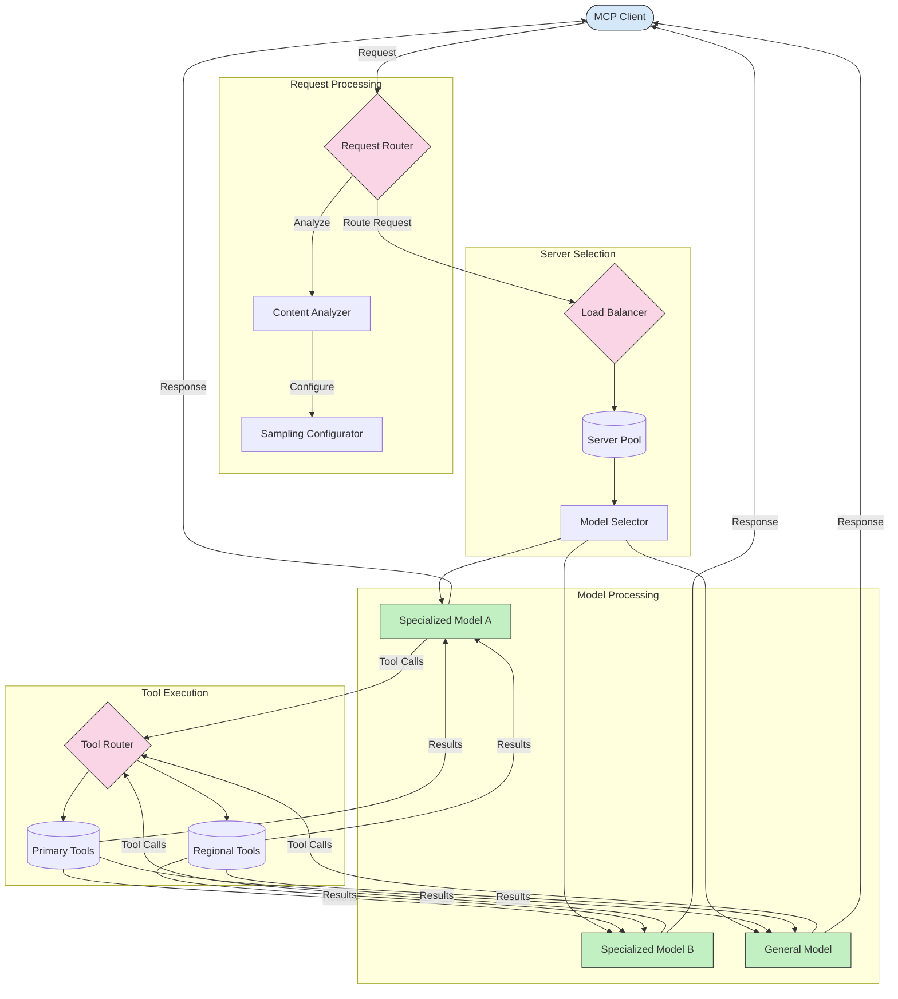

<!--
CO_OP_TRANSLATOR_METADATA:
{
  "original_hash": "2f1b473818b5a6cc9a9bbf777fffa6d4",
  "translation_date": "2025-07-14T21:48:12+00:00",
  "source_file": "05-AdvancedTopics/mcp-routing/README.md",
  "language_code": "sv"
}
-->
## Dynamisk verktygsdirigering

Verktygsdirigering säkerställer att verktygsanrop skickas till den mest lämpliga tjänsten baserat på kontext. Till exempel kan ett väderverktygsanrop behöva dirigeras till en regional slutpunkt baserat på användarens plats, eller ett kalkylatorverktyg kan behöva använda en specifik version av API:et.

Låt oss titta på ett exempel som visar dynamisk verktygsdirigering baserat på förfrågningsanalys, regionala slutpunkter och versionsstöd.

## Sampling och dirigeringsarkitektur i MCP

Sampling är en viktig del av Model Context Protocol (MCP) som möjliggör effektiv hantering och dirigering av förfrågningar. Det innebär att analysera inkommande förfrågningar för att avgöra vilken modell eller tjänst som är mest lämplig att hantera dem, baserat på olika kriterier som innehållstyp, användarkontext och systembelastning.

Sampling och dirigering kan kombineras för att skapa en robust arkitektur som optimerar resursanvändning och säkerställer hög tillgänglighet. Samplingsprocessen kan användas för att klassificera förfrågningar, medan dirigering skickar dem till rätt modeller eller tjänster.

Diagrammet nedan visar hur sampling och dirigering samverkar i en omfattande MCP-arkitektur:

## Vad händer härnäst

- [5.6 Sampling](../mcp-sampling/README.md)

**Ansvarsfriskrivning**:  
Detta dokument har översatts med hjälp av AI-översättningstjänsten [Co-op Translator](https://github.com/Azure/co-op-translator). Även om vi strävar efter noggrannhet, vänligen observera att automatiska översättningar kan innehålla fel eller brister. Det ursprungliga dokumentet på dess modersmål bör betraktas som den auktoritativa källan. För kritisk information rekommenderas professionell mänsklig översättning. Vi ansvarar inte för eventuella missförstånd eller feltolkningar som uppstår vid användning av denna översättning.