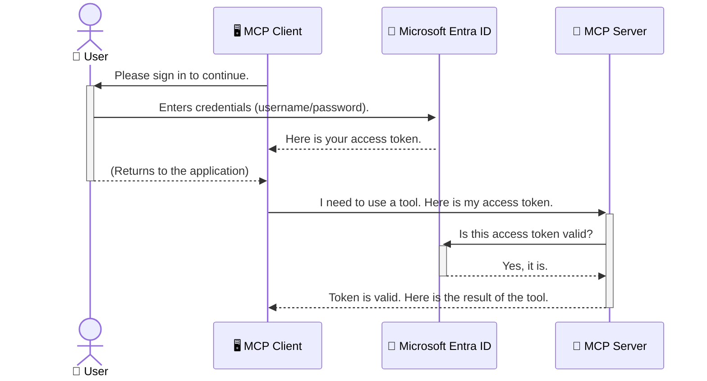

<!--
CO_OP_TRANSLATOR_METADATA:
{
  "original_hash": "6e562d7e5a77c8982da4aa8f762ad1d8",
  "translation_date": "2025-07-14T03:05:49+00:00",
  "source_file": "05-AdvancedTopics/mcp-security-entra/README.md",
  "language_code": "sv"
}
-->
# Säkerställa AI-arbetsflöden: Entra ID-autentisering för Model Context Protocol-servrar

## Introduktion
Att säkra din Model Context Protocol (MCP)-server är lika viktigt som att låsa ytterdörren hemma. Om du lämnar din MCP-server öppen utsätter du dina verktyg och data för obehörig åtkomst, vilket kan leda till säkerhetsintrång. Microsoft Entra ID erbjuder en robust molnbaserad lösning för identitets- och åtkomsthantering som hjälper till att säkerställa att endast auktoriserade användare och applikationer kan interagera med din MCP-server. I detta avsnitt lär du dig hur du skyddar dina AI-arbetsflöden med hjälp av Entra ID-autentisering.

## Lärandemål
Efter detta avsnitt kommer du att kunna:

- Förstå vikten av att säkra MCP-servrar.
- Förklara grunderna i Microsoft Entra ID och OAuth 2.0-autentisering.
- Känna igen skillnaden mellan publika och konfidentiella klienter.
- Implementera Entra ID-autentisering i både lokala (publik klient) och fjärrstyrda (konfidentiell klient) MCP-server-scenarier.
- Tillämpa säkerhetsbästa praxis vid utveckling av AI-arbetsflöden.

## Säkerhet och MCP

Precis som du inte skulle lämna ytterdörren olåst, bör du inte lämna din MCP-server öppen för vem som helst att använda. Att säkra dina AI-arbetsflöden är avgörande för att bygga robusta, pålitliga och säkra applikationer. Detta kapitel introducerar hur du använder Microsoft Entra ID för att skydda dina MCP-servrar, så att endast auktoriserade användare och applikationer kan interagera med dina verktyg och data.

## Varför säkerhet är viktigt för MCP-servrar

Föreställ dig att din MCP-server har ett verktyg som kan skicka e-post eller komma åt en kunddatabas. En osäkrad server innebär att vem som helst potentiellt kan använda det verktyget, vilket kan leda till obehörig dataåtkomst, spam eller andra skadliga aktiviteter.

Genom att implementera autentisering säkerställer du att varje förfrågan till din server verifieras, vilket bekräftar identiteten på användaren eller applikationen som gör förfrågan. Detta är det första och mest kritiska steget för att säkra dina AI-arbetsflöden.

## Introduktion till Microsoft Entra ID

[**Microsoft Entra ID**](https://adoption.microsoft.com/microsoft-security/entra/) är en molnbaserad tjänst för identitets- och åtkomsthantering. Tänk på det som en universell säkerhetsvakt för dina applikationer. Den hanterar den komplexa processen att verifiera användaridentiteter (autentisering) och bestämma vad de får göra (auktorisation).

Genom att använda Entra ID kan du:

- Möjliggöra säker inloggning för användare.
- Skydda API:er och tjänster.
- Hantera åtkomstpolicyer från en central plats.

För MCP-servrar erbjuder Entra ID en robust och allmänt betrodd lösning för att kontrollera vem som kan använda serverns funktioner.

---

## Förstå magin: Hur Entra ID-autentisering fungerar

Entra ID använder öppna standarder som **OAuth 2.0** för att hantera autentisering. Även om detaljerna kan vara komplexa är kärnkonceptet enkelt och kan förstås med en liknelse.

### En enkel introduktion till OAuth 2.0: Valetnyckeln

Tänk på OAuth 2.0 som en parkeringsservice för din bil. När du kommer till en restaurang ger du inte parkeringsvakten din huvudnyckel. Istället ger du en **valetnyckel** som har begränsade rättigheter – den kan starta bilen och låsa dörrarna, men kan inte öppna bagageutrymmet eller handskfacket.

I denna liknelse:

- **Du** är **Användaren**.
- **Din bil** är **MCP-servern** med dess värdefulla verktyg och data.
- **Parkeringvakten** är **Microsoft Entra ID**.
- **Parkeringsvakten** är **MCP-klienten** (applikationen som försöker nå servern).
- **Valetnyckeln** är **Access Token**.

Access token är en säker textsträng som MCP-klienten får från Entra ID efter att du loggat in. Klienten skickar sedan denna token till MCP-servern vid varje förfrågan. Servern kan verifiera token för att säkerställa att förfrågan är legitim och att klienten har nödvändiga rättigheter, utan att någonsin behöva hantera dina faktiska inloggningsuppgifter (som ditt lösenord).

### Autentiseringsflödet

Så här fungerar processen i praktiken:



### Introduktion till Microsoft Authentication Library (MSAL)

Innan vi går in på koden är det viktigt att presentera en nyckelkomponent som du kommer att se i exemplen: **Microsoft Authentication Library (MSAL)**.

MSAL är ett bibliotek utvecklat av Microsoft som gör det mycket enklare för utvecklare att hantera autentisering. Istället för att du själv måste skriva all komplex kod för att hantera säkerhetstoken, inloggningar och sessioner, tar MSAL hand om det tunga arbetet.

Att använda ett bibliotek som MSAL rekommenderas starkt eftersom:

- **Det är säkert:** Det implementerar branschstandardprotokoll och säkerhetsbästa praxis, vilket minskar risken för sårbarheter i din kod.
- **Det förenklar utvecklingen:** Det döljer komplexiteten i OAuth 2.0 och OpenID Connect, så att du kan lägga till robust autentisering i din applikation med bara några kodrader.
- **Det underhålls:** Microsoft uppdaterar och underhåller aktivt MSAL för att hantera nya säkerhetshot och plattformsförändringar.

MSAL stöder många olika språk och applikationsramverk, inklusive .NET, JavaScript/TypeScript, Python, Java, Go samt mobila plattformar som iOS och Android. Det innebär att du kan använda samma konsekventa autentiseringsmönster över hela din tekniska stack.

För att lära dig mer om MSAL kan du läsa den officiella [MSAL-översiktsdokumentationen](https://learn.microsoft.com/entra/identity-platform/msal-overview).

---

## Säkerställa din MCP-server med Entra ID: En steg-för-steg-guide

Nu går vi igenom hur du säkrar en lokal MCP-server (som kommunicerar över `stdio`) med Entra ID. Detta exempel använder en **publik klient**, vilket passar för applikationer som körs på en användares dator, som en skrivbordsapp eller en lokal utvecklingsserver.

### Scenario 1: Säkerställa en lokal MCP-server (med en publik klient)

I detta scenario tittar vi på en MCP-server som körs lokalt, kommunicerar över `stdio` och använder Entra ID för att autentisera användaren innan åtkomst till dess verktyg tillåts. Servern har ett enda verktyg som hämtar användarens profilinformation från Microsoft Graph API.

#### 1. Registrera applikationen i Entra ID

Innan du skriver någon kod måste du registrera din applikation i Microsoft Entra ID. Detta berättar för Entra ID om din applikation och ger den tillstånd att använda autentiseringstjänsten.

1. Gå till **[Microsoft Entra-portalen](https://entra.microsoft.com/)**.
2. Gå till **App registrations** och klicka på **New registration**.
3. Ge din applikation ett namn (t.ex. "My Local MCP Server").
4. För **Supported account types**, välj **Accounts in this organizational directory only**.
5. Du kan lämna **Redirect URI** tom för detta exempel.
6. Klicka på **Register**.

När registreringen är klar, notera **Application (client) ID** och **Directory (tenant) ID**. Du kommer att behöva dessa i din kod.

#### 2. Koden: En genomgång

Låt oss titta på de viktigaste delarna av koden som hanterar autentisering. Den fullständiga koden för detta exempel finns i mappen [Entra ID - Local - WAM](https://github.com/Azure-Samples/mcp-auth-servers/tree/main/src/entra-id-local-wam) i [mcp-auth-servers GitHub-repositoriet](https://github.com/Azure-Samples/mcp-auth-servers).

**`AuthenticationService.cs`**

Denna klass ansvarar för att hantera interaktionen med Entra ID.

- **`CreateAsync`**: Denna metod initierar `PublicClientApplication` från MSAL (Microsoft Authentication Library). Den konfigureras med din applikations `clientId` och `tenantId`.
- **`WithBroker`**: Detta aktiverar användning av en broker (som Windows Web Account Manager), vilket ger en säkrare och smidigare single sign-on-upplevelse.
- **`AcquireTokenAsync`**: Detta är kärnmetoden. Den försöker först hämta en token tyst (så att användaren inte behöver logga in igen om en giltig session redan finns). Om en tyst token inte kan hämtas, uppmanas användaren att logga in interaktivt.

```csharp
// Simplified for clarity
public static async Task<AuthenticationService> CreateAsync(ILogger<AuthenticationService> logger)
{
    var msalClient = PublicClientApplicationBuilder
        .Create(_clientId) // Your Application (client) ID
        .WithAuthority(AadAuthorityAudience.AzureAdMyOrg)
        .WithTenantId(_tenantId) // Your Directory (tenant) ID
        .WithBroker(new BrokerOptions(BrokerOptions.OperatingSystems.Windows))
        .Build();

    // ... cache registration ...

    return new AuthenticationService(logger, msalClient);
}

public async Task<string> AcquireTokenAsync()
{
    try
    {
        // Try silent authentication first
        var accounts = await _msalClient.GetAccountsAsync();
        var account = accounts.FirstOrDefault();

        AuthenticationResult? result = null;

        if (account != null)
        {
            result = await _msalClient.AcquireTokenSilent(_scopes, account).ExecuteAsync();
        }
        else
        {
            // If no account, or silent fails, go interactive
            result = await _msalClient.AcquireTokenInteractive(_scopes).ExecuteAsync();
        }

        return result.AccessToken;
    }
    catch (Exception ex)
    {
        _logger.LogError(ex, "An error occurred while acquiring the token.");
        throw; // Optionally rethrow the exception for higher-level handling
    }
}
```

**`Program.cs`**

Här sätts MCP-servern upp och autentiseringstjänsten integreras.

- **`AddSingleton<AuthenticationService>`**: Registrerar `AuthenticationService` i beroendeinjektionscontainern så att den kan användas av andra delar av applikationen (som vårt verktyg).
- **`GetUserDetailsFromGraph`-verktyget**: Detta verktyg kräver en instans av `AuthenticationService`. Innan det gör något anropar det `authService.AcquireTokenAsync()` för att få en giltig access token. Om autentiseringen lyckas använder det token för att anropa Microsoft Graph API och hämta användarens uppgifter.

```csharp
// Simplified for clarity
[McpServerTool(Name = "GetUserDetailsFromGraph")]
public static async Task<string> GetUserDetailsFromGraph(
    AuthenticationService authService)
{
    try
    {
        // This will trigger the authentication flow
        var accessToken = await authService.AcquireTokenAsync();

        // Use the token to create a GraphServiceClient
        var graphClient = new GraphServiceClient(
            new BaseBearerTokenAuthenticationProvider(new TokenProvider(authService)));

        var user = await graphClient.Me.GetAsync();

        return System.Text.Json.JsonSerializer.Serialize(user);
    }
    catch (Exception ex)
    {
        return $"Error: {ex.Message}";
    }
}
```

#### 3. Så här fungerar allt tillsammans

1. När MCP-klienten försöker använda verktyget `GetUserDetailsFromGraph` anropar verktyget först `AcquireTokenAsync`.
2. `AcquireTokenAsync` triggar MSAL-biblioteket att kontrollera om en giltig token finns.
3. Om ingen token hittas, kommer MSAL via brokern att be användaren logga in med sitt Entra ID-konto.
4. När användaren loggar in utfärdar Entra ID en access token.
5. Verktyget tar emot token och använder den för att göra ett säkert anrop till Microsoft Graph API.
6. Användarens uppgifter returneras till MCP-klienten.

Denna process säkerställer att endast autentiserade användare kan använda verktyget, vilket effektivt skyddar din lokala MCP-server.

### Scenario 2: Säkerställa en fjärrstyrd MCP-server (med en konfidentiell klient)

När din MCP-server körs på en fjärrmaskin (t.ex. en molnserver) och kommunicerar över ett protokoll som HTTP Streaming, är säkerhetskraven annorlunda. I detta fall bör du använda en **konfidentiell klient** och **Authorization Code Flow**. Detta är en säkrare metod eftersom applikationens hemligheter aldrig exponeras för webbläsaren.

Detta exempel använder en TypeScript-baserad MCP-server som använder Express.js för att hantera HTTP-förfrågningar.

#### 1. Registrera applikationen i Entra ID

Upplägget i Entra ID är liknande det för den publika klienten, men med en viktig skillnad: du måste skapa en **client secret**.

1. Gå till **[Microsoft Entra-portalen](https://entra.microsoft.com/)**.
2. I din appregistrering, gå till fliken **Certificates & secrets**.
3. Klicka på **New client secret**, ge den en beskrivning och klicka på **Add**.
4. **Viktigt:** Kopiera hemligheten direkt. Du kommer inte att kunna se den igen.
5. Du måste också konfigurera en **Redirect URI**. Gå till fliken **Authentication**, klicka på **Add a platform**, välj **Web** och ange redirect URI för din applikation (t.ex. `http://localhost:3001/auth/callback`).

> **⚠️ Viktig säkerhetsnotis:** För produktionsapplikationer rekommenderar Microsoft starkt att använda **secretless authentication**-metoder som **Managed Identity** eller **Workload Identity Federation** istället för klienthemligheter. Klienthemligheter innebär säkerhetsrisker eftersom de kan exponeras eller komprometteras. Managed identities erbjuder en säkrare metod genom att eliminera behovet av att lagra autentiseringsuppgifter i din kod eller konfiguration.
>
> För mer information om managed identities och hur du implementerar dem, se [Managed identities for Azure resources overview](https://learn.microsoft.com/entra/identity/managed-identities-azure-resources/overview).

#### 2. Koden: En genomgång

Detta exempel använder en sessionsbaserad metod. När användaren autentiserar sig lagrar servern access token och refresh token i en session och ger användaren en sessionstoken. Denna sessionstoken används sedan för efterföljande förfrågningar. Den fullständiga koden för detta exempel finns i mappen [Entra ID - Confidential client](https://github.com/Azure-Samples/mcp-auth-servers/tree/main/src/entra-id-cca-session) i [mcp-auth-servers GitHub-repositoriet](https://github.com/Azure-Samples/mcp-auth-servers).

**`Server.ts`**

Denna fil sätter upp Express-servern och MCP-transportlagret.

- **`requireBearerAuth`**: Detta är middleware som skyddar `/sse` och `/message` endpoints. Den kontrollerar att en giltig bearer-token finns i `Authorization`-huvudet i förfrågan.
- **`EntraIdServerAuthProvider`**: Detta är en anpassad klass som implementerar gränssnittet `McpServerAuthorizationProvider`. Den ansvarar för att hantera OAuth 2.0-flödet.
- **`/auth/callback`**: Denna endpoint hanterar redirect från Entra ID efter att användaren autentiserat sig. Den byter ut auktoriseringskoden mot en access token och en refresh token.

```typescript
// Simplified for clarity
const app = express();
const { server } = createServer();
const provider = new EntraIdServerAuthProvider();

// Protect the SSE endpoint
app.get("/sse", requireBearerAuth({
  provider,
  requiredScopes: ["User.Read"]
}), async (req, res) => {
  // ... connect to the transport ...
});

// Protect the message endpoint
app.post("/message", requireBearerAuth({
  provider,
  requiredScopes: ["User.Read"]
}), async (req, res) => {
  // ... handle the message ...
});

// Handle the OAuth 2.0 callback
app.get("/auth/callback", (req, res) => {
  provider.handleCallback(req.query.code, req.query.state)
    .then(result => {
      // ... handle success or failure ...
    });
});
```

**`Tools.ts`**

Denna fil definierar de verktyg som MCP-servern tillhandahåller. Verktyget `getUserDetails` liknar det i föregående exempel, men hämtar access token från sessionen.

```typescript
// Simplified for clarity
server.setRequestHandler(CallToolRequestSchema, async (request) => {
  const { name } = request.params;
  const context = request.params?.context as { token?: string } | undefined;
  const sessionToken = context?.token;

  if (name === ToolName.GET_USER_DETAILS) {
    if (!sessionToken) {
      throw new AuthenticationError("Authentication token is missing or invalid. Ensure the token is provided in the request context.");
    }

    // Get the Entra ID token from the session store
    const tokenData = tokenStore.getToken(sessionToken);
    const entraIdToken = tokenData.accessToken;

    const graphClient = Client.init({
      authProvider: (done) => {
        done(null, entraIdToken);
      }
    });

    const user = await graphClient.api('/me').get();

    // ... return user details ...
  }
});
```

**`auth/EntraIdServerAuthProvider.ts`**

Denna klass hanterar logiken för:

- Att omdirigera användaren till Entra ID:s inloggningssida.
- Att byta auktoriseringskoden mot en access token.
- Att lagra token i `tokenStore`.
- Att uppdatera access token när den går ut.

#### 3. Så här fungerar allt tillsammans

1. När en användare först försöker ansluta till MCP-servern ser `requireBearerAuth`-middleware att de inte har en giltig session och omdirigerar dem till Entra ID:s inloggningssida.
2. Användaren loggar in med sitt Entra ID-konto.
3. Entra ID omdirigerar användaren tillbaka till `/auth/callback`-endpointen med en auktoriseringskod.
4. Servern byter koden mot en access token och en refresh token, sparar dem och skapar en sessionstoken som skickas till klienten.  
5. Klienten kan nu använda denna sessionstoken i `Authorization`-huvudet för alla framtida förfrågningar till MCP-servern.  
6. När verktyget `getUserDetails` anropas, använder det sessionstoken för att hämta Entra ID access token och använder sedan den för att anropa Microsoft Graph API.

Detta flöde är mer komplext än flödet för public clients, men krävs för internetexponerade endpoints. Eftersom fjärr-MCP-servrar är tillgängliga över det publika internet behöver de starkare säkerhetsåtgärder för att skydda mot obehörig åtkomst och potentiella attacker.


## Säkerhetsrekommendationer

- **Använd alltid HTTPS**: Kryptera kommunikationen mellan klient och server för att skydda tokens från att avlyssnas.  
- **Implementera rollbaserad åtkomstkontroll (RBAC)**: Kontrollera inte bara *om* en användare är autentiserad, utan även *vad* de är behöriga att göra. Du kan definiera roller i Entra ID och kontrollera dessa i din MCP-server.  
- **Övervaka och granska**: Logga alla autentiseringsevenemang så att du kan upptäcka och reagera på misstänkt aktivitet.  
- **Hantera rate limiting och throttling**: Microsoft Graph och andra API:er implementerar rate limiting för att förhindra missbruk. Implementera exponentiell backoff och retry-logik i din MCP-server för att hantera HTTP 429 (Too Many Requests) på ett smidigt sätt. Överväg att cachelagra ofta åtkommen data för att minska API-anrop.  
- **Säker lagring av tokens**: Spara access tokens och refresh tokens på ett säkert sätt. För lokala applikationer, använd systemets säkra lagringsmekanismer. För serverapplikationer, överväg krypterad lagring eller säkra nyckelhanteringstjänster som Azure Key Vault.  
- **Hantera tokenutgång**: Access tokens har en begränsad livslängd. Implementera automatisk tokenförnyelse med hjälp av refresh tokens för att bibehålla en sömlös användarupplevelse utan att kräva omautentisering.  
- **Överväg att använda Azure API Management**: Att implementera säkerhet direkt i din MCP-server ger dig finmaskig kontroll, men API-gateways som Azure API Management kan hantera många av dessa säkerhetsaspekter automatiskt, inklusive autentisering, auktorisering, rate limiting och övervakning. De erbjuder ett centraliserat säkerhetslager mellan dina klienter och MCP-servrar. För mer information om att använda API-gateways med MCP, se vår [Azure API Management Your Auth Gateway For MCP Servers](https://techcommunity.microsoft.com/blog/integrationsonazureblog/azure-api-management-your-auth-gateway-for-mcp-servers/4402690).


## Viktiga punkter

- Att säkra din MCP-server är avgörande för att skydda dina data och verktyg.  
- Microsoft Entra ID erbjuder en robust och skalbar lösning för autentisering och auktorisering.  
- Använd en **public client** för lokala applikationer och en **confidential client** för fjärrservrar.  
- **Authorization Code Flow** är det säkraste alternativet för webbapplikationer.


## Övning

1. Fundera på en MCP-server du skulle kunna bygga. Skulle det vara en lokal server eller en fjärrserver?  
2. Baserat på ditt svar, skulle du använda en public eller confidential client?  
3. Vilka behörigheter skulle din MCP-server begära för att utföra åtgärder mot Microsoft Graph?


## Praktiska övningar

### Övning 1: Registrera en applikation i Entra ID  
Navigera till Microsoft Entra-portalen.  
Registrera en ny applikation för din MCP-server.  
Anteckna Application (client) ID och Directory (tenant) ID.

### Övning 2: Säkra en lokal MCP-server (Public Client)  
- Följ kodexemplet för att integrera MSAL (Microsoft Authentication Library) för användarautentisering.  
- Testa autentiseringsflödet genom att anropa MCP-verktyget som hämtar användardetaljer från Microsoft Graph.

### Övning 3: Säkra en fjärr-MCP-server (Confidential Client)  
- Registrera en confidential client i Entra ID och skapa en klienthemlighet.  
- Konfigurera din Express.js MCP-server att använda Authorization Code Flow.  
- Testa de skyddade endpoints och bekräfta åtkomst baserat på token.

### Övning 4: Tillämpa säkerhetsrekommendationer  
- Aktivera HTTPS för din lokala eller fjärrserver.  
- Implementera rollbaserad åtkomstkontroll (RBAC) i din serverlogik.  
- Lägg till hantering av tokenutgång och säker tokenlagring.

## Resurser

1. **MSAL Overview Documentation**  
   Lär dig hur Microsoft Authentication Library (MSAL) möjliggör säker tokenhämtning över plattformar:  
   [MSAL Overview on Microsoft Learn](https://learn.microsoft.com/en-gb/entra/msal/overview)

2. **Azure-Samples/mcp-auth-servers GitHub Repository**  
   Referensimplementationer av MCP-servrar som visar autentiseringsflöden:  
   [Azure-Samples/mcp-auth-servers on GitHub](https://github.com/Azure-Samples/mcp-auth-servers)

3. **Managed Identities for Azure Resources Overview**  
   Förstå hur du kan eliminera hemligheter genom att använda system- eller användartilldelade managed identities:  
   [Managed Identities Overview on Microsoft Learn](https://learn.microsoft.com/en-us/entra/identity/managed-identities-azure-resources/)

4. **Azure API Management: Your Auth Gateway for MCP Servers**  
   En djupdykning i att använda APIM som en säker OAuth2-gateway för MCP-servrar:  
   [Azure API Management Your Auth Gateway For MCP Servers](https://techcommunity.microsoft.com/blog/integrationsonazureblog/azure-api-management-your-auth-gateway-for-mcp-servers/4402690)

5. **Microsoft Graph Permissions Reference**  
   Omfattande lista över delegerade och applikationsbehörigheter för Microsoft Graph:  
   [Microsoft Graph Permissions Reference](https://learn.microsoft.com/zh-tw/graph/permissions-reference)


## Lärandemål  
Efter att ha slutfört denna sektion kommer du att kunna:

- Förklara varför autentisering är avgörande för MCP-servrar och AI-arbetsflöden.  
- Ställa in och konfigurera Entra ID-autentisering för både lokala och fjärr-MCP-server-scenarier.  
- Välja rätt klienttyp (public eller confidential) baserat på din servers distribution.  
- Implementera säkra kodningsmetoder, inklusive tokenlagring och rollbaserad auktorisering.  
- Tryggt skydda din MCP-server och dess verktyg från obehörig åtkomst.

## Vad händer härnäst

- [5.13 Model Context Protocol (MCP) Integration with Azure AI Foundry](../mcp-foundry-agent-integration/README.md)

**Ansvarsfriskrivning**:  
Detta dokument har översatts med hjälp av AI-översättningstjänsten [Co-op Translator](https://github.com/Azure/co-op-translator). Även om vi strävar efter noggrannhet, vänligen observera att automatiska översättningar kan innehålla fel eller brister. Det ursprungliga dokumentet på dess modersmål bör betraktas som den auktoritativa källan. För kritisk information rekommenderas professionell mänsklig översättning. Vi ansvarar inte för några missförstånd eller feltolkningar som uppstår till följd av användningen av denna översättning.