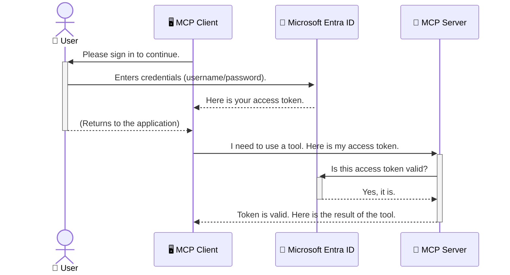

<!--
CO_OP_TRANSLATOR_METADATA:
{
  "original_hash": "6e562d7e5a77c8982da4aa8f762ad1d8",
  "translation_date": "2025-07-02T09:32:03+00:00",
  "source_file": "05-AdvancedTopics/mcp-security-entra/README.md",
  "language_code": "sv"
}
-->
# Säkerställa AI-flöden: Entra ID-autentisering för Model Context Protocol-servrar

## Introduktion
Att säkra din Model Context Protocol (MCP)-server är lika viktigt som att låsa ytterdörren hemma. Om du lämnar din MCP-server öppen utsätter du dina verktyg och data för obehörig åtkomst, vilket kan leda till säkerhetsintrång. Microsoft Entra ID erbjuder en robust molnbaserad lösning för identitets- och åtkomsthantering som hjälper till att säkerställa att endast auktoriserade användare och applikationer kan interagera med din MCP-server. I det här avsnittet lär du dig hur du skyddar dina AI-flöden med hjälp av Entra ID-autentisering.

## Lärandemål
När du har gått igenom detta avsnitt ska du kunna:

- Förstå vikten av att säkra MCP-servrar.
- Förklara grunderna i Microsoft Entra ID och OAuth 2.0-autentisering.
- Känna igen skillnaden mellan publika och konfidentiella klienter.
- Implementera Entra ID-autentisering i både lokala (publik klient) och fjärrstyrda (konfidentiell klient) MCP-server-scenarier.
- Använda säkerhetsbästa praxis vid utveckling av AI-flöden.

## Säkerhet och MCP

Precis som du inte skulle lämna ytterdörren olåst bör du inte lämna din MCP-server öppen för vem som helst att använda. Att säkra dina AI-flöden är avgörande för att bygga robusta, pålitliga och säkra applikationer. I detta kapitel introduceras du för hur du använder Microsoft Entra ID för att skydda dina MCP-servrar, så att endast auktoriserade användare och applikationer kan interagera med dina verktyg och data.

## Varför säkerhet är viktigt för MCP-servrar

Tänk dig att din MCP-server har ett verktyg som kan skicka e-post eller komma åt en kunddatabas. En osäkrad server skulle innebära att vem som helst potentiellt kan använda det verktyget, vilket kan leda till obehörig dataåtkomst, skräppost eller andra skadliga aktiviteter.

Genom att implementera autentisering säkerställer du att varje förfrågan till din server verifieras och att identiteten på användaren eller applikationen som gör förfrågan bekräftas. Detta är det första och mest kritiska steget för att säkra dina AI-flöden.

## Introduktion till Microsoft Entra ID

[**Microsoft Entra ID**](https://adoption.microsoft.com/microsoft-security/entra/) är en molnbaserad tjänst för identitets- och åtkomsthantering. Tänk på det som en universell säkerhetsvakt för dina applikationer. Den hanterar den komplexa processen att verifiera användaridentiteter (autentisering) och bestämma vad de har rätt att göra (auktorisering).

Genom att använda Entra ID kan du:

- Möjliggöra säker inloggning för användare.
- Skydda API:er och tjänster.
- Hantera åtkomstpolicyer från en central plats.

För MCP-servrar erbjuder Entra ID en robust och allmänt betrodd lösning för att kontrollera vem som kan använda serverns funktioner.

---

## Förstå magin: Hur Entra ID-autentisering fungerar

Entra ID använder öppna standarder som **OAuth 2.0** för att hantera autentisering. Även om detaljerna kan vara komplexa är kärnkonceptet enkelt och kan förstås med en liknelse.

### En enkel introduktion till OAuth 2.0: Valettnyckeln

Tänk på OAuth 2.0 som en parkeringsservice för din bil. När du anländer till en restaurang ger du inte parkeringsvakten din huvudnyckel. Istället ger du en **valettnyckel** som har begränsade rättigheter – den kan starta bilen och låsa dörrarna, men den kan inte öppna bagageutrymmet eller handskfacket.

I denna liknelse:

- **Du** är **Användaren**.
- **Din bil** är **MCP-servern** med dess värdefulla verktyg och data.
- **Parkeringvakten** är **Microsoft Entra ID**.
- **Parkeringsassistenten** är **MCP-klienten** (applikationen som försöker nå servern).
- **Valettnyckeln** är **Access Token**.

Access token är en säker textsträng som MCP-klienten får från Entra ID efter att du loggat in. Klienten skickar sedan med denna token i varje förfrågan till MCP-servern. Servern kan verifiera token för att säkerställa att förfrågan är legitim och att klienten har nödvändiga rättigheter, utan att någonsin behöva hantera dina faktiska inloggningsuppgifter (som ditt lösenord).

### Autentiseringsflödet

Så här fungerar processen i praktiken:



### Introduktion till Microsoft Authentication Library (MSAL)

Innan vi går in på koden är det viktigt att presentera en nyckelkomponent som du kommer att se i exemplen: **Microsoft Authentication Library (MSAL)**.

MSAL är ett bibliotek utvecklat av Microsoft som gör det mycket enklare för utvecklare att hantera autentisering. Istället för att du själv måste skriva all komplex kod för att hantera säkerhetstoken, inloggningar och sessioner, tar MSAL hand om det tunga arbetet.

Att använda ett bibliotek som MSAL rekommenderas starkt eftersom:

- **Det är säkert:** Det implementerar industristandardprotokoll och säkerhetsbästa praxis, vilket minskar risken för sårbarheter i din kod.
- **Det förenklar utvecklingen:** Det döljer komplexiteten i OAuth 2.0 och OpenID Connect, så att du kan lägga till robust autentisering i din applikation med bara några kodrader.
- **Det underhålls:** Microsoft underhåller och uppdaterar MSAL kontinuerligt för att hantera nya säkerhetshot och plattformsförändringar.

MSAL stödjer många olika språk och ramverk, inklusive .NET, JavaScript/TypeScript, Python, Java, Go samt mobila plattformar som iOS och Android. Det innebär att du kan använda samma konsekventa autentiseringsmönster över hela din teknikstack.

För mer information om MSAL kan du läsa den officiella [MSAL-översiktsdokumentationen](https://learn.microsoft.com/entra/identity-platform/msal-overview).

---

## Så här säkrar du din MCP-server med Entra ID: En steg-för-steg-guide

Nu går vi igenom hur du säkrar en lokal MCP-server (en som kommunicerar över `stdio`) using Entra ID. This example uses a **public client**, which is suitable for applications running on a user's machine, like a desktop app or a local development server.

### Scenario 1: Securing a Local MCP Server (with a Public Client)

In this scenario, we'll look at an MCP server that runs locally, communicates over `stdio`, and uses Entra ID to authenticate the user before allowing access to its tools. The server will have a single tool that fetches the user's profile information from the Microsoft Graph API.

#### 1. Setting Up the Application in Entra ID

Before writing any code, you need to register your application in Microsoft Entra ID. This tells Entra ID about your application and grants it permission to use the authentication service.

1. Navigate to the **[Microsoft Entra portal](https://entra.microsoft.com/)**.
2. Go to **App registrations** and click **New registration**.
3. Give your application a name (e.g., "My Local MCP Server").
4. For **Supported account types**, select **Accounts in this organizational directory only**.
5. You can leave the **Redirect URI** blank for this example.
6. Click **Register**.

Once registered, take note of the **Application (client) ID** and **Directory (tenant) ID**. You'll need these in your code.

#### 2. The Code: A Breakdown

Let's look at the key parts of the code that handle authentication. The full code for this example is available in the [Entra ID - Local - WAM](https://github.com/Azure-Samples/mcp-auth-servers/tree/main/src/entra-id-local-wam) folder of the [mcp-auth-servers GitHub repository](https://github.com/Azure-Samples/mcp-auth-servers).

**`AuthenticationService.cs`**

This class is responsible for handling the interaction with Entra ID.

- **`CreateAsync`**: This method initializes the `PublicClientApplication` from the MSAL (Microsoft Authentication Library). It's configured with your application's `clientId` and `tenantId`.
- **`WithBroker`**: This enables the use of a broker (like the Windows Web Account Manager), which provides a more secure and seamless single sign-on experience.
- **`AcquireTokenAsync`**: Detta är kärnmetoden. Den försöker först hämta en token tyst (det vill säga att användaren inte behöver logga in igen om de redan har en giltig session). Om en tyst token inte kan hämtas, uppmanas användaren att logga in interaktivt.

```csharp
// Simplified for clarity
public static async Task<AuthenticationService> CreateAsync(ILogger<AuthenticationService> logger)
{
    var msalClient = PublicClientApplicationBuilder
        .Create(_clientId) // Your Application (client) ID
        .WithAuthority(AadAuthorityAudience.AzureAdMyOrg)
        .WithTenantId(_tenantId) // Your Directory (tenant) ID
        .WithBroker(new BrokerOptions(BrokerOptions.OperatingSystems.Windows))
        .Build();

    // ... cache registration ...

    return new AuthenticationService(logger, msalClient);
}

public async Task<string> AcquireTokenAsync()
{
    try
    {
        // Try silent authentication first
        var accounts = await _msalClient.GetAccountsAsync();
        var account = accounts.FirstOrDefault();

        AuthenticationResult? result = null;

        if (account != null)
        {
            result = await _msalClient.AcquireTokenSilent(_scopes, account).ExecuteAsync();
        }
        else
        {
            // If no account, or silent fails, go interactive
            result = await _msalClient.AcquireTokenInteractive(_scopes).ExecuteAsync();
        }

        return result.AccessToken;
    }
    catch (Exception ex)
    {
        _logger.LogError(ex, "An error occurred while acquiring the token.");
        throw; // Optionally rethrow the exception for higher-level handling
    }
}
```

**`Program.cs`**

This is where the MCP server is set up and the authentication service is integrated.

- **`AddSingleton<AuthenticationService>`**: This registers the `AuthenticationService` with the dependency injection container, so it can be used by other parts of the application (like our tool).
- **`GetUserDetailsFromGraph` tool**: This tool requires an instance of `AuthenticationService`. Before it does anything, it calls `authService.AcquireTokenAsync()` används för att hämta en giltig access token. Om autentiseringen lyckas används token för att anropa Microsoft Graph API och hämta användarens uppgifter.

```csharp
// Simplified for clarity
[McpServerTool(Name = "GetUserDetailsFromGraph")]
public static async Task<string> GetUserDetailsFromGraph(
    AuthenticationService authService)
{
    try
    {
        // This will trigger the authentication flow
        var accessToken = await authService.AcquireTokenAsync();

        // Use the token to create a GraphServiceClient
        var graphClient = new GraphServiceClient(
            new BaseBearerTokenAuthenticationProvider(new TokenProvider(authService)));

        var user = await graphClient.Me.GetAsync();

        return System.Text.Json.JsonSerializer.Serialize(user);
    }
    catch (Exception ex)
    {
        return $"Error: {ex.Message}";
    }
}
```

#### 3. Så här fungerar allt tillsammans

1. När MCP-klienten försöker använda `GetUserDetailsFromGraph` tool, the tool first calls `AcquireTokenAsync`.
2. `AcquireTokenAsync` triggers the MSAL library to check for a valid token.
3. If no token is found, MSAL, through the broker, will prompt the user to sign in with their Entra ID account.
4. Once the user signs in, Entra ID issues an access token.
5. The tool receives the token and uses it to make a secure call to the Microsoft Graph API.
6. The user's details are returned to the MCP client.

This process ensures that only authenticated users can use the tool, effectively securing your local MCP server.

### Scenario 2: Securing a Remote MCP Server (with a Confidential Client)

When your MCP server is running on a remote machine (like a cloud server) and communicates over a protocol like HTTP Streaming, the security requirements are different. In this case, you should use a **confidential client** and the **Authorization Code Flow**. This is a more secure method because the application's secrets are never exposed to the browser.

This example uses a TypeScript-based MCP server that uses Express.js to handle HTTP requests.

#### 1. Setting Up the Application in Entra ID

The setup in Entra ID is similar to the public client, but with one key difference: you need to create a **client secret**.

1. Navigate to the **[Microsoft Entra portal](https://entra.microsoft.com/)**.
2. In your app registration, go to the **Certificates & secrets** tab.
3. Click **New client secret**, give it a description, and click **Add**.
4. **Important:** Copy the secret value immediately. You will not be able to see it again.
5. You also need to configure a **Redirect URI**. Go to the **Authentication** tab, click **Add a platform**, select **Web**, and enter the redirect URI for your application (e.g., `http://localhost:3001/auth/callback`).

> **⚠️ Important Security Note:** For production applications, Microsoft strongly recommends using **secretless authentication** methods such as **Managed Identity** or **Workload Identity Federation** instead of client secrets. Client secrets pose security risks as they can be exposed or compromised. Managed identities provide a more secure approach by eliminating the need to store credentials in your code or configuration.
>
> For more information about managed identities and how to implement them, see the [Managed identities for Azure resources overview](https://learn.microsoft.com/entra/identity/managed-identities-azure-resources/overview).

#### 2. The Code: A Breakdown

This example uses a session-based approach. When the user authenticates, the server stores the access token and refresh token in a session and gives the user a session token. This session token is then used for subsequent requests. The full code for this example is available in the [Entra ID - Confidential client](https://github.com/Azure-Samples/mcp-auth-servers/tree/main/src/entra-id-cca-session) folder of the [mcp-auth-servers GitHub repository](https://github.com/Azure-Samples/mcp-auth-servers).

**`Server.ts`**

This file sets up the Express server and the MCP transport layer.

- **`requireBearerAuth`**: This is middleware that protects the `/sse` and `/message` endpoints. It checks for a valid bearer token in the `Authorization` header of the request.
- **`EntraIdServerAuthProvider`**: This is a custom class that implements the `McpServerAuthorizationProvider` interface. It's responsible for handling the OAuth 2.0 flow.
- **`/auth/callback`**: Den här endpointen hanterar omdirigeringen från Entra ID efter att användaren har autentiserats. Den byter ut auktoriseringskoden mot en access token och en refresh token.

```typescript
// Simplified for clarity
const app = express();
const { server } = createServer();
const provider = new EntraIdServerAuthProvider();

// Protect the SSE endpoint
app.get("/sse", requireBearerAuth({
  provider,
  requiredScopes: ["User.Read"]
}), async (req, res) => {
  // ... connect to the transport ...
});

// Protect the message endpoint
app.post("/message", requireBearerAuth({
  provider,
  requiredScopes: ["User.Read"]
}), async (req, res) => {
  // ... handle the message ...
});

// Handle the OAuth 2.0 callback
app.get("/auth/callback", (req, res) => {
  provider.handleCallback(req.query.code, req.query.state)
    .then(result => {
      // ... handle success or failure ...
    });
});
```

**`Tools.ts`**

This file defines the tools that the MCP server provides. The `getUserDetails`-verktyget liknar det i föregående exempel, men hämtar access token från sessionen.

```typescript
// Simplified for clarity
server.setRequestHandler(CallToolRequestSchema, async (request) => {
  const { name } = request.params;
  const context = request.params?.context as { token?: string } | undefined;
  const sessionToken = context?.token;

  if (name === ToolName.GET_USER_DETAILS) {
    if (!sessionToken) {
      throw new AuthenticationError("Authentication token is missing or invalid. Ensure the token is provided in the request context.");
    }

    // Get the Entra ID token from the session store
    const tokenData = tokenStore.getToken(sessionToken);
    const entraIdToken = tokenData.accessToken;

    const graphClient = Client.init({
      authProvider: (done) => {
        done(null, entraIdToken);
      }
    });

    const user = await graphClient.api('/me').get();

    // ... return user details ...
  }
});
```

**`auth/EntraIdServerAuthProvider.ts`**

This class handles the logic for:

- Redirecting the user to the Entra ID sign-in page.
- Exchanging the authorization code for an access token.
- Storing the tokens in the `tokenStore`.
- Refreshing the access token when it expires.

#### 3. How It All Works Together

1. When a user first tries to connect to the MCP server, the `requireBearerAuth` middleware will see that they don't have a valid session and will redirect them to the Entra ID sign-in page.
2. The user signs in with their Entra ID account.
3. Entra ID redirects the user back to the `/auth/callback` endpoint with an authorization code.
4. The server exchanges the code for an access token and a refresh token, stores them, and creates a session token which is sent to the client.
5. The client can now use this session token in the `Authorization` header for all future requests to the MCP server.
6. When the `getUserDetails`-verktyget kallas, och använder sessionstoken för att hitta Entra ID access token och sedan anropa Microsoft Graph API.

Detta flöde är mer komplext än flödet för publika klienter, men krävs för internetexponerade endpoints. Eftersom fjärrstyrda MCP-servrar är åtkomliga över det publika internet behöver de starkare säkerhetsåtgärder för att skydda mot obehörig åtkomst och potentiella attacker.

## Säkerhetsbästa praxis

- **Använd alltid HTTPS**: Kryptera kommunikationen mellan klient och server för att skydda tokens från att fångas upp.
- **Implementera rollbaserad åtkomstkontroll (RBAC)**: Kontrollera inte bara *om* en användare är autentiserad, utan *vad* hen är auktoriserad att göra. Du kan definiera roller i Entra ID och kontrollera dem i din MCP-server.
- **Övervaka och granska**: Logga alla autentiseringsevenemang så att du kan upptäcka och reagera på misstänkt aktivitet.
- **Hantera rate limiting och throttling**: Microsoft Graph och andra API:er har begränsningar för att förhindra missbruk. Implementera exponentiell backoff och återförsök i din MCP-server för att hantera HTTP 429 (För många förfrågningar) på ett smidigt sätt. Överväg att cachelagra ofta åtkommen data för att minska API-anrop.
- **Säker lagring av tokens**: Spara access tokens och refresh tokens på ett säkert sätt. För lokala applikationer, använd systemets säkra lagringsmekanismer. För serverapplikationer, överväg krypterad lagring eller säkra nyckelhanteringstjänster som Azure Key Vault.
- **Hantera tokenutgång**: Access tokens har en begränsad livslängd. Implementera automatisk tokenförnyelse med hjälp av refresh tokens för att ge en sömlös användarupplevelse utan att kräva omautentisering.
- **Överväg att använda Azure API Management**: Även om du kan implementera säkerhet direkt i din MCP-server för finjusterad kontroll, kan API-gateways som Azure API Management hantera många av dessa säkerhetsaspekter automatiskt, inklusive autentisering, auktorisering, rate limiting och övervakning. De erbjuder ett centraliserat säkerhetslager mellan dina klienter och MCP-servrar. För mer information om att använda API-gateways med MCP, se vår [Azure API Management Your Auth Gateway For MCP Servers](https://techcommunity.microsoft.com/blog/integrationsonazureblog/azure-api-management-your-auth-gateway-for-mcp-servers/4402690).

## Viktiga punkter att ta med sig

- Att säkra din MCP-server är avgörande för att skydda dina data och verktyg.
- Microsoft Entra ID erbjuder en robust och skalbar lösning för autentisering och auktorisering.
- Använd en **publik klient** för lokala applikationer och en **konfidentiell klient** för fjärrservrar.
- **Authorization Code Flow** är det säkraste alternativet för webbapplikationer.

## Övning

1. Fundera på en MCP-server du skulle kunna bygga. Skulle det vara en lokal server eller en fjärrserver?
2. Baserat på ditt svar, skulle du använda en publik eller konfidentiell klient?
3. Vilken behörighet skulle din MCP-server behöva för att utföra åtgärder mot Microsoft Graph?

## Praktiska övningar

### Övning 1: Registrera en applikation i Entra ID
Navigera till Microsoft Entra-portalen.  
Registrera en ny applikation för din MCP-server.  
Anteckna applikations-ID (client ID) och katalog-ID (tenant ID).

### Övning 2: Säkra en lokal MCP-server (publik klient)
- Följ kodexemplet för att integrera MSAL (Microsoft Authentication Library) för användarautentisering.
- Testa autentiseringsflödet genom att anropa MCP-verktyget som hämtar användaruppgifter från Microsoft Graph.

### Övning 3: Säkra en fjärrstyrd MCP-server (konfidentiell klient)
- Registrera en konfidentiell klient i Entra ID och skapa en klienthemlighet.
- Konfigurera din Express.js MCP-server för att använda Authorization Code Flow.
- Testa de skyddade endpoints och bekräfta åtkomst baserad på token.

### Övning 4: Använd säkerhetsbästa praxis
- Aktivera HTTPS för din lokala eller fjärrserver.
- Implementera rollbaserad åtkomstkontroll (RBAC) i serverlogiken.
- Lägg till hantering av tokenutgång och säker tokenlagring.

## Resurser

1. **MSAL-översiktsdokumentation**  
   Lär dig hur Microsoft Authentication Library (MSAL) möjliggör säker tokenhämtning över plattformar:  
   [MSAL Overview on Microsoft Learn](https://learn.microsoft.com/en-gb/entra/msal/overview)

2. **Azure-Samples/mcp-auth-servers GitHub-repo**  
   Referensexempel på MCP-servrar som visar autentiseringsflöden:  
   [Azure-Samples/mcp-auth-servers on GitHub](https://github.com/Azure-Samples/mcp-auth-servers)

3. **Managed Identities för Azure-resurser Översikt**  
   Förstå hur du eliminerar hemligheter genom att använda system- eller användartilldelade hanterade identiteter:  
   [Managed Identities Overview on Microsoft Learn](https://learn.microsoft.com/en-us/entra/identity/managed-identities-azure-resources/)

4. **Azure API Management: Din Auth Gateway för MCP-servrar**  
   En djupdykning i att använda APIM som en säker OAuth2-gateway för MCP-servrar:  
   [Azure API Management Your Auth Gateway For MCP Servers](https://techcommunity.microsoft.com/blog/integrationsonazureblog/azure-api-management-your-auth-gateway-for-mcp-servers/4402690)

5. **Microsoft Graph Behörighetsreferens**  
   Omfattande lista över delegerade och applikationsbehörigheter för Microsoft Graph:  
   [Microsoft Graph Permissions Reference](https://learn.microsoft.com/zh-tw/graph/permissions-reference)

## Lärandemål efter avslutat avsnitt

- Förklara varför autentisering är kritiskt för MCP-servrar och AI-flöden.
- Konfigurera och ställa in Entra ID-autentisering för både lokala och fjärrstyrda MCP-server-scenarier.
- Välja rätt klienttyp (publik eller konfidentiell) baserat på serverns distribution.
- Implementera säkra kodningspraxis, inklusive tokenlagring och rollbaserad auktorisering.
- Skydda din MCP-server och dess verktyg från obehörig åtkomst med självförtroende.

## Vad händer härnäst

- [5.13 Model Context Protocol (MCP) Integration med Azure AI Foundry](../mcp-foundry-agent-integration/README.md)

**Ansvarsfriskrivning**:  
Detta dokument har översatts med hjälp av AI-översättningstjänsten [Co-op Translator](https://github.com/Azure/co-op-translator). Även om vi strävar efter noggrannhet, vänligen observera att automatiska översättningar kan innehålla fel eller brister. Det ursprungliga dokumentet på dess modersmål bör betraktas som den auktoritativa källan. För kritisk information rekommenderas professionell mänsklig översättning. Vi ansvarar inte för några missförstånd eller feltolkningar som uppstår till följd av användningen av denna översättning.