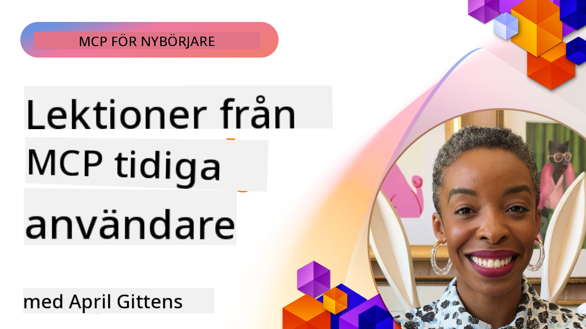

<!--
CO_OP_TRANSLATOR_METADATA:
{
  "original_hash": "41f16dac486d2086a53bc644a01cbe42",
  "translation_date": "2025-08-18T14:45:16+00:00",
  "source_file": "07-LessonsfromEarlyAdoption/README.md",
  "language_code": "sv"
}
-->
# 🌟 Lärdomar från Tidiga Användare

[](https://youtu.be/jds7dSmNptE)

_(Klicka på bilden ovan för att se videon av denna lektion)_

## 🎯 Vad Denna Modul Täcker

Denna modul utforskar hur verkliga organisationer och utvecklare använder Model Context Protocol (MCP) för att lösa faktiska utmaningar och driva innovation. Genom detaljerade fallstudier och praktiska exempel får du upptäcka hur MCP möjliggör säker och skalbar AI-integration som kopplar samman språkmodeller, verktyg och företagsdata.

### 📚 Se MCP i Praktiken

Vill du se dessa principer tillämpas på produktionsklara verktyg? Kolla in vår [**10 Microsoft MCP-servrar som Transformerar Utvecklarproduktivitet**](microsoft-mcp-servers.md), som visar verkliga Microsoft MCP-servrar du kan använda idag.

## Översikt

Denna lektion utforskar hur tidiga användare har utnyttjat Model Context Protocol (MCP) för att lösa verkliga utmaningar och driva innovation inom olika branscher. Genom detaljerade fallstudier och praktiska projekt får du se hur MCP möjliggör standardiserad, säker och skalbar AI-integration—som kopplar samman stora språkmodeller, verktyg och företagsdata i en enhetlig ram. Du får praktisk erfarenhet av att designa och bygga MCP-baserade lösningar, lära dig av beprövade implementeringsmönster och upptäcka bästa praxis för att implementera MCP i produktionsmiljöer. Lektionen lyfter också fram framväxande trender, framtida riktningar och öppna källresurser för att hjälpa dig att hålla dig i framkant av MCP-teknologi och dess utvecklande ekosystem.

## Lärandemål

- Analysera verkliga MCP-implementeringar inom olika branscher
- Designa och bygg kompletta MCP-baserade applikationer
- Utforska framväxande trender och framtida riktningar inom MCP-teknologi
- Tillämpa bästa praxis i faktiska utvecklingsscenarier

## Verkliga MCP-Implementeringar

### Fallstudie 1: Automatisering av Företagskundsupport

Ett multinationellt företag implementerade en MCP-baserad lösning för att standardisera AI-interaktioner över deras kundsupportsystem. Detta gjorde det möjligt för dem att:

- Skapa ett enhetligt gränssnitt för flera LLM-leverantörer
- Upprätthålla konsekvent prompthantering över avdelningar
- Implementera robusta säkerhets- och efterlevnadskontroller
- Enkelt byta mellan olika AI-modeller baserat på specifika behov

**Teknisk Implementering:**

```python
# Python MCP server implementation for customer support
import logging
import asyncio
from modelcontextprotocol import create_server, ServerConfig
from modelcontextprotocol.server import MCPServer
from modelcontextprotocol.transports import create_http_transport
from modelcontextprotocol.resources import ResourceDefinition
from modelcontextprotocol.prompts import PromptDefinition
from modelcontextprotocol.tool import ToolDefinition

# Configure logging
logging.basicConfig(level=logging.INFO)

async def main():
    # Create server configuration
    config = ServerConfig(
        name="Enterprise Customer Support Server",
        version="1.0.0",
        description="MCP server for handling customer support inquiries"
    )
    
    # Initialize MCP server
    server = create_server(config)
    
    # Register knowledge base resources
    server.resources.register(
        ResourceDefinition(
            name="customer_kb",
            description="Customer knowledge base documentation"
        ),
        lambda params: get_customer_documentation(params)
    )
    
    # Register prompt templates
    server.prompts.register(
        PromptDefinition(
            name="support_template",
            description="Templates for customer support responses"
        ),
        lambda params: get_support_templates(params)
    )
    
    # Register support tools
    server.tools.register(
        ToolDefinition(
            name="ticketing",
            description="Create and update support tickets"
        ),
        handle_ticketing_operations
    )
    
    # Start server with HTTP transport
    transport = create_http_transport(port=8080)
    await server.run(transport)

if __name__ == "__main__":
    asyncio.run(main())
```

**Resultat:** 30% minskning av modellkostnader, 45% förbättring av svarskonsistens och förbättrad efterlevnad över globala operationer.

### Fallstudie 2: Diagnostisk Assistent för Hälso- och Sjukvård

En vårdgivare utvecklade en MCP-infrastruktur för att integrera flera specialiserade medicinska AI-modeller samtidigt som känsliga patientdata förblev skyddade:

- Smidig växling mellan generalistiska och specialistiska medicinska modeller
- Strikta sekretesskontroller och granskningsspår
- Integration med befintliga Elektroniska Patientjournaler (EHR)
- Konsekvent prompthantering för medicinsk terminologi

**Teknisk Implementering:**

```csharp
// C# MCP host application implementation in healthcare application
using Microsoft.Extensions.DependencyInjection;
using ModelContextProtocol.SDK.Client;
using ModelContextProtocol.SDK.Security;
using ModelContextProtocol.SDK.Resources;

public class DiagnosticAssistant
{
    private readonly MCPHostClient _mcpClient;
    private readonly PatientContext _patientContext;
    
    public DiagnosticAssistant(PatientContext patientContext)
    {
        _patientContext = patientContext;
        
        // Configure MCP client with healthcare-specific settings
        var clientOptions = new ClientOptions
        {
            Name = "Healthcare Diagnostic Assistant",
            Version = "1.0.0",
            Security = new SecurityOptions
            {
                Encryption = EncryptionLevel.Medical,
                AuditEnabled = true
            }
        };
        
        _mcpClient = new MCPHostClientBuilder()
            .WithOptions(clientOptions)
            .WithTransport(new HttpTransport("https://healthcare-mcp.example.org"))
            .WithAuthentication(new HIPAACompliantAuthProvider())
            .Build();
    }
    
    public async Task<DiagnosticSuggestion> GetDiagnosticAssistance(
        string symptoms, string patientHistory)
    {
        // Create request with appropriate resources and tool access
        var resourceRequest = new ResourceRequest
        {
            Name = "patient_records",
            Parameters = new Dictionary<string, object>
            {
                ["patientId"] = _patientContext.PatientId,
                ["requestingProvider"] = _patientContext.ProviderId
            }
        };
        
        // Request diagnostic assistance using appropriate prompt
        var response = await _mcpClient.SendPromptRequestAsync(
            promptName: "diagnostic_assistance",
            parameters: new Dictionary<string, object>
            {
                ["symptoms"] = symptoms,
                patientHistory = patientHistory,
                relevantGuidelines = _patientContext.GetRelevantGuidelines()
            });
            
        return DiagnosticSuggestion.FromMCPResponse(response);
    }
}
```

**Resultat:** Förbättrade diagnostiska förslag för läkare samtidigt som full HIPAA-efterlevnad upprätthölls och betydande minskning av kontextväxling mellan system.

### Fallstudie 3: Riskanalys inom Finansiella Tjänster

En finansiell institution implementerade MCP för att standardisera sina riskanalysprocesser över olika avdelningar:

- Skapade ett enhetligt gränssnitt för kreditrisk, bedrägeridetektion och investeringsriskmodeller
- Implementerade strikta åtkomstkontroller och modellversionering
- Säkerställde granskningsbarhet för alla AI-rekommendationer
- Upprätthöll konsekvent dataformatering över olika system

**Teknisk Implementering:**

```java
// Java MCP server for financial risk assessment
import org.mcp.server.*;
import org.mcp.security.*;

public class FinancialRiskMCPServer {
    public static void main(String[] args) {
        // Create MCP server with financial compliance features
        MCPServer server = new MCPServerBuilder()
            .withModelProviders(
                new ModelProvider("risk-assessment-primary", new AzureOpenAIProvider()),
                new ModelProvider("risk-assessment-audit", new LocalLlamaProvider())
            )
            .withPromptTemplateDirectory("./compliance/templates")
            .withAccessControls(new SOCCompliantAccessControl())
            .withDataEncryption(EncryptionStandard.FINANCIAL_GRADE)
            .withVersionControl(true)
            .withAuditLogging(new DatabaseAuditLogger())
            .build();
            
        server.addRequestValidator(new FinancialDataValidator());
        server.addResponseFilter(new PII_RedactionFilter());
        
        server.start(9000);
        
        System.out.println("Financial Risk MCP Server running on port 9000");
    }
}
```

**Resultat:** Förbättrad regulatorisk efterlevnad, 40% snabbare modellimplementeringscykler och förbättrad riskbedömningskonsistens över avdelningar.

### Fallstudie 4: Microsoft Playwright MCP Server för Webbläsarautomatisering

Microsoft utvecklade [Playwright MCP-servern](https://github.com/microsoft/playwright-mcp) för att möjliggöra säker, standardiserad webbläsarautomatisering genom Model Context Protocol. Denna produktionsklara server tillåter AI-agenter och LLMs att interagera med webbläsare på ett kontrollerat, granskningsbart och utbyggbart sätt—möjliggörande användningsområden som automatiserad webbtestning, datautvinning och end-to-end arbetsflöden.

> **🎯 Produktionsklart Verktyg**
> 
> Denna fallstudie visar en verklig MCP-server du kan använda idag! Läs mer om Playwright MCP-servern och 9 andra produktionsklara Microsoft MCP-servrar i vår [**Microsoft MCP Servers Guide**](microsoft-mcp-servers.md#8--playwright-mcp-server).

**Nyckelfunktioner:**
- Exponerar webbläsarautomatiseringsfunktioner (navigering, formulärifyllning, skärmdumpskapning, etc.) som MCP-verktyg
- Implementerar strikta åtkomstkontroller och sandboxing för att förhindra obehöriga åtgärder
- Tillhandahåller detaljerade granskningsloggar för alla webbläsarinteraktioner
- Stödjer integration med Azure OpenAI och andra LLM-leverantörer för agentdriven automatisering
- Driver GitHub Copilots Kodningsagent med webbläsarfunktioner

**Teknisk Implementering:**

```typescript
// TypeScript: Registering Playwright browser automation tools in an MCP server
import { createServer, ToolDefinition } from 'modelcontextprotocol';
import { launch } from 'playwright';

const server = createServer({
  name: 'Playwright MCP Server',
  version: '1.0.0',
  description: 'MCP server for browser automation using Playwright'
});

// Register a tool for navigating to a URL and capturing a screenshot
server.tools.register(
  new ToolDefinition({
    name: 'navigate_and_screenshot',
    description: 'Navigate to a URL and capture a screenshot',
    parameters: {
      url: { type: 'string', description: 'The URL to visit' }
    }
  }),
  async ({ url }) => {
    const browser = await launch();
    const page = await browser.newPage();
    await page.goto(url);
    const screenshot = await page.screenshot();
    await browser.close();
    return { screenshot };
  }
);

// Start the MCP server
server.listen(8080);
```

**Resultat:**

- Möjliggjorde säker, programmatisk webbläsarautomatisering för AI-agenter och LLMs
- Minskade manuella testinsatser och förbättrade testtäckning för webbapplikationer
- Tillhandahöll en återanvändbar, utbyggbar ram för webbläsarbaserad verktygsintegration i företagsmiljöer
- Driver GitHub Copilots webbläsarfunktioner

**Referenser:**

- [Playwright MCP Server GitHub Repository](https://github.com/microsoft/playwright-mcp)
- [Microsoft AI och Automatiseringslösningar](https://azure.microsoft.com/en-us/products/ai-services/)

### Fallstudie 5: Azure MCP – Företagsklassad Model Context Protocol som Tjänst

Azure MCP Server ([https://aka.ms/azmcp](https://aka.ms/azmcp)) är Microsofts hanterade, företagsklassade implementering av Model Context Protocol, designad för att tillhandahålla skalbara, säkra och efterlevnadskompatibla MCP-serverfunktioner som en molntjänst. Azure MCP möjliggör för organisationer att snabbt implementera, hantera och integrera MCP-servrar med Azure AI, data och säkerhetstjänster, vilket minskar operativt arbete och påskyndar AI-adoption.

> **🎯 Produktionsklart Verktyg**
> 
> Detta är en verklig MCP-server du kan använda idag! Läs mer om Azure AI Foundry MCP-servern i vår [**Microsoft MCP Servers Guide**](microsoft-mcp-servers.md).

- Fullt hanterad MCP-serverhosting med inbyggd skalning, övervakning och säkerhet
- Naturlig integration med Azure OpenAI, Azure AI Search och andra Azure-tjänster
- Företagsautentisering och auktorisering via Microsoft Entra ID
- Stöd för anpassade verktyg, promptmallar och resursanslutningar
- Efterlevnad av företags säkerhets- och regulatoriska krav

**Teknisk Implementering:**

```yaml
# Example: Azure MCP server deployment configuration (YAML)
apiVersion: mcp.microsoft.com/v1
kind: McpServer
metadata:
  name: enterprise-mcp-server
spec:
  modelProviders:
    - name: azure-openai
      type: AzureOpenAI
      endpoint: https://<your-openai-resource>.openai.azure.com/
      apiKeySecret: <your-azure-keyvault-secret>
  tools:
    - name: document_search
      type: AzureAISearch
      endpoint: https://<your-search-resource>.search.windows.net/
      apiKeySecret: <your-azure-keyvault-secret>
  authentication:
    type: EntraID
    tenantId: <your-tenant-id>
  monitoring:
    enabled: true
    logAnalyticsWorkspace: <your-log-analytics-id>
```

**Resultat:**  
- Minskad tid-till-värde för företags AI-projekt genom att tillhandahålla en färdig, efterlevnadskompatibel MCP-serverplattform
- Förenklad integration av LLMs, verktyg och företagsdatakällor
- Förbättrad säkerhet, observabilitet och operativ effektivitet för MCP-arbetsbelastningar
- Förbättrad kodkvalitet med Azure SDK bästa praxis och aktuella autentiseringsmönster

**Referenser:**  
- [Azure MCP Dokumentation](https://aka.ms/azmcp)
- [Azure MCP Server GitHub Repository](https://github.com/Azure/azure-mcp)
- [Azure AI Tjänster](https://azure.microsoft.com/en-us/products/ai-services/)
- [Microsoft MCP Center](https://mcp.azure.com)

### Fallstudie 6: NLWeb

MCP (Model Context Protocol) är ett framväxande protokoll för chatbots och AI-assistenter att interagera med verktyg. Varje NLWeb-instans är också en MCP-server, som stödjer en kärnmetod, ask, som används för att ställa en webbplats en fråga på naturligt språk. Det returnerade svaret utnyttjar schema.org, ett allmänt använt vokabulär för att beskriva webbdata. Grovt sett är MCP för NLWeb vad Http är för HTML. NLWeb kombinerar protokoll, Schema.org-format och exempel på kod för att hjälpa webbplatser att snabbt skapa dessa slutpunkter, vilket gynnar både människor genom konversationsgränssnitt och maskiner genom naturlig agent-till-agent-interaktion.

Det finns två distinkta komponenter i NLWeb:
- Ett protokoll, mycket enkelt att börja med, för att interagera med en webbplats på naturligt språk och ett format, som utnyttjar json och schema.org för det returnerade svaret. Se dokumentationen om REST API för mer information.
- En enkel implementering av (1) som utnyttjar befintlig markup, för webbplatser som kan abstraheras som listor av objekt (produkter, recept, attraktioner, recensioner, etc.). Tillsammans med en uppsättning användargränssnittswidgets kan webbplatser enkelt tillhandahålla konversationsgränssnitt till sitt innehåll. Se dokumentationen om Livet av en chattfråga för mer information om hur detta fungerar.

**Referenser:**  
- [Azure MCP Dokumentation](https://aka.ms/azmcp)
- [NLWeb](https://github.com/microsoft/NlWeb)

### Fallstudie 7: Azure AI Foundry MCP Server – Integration av Företags AI-agenter

Azure AI Foundry MCP-servrar visar hur MCP kan användas för att orkestrera och hantera AI-agenter och arbetsflöden i företagsmiljöer. Genom att integrera MCP med Azure AI Foundry kan organisationer standardisera agentinteraktioner, utnyttja Foundrys arbetsflödeshantering och säkerställa säkra, skalbara implementeringar.

> **🎯 Produktionsklart Verktyg**
> 
> Detta är en verklig MCP-server du kan använda idag! Läs mer om Azure AI Foundry MCP-servern i vår [**Microsoft MCP Servers Guide**](microsoft-mcp-servers.md#9--azure-ai-foundry-mcp-server).

**Nyckelfunktioner:**
- Omfattande åtkomst till Azures AI-ekosystem, inklusive modellkataloger och implementeringshantering
- Kunskapsindexering med Azure AI Search för RAG-applikationer
- Utvärderingsverktyg för AI-modellprestanda och kvalitetskontroll
- Integration med Azure AI Foundry Catalog och Labs för banbrytande forskningsmodeller
- Agenthantering och utvärderingsmöjligheter för produktionsscenarier

**Resultat:**
- Snabb prototypframtagning och robust övervakning av AI-agentarbetsflöden
- Smidig integration med Azure AI-tjänster för avancerade scenarier
- Enhetligt gränssnitt för att bygga, implementera och övervaka agentpipelines
- Förbättrad säkerhet, efterlevnad och operativ effektivitet för företag
- Påskyndad AI-adoption samtidigt som kontroll över komplexa agentdrivna processer bibehålls

**Referenser:**
- [Azure AI Foundry MCP Server GitHub Repository](https://github.com/azure-ai-foundry/mcp-foundry)
- [Integrera Azure AI-agenter med MCP (Microsoft Foundry Blog)](https://devblogs.microsoft.com/foundry/integrating-azure-ai-agents-mcp/)

### Fallstudie 8: Foundry MCP Playground – Experimentering och Prototypframtagning

Foundry MCP Playground erbjuder en färdig miljö för att experimentera med MCP-servrar och Azure AI Foundry-integrationer. Utvecklare kan snabbt prototypa, testa och utvärdera AI-modeller och agentarbetsflöden med resurser från Azure AI Foundry Catalog och Labs. Playground förenklar installationen, tillhandahåller exempelprojekt och stödjer samarbetsutveckling, vilket gör det enkelt att utforska bästa praxis och nya scenarier med minimal arbetsinsats. Det är särskilt användbart för team som vill validera idéer, dela experiment och påskynda lärande utan behov av komplex infrastruktur. Genom att sänka inträdesbarriären hjälper playground till att främja innovation och gemenskapsbidrag inom MCP- och Azure AI Foundry-ekosystemet.

**Referenser:**

- [Foundry MCP Playground GitHub Repository](https://github.com/azure-ai-foundry/foundry-mcp-playground)

### Fallstudie 9: Microsoft Learn Docs MCP Server – AI-Driven Dokumentationsåtkomst

Microsoft Learn Docs MCP Server är en molnhostad tjänst som ger AI-assistenter realtidsåtkomst till officiell Microsoft-dokumentation genom Model Context Protocol. Denna produktionsklara server ansluter till det omfattande Microsoft Learn-ekosystemet och möjliggör semantisk sökning över alla officiella Microsoft-källor.
> **🎯 Produktionsklar Verktyg**
> 
> Detta är en riktig MCP-server som du kan använda redan idag! Läs mer om Microsoft Learn Docs MCP Server i vår [**Microsoft MCP Servers Guide**](microsoft-mcp-servers.md#1--microsoft-learn-docs-mcp-server).
**Nyckelfunktioner:**
- Realtidsåtkomst till officiell Microsoft-dokumentation, Azure-dokumentation och Microsoft 365-dokumentation
- Avancerade semantiska sökfunktioner som förstår kontext och avsikt
- Alltid uppdaterad information när Microsoft Learn-innehåll publiceras
- Omfattande täckning av Microsoft Learn, Azure-dokumentation och Microsoft 365-källor
- Returnerar upp till 10 högkvalitativa innehållsdelar med artikelrubriker och URL:er

**Varför det är kritiskt:**
- Löser problemet med "föråldrad AI-kunskap" för Microsoft-teknologier
- Säkerställer att AI-assistenter har tillgång till de senaste .NET-, C#-, Azure- och Microsoft 365-funktionerna
- Tillhandahåller auktoritativ förstapartinformation för korrekt kodgenerering
- Avgörande för utvecklare som arbetar med snabbt föränderliga Microsoft-teknologier

**Resultat:**
- Dramatiskt förbättrad noggrannhet i AI-genererad kod för Microsoft-teknologier
- Minskad tid som spenderas på att söka efter aktuell dokumentation och bästa praxis
- Förbättrad utvecklarproduktivitet med kontextmedveten dokumentationshämtning
- Sömlös integration med utvecklingsarbetsflöden utan att lämna IDE:n

**Referenser:**
- [Microsoft Learn Docs MCP Server GitHub Repository](https://github.com/MicrosoftDocs/mcp)
- [Microsoft Learn Documentation](https://learn.microsoft.com/)

## Praktiska projekt

### Projekt 1: Bygg en Multi-Provider MCP Server

**Syfte:** Skapa en MCP-server som kan dirigera förfrågningar till flera AI-modellleverantörer baserat på specifika kriterier.

**Krav:**

- Stöd för minst tre olika modellleverantörer (t.ex. OpenAI, Anthropic, lokala modeller)
- Implementera en routningsmekanism baserad på förfrågningsmetadata
- Skapa ett konfigurationssystem för att hantera leverantörsautentisering
- Lägg till caching för att optimera prestanda och kostnader
- Bygg en enkel instrumentpanel för att övervaka användning

**Implementeringssteg:**

1. Sätt upp den grundläggande MCP-serverinfrastrukturen
2. Implementera leverantörsadaptrar för varje AI-modelltjänst
3. Skapa routningslogik baserad på förfrågningsattribut
4. Lägg till cachingmekanismer för frekventa förfrågningar
5. Utveckla övervakningsinstrumentpanelen
6. Testa med olika förfrågningsmönster

**Teknologier:** Välj mellan Python (.NET/Java/Python baserat på din preferens), Redis för caching och ett enkelt webbframework för instrumentpanelen.

### Projekt 2: Enterprise Prompt Management System

**Syfte:** Utveckla ett MCP-baserat system för att hantera, versionshantera och distribuera promptmallar inom en organisation.

**Krav:**

- Skapa ett centraliserat arkiv för promptmallar
- Implementera versionshantering och godkännandeflöden
- Bygg testfunktioner för mallar med exempeldata
- Utveckla rollbaserade åtkomstkontroller
- Skapa ett API för hämtning och distribution av mallar

**Implementeringssteg:**

1. Designa databasstrukturen för mallförvaring
2. Skapa kärn-API:t för CRUD-operationer på mallar
3. Implementera versionshanteringssystemet
4. Bygg godkännandeflödet
5. Utveckla testramverket
6. Skapa ett enkelt webbgränssnitt för hantering
7. Integrera med en MCP-server

**Teknologier:** Valfritt backend-framework, SQL eller NoSQL-databas och ett frontend-framework för hanteringsgränssnittet.

### Projekt 3: MCP-baserad plattform för innehållsgenerering

**Syfte:** Bygg en plattform för innehållsgenerering som använder MCP för att leverera konsekventa resultat över olika innehållstyper.

**Krav:**

- Stöd för flera innehållsformat (blogginlägg, sociala medier, marknadsföringstexter)
- Implementera mallbaserad generering med anpassningsalternativ
- Skapa ett system för innehållsgranskning och feedback
- Spåra prestandamått för innehåll
- Stöd för versionshantering och iteration av innehåll

**Implementeringssteg:**

1. Sätt upp MCP-klientinfrastrukturen
2. Skapa mallar för olika innehållstyper
3. Bygg innehållsgenereringspipeline
4. Implementera granskningssystemet
5. Utveckla systemet för spårning av mått
6. Skapa ett användargränssnitt för mallhantering och innehållsgenerering

**Teknologier:** Valfritt programmeringsspråk, webbframework och databassystem.

## Framtida riktningar för MCP-teknologi

### Framväxande trender

1. **Multi-Modal MCP**
   - Utvidgning av MCP för att standardisera interaktioner med bild-, ljud- och videomodeller
   - Utveckling av tvärmodala resonemangsförmågor
   - Standardiserade promptformat för olika modaliteter

2. **Federerad MCP-infrastruktur**
   - Distribuerade MCP-nätverk som kan dela resurser mellan organisationer
   - Standardiserade protokoll för säker modelldelning
   - Integritetsskyddande beräkningstekniker

3. **MCP-marknadsplatser**
   - Ekosystem för att dela och tjäna pengar på MCP-mallar och plugins
   - Kvalitetssäkring och certifieringsprocesser
   - Integration med modellmarknadsplatser

4. **MCP för Edge Computing**
   - Anpassning av MCP-standarder för resursbegränsade edge-enheter
   - Optimerade protokoll för lågbandbreddsmiljöer
   - Specialiserade MCP-implementationer för IoT-ekosystem

5. **Regulatoriska ramverk**
   - Utveckling av MCP-tillägg för regulatorisk efterlevnad
   - Standardiserade granskningsspår och förklaringsgränssnitt
   - Integration med framväxande AI-styrningsramverk

### MCP-lösningar från Microsoft

Microsoft och Azure har utvecklat flera open source-arkiv för att hjälpa utvecklare att implementera MCP i olika scenarier:

#### Microsoft-organisationen

1. [playwright-mcp](https://github.com/microsoft/playwright-mcp) - En Playwright MCP-server för webbläsarautomatisering och testning
2. [files-mcp-server](https://github.com/microsoft/files-mcp-server) - En OneDrive MCP-serverimplementation för lokal testning och community-bidrag
3. [NLWeb](https://github.com/microsoft/NlWeb) - NLWeb är en samling öppna protokoll och tillhörande open source-verktyg. Fokus ligger på att etablera ett grundläggande lager för AI-webben

#### Azure-Samples-organisationen

1. [mcp](https://github.com/Azure-Samples/mcp) - Länkar till exempel, verktyg och resurser för att bygga och integrera MCP-servrar på Azure med flera språk
2. [mcp-auth-servers](https://github.com/Azure-Samples/mcp-auth-servers) - Referens-MCP-servrar som demonstrerar autentisering med den aktuella Model Context Protocol-specifikationen
3. [remote-mcp-functions](https://github.com/Azure-Samples/remote-mcp-functions) - Landningssida för Remote MCP Server-implementationer i Azure Functions med länkar till språk-specifika arkiv
4. [remote-mcp-functions-python](https://github.com/Azure-Samples/remote-mcp-functions-python) - Snabbstartsmall för att bygga och distribuera anpassade Remote MCP-servrar med Azure Functions och Python
5. [remote-mcp-functions-dotnet](https://github.com/Azure-Samples/remote-mcp-functions-dotnet) - Snabbstartsmall för att bygga och distribuera anpassade Remote MCP-servrar med Azure Functions och .NET/C#
6. [remote-mcp-functions-typescript](https://github.com/Azure-Samples/remote-mcp-functions-typescript) - Snabbstartsmall för att bygga och distribuera anpassade Remote MCP-servrar med Azure Functions och TypeScript
7. [remote-mcp-apim-functions-python](https://github.com/Azure-Samples/remote-mcp-apim-functions-python) - Azure API Management som AI Gateway till Remote MCP-servrar med Python
8. [AI-Gateway](https://github.com/Azure-Samples/AI-Gateway) - APIM ❤️ AI-experiment inklusive MCP-funktioner, integrering med Azure OpenAI och AI Foundry

Dessa arkiv tillhandahåller olika implementationer, mallar och resurser för att arbeta med Model Context Protocol över olika programmeringsspråk och Azure-tjänster. De täcker en rad användningsfall från grundläggande serverimplementationer till autentisering, molndistribution och företagsintegration.

#### MCP-resurskatalog

[MCP-resurskatalogen](https://github.com/microsoft/mcp/tree/main/Resources) i det officiella Microsoft MCP-arkivet erbjuder en kuraterad samling av exempelresurser, promptmallar och verktygsdefinitioner för användning med Model Context Protocol-servrar. Denna katalog är utformad för att hjälpa utvecklare att snabbt komma igång med MCP genom att erbjuda återanvändbara byggstenar och bästa praxis-exempel för:

- **Promptmallar:** Färdiga promptmallar för vanliga AI-uppgifter och scenarier, som kan anpassas för dina egna MCP-serverimplementationer.
- **Verktygsdefinitioner:** Exempel på verktygsscheman och metadata för att standardisera verktygsintegration och anrop över olika MCP-servrar.
- **Resursexempel:** Exempel på resursdefinitioner för att ansluta till datakällor, API:er och externa tjänster inom MCP-ramverket.
- **Referensimplementationer:** Praktiska exempel som visar hur man strukturerar och organiserar resurser, promptar och verktyg i verkliga MCP-projekt.

Dessa resurser påskyndar utveckling, främjar standardisering och hjälper till att säkerställa bästa praxis vid byggande och distribution av MCP-baserade lösningar.

#### MCP-resurskatalog

- [MCP-resurser (Exempel på promptar, verktyg och resursdefinitioner)](https://github.com/microsoft/mcp/tree/main/Resources)

### Forskningsmöjligheter

- Effektiva tekniker för promptoptimering inom MCP-ramverk
- Säkerhetsmodeller för multi-tenant MCP-distributioner
- Prestandajämförelser mellan olika MCP-implementationer
- Formella verifieringsmetoder för MCP-servrar

## Slutsats

Model Context Protocol (MCP) formar snabbt framtiden för standardiserad, säker och interoperabel AI-integration över olika industrier. Genom fallstudier och praktiska projekt i denna lektion har du sett hur tidiga användare—inklusive Microsoft och Azure—utnyttjar MCP för att lösa verkliga utmaningar, påskynda AI-adoption och säkerställa efterlevnad, säkerhet och skalbarhet. MCP:s modulära tillvägagångssätt gör det möjligt för organisationer att ansluta stora språkmodeller, verktyg och företagsdata i ett enhetligt, granskningsbart ramverk. När MCP fortsätter att utvecklas kommer engagemang i communityn, utforskning av open source-resurser och tillämpning av bästa praxis att vara nyckeln till att bygga robusta, framtidssäkra AI-lösningar.

## Ytterligare resurser

- [MCP Foundry GitHub Repository](https://github.com/azure-ai-foundry/mcp-foundry)
- [Foundry MCP Playground](https://github.com/azure-ai-foundry/foundry-mcp-playground)
- [Integrating Azure AI Agents with MCP (Microsoft Foundry Blog)](https://devblogs.microsoft.com/foundry/integrating-azure-ai-agents-mcp/)
- [MCP GitHub Repository (Microsoft)](https://github.com/microsoft/mcp)
- [MCP Resources Directory (Sample Prompts, Tools, and Resource Definitions)](https://github.com/microsoft/mcp/tree/main/Resources)
- [MCP Community & Documentation](https://modelcontextprotocol.io/introduction)
- [Azure MCP Documentation](https://aka.ms/azmcp)
- [Playwright MCP Server GitHub Repository](https://github.com/microsoft/playwright-mcp)
- [Files MCP Server (OneDrive)](https://github.com/microsoft/files-mcp-server)
- [Azure-Samples MCP](https://github.com/Azure-Samples/mcp)
- [MCP Auth Servers (Azure-Samples)](https://github.com/Azure-Samples/mcp-auth-servers)
- [Remote MCP Functions (Azure-Samples)](https://github.com/Azure-Samples/remote-mcp-functions)
- [Remote MCP Functions Python (Azure-Samples)](https://github.com/Azure-Samples/remote-mcp-functions-python)
- [Remote MCP Functions .NET (Azure-Samples)](https://github.com/Azure-Samples/remote-mcp-functions-dotnet)
- [Remote MCP Functions TypeScript (Azure-Samples)](https://github.com/Azure-Samples/remote-mcp-functions-typescript)
- [Remote MCP APIM Functions Python (Azure-Samples)](https://github.com/Azure-Samples/remote-mcp-apim-functions-python)
- [AI-Gateway (Azure-Samples)](https://github.com/Azure-Samples/AI-Gateway)
- [Microsoft AI and Automation Solutions](https://azure.microsoft.com/en-us/products/ai-services/)

## Övningar

1. Analysera en av fallstudierna och föreslå en alternativ implementeringsmetod.
2. Välj en av projektidéerna och skapa en detaljerad teknisk specifikation.
3. Undersök en industri som inte täcks av fallstudierna och beskriv hur MCP kan lösa dess specifika utmaningar.
4. Utforska en av de framtida riktningarna och skapa ett koncept för en ny MCP-tillägg för att stödja den.

Nästa: [Microsoft MCP Server](../07-LessonsfromEarlyAdoption/microsoft-mcp-servers.md)

**Ansvarsfriskrivning**:  
Detta dokument har översatts med hjälp av AI-översättningstjänsten [Co-op Translator](https://github.com/Azure/co-op-translator). Även om vi strävar efter noggrannhet, vänligen notera att automatiska översättningar kan innehålla fel eller felaktigheter. Det ursprungliga dokumentet på dess originalspråk bör betraktas som den auktoritativa källan. För kritisk information rekommenderas professionell mänsklig översättning. Vi ansvarar inte för eventuella missförstånd eller feltolkningar som uppstår vid användning av denna översättning.