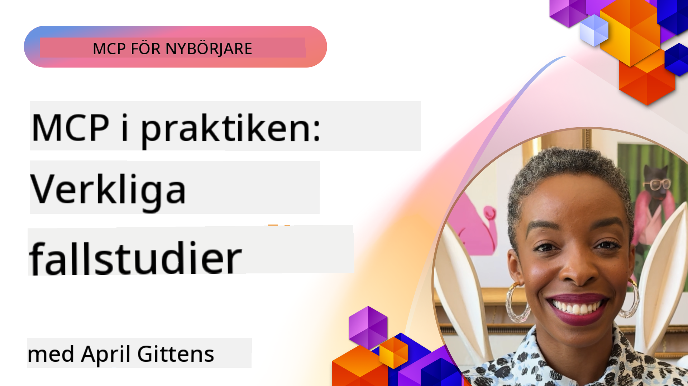

<!--
CO_OP_TRANSLATOR_METADATA:
{
  "original_hash": "1611dc5f6a2a35a789fc4c95fc5bfbe8",
  "translation_date": "2025-09-26T18:31:55+00:00",
  "source_file": "09-CaseStudy/README.md",
  "language_code": "sv"
}
-->
# MCP i praktiken: Fallstudier från verkligheten

_(Klicka på bilden ovan för att se videon till denna lektion)_

Model Context Protocol (MCP) förändrar hur AI-applikationer interagerar med data, verktyg och tjänster. Denna sektion presenterar fallstudier från verkligheten som visar praktiska tillämpningar av MCP i olika företagsmiljöer.

## Översikt

Denna sektion lyfter fram konkreta exempel på MCP-implementeringar och visar hur organisationer använder detta protokoll för att lösa komplexa affärsutmaningar. Genom att studera dessa fallstudier får du insikter i MCP:s mångsidighet, skalbarhet och praktiska fördelar i verkliga scenarier.

## Viktiga lärandemål

Genom att utforska dessa fallstudier kommer du att:

- Förstå hur MCP kan användas för att lösa specifika affärsproblem
- Lära dig om olika integrationsmönster och arkitektoniska tillvägagångssätt
- Identifiera bästa praxis för att implementera MCP i företagsmiljöer
- Få insikter i utmaningar och lösningar som uppstått vid verkliga implementeringar
- Upptäcka möjligheter att tillämpa liknande mönster i dina egna projekt

## Utvalda fallstudier

### 1. [Azure AI Travel Agents – Referensimplementering](./travelagentsample.md)

Denna fallstudie undersöker Microsofts omfattande referenslösning som visar hur man bygger en AI-driven reseplaneringsapplikation med flera agenter, med hjälp av MCP, Azure OpenAI och Azure AI Search. Projektet visar:

- Orkestrering av flera agenter via MCP
- Integration av företagsdata med Azure AI Search
- Säker och skalbar arkitektur med Azure-tjänster
- Utbyggbara verktyg med återanvändbara MCP-komponenter
- Konversationsbaserad användarupplevelse med Azure OpenAI

Arkitekturen och implementeringsdetaljerna ger värdefulla insikter i hur man bygger komplexa system med flera agenter där MCP fungerar som koordineringslager.

### 2. [Uppdatering av Azure DevOps-objekt från YouTube-data](./UpdateADOItemsFromYT.md)

Denna fallstudie visar en praktisk tillämpning av MCP för att automatisera arbetsflöden. Den demonstrerar hur MCP-verktyg kan användas för att:

- Extrahera data från onlineplattformar (YouTube)
- Uppdatera arbetsobjekt i Azure DevOps-system
- Skapa återanvändbara automatiseringsarbetsflöden
- Integrera data mellan olika system

Exemplet illustrerar hur även relativt enkla MCP-implementeringar kan ge betydande effektivitetsvinster genom att automatisera rutinuppgifter och förbättra datakonsistensen mellan system.

### 3. [Dokumentationshämtning i realtid med MCP](./docs-mcp/README.md)

Denna fallstudie guidar dig genom att ansluta en Python-konsolklient till en MCP-server för att hämta och logga realtidsanpassad Microsoft-dokumentation. Du kommer att lära dig hur man:

- Ansluter till en MCP-server med en Python-klient och den officiella MCP SDK
- Använder strömmande HTTP-klienter för effektiv datahämtning i realtid
- Anropar dokumentationsverktyg på servern och loggar svar direkt till konsolen
- Integrerar aktuell Microsoft-dokumentation i ditt arbetsflöde utan att lämna terminalen

Kapitlet inkluderar en praktisk uppgift, ett minimalt fungerande kodexempel och länkar till ytterligare resurser för fördjupad inlärning. Se den fullständiga genomgången och koden i det länkade kapitlet för att förstå hur MCP kan förändra åtkomsten till dokumentation och utvecklarproduktivitet i konsolbaserade miljöer.

### 4. [Interaktiv studieplansgenerator-webbapp med MCP](./docs-mcp/README.md)

Denna fallstudie visar hur man bygger en interaktiv webbapplikation med Chainlit och MCP för att generera personliga studieplaner för valfritt ämne. Användare kan ange ett ämne (som "AI-900-certifiering") och en studietid (t.ex. 8 veckor), och appen kommer att ge en veckovis uppdelning av rekommenderat innehåll. Chainlit möjliggör en konversationsbaserad chattgränssnitt, vilket gör upplevelsen engagerande och anpassningsbar.

- Konversationsbaserad webbapp driven av Chainlit
- Användarstyrda frågor för ämne och tidsram
- Veckovis innehållsrekommendationer med MCP
- Realtidsanpassade svar i ett chattgränssnitt

Projektet illustrerar hur konversationsbaserad AI och MCP kan kombineras för att skapa dynamiska, användarstyrda utbildningsverktyg i en modern webbmiljö.

### 5. [Dokumentation i redigeraren med MCP-server i VS Code](./docs-mcp/README.md)

Denna fallstudie visar hur du kan få Microsoft Learn-dokumentation direkt i din VS Code-miljö med MCP-servern – ingen mer växling mellan webbläsarflikar! Du kommer att se hur man:

- Söker och läser dokumentation direkt i VS Code med MCP-panelen eller kommandopaletten
- Refererar dokumentation och infogar länkar direkt i README- eller kursmarkdownfiler
- Använder GitHub Copilot och MCP tillsammans för sömlösa, AI-drivna dokumentations- och kodarbetsflöden
- Validerar och förbättrar dokumentation med realtidsfeedback och Microsoft-källad noggrannhet
- Integrerar MCP med GitHub-arbetsflöden för kontinuerlig dokumentationsvalidering

Implementeringen inkluderar:

- Exempel på `.vscode/mcp.json`-konfiguration för enkel installation
- Genomgångar med skärmdumpar av upplevelsen i redigeraren
- Tips för att kombinera Copilot och MCP för maximal produktivitet

Detta scenario är idealiskt för kursförfattare, dokumentationsskrivare och utvecklare som vill hålla fokus i sin redigerare medan de arbetar med dokumentation, Copilot och valideringsverktyg – allt drivet av MCP.

### 6. [Skapande av MCP-server med APIM](./apimsample.md)

Denna fallstudie ger en steg-för-steg-guide om hur man skapar en MCP-server med Azure API Management (APIM). Den täcker:

- Konfigurering av en MCP-server i Azure API Management
- Exponering av API-operationer som MCP-verktyg
- Konfigurering av policyer för hastighetsbegränsning och säkerhet
- Testning av MCP-servern med Visual Studio Code och GitHub Copilot

Exemplet illustrerar hur man kan utnyttja Azures kapabiliteter för att skapa en robust MCP-server som kan användas i olika applikationer och förbättra integrationen av AI-system med företags-API:er.

### 7. [GitHub MCP Registry – Snabbare agentintegration](https://github.com/mcp)

Denna fallstudie undersöker hur GitHubs MCP Registry, lanserad i september 2025, adresserar en kritisk utmaning i AI-ekosystemet: den fragmenterade upptäckten och implementeringen av MCP-servrar.

#### Översikt
**MCP Registry** löser problemet med spridda MCP-servrar över olika repositories och register, vilket tidigare gjorde integrationen långsam och felbenägen. Dessa servrar möjliggör för AI-agenter att interagera med externa system som API:er, databaser och dokumentationskällor.

#### Problemformulering
Utvecklare som bygger agentbaserade arbetsflöden stötte på flera utmaningar:
- **Dålig upptäckbarhet** av MCP-servrar på olika plattformar
- **Redundanta installationsfrågor** spridda över forum och dokumentation
- **Säkerhetsrisker** från otestade och opålitliga källor
- **Brist på standardisering** i serverkvalitet och kompatibilitet

#### Lösningsarkitektur
GitHubs MCP Registry centraliserar betrodda MCP-servrar med nyckelfunktioner:
- **Enklicksinstallation** via VS Code för smidig installation
- **Signal över brus-sortering** baserat på stjärnor, aktivitet och community-validering
- **Direkt integration** med GitHub Copilot och andra MCP-kompatibla verktyg
- **Öppen bidragsmodell** som möjliggör bidrag från både community och företagsparter

#### Affärspåverkan
Registret har levererat mätbara förbättringar:
- **Snabbare onboarding** för utvecklare som använder verktyg som Microsoft Learn MCP Server, som strömmar officiell dokumentation direkt till agenter
- **Förbättrad produktivitet** via specialiserade servrar som `github-mcp-server`, som möjliggör naturlig språkbaserad GitHub-automation (PR-skapande, CI-omkörningar, kodskanning)
- **Starkare ekosystemförtroende** genom kuraterade listningar och transparenta konfigurationsstandarder

#### Strategiskt värde
För praktiker som specialiserar sig på agentlivscykelhantering och reproducerbara arbetsflöden erbjuder MCP Registry:
- **Modulär agentdistribution** med standardiserade komponenter
- **Registret-backade utvärderingspipelines** för konsekvent testning och validering
- **Interoperabilitet mellan verktyg** som möjliggör sömlös integration över olika AI-plattformar

Denna fallstudie visar att MCP Registry är mer än bara en katalog – det är en grundläggande plattform för skalbar, verklig modellintegration och agentbaserad systemdistribution.

## Slutsats

Dessa sju omfattande fallstudier visar den anmärkningsvärda mångsidigheten och praktiska tillämpningarna av Model Context Protocol i olika verkliga scenarier. Från komplexa reseplaneringssystem med flera agenter och företags-API-hantering till strömlinjeformade dokumentationsarbetsflöden och det revolutionerande GitHub MCP Registry, exemplen visar hur MCP erbjuder ett standardiserat, skalbart sätt att koppla AI-system med de verktyg, data och tjänster de behöver för att leverera exceptionellt värde.

Fallstudierna täcker flera dimensioner av MCP-implementering:
- **Företagsintegration**: Azure API Management och Azure DevOps-automation
- **Orkestrering av flera agenter**: Resplanering med koordinerade AI-agenter
- **Utvecklarproduktivitet**: VS Code-integration och realtidsdokumentationsåtkomst
- **Ekosystemutveckling**: GitHubs MCP Registry som en grundläggande plattform
- **Utbildningsapplikationer**: Interaktiva studieplansgeneratorer och konversationsgränssnitt

Genom att studera dessa implementeringar får du kritiska insikter i:
- **Arkitektoniska mönster** för olika skalor och användningsområden
- **Implementeringsstrategier** som balanserar funktionalitet med underhållbarhet
- **Säkerhets- och skalbarhetsöverväganden** för produktionsdistributioner
- **Bästa praxis** för utveckling av MCP-servrar och klientintegration
- **Ekosystemtänkande** för att bygga sammanhängande AI-drivna lösningar

Dessa exempel visar att MCP inte bara är en teoretisk ram utan ett moget, produktionsklart protokoll som möjliggör praktiska lösningar på komplexa affärsutmaningar. Oavsett om du bygger enkla automatiseringsverktyg eller sofistikerade system med flera agenter, ger de mönster och tillvägagångssätt som illustreras här en solid grund för dina egna MCP-projekt.

## Ytterligare resurser

- [Azure AI Travel Agents GitHub Repository](https://github.com/Azure-Samples/azure-ai-travel-agents)
- [Azure DevOps MCP Tool](https://github.com/microsoft/azure-devops-mcp)
- [Playwright MCP Tool](https://github.com/microsoft/playwright-mcp)
- [Microsoft Docs MCP Server](https://github.com/MicrosoftDocs/mcp)
- [GitHub MCP Registry – Snabbare agentintegration](https://github.com/mcp)
- [MCP Community Examples](https://github.com/microsoft/mcp)

Nästa: Praktisk labb [Strömlinjeformade AI-arbetsflöden: Bygga en MCP-server med AI Toolkit](../10-StreamliningAIWorkflowsBuildingAnMCPServerWithAIToolkit/README.md)

---

