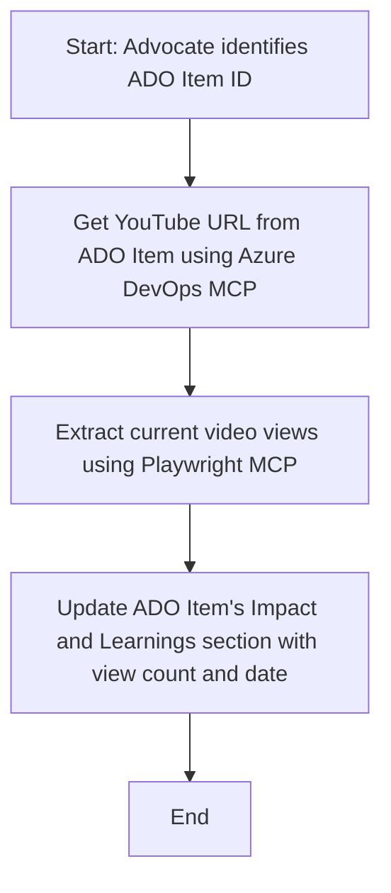

<!--
CO_OP_TRANSLATOR_METADATA:
{
  "original_hash": "14a2dfbea55ef735660a06bd6bdfe5f3",
  "translation_date": "2025-07-14T06:12:52+00:00",
  "source_file": "09-CaseStudy/UpdateADOItemsFromYT.md",
  "language_code": "sv"
}
-->
# Fallstudie: Uppdatering av Azure DevOps-objekt med YouTube-data med MCP

> **Disclaimer:** Det finns redan onlineverktyg och rapporter som kan automatisera processen att uppdatera Azure DevOps-objekt med data från plattformar som YouTube. Följande scenario ges enbart som ett exempel för att illustrera hur MCP-verktyg kan användas för automatisering och integration.

## Översikt

Denna fallstudie visar ett exempel på hur Model Context Protocol (MCP) och dess verktyg kan användas för att automatisera processen att uppdatera Azure DevOps (ADO) arbetsobjekt med information hämtad från onlineplattformar, som YouTube. Det beskrivna scenariot är bara en illustration av de bredare möjligheterna med dessa verktyg, som kan anpassas till många liknande automatiseringsbehov.

I detta exempel följer en Advocate online-sessioner med hjälp av ADO-objekt, där varje objekt innehåller en YouTube-video-URL. Genom att använda MCP-verktyg kan Advocaten hålla ADO-objekten uppdaterade med de senaste videostatistikerna, som visningsantal, på ett upprepbart och automatiserat sätt. Denna metod kan generaliseras till andra användningsfall där information från onlinekällor behöver integreras i ADO eller andra system.

## Scenario

En Advocate ansvarar för att följa upp effekten av online-sessioner och community-engagemang. Varje session loggas som ett ADO-arbetsobjekt i projektet 'DevRel', och arbetsobjektet innehåller ett fält för YouTube-video-URL. För att rapportera sessionens räckvidd korrekt behöver Advocaten uppdatera ADO-objektet med det aktuella antalet visningar och datum för när denna information hämtades.

## Använda verktyg

- [Azure DevOps MCP](https://github.com/microsoft/azure-devops-mcp): Möjliggör programmatisk åtkomst och uppdatering av ADO-arbetsobjekt via MCP.
- [Playwright MCP](https://github.com/microsoft/playwright-mcp): Automatiserar webbläsaråtgärder för att extrahera live-data från webbsidor, som YouTube-videostatistik.

## Steg-för-steg-arbetsflöde

1. **Identifiera ADO-objektet**: Börja med ADO-arbetsobjektets ID (t.ex. 1234) i projektet 'DevRel'.
2. **Hämta YouTube-URL**: Använd Azure DevOps MCP-verktyget för att få YouTube-URL:en från arbetsobjektet.
3. **Extrahera visningar**: Använd Playwright MCP-verktyget för att navigera till YouTube-URL:en och hämta det aktuella visningsantalet.
4. **Uppdatera ADO-objektet**: Skriv in det senaste visningsantalet och datum för hämtning i avsnittet 'Impact and Learnings' i ADO-arbetsobjektet med hjälp av Azure DevOps MCP-verktyget.

## Exempel på prompt

```bash
- Work with the ADO Item ID: 1234
- The project is '2025-Awesome'
- Get the YouTube URL for the ADO item
- Use Playwright to get the current views from the YouTube video
- Update the ADO item with the current video views and the updated date of the information
```

## Mermaid-flödesschema



## Teknisk implementering

- **MCP Orkestrering**: Arbetsflödet styrs av en MCP-server som koordinerar användningen av både Azure DevOps MCP och Playwright MCP-verktygen.
- **Automatisering**: Processen kan startas manuellt eller schemaläggas för att köras regelbundet för att hålla ADO-objekten uppdaterade.
- **Utbyggbarhet**: Samma mönster kan utvidgas för att uppdatera ADO-objekt med andra online-mått (t.ex. likes, kommentarer) eller från andra plattformar.

## Resultat och påverkan

- **Effektivitet**: Minskar manuellt arbete för Advocates genom att automatisera hämtning och uppdatering av videostatistik.
- **Noggrannhet**: Säkerställer att ADO-objekten speglar den mest aktuella data som finns tillgänglig från onlinekällor.
- **Upprepbarhet**: Ger ett återanvändbart arbetsflöde för liknande scenarier med andra datakällor eller mått.

## Referenser

- [Azure DevOps MCP](https://github.com/microsoft/azure-devops-mcp)
- [Playwright MCP](https://github.com/microsoft/playwright-mcp)
- [Model Context Protocol (MCP)](https://modelcontextprotocol.io/)

**Ansvarsfriskrivning**:  
Detta dokument har översatts med hjälp av AI-översättningstjänsten [Co-op Translator](https://github.com/Azure/co-op-translator). Även om vi strävar efter noggrannhet, vänligen observera att automatiska översättningar kan innehålla fel eller brister. Det ursprungliga dokumentet på dess modersmål bör betraktas som den auktoritativa källan. För kritisk information rekommenderas professionell mänsklig översättning. Vi ansvarar inte för några missförstånd eller feltolkningar som uppstår vid användning av denna översättning.