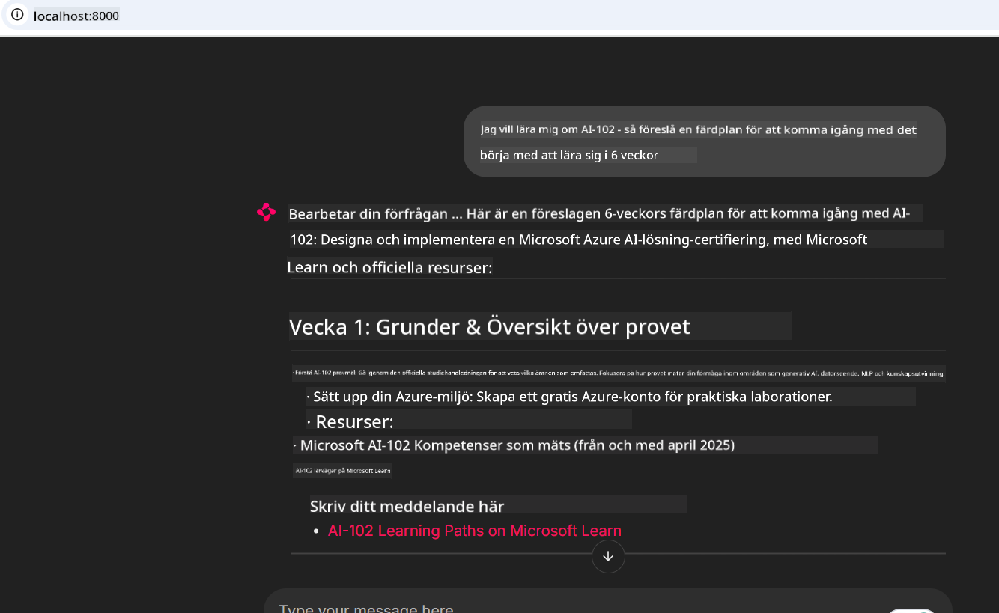
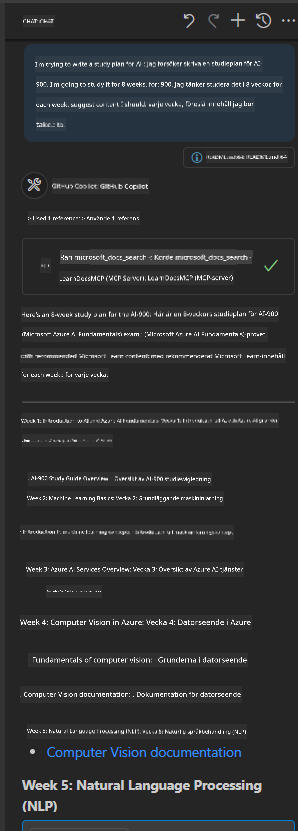

<!--
CO_OP_TRANSLATOR_METADATA:
{
  "original_hash": "4319d291c9d124ecafea52b3d04bfa0e",
  "translation_date": "2025-07-14T06:25:05+00:00",
  "source_file": "09-CaseStudy/docs-mcp/README.md",
  "language_code": "sv"
}
-->
# Fallstudie: Ansluta till Microsoft Learn Docs MCP-servern från en klient

Har du någonsin känt att du jonglerar mellan dokumentationssidor, Stack Overflow och oändliga flikar i sökmotorer, samtidigt som du försöker lösa ett problem i din kod? Kanske har du en andra skärm bara för dokumentation, eller så växlar du ständigt mellan din IDE och en webbläsare. Skulle det inte vara bättre om du kunde få dokumentationen direkt in i ditt arbetsflöde—integrerat i dina appar, din IDE eller till och med dina egna anpassade verktyg? I denna fallstudie ska vi utforska hur du gör just det genom att ansluta direkt till Microsoft Learn Docs MCP-servern från din egen klientapplikation.

## Översikt

Modern utveckling handlar om mer än bara att skriva kod—det handlar om att hitta rätt information vid rätt tillfälle. Dokumentation finns överallt, men sällan där du behöver den som mest: inuti dina verktyg och arbetsflöden. Genom att integrera dokumentationshämtning direkt i dina applikationer kan du spara tid, minska kontextbyten och öka produktiviteten. I detta avsnitt visar vi hur du ansluter en klient till Microsoft Learn Docs MCP-servern, så att du kan få tillgång till realtids- och kontextmedveten dokumentation utan att någonsin lämna din app.

Vi går igenom processen för att etablera en anslutning, skicka en förfrågan och hantera strömmande svar på ett effektivt sätt. Denna metod förenklar inte bara ditt arbetsflöde utan öppnar också dörren för att bygga smartare och mer hjälpsamma utvecklarverktyg.

## Lärandemål

Varför gör vi detta? För att de bästa utvecklarupplevelserna är de som tar bort hinder. Föreställ dig en värld där din kodredigerare, chatbot eller webbapp kan svara på dina dokumentationsfrågor direkt, med den senaste informationen från Microsoft Learn. I slutet av detta kapitel kommer du att kunna:

- Förstå grunderna i MCP-server-klientkommunikation för dokumentation
- Implementera en konsol- eller webbapplikation som ansluter till Microsoft Learn Docs MCP-servern
- Använda strömmande HTTP-klienter för realtidsdokumentationshämtning
- Logga och tolka dokumentationssvar i din applikation

Du kommer att se hur dessa färdigheter kan hjälpa dig att bygga verktyg som inte bara är reaktiva, utan verkligen interaktiva och kontextmedvetna.

## Scenario 1 - Realtidsdokumentationshämtning med MCP

I detta scenario visar vi hur du ansluter en klient till Microsoft Learn Docs MCP-servern, så att du kan få tillgång till realtids- och kontextmedveten dokumentation utan att lämna din app.

Låt oss sätta detta i praktiken. Din uppgift är att skriva en app som ansluter till Microsoft Learn Docs MCP-servern, anropar verktyget `microsoft_docs_search` och loggar det strömmande svaret till konsolen.

### Varför denna metod?
För att det är grunden för att bygga mer avancerade integrationer—oavsett om du vill driva en chatbot, en IDE-tillägg eller en webbpanel.

Du hittar koden och instruktionerna för detta scenario i [`solution`](./solution/README.md)-mappen i denna fallstudie. Stegen guidar dig genom att sätta upp anslutningen:
- Använd den officiella MCP SDK:n och en strömmande HTTP-klient för anslutning
- Anropa verktyget `microsoft_docs_search` med en sökparameter för att hämta dokumentation
- Implementera korrekt loggning och felhantering
- Skapa ett interaktivt konsolgränssnitt som låter användare göra flera sökningar

Detta scenario visar hur du:
- Ansluter till Docs MCP-servern
- Skickar en sökfråga
- Tolkar och skriver ut resultaten

Så här kan det se ut när du kör lösningen:

```
Prompt> What is Azure Key Vault?
Answer> Azure Key Vault is a cloud service for securely storing and accessing secrets. ...
```

Nedan finns ett minimalt exempel på lösning. Fullständig kod och detaljer finns i lösningsmappen.

<details>
<summary>Python</summary>

```python
import asyncio
from mcp.client.streamable_http import streamablehttp_client
from mcp import ClientSession

async def main():
    async with streamablehttp_client("https://learn.microsoft.com/api/mcp") as (read_stream, write_stream, _):
        async with ClientSession(read_stream, write_stream) as session:
            await session.initialize()
            result = await session.call_tool("microsoft_docs_search", {"query": "Azure Functions best practices"})
            print(result.content)

if __name__ == "__main__":
    asyncio.run(main())
```

- För fullständig implementation och loggning, se [`scenario1.py`](../../../../09-CaseStudy/docs-mcp/solution/python/scenario1.py).
- För installations- och användarinstruktioner, se [`README.md`](./solution/python/README.md) i samma mapp.
</details>

## Scenario 2 - Interaktiv webbapp för studieplan med MCP

I detta scenario lär du dig hur du integrerar Docs MCP i ett webbprojekt. Målet är att låta användare söka i Microsoft Learn-dokumentationen direkt från ett webbgränssnitt, vilket gör dokumentationen omedelbart tillgänglig i din app eller på din webbplats.

Du kommer att se hur du:
- Sätter upp en webbapp
- Ansluter till Docs MCP-servern
- Hanterar användarinmatning och visar resultat

Så här kan det se ut när du kör lösningen:

```
User> I want to learn about AI102 - so suggest the roadmap to get it started from learn for 6 weeks

Assistant> Here’s a detailed 6-week roadmap to start your preparation for the AI-102: Designing and Implementing a Microsoft Azure AI Solution certification, using official Microsoft resources and focusing on exam skills areas:

---
## Week 1: Introduction & Fundamentals
- **Understand the Exam**: Review the [AI-102 exam skills outline](https://learn.microsoft.com/en-us/credentials/certifications/exams/ai-102/).
- **Set up Azure**: Sign up for a free Azure account if you don't have one.
- **Learning Path**: [Introduction to Azure AI services](https://learn.microsoft.com/en-us/training/modules/intro-to-azure-ai/)
- **Focus**: Get familiar with Azure portal, AI capabilities, and necessary tools.

....more weeks of the roadmap...

Let me know if you want module-specific recommendations or need more customized weekly tasks!
```

Nedan finns ett minimalt exempel på lösning. Fullständig kod och detaljer finns i lösningsmappen.



<details>
<summary>Python (Chainlit)</summary>

Chainlit är ett ramverk för att bygga konverserande AI-webbappar. Det gör det enkelt att skapa interaktiva chatbots och assistenter som kan anropa MCP-verktyg och visa resultat i realtid. Perfekt för snabb prototypframtagning och användarvänliga gränssnitt.

```python
import chainlit as cl
import requests

MCP_URL = "https://learn.microsoft.com/api/mcp"

@cl.on_message
def handle_message(message):
    query = {"question": message}
    response = requests.post(MCP_URL, json=query)
    if response.ok:
        result = response.json()
        cl.Message(content=result.get("answer", "No answer found.")).send()
    else:
        cl.Message(content="Error: " + response.text).send()
```

- För fullständig implementation, se [`scenario2.py`](../../../../09-CaseStudy/docs-mcp/solution/python/scenario2.py).
- För installations- och körinstruktioner, se [`README.md`](./solution/python/README.md).
</details>

## Scenario 3: In-Editor Docs med MCP-server i VS Code

Om du vill få Microsoft Learn Docs direkt i VS Code (istället för att växla mellan webbläsarflikar) kan du använda MCP-servern i din editor. Detta låter dig:
- Söka och läsa dokumentation i VS Code utan att lämna din kodmiljö.
- Referera dokumentation och infoga länkar direkt i dina README- eller kursfiler.
- Kombinera GitHub Copilot och MCP för ett sömlöst, AI-drivet dokumentationsarbetsflöde.

**Du kommer att lära dig hur du:**
- Lägger till en giltig `.vscode/mcp.json`-fil i din arbetsmapp (se exempel nedan).
- Öppnar MCP-panelen eller använder kommandopaletten i VS Code för att söka och infoga dokumentation.
- Refererar dokumentation direkt i dina markdown-filer medan du arbetar.
- Kombinerar detta arbetsflöde med GitHub Copilot för ännu högre produktivitet.

Här är ett exempel på hur du sätter upp MCP-servern i VS Code:

```json
{
  "servers": {
    "LearnDocsMCP": {
      "url": "https://learn.microsoft.com/api/mcp"
    }
  }
}
```

</details>

> För en detaljerad genomgång med skärmbilder och steg-för-steg-guide, se [`README.md`](./solution/scenario3/README.md).



Denna metod är idealisk för alla som bygger tekniska kurser, skriver dokumentation eller utvecklar kod med frekventa referensbehov.

## Viktiga insikter

Att integrera dokumentation direkt i dina verktyg är inte bara en bekvämlighet—det är en produktivitetsrevolution. Genom att ansluta till Microsoft Learn Docs MCP-servern från din klient kan du:

- Eliminera kontextbyten mellan kod och dokumentation
- Hämta uppdaterad, kontextmedveten dokumentation i realtid
- Bygga smartare, mer interaktiva utvecklarverktyg

Dessa färdigheter hjälper dig att skapa lösningar som inte bara är effektiva, utan också trevliga att använda.

## Ytterligare resurser

För att fördjupa din förståelse, utforska dessa officiella resurser:

- [Microsoft Learn Docs MCP Server (GitHub)](https://github.com/MicrosoftDocs/mcp)
- [Kom igång med Azure MCP Server (mcp-python)](https://learn.microsoft.com/en-us/azure/developer/azure-mcp-server/get-started#create-the-python-app)
- [Vad är Azure MCP Server?](https://learn.microsoft.com/en-us/azure/developer/azure-mcp-server/)
- [Model Context Protocol (MCP) Introduktion](https://modelcontextprotocol.io/introduction)
- [Lägg till plugins från en MCP Server (Python)](https://learn.microsoft.com/en-us/semantic-kernel/concepts/plugins/adding-mcp-plugins)

**Ansvarsfriskrivning**:  
Detta dokument har översatts med hjälp av AI-översättningstjänsten [Co-op Translator](https://github.com/Azure/co-op-translator). Även om vi strävar efter noggrannhet, vänligen observera att automatiska översättningar kan innehålla fel eller brister. Det ursprungliga dokumentet på dess modersmål bör betraktas som den auktoritativa källan. För kritisk information rekommenderas professionell mänsklig översättning. Vi ansvarar inte för några missförstånd eller feltolkningar som uppstår till följd av användningen av denna översättning.