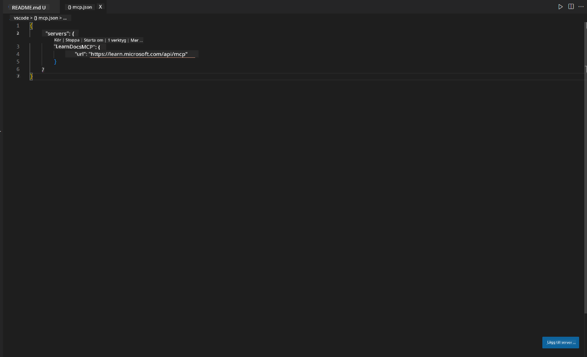
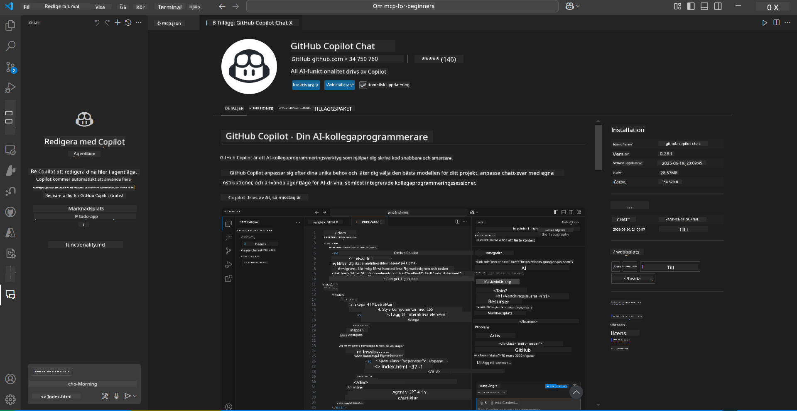
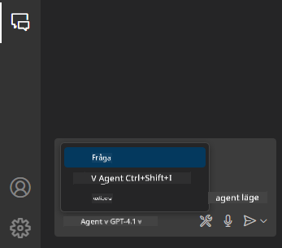
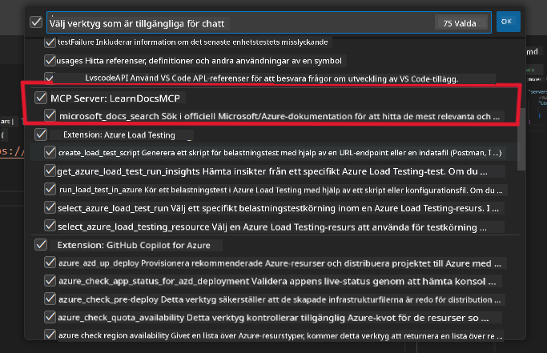
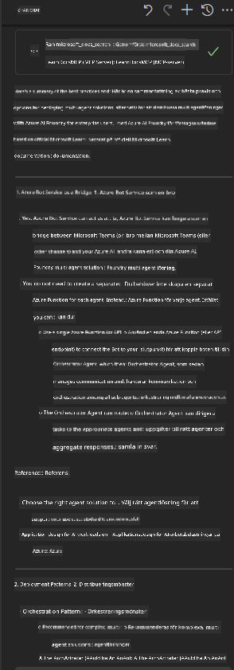

<!--
CO_OP_TRANSLATOR_METADATA:
{
  "original_hash": "db532b1ec386c9ce38c791653dc3c881",
  "translation_date": "2025-07-14T06:52:13+00:00",
  "source_file": "09-CaseStudy/docs-mcp/solution/scenario3/README.md",
  "language_code": "sv"
}
-->
# Scenario 3: In-Editor Docs med MCP-server i VS Code

## Översikt

I det här scenariot kommer du att lära dig hur du kan få Microsoft Learn Docs direkt in i din Visual Studio Code-miljö med hjälp av MCP-servern. Istället för att ständigt byta webbläsarflikar för att söka efter dokumentation kan du nu komma åt, söka och referera till officiell dokumentation direkt i din editor. Detta förenklar ditt arbetsflöde, hjälper dig att hålla fokus och möjliggör sömlös integration med verktyg som GitHub Copilot.

- Sök och läs dokumentation i VS Code utan att lämna din kodmiljö.
- Referera dokumentation och infoga länkar direkt i dina README- eller kursfiler.
- Använd GitHub Copilot och MCP tillsammans för ett smidigt, AI-drivet dokumentationsflöde.

## Lärandemål

I slutet av detta kapitel kommer du att förstå hur du ställer in och använder MCP-servern i VS Code för att förbättra ditt dokumentations- och utvecklingsflöde. Du kommer att kunna:

- Konfigurera din arbetsyta för att använda MCP-servern för dokumentationssökning.
- Söka och infoga dokumentation direkt från VS Code.
- Kombinera kraften i GitHub Copilot och MCP för ett mer produktivt, AI-förstärkt arbetsflöde.

Dessa färdigheter hjälper dig att hålla fokus, förbättra dokumentationskvaliteten och öka din produktivitet som utvecklare eller teknisk skribent.

## Lösning

För att få tillgång till dokumentation direkt i editorn följer du en serie steg som integrerar MCP-servern med VS Code och GitHub Copilot. Denna lösning är idealisk för kursförfattare, dokumentationsskrivare och utvecklare som vill behålla fokus i editorn samtidigt som de arbetar med dokumentation och Copilot.

- Lägg snabbt till referenslänkar i en README när du skriver kurs- eller projektdokumentation.
- Använd Copilot för att generera kod och MCP för att snabbt hitta och citera relevant dokumentation.
- Håll fokus i editorn och öka produktiviteten.

### Steg-för-steg-guide

För att komma igång, följ dessa steg. För varje steg kan du lägga till en skärmbild från assets-mappen för att visuellt illustrera processen.

1. **Lägg till MCP-konfigurationen:**  
   Skapa en fil `.vscode/mcp.json` i projektets rotmapp och lägg till följande konfiguration:  
   ```json
   {
     "servers": {
       "LearnDocsMCP": {
         "url": "https://learn.microsoft.com/api/mcp"
       }
     }
   }
   ```  
   Denna konfiguration berättar för VS Code hur den ska ansluta till [`Microsoft Learn Docs MCP server`](https://github.com/MicrosoftDocs/mcp).
   
   
    
2. **Öppna GitHub Copilot Chat-panelen:**  
   Om du inte redan har GitHub Copilot-tillägget installerat, gå till Extensions-vyn i VS Code och installera det. Du kan ladda ner det direkt från [Visual Studio Code Marketplace](https://marketplace.visualstudio.com/items?itemName=GitHub.copilot-chat). Öppna sedan Copilot Chat-panelen från sidofältet.

   

3. **Aktivera agentläge och verifiera verktyg:**  
   I Copilot Chat-panelen, aktivera agentläge.

   

   Efter att ha aktiverat agentläge, kontrollera att MCP-servern finns med bland de tillgängliga verktygen. Detta säkerställer att Copilot-agenten kan nå dokumentationsservern för att hämta relevant information.
   
   

4. **Starta en ny chatt och ställ frågor till agenten:**  
   Öppna en ny chatt i Copilot Chat-panelen. Nu kan du ställa dina dokumentationsfrågor till agenten. Agenten använder MCP-servern för att hämta och visa relevant Microsoft Learn-dokumentation direkt i din editor.

   - *"Jag försöker skriva en studieplan för ämne X. Jag ska studera det i 8 veckor, för varje vecka, föreslå innehåll jag bör ta."*

   

5. **Live Query:**

   > Låt oss ta en live-fråga från [#get-help](https://discord.gg/D6cRhjHWSC)-sektionen i Azure AI Foundry Discord ([se originalmeddelande](https://discord.com/channels/1113626258182504448/1385498306720829572)):
   
   *"Jag söker svar på hur man distribuerar en multi-agentlösning med AI-agenter utvecklade på Azure AI Foundry. Jag ser att det inte finns någon direkt distributionsmetod, som Copilot Studio-kanaler. Vilka är de olika sätten att göra denna distribution för företagsanvändare att interagera och få jobbet gjort?  
Det finns många artiklar/bloggar som säger att vi kan använda Azure Bot service för detta, som kan fungera som en brygga mellan MS Teams och Azure AI Foundry Agents. Kommer detta att fungera om jag sätter upp en Azure-bot som kopplar till Orchestrator Agent på Azure AI Foundry via Azure Function för att utföra orkestreringen, eller behöver jag skapa en Azure Function för varje AI-agent som ingår i multi-agentlösningen för att göra orkestreringen i Bot Framework? Andra förslag är varmt välkomna."*

   

   Agenten kommer att svara med relevanta dokumentationslänkar och sammanfattningar, som du sedan kan infoga direkt i dina markdown-filer eller använda som referenser i din kod.

### Exempel på frågor

Här är några exempel på frågor du kan prova. Dessa frågor visar hur MCP-servern och Copilot kan samarbeta för att snabbt ge kontextanpassad dokumentation och referenser utan att du lämnar VS Code:

- "Visa mig hur man använder Azure Functions triggers."
- "Infoga en länk till den officiella dokumentationen för Azure Key Vault."
- "Vilka är bästa praxis för att säkra Azure-resurser?"
- "Hitta en snabbstartsguide för Azure AI-tjänster."

Dessa frågor visar hur MCP-servern och Copilot kan samarbeta för att snabbt ge kontextanpassad dokumentation och referenser utan att du lämnar VS Code.

---

**Ansvarsfriskrivning**:  
Detta dokument har översatts med hjälp av AI-översättningstjänsten [Co-op Translator](https://github.com/Azure/co-op-translator). Även om vi strävar efter noggrannhet, vänligen observera att automatiska översättningar kan innehålla fel eller brister. Det ursprungliga dokumentet på dess modersmål bör betraktas som den auktoritativa källan. För kritisk information rekommenderas professionell mänsklig översättning. Vi ansvarar inte för några missförstånd eller feltolkningar som uppstår vid användning av denna översättning.