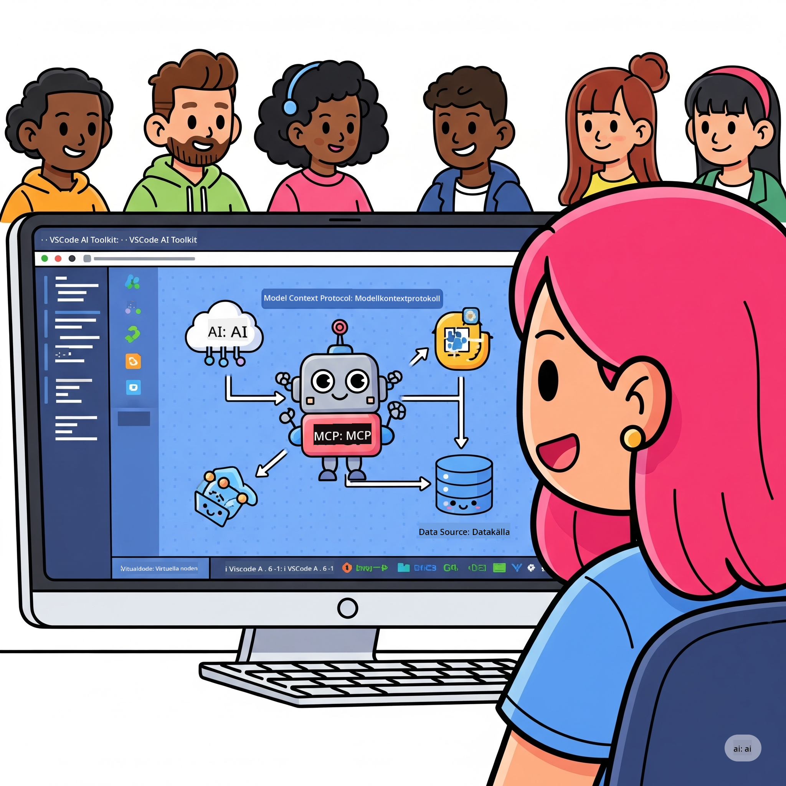

<!--
CO_OP_TRANSLATOR_METADATA:
{
  "original_hash": "787440926586cd064b0899fd1c514f52",
  "translation_date": "2025-07-14T07:08:13+00:00",
  "source_file": "10-StreamliningAIWorkflowsBuildingAnMCPServerWithAIToolkit/README.md",
  "language_code": "sv"
}
-->
# Effektivisera AI-arbetsflöden: Bygg en MCP-server med AI Toolkit

## 🎯 Översikt

Välkommen till **Model Context Protocol (MCP) Workshop**! Denna omfattande praktiska workshop kombinerar två banbrytande teknologier för att revolutionera AI-applikationsutveckling:

- **🔗 Model Context Protocol (MCP)**: En öppen standard för sömlös integration av AI-verktyg
- **🛠️ AI Toolkit för Visual Studio Code (AITK)**: Microsofts kraftfulla AI-utvecklingsförlängning

### 🎓 Vad du kommer att lära dig

I slutet av denna workshop kommer du att behärska konsten att bygga intelligenta applikationer som kopplar AI-modeller till verkliga verktyg och tjänster. Från automatiserad testning till anpassade API-integrationer får du praktiska färdigheter för att lösa komplexa affärsutmaningar.

## 🏗️ Teknikstack

### 🔌 Model Context Protocol (MCP)

MCP är **"USB-C för AI"** – en universell standard som kopplar AI-modeller till externa verktyg och datakällor.

**✨ Viktiga funktioner:**
- 🔄 **Standardiserad integration**: Universellt gränssnitt för AI-verktygskopplingar
- 🏛️ **Flexibel arkitektur**: Lokala och fjärrservrar via stdio/SSE-transport
- 🧰 **Rikt ekosystem**: Verktyg, prompts och resurser i ett protokoll
- 🔒 **Företagsanpassad**: Inbyggd säkerhet och pålitlighet

**🎯 Varför MCP är viktigt:**
Precis som USB-C eliminerade kabelkaos, förenklar MCP komplexiteten i AI-integrationer. Ett protokoll, oändliga möjligheter.

### 🤖 AI Toolkit för Visual Studio Code (AITK)

Microsofts flaggskeppsförlängning för AI-utveckling som förvandlar VS Code till en AI-kraftstation.

**🚀 Kärnfunktioner:**
- 📦 **Modellkatalog**: Tillgång till modeller från Azure AI, GitHub, Hugging Face, Ollama
- ⚡ **Lokal inferens**: ONNX-optimerad CPU/GPU/NPU-körning
- 🏗️ **Agent Builder**: Visuell AI-agentutveckling med MCP-integration
- 🎭 **Multimodal**: Stöd för text, bild och strukturerad output

**💡 Utvecklingsfördelar:**
- Nollkonfigurationsmodellutplacering
- Visuell promptdesign
- Realtidstestningsmiljö
- Sömlös integration med MCP-server

## 📚 Läranderesa

### [🚀 Modul 1: AI Toolkit-grunder](./lab1/README.md)
**Varaktighet**: 15 minuter
- 🛠️ Installera och konfigurera AI Toolkit för VS Code
- 🗂️ Utforska Modellkatalogen (100+ modeller från GitHub, ONNX, OpenAI, Anthropic, Google)
- 🎮 Bemästra den interaktiva testmiljön för realtidsmodelltestning
- 🤖 Bygg din första AI-agent med Agent Builder
- 📊 Utvärdera modellprestanda med inbyggda mått (F1, relevans, likhet, koherens)
- ⚡ Lär dig batchbearbetning och multimodala funktioner

**🎯 Lärandemål**: Skapa en fungerande AI-agent med en gedigen förståelse för AITK:s möjligheter

### [🌐 Modul 2: MCP med AI Toolkit-grunder](./lab2/README.md)
**Varaktighet**: 20 minuter
- 🧠 Bemästra Model Context Protocols (MCP) arkitektur och koncept
- 🌐 Utforska Microsofts MCP-serverekosystem
- 🤖 Bygg en webbläsarautomationsagent med Playwright MCP-server
- 🔧 Integrera MCP-servrar med AI Toolkit Agent Builder
- 📊 Konfigurera och testa MCP-verktyg i dina agenter
- 🚀 Exportera och distribuera MCP-drivna agenter för produktion

**🎯 Lärandemål**: Distribuera en AI-agent förstärkt med externa verktyg via MCP

### [🔧 Modul 3: Avancerad MCP-utveckling med AI Toolkit](./lab3/README.md)
**Varaktighet**: 20 minuter
- 💻 Skapa egna MCP-servrar med AI Toolkit
- 🐍 Konfigurera och använd senaste MCP Python SDK (v1.9.3)
- 🔍 Sätt upp och använd MCP Inspector för felsökning
- 🛠️ Bygg en Weather MCP Server med professionella felsökningsflöden
- 🧪 Felsök MCP-servrar i både Agent Builder och Inspector-miljöer

**🎯 Lärandemål**: Utveckla och felsök egna MCP-servrar med moderna verktyg

### [🐙 Modul 4: Praktisk MCP-utveckling – Anpassad GitHub Clone Server](./lab4/README.md)
**Varaktighet**: 30 minuter
- 🏗️ Bygg en verklighetsnära GitHub Clone MCP Server för utvecklingsarbetsflöden
- 🔄 Implementera smart kloning av repositories med validering och felhantering
- 📁 Skapa intelligent kataloghantering och VS Code-integration
- 🤖 Använd GitHub Copilot Agent Mode med anpassade MCP-verktyg
- 🛡️ Tillämpa produktionsklar pålitlighet och plattformsoberoende

**🎯 Lärandemål**: Distribuera en produktionsklar MCP-server som effektiviserar verkliga utvecklingsflöden

## 💡 Verkliga tillämpningar & påverkan

### 🏢 Företagsanvändning

#### 🔄 DevOps-automation
Förvandla ditt utvecklingsflöde med intelligent automation:
- **Smart repository-hantering**: AI-driven kodgranskning och sammanslagningsbeslut
- **Intelligent CI/CD**: Automatiserad pipelineoptimering baserat på kodändringar
- **Issue-triage**: Automatisk klassificering och tilldelning av buggar

#### 🧪 Kvalitetssäkringens revolution
Höj testningen med AI-driven automation:
- **Intelligent testgenerering**: Skapa omfattande testsuiter automatiskt
- **Visuell regressionstestning**: AI-driven upptäckt av UI-förändringar
- **Prestandaövervakning**: Proaktiv identifiering och lösning av problem

#### 📊 Dataflödesintelligens
Bygg smartare datahanteringsflöden:
- **Adaptiva ETL-processer**: Självoptimerande datatransformationer
- **Anomalidetektion**: Realtidsövervakning av datakvalitet
- **Intelligent dirigering**: Smart hantering av dataflöden

#### 🎧 Förbättrad kundupplevelse
Skapa exceptionella kundinteraktioner:
- **Kontextmedveten support**: AI-agenter med tillgång till kundhistorik
- **Proaktiv problemlösning**: Förutsägande kundservice
- **Multikanalsintegration**: Enhetlig AI-upplevelse över plattformar

## 🛠️ Förutsättningar & installation

### 💻 Systemkrav

| Komponent           | Krav                  | Noteringar               |
|---------------------|-----------------------|-------------------------|
| **Operativsystem**   | Windows 10+, macOS 10.15+, Linux | Valfritt modernt OS      |
| **Visual Studio Code** | Senaste stabila versionen | Krävs för AITK          |
| **Node.js**          | v18.0+ och npm        | För MCP-serverutveckling |
| **Python**           | 3.10+                 | Valfritt för Python MCP-servrar |
| **Minne**            | Minst 8GB RAM         | 16GB rekommenderas för lokala modeller |

### 🔧 Utvecklingsmiljö

#### Rekommenderade VS Code-tillägg
- **AI Toolkit** (ms-windows-ai-studio.windows-ai-studio)
- **Python** (ms-python.python)
- **Python Debugger** (ms-python.debugpy)
- **GitHub Copilot** (GitHub.copilot) – Valfritt men användbart

#### Valfria verktyg
- **uv**: Modern Python-pakethanterare
- **MCP Inspector**: Visuellt felsökningsverktyg för MCP-servrar
- **Playwright**: För exempel på webautomation

## 🎖️ Lärandemål & certifieringsväg

### 🏆 Checklista för färdighetsmästerskap

Genom att slutföra denna workshop uppnår du expertis inom:

#### 🎯 Kärnkompetenser
- [ ] **MCP-protokollmästerskap**: Djup förståelse för arkitektur och implementeringsmönster
- [ ] **AITK-färdighet**: Expertanvändning av AI Toolkit för snabb utveckling
- [ ] **Egen serverutveckling**: Bygg, distribuera och underhåll produktions-MCP-servrar
- [ ] **Verktygsintegration**: Sömlös koppling av AI till befintliga utvecklingsflöden
- [ ] **Problemlösning**: Tillämpa kunskaper på verkliga affärsutmaningar

#### 🔧 Tekniska färdigheter
- [ ] Installera och konfigurera AI Toolkit i VS Code
- [ ] Designa och implementera egna MCP-servrar
- [ ] Integrera GitHub-modeller med MCP-arkitektur
- [ ] Bygg automatiserade testflöden med Playwright
- [ ] Distribuera AI-agenter för produktion
- [ ] Felsök och optimera MCP-serverprestanda

#### 🚀 Avancerade förmågor
- [ ] Arkitektera AI-integrationer i företagsklass
- [ ] Implementera säkerhetsrutiner för AI-applikationer
- [ ] Designa skalbara MCP-serverarkitekturer
- [ ] Skapa anpassade verktygskedjor för specifika domäner
- [ ] Vägleda andra i AI-native utveckling

## 📖 Ytterligare resurser
- [MCP Specification](https://modelcontextprotocol.io/docs)
- [AI Toolkit GitHub Repository](https://github.com/microsoft/vscode-ai-toolkit)
- [Sample MCP Servers Collection](https://github.com/modelcontextprotocol/servers)
- [Best Practices Guide](https://modelcontextprotocol.io/docs/best-practices)

---

**🚀 Redo att revolutionera ditt AI-utvecklingsflöde?**

Låt oss tillsammans bygga framtidens intelligenta applikationer med MCP och AI Toolkit!

**Ansvarsfriskrivning**:  
Detta dokument har översatts med hjälp av AI-översättningstjänsten [Co-op Translator](https://github.com/Azure/co-op-translator). Även om vi strävar efter noggrannhet, vänligen observera att automatiska översättningar kan innehålla fel eller brister. Det ursprungliga dokumentet på dess modersmål bör betraktas som den auktoritativa källan. För kritisk information rekommenderas professionell mänsklig översättning. Vi ansvarar inte för några missförstånd eller feltolkningar som uppstår vid användning av denna översättning.