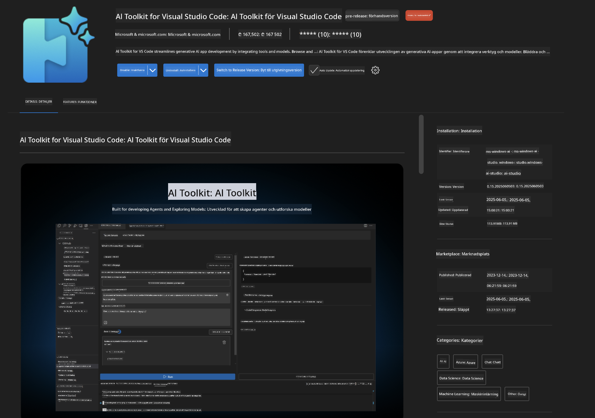
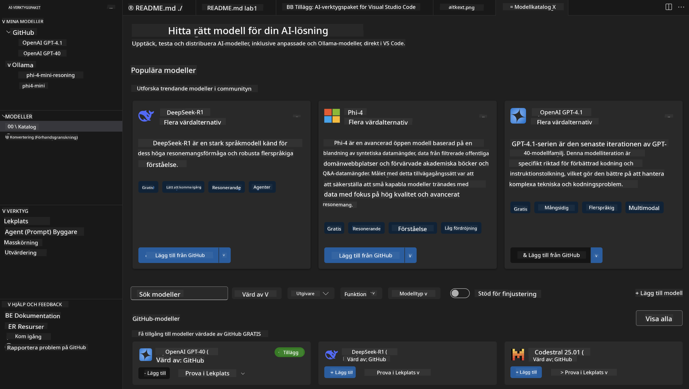
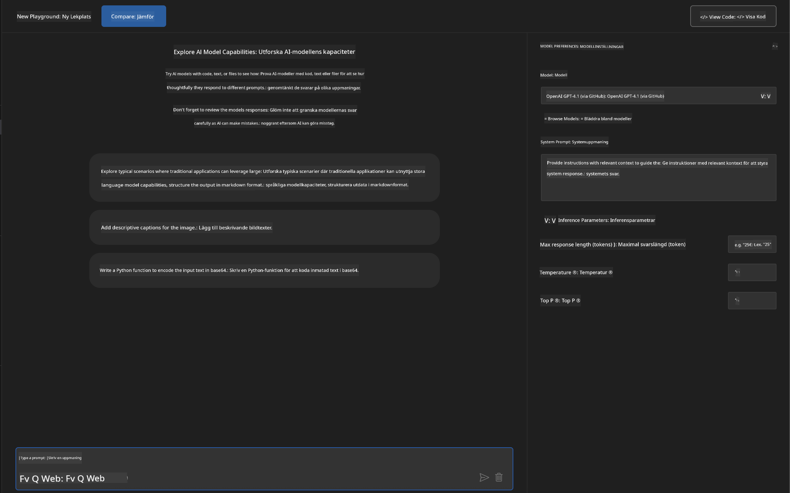
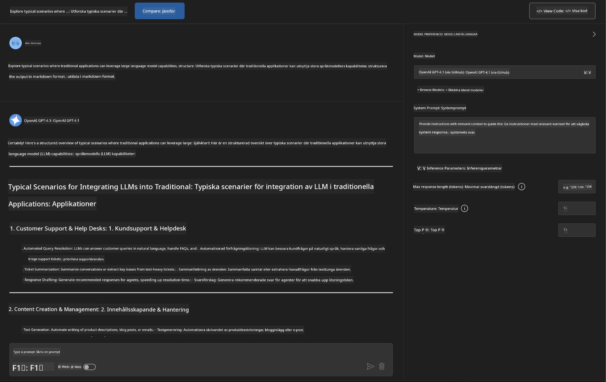
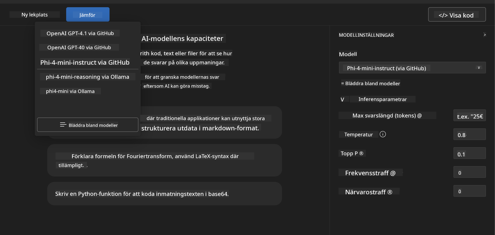
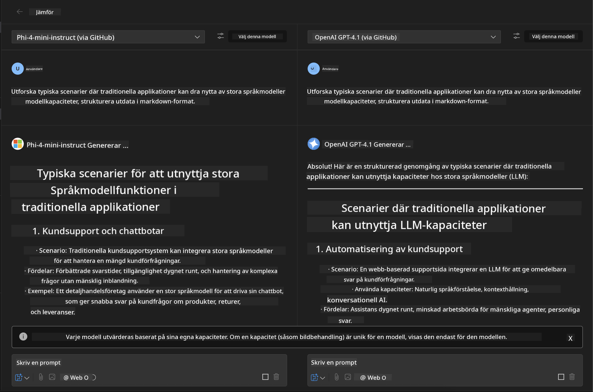
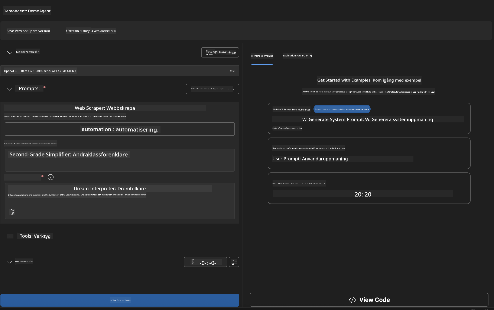
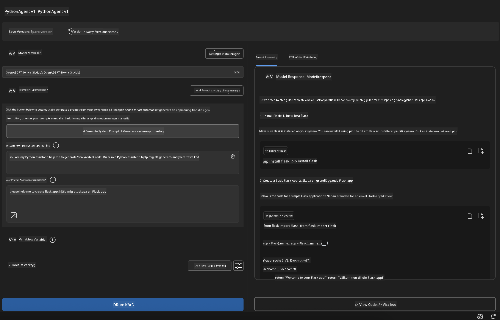

<!--
CO_OP_TRANSLATOR_METADATA:
{
  "original_hash": "2aa9dbc165e104764fa57e8a0d3f1c73",
  "translation_date": "2025-07-14T07:28:18+00:00",
  "source_file": "10-StreamliningAIWorkflowsBuildingAnMCPServerWithAIToolkit/lab1/README.md",
  "language_code": "sv"
}
-->
# 🚀 Modul 1: Grunderna i AI Toolkit

[]()
[]()
[]()

## 📋 Lärandemål

I slutet av denna modul kommer du att kunna:
- ✅ Installera och konfigurera AI Toolkit för Visual Studio Code
- ✅ Navigera i Model Catalog och förstå olika modellkällor
- ✅ Använda Playground för modelltestning och experiment
- ✅ Skapa egna AI-agenter med Agent Builder
- ✅ Jämföra modellprestanda mellan olika leverantörer
- ✅ Tillämpa bästa praxis för prompt engineering

## 🧠 Introduktion till AI Toolkit (AITK)

**AI Toolkit för Visual Studio Code** är Microsofts flaggskeppstillägg som förvandlar VS Code till en komplett AI-utvecklingsmiljö. Det överbryggar klyftan mellan AI-forskning och praktisk applikationsutveckling, vilket gör generativ AI tillgängligt för utvecklare på alla nivåer.

### 🌟 Viktiga funktioner

| Funktion | Beskrivning | Användningsområde |
|---------|-------------|-------------------|
| **🗂️ Model Catalog** | Tillgång till över 100 modeller från GitHub, ONNX, OpenAI, Anthropic, Google | Modellupptäckt och val |
| **🔌 BYOM Support** | Integrera dina egna modeller (lokala/fjärranslutna) | Anpassad modellutplacering |
| **🎮 Interaktiv Playground** | Realtidstestning av modeller med chattgränssnitt | Snabb prototypframtagning och testning |
| **📎 Multi-Modal Support** | Hantera text, bilder och bilagor | Komplexa AI-applikationer |
| **⚡ Batch Processing** | Kör flera prompts samtidigt | Effektiva testflöden |
| **📊 Model Evaluation** | Inbyggda mått (F1, relevans, likhet, koherens) | Prestandautvärdering |

### 🎯 Varför AI Toolkit är viktigt

- **🚀 Snabbare utveckling**: Från idé till prototyp på några minuter
- **🔄 Enhetligt arbetsflöde**: En gränssnitt för flera AI-leverantörer
- **🧪 Enkel experimentering**: Jämför modeller utan komplicerad setup
- **📈 Produktionsklart**: Smidig övergång från prototyp till driftsättning

## 🛠️ Förutsättningar & installation

### 📦 Installera AI Toolkit-tillägget

**Steg 1: Öppna Extensions Marketplace**
1. Starta Visual Studio Code
2. Gå till Extensions-vyn (`Ctrl+Shift+X` eller `Cmd+Shift+X`)
3. Sök efter "AI Toolkit"

**Steg 2: Välj din version**
- **🟢 Release**: Rekommenderas för produktionsanvändning
- **🔶 Pre-release**: Tidig tillgång till nya funktioner

**Steg 3: Installera och aktivera**



### ✅ Kontrollista för verifiering
- [ ] AI Toolkit-ikonen syns i VS Code:s sidopanel
- [ ] Tillägget är aktiverat och igång
- [ ] Inga installationsfel i outputpanelen

## 🧪 Praktiskt övning 1: Utforska GitHub-modeller

**🎯 Mål**: Bemästra Model Catalog och testa din första AI-modell

### 📊 Steg 1: Navigera i Model Catalog

Model Catalog är din port till AI-ekosystemet. Den samlar modeller från flera leverantörer, vilket gör det enkelt att upptäcka och jämföra alternativ.

**🔍 Navigationsguide:**

Klicka på **MODELS - Catalog** i AI Toolkit:s sidopanel



**💡 Tips**: Leta efter modeller med specifika egenskaper som passar ditt användningsområde (t.ex. kodgenerering, kreativt skrivande, analys).

**⚠️ Notera**: GitHub-hostade modeller (dvs. GitHub Models) är gratis att använda men har begränsningar i antal förfrågningar och tokens. Vill du använda icke-GitHub-modeller (dvs. externa modeller via Azure AI eller andra endpoints) behöver du ange rätt API-nyckel eller autentisering.

### 🚀 Steg 2: Lägg till och konfigurera din första modell

**Modellvalstrategi:**
- **GPT-4.1**: Bäst för komplex resonemang och analys
- **Phi-4-mini**: Lättviktig, snabba svar för enklare uppgifter

**🔧 Konfigurationsprocess:**
1. Välj **OpenAI GPT-4.1** från katalogen
2. Klicka på **Add to My Models** – detta registrerar modellen för användning
3. Välj **Try in Playground** för att starta testmiljön
4. Vänta på att modellen initieras (första gången kan ta en stund)



**⚙️ Förstå modellparametrar:**
- **Temperature**: Styr kreativitet (0 = deterministisk, 1 = kreativ)
- **Max Tokens**: Maximal svarslängd
- **Top-p**: Nucleus sampling för svarsmångfald

### 🎯 Steg 3: Bemästra Playground-gränssnittet

Playground är ditt AI-experimentlabb. Så här får du ut mesta möjliga:

**🎨 Bästa praxis för prompt engineering:**
1. **Var specifik**: Klara, detaljerade instruktioner ger bättre resultat
2. **Ge kontext**: Inkludera relevant bakgrundsinformation
3. **Använd exempel**: Visa modellen vad du vill med exempel
4. **Iterera**: Förfina prompts baserat på initiala resultat

**🧪 Testscenarier:**
```markdown
# Example 1: Code Generation
"Write a Python function that calculates the factorial of a number using recursion. Include error handling and docstrings."

# Example 2: Creative Writing
"Write a professional email to a client explaining a project delay, maintaining a positive tone while being transparent about challenges."

# Example 3: Data Analysis
"Analyze this sales data and provide insights: [paste your data]. Focus on trends, anomalies, and actionable recommendations."
```



### 🏆 Utmaningsövning: Jämför modellprestanda

**🎯 Mål**: Jämför olika modeller med identiska prompts för att förstå deras styrkor

**📋 Instruktioner:**
1. Lägg till **Phi-4-mini** i din arbetsyta
2. Använd samma prompt för både GPT-4.1 och Phi-4-mini



3. Jämför svarens kvalitet, hastighet och noggrannhet
4. Dokumentera dina resultat i resultatsektionen



**💡 Viktiga insikter att upptäcka:**
- När man ska använda LLM vs SLM
- Kostnad kontra prestanda
- Specialiserade funktioner hos olika modeller

## 🤖 Praktiskt övning 2: Skapa egna agenter med Agent Builder

**🎯 Mål**: Skapa specialiserade AI-agenter anpassade för specifika uppgifter och arbetsflöden

### 🏗️ Steg 1: Förstå Agent Builder

Agent Builder är där AI Toolkit verkligen visar sin styrka. Här kan du skapa skräddarsydda AI-assistenter som kombinerar kraften i stora språkmodeller med egna instruktioner, specifika parametrar och specialkunskap.

**🧠 Agentens arkitekturkomponenter:**
- **Core Model**: Bas-LLM (GPT-4, Groks, Phi, etc.)
- **System Prompt**: Definierar agentens personlighet och beteende
- **Parametrar**: Finjusterade inställningar för optimal prestanda
- **Verktygsintegration**: Koppla till externa API:er och MCP-tjänster
- **Minne**: Konversationskontext och sessionspersistens



### ⚙️ Steg 2: Djupdykning i agentkonfiguration

**🎨 Skapa effektiva systemprompter:**
```markdown
# Template Structure:
## Role Definition
You are a [specific role] with expertise in [domain].

## Capabilities
- List specific abilities
- Define scope of knowledge
- Clarify limitations

## Behavior Guidelines
- Response style (formal, casual, technical)
- Output format preferences
- Error handling approach

## Examples
Provide 2-3 examples of ideal interactions
```

*Du kan förstås också använda Generate System Prompt för att låta AI hjälpa dig att skapa och optimera prompter*

**🔧 Parameteroptimering:**
| Parameter | Rekommenderat intervall | Användningsområde |
|-----------|------------------------|-------------------|
| **Temperature** | 0.1-0.3 | Tekniska/faktabaserade svar |
| **Temperature** | 0.7-0.9 | Kreativa/brainstorming-uppgifter |
| **Max Tokens** | 500-1000 | Koncisa svar |
| **Max Tokens** | 2000-4000 | Detaljerade förklaringar |

### 🐍 Steg 3: Praktisk övning – Python-programmeringsagent

**🎯 Uppdrag**: Skapa en specialiserad assistent för Python-kodning

**📋 Konfigurationssteg:**

1. **Modellval**: Välj **Claude 3.5 Sonnet** (utmärkt för kod)

2. **System Prompt-design**:
```markdown
# Python Programming Expert Agent

## Role
You are a senior Python developer with 10+ years of experience. You excel at writing clean, efficient, and well-documented Python code.

## Capabilities
- Write production-ready Python code
- Debug complex issues
- Explain code concepts clearly
- Suggest best practices and optimizations
- Provide complete working examples

## Response Format
- Always include docstrings
- Add inline comments for complex logic
- Suggest testing approaches
- Mention relevant libraries when applicable

## Code Quality Standards
- Follow PEP 8 style guidelines
- Use type hints where appropriate
- Handle exceptions gracefully
- Write readable, maintainable code
```

3. **Parameterinställningar**:
   - Temperature: 0.2 (för konsekvent, pålitlig kod)
   - Max Tokens: 2000 (detaljerade förklaringar)
   - Top-p: 0.9 (balanserad kreativitet)



### 🧪 Steg 4: Testa din Python-agent

**Testscenarier:**
1. **Grundläggande funktion**: "Skapa en funktion för att hitta primtal"
2. **Komplex algoritm**: "Implementera ett binärt sökträd med metoder för insättning, borttagning och sökning"
3. **Verkligt problem**: "Bygg en web scraper som hanterar rate limiting och retries"
4. **Felsökning**: "Fixa denna kod [klistra in buggig kod]"

**🏆 Framgångskriterier:**
- ✅ Koden körs utan fel
- ✅ Innehåller korrekt dokumentation
- ✅ Följer Pythons bästa praxis
- ✅ Ger tydliga förklaringar
- ✅ Föreslår förbättringar

## 🎓 Avslutning av Modul 1 & Nästa steg

### 📊 Kunskapskontroll

Testa dina kunskaper:
- [ ] Kan du förklara skillnaderna mellan modellerna i katalogen?
- [ ] Har du lyckats skapa och testa en egen agent?
- [ ] Förstår du hur man optimerar parametrar för olika användningsområden?
- [ ] Kan du designa effektiva systemprompter?

### 📚 Ytterligare resurser

- **AI Toolkit-dokumentation**: [Official Microsoft Docs](https://github.com/microsoft/vscode-ai-toolkit)
- **Guide för prompt engineering**: [Best Practices](https://platform.openai.com/docs/guides/prompt-engineering)
- **Modeller i AI Toolkit**: [Models in Development](https://github.com/microsoft/vscode-ai-toolkit/blob/main/doc/models.md)

**🎉 Grattis!** Du har nu behärskat grunderna i AI Toolkit och är redo att bygga mer avancerade AI-applikationer!

### 🔜 Fortsätt till nästa modul

Redo för mer avancerade funktioner? Fortsätt till **[Modul 2: MCP med AI Toolkit Fundamentals](../lab2/README.md)** där du lär dig att:
- Koppla dina agenter till externa verktyg med Model Context Protocol (MCP)
- Bygga webbläsarautomationsagenter med Playwright
- Integrera MCP-servrar med dina AI Toolkit-agenter
- Ge dina agenter extra kraft med externa data och funktioner

**Ansvarsfriskrivning**:  
Detta dokument har översatts med hjälp av AI-översättningstjänsten [Co-op Translator](https://github.com/Azure/co-op-translator). Även om vi strävar efter noggrannhet, vänligen observera att automatiska översättningar kan innehålla fel eller brister. Det ursprungliga dokumentet på dess modersmål bör betraktas som den auktoritativa källan. För kritisk information rekommenderas professionell mänsklig översättning. Vi ansvarar inte för några missförstånd eller feltolkningar som uppstår vid användning av denna översättning.