<!--
CO_OP_TRANSLATOR_METADATA:
{
  "original_hash": "a22b7dd11cd7690f99f9195877cafdc3",
  "translation_date": "2025-07-14T07:53:52+00:00",
  "source_file": "10-StreamliningAIWorkflowsBuildingAnMCPServerWithAIToolkit/lab2/README.md",
  "language_code": "sv"
}
-->
# 🌐 Modul 2: MCP med AI Toolkit-grunder

[]()
[]()
[]()

## 📋 Lärandemål

I slutet av denna modul kommer du att kunna:
- ✅ Förstå Model Context Protocol (MCP) arkitektur och fördelar
- ✅ Utforska Microsofts MCP-serverekosystem
- ✅ Integrera MCP-servrar med AI Toolkit Agent Builder
- ✅ Bygga en fungerande webbläsarautomationsagent med Playwright MCP
- ✅ Konfigurera och testa MCP-verktyg inom dina agenter
- ✅ Exportera och distribuera MCP-drivna agenter för produktion

## 🎯 Bygga vidare på Modul 1

I Modul 1 lärde vi oss grunderna i AI Toolkit och skapade vår första Python-agent. Nu ska vi **förstärka** dina agenter genom att koppla dem till externa verktyg och tjänster via det revolutionerande **Model Context Protocol (MCP)**.

Tänk på detta som att uppgradera från en enkel miniräknare till en fullfjädrad dator – dina AI-agenter får nu möjlighet att:
- 🌐 Surfa och interagera med webbplatser
- 📁 Få åtkomst till och hantera filer
- 🔧 Integrera med företagsystem
- 📊 Bearbeta realtidsdata från API:er

## 🧠 Förstå Model Context Protocol (MCP)

### 🔍 Vad är MCP?

Model Context Protocol (MCP) är **"USB-C för AI-applikationer"** – en revolutionerande öppen standard som kopplar samman stora språkmodeller (LLM) med externa verktyg, datakällor och tjänster. Precis som USB-C eliminerade kabelkaos genom att erbjuda en universell kontakt, förenklar MCP AI-integration med ett enda standardiserat protokoll.

### 🎯 Problemet MCP löser

**Före MCP:**
- 🔧 Anpassade integrationer för varje verktyg
- 🔄 Leverantörslåsning med proprietära lösningar  
- 🔒 Säkerhetsrisker från ad hoc-anslutningar
- ⏱️ Månader av utveckling för grundläggande integrationer

**Med MCP:**
- ⚡ Plug-and-play integration av verktyg
- 🔄 Leverantörsoberoende arkitektur
- 🛡️ Inbyggda säkerhetsrutiner
- 🚀 Minuter för att lägga till nya funktioner

### 🏗️ Djupdykning i MCP-arkitektur

MCP följer en **klient-server-arkitektur** som skapar ett säkert och skalbart ekosystem:

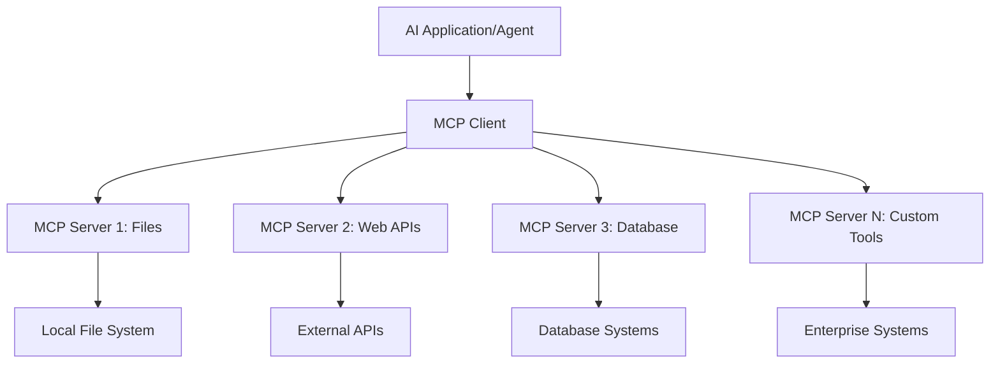

**🔧 Kärnkomponenter:**

| Komponent | Roll | Exempel |
|-----------|------|---------|
| **MCP Hosts** | Applikationer som använder MCP-tjänster | Claude Desktop, VS Code, AI Toolkit |
| **MCP Clients** | Protokollhanterare (1:1 med servrar) | Inbyggda i host-applikationer |
| **MCP Servers** | Exponerar funktioner via standardprotokoll | Playwright, Files, Azure, GitHub |
| **Transport Layer** | Kommunikationsmetoder | stdio, HTTP, WebSockets |

## 🏢 Microsofts MCP-serverekosystem

Microsoft leder MCP-ekosystemet med en omfattande svit av företagsservrar som möter verkliga affärsbehov.

### 🌟 Utvalda Microsoft MCP-servrar

#### 1. ☁️ Azure MCP Server
**🔗 Repository**: [azure/azure-mcp](https://github.com/azure/azure-mcp)  
**🎯 Syfte**: Omfattande hantering av Azure-resurser med AI-integration

**✨ Nyckelfunktioner:**
- Deklarativ infrastrukturprovisionering
- Realtidsövervakning av resurser
- Rekommendationer för kostnadsoptimering
- Säkerhets- och efterlevnadskontroller

**🚀 Användningsområden:**
- Infrastruktur som kod med AI-stöd
- Automatisk resursanpassning
- Optimering av molnkostnader
- Automatisering av DevOps-flöden

#### 2. 📊 Microsoft Dataverse MCP
**📚 Dokumentation**: [Microsoft Dataverse Integration](https://go.microsoft.com/fwlink/?linkid=2320176)  
**🎯 Syfte**: Naturligt språkgränssnitt för affärsdata

**✨ Nyckelfunktioner:**
- Databasfrågor på naturligt språk
- Förståelse för affärskontext
- Anpassade promptmallar
- Företagsstyrning av data

**🚀 Användningsområden:**
- Business intelligence-rapportering
- Kunddataanalys
- Insikter i försäljningspipeline
- Efterlevnadsfrågor

#### 3. 🌐 Playwright MCP Server
**🔗 Repository**: [microsoft/playwright-mcp](https://github.com/microsoft/playwright-mcp)  
**🎯 Syfte**: Webbläsarautomation och webbinteraktion

**✨ Nyckelfunktioner:**
- Cross-browser automation (Chrome, Firefox, Safari)
- Intelligent elementdetektion
- Skärmdumps- och PDF-generering
- Nätverkstrafikövervakning

**🚀 Användningsområden:**
- Automatiserade testflöden
- Webbskrapning och datautvinning
- UI/UX-övervakning
- Automatisering av konkurrensanalys

#### 4. 📁 Files MCP Server
**🔗 Repository**: [microsoft/files-mcp-server](https://github.com/microsoft/files-mcp-server)  
**🎯 Syfte**: Intelligenta filsystemoperationer

**✨ Nyckelfunktioner:**
- Deklarativ filhantering
- Innehållssynkronisering
- Versionshanteringsintegration
- Metadatautvinning

**🚀 Användningsområden:**
- Dokumenthantering
- Organisering av kodförråd
- Arbetsflöden för innehållspublicering
- Filhantering i datapipelines

#### 5. 📝 MarkItDown MCP Server
**🔗 Repository**: [microsoft/markitdown](https://github.com/microsoft/markitdown)  
**🎯 Syfte**: Avancerad Markdown-hantering och bearbetning

**✨ Nyckelfunktioner:**
- Rik Markdown-parsing
- Formatkonvertering (MD ↔ HTML ↔ PDF)
- Analys av innehållsstruktur
- Mallhantering

**🚀 Användningsområden:**
- Tekniska dokumentationsflöden
- Innehållshanteringssystem
- Rapportgenerering
- Automatisering av kunskapsbaser

#### 6. 📈 Clarity MCP Server
**📦 Paket**: [@microsoft/clarity-mcp-server](https://www.npmjs.com/package/@microsoft/clarity-mcp-server)  
**🎯 Syfte**: Webbstatistik och insikter om användarbeteende

**✨ Nyckelfunktioner:**
- Heatmap-analys
- Inspelningar av användarsessioner
- Prestandamått
- Analys av konverteringstrattar

**🚀 Användningsområden:**
- Webbplatsoptimering
- Användarupplevelseforskning
- A/B-testanalys
- Business intelligence-instrumentpaneler

### 🌍 Community-ekosystem

Utöver Microsofts servrar inkluderar MCP-ekosystemet:
- **🐙 GitHub MCP**: Hantering av repositories och kodanalys
- **🗄️ Databas-MCP:er**: PostgreSQL, MySQL, MongoDB-integrationer
- **☁️ Molnleverantörs-MCP:er**: AWS, GCP, Digital Ocean-verktyg
- **📧 Kommunikations-MCP:er**: Slack, Teams, e-postintegrationer

## 🛠️ Praktisk labb: Bygga en webbläsarautomationsagent

**🎯 Projektmål**: Skapa en intelligent webbläsarautomationsagent med Playwright MCP-server som kan navigera på webbplatser, extrahera information och utföra komplexa webbinteraktioner.

### 🚀 Fas 1: Agentens grundläggande uppsättning

#### Steg 1: Initiera din agent
1. **Öppna AI Toolkit Agent Builder**  
2. **Skapa ny agent** med följande konfiguration:  
   - **Namn**: `BrowserAgent`  
   - **Modell**: Välj GPT-4o  

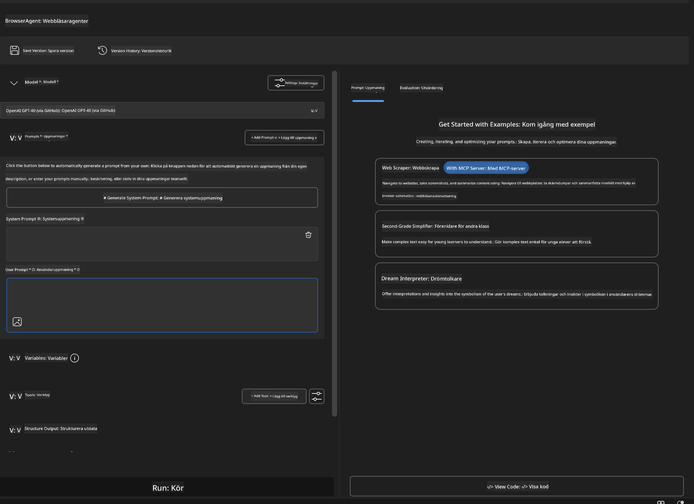

### 🔧 Fas 2: MCP-integrationsflöde

#### Steg 3: Lägg till MCP-serverintegration
1. **Gå till Verktygssektionen** i Agent Builder  
2. **Klicka på "Add Tool"** för att öppna integrationsmenyn  
3. **Välj "MCP Server"** från tillgängliga alternativ  

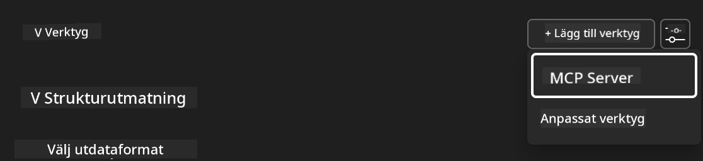

**🔍 Förstå verktygstyper:**
- **Inbyggda verktyg**: Förkonfigurerade AI Toolkit-funktioner  
- **MCP-servrar**: Integrationer med externa tjänster  
- **Anpassade API:er**: Egna tjänsteendpoints  
- **Funktionsanrop**: Direkt åtkomst till modellfunktioner  

#### Steg 4: Välj MCP-server
1. **Välj "MCP Server"** för att fortsätta  
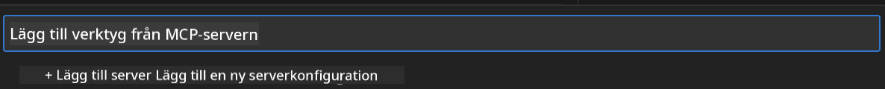

2. **Bläddra i MCP-katalogen** för att utforska tillgängliga integrationer  


### 🎮 Fas 3: Playwright MCP-konfiguration

#### Steg 5: Välj och konfigurera Playwright
1. **Klicka på "Use Featured MCP Servers"** för att komma åt Microsofts verifierade servrar  
2. **Välj "Playwright"** från listan över utvalda servrar  
3. **Acceptera standard MCP-ID** eller anpassa för din miljö  

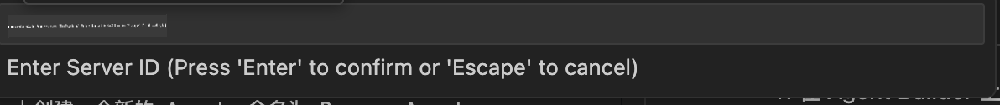

#### Steg 6: Aktivera Playwright-funktioner
**🔑 Viktigt steg**: Välj **ALLA** tillgängliga Playwright-metoder för maximal funktionalitet  

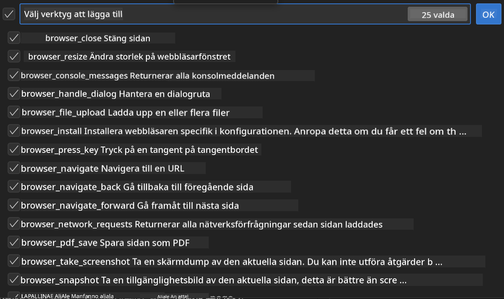

**🛠️ Viktiga Playwright-verktyg:**
- **Navigering**: `goto`, `goBack`, `goForward`, `reload`  
- **Interaktion**: `click`, `fill`, `press`, `hover`, `drag`  
- **Extraktion**: `textContent`, `innerHTML`, `getAttribute`  
- **Validering**: `isVisible`, `isEnabled`, `waitForSelector`  
- **Fångst**: `screenshot`, `pdf`, `video`  
- **Nätverk**: `setExtraHTTPHeaders`, `route`, `waitForResponse`  

#### Steg 7: Verifiera integrationsframgång
**✅ Framgångsindikatorer:**
- Alla verktyg syns i Agent Builder-gränssnittet  
- Inga felmeddelanden i integrationspanelen  
- Playwright-serverns status visar "Connected"  

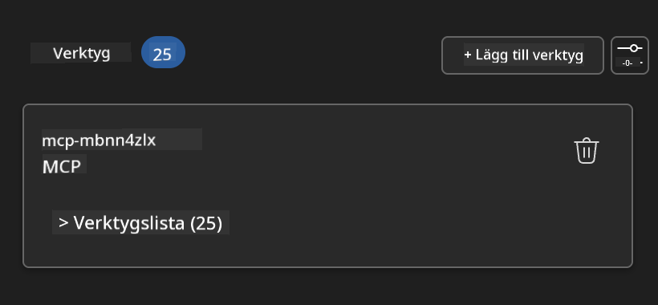

**🔧 Vanliga problem och lösningar:**
- **Anslutning misslyckades**: Kontrollera internetanslutning och brandväggsinställningar  
- **Saknade verktyg**: Säkerställ att alla funktioner valdes vid installation  
- **Behörighetsfel**: Kontrollera att VS Code har nödvändiga systembehörigheter  

### 🎯 Fas 4: Avancerad promptdesign

#### Steg 8: Skapa intelligenta systemprompter
Designa avancerade prompter som utnyttjar Playwrights fulla kapacitet:

```markdown
# Web Automation Expert System Prompt

## Core Identity
You are an advanced web automation specialist with deep expertise in browser automation, web scraping, and user experience analysis. You have access to Playwright tools for comprehensive browser control.

## Capabilities & Approach
### Navigation Strategy
- Always start with screenshots to understand page layout
- Use semantic selectors (text content, labels) when possible
- Implement wait strategies for dynamic content
- Handle single-page applications (SPAs) effectively

### Error Handling
- Retry failed operations with exponential backoff
- Provide clear error descriptions and solutions
- Suggest alternative approaches when primary methods fail
- Always capture diagnostic screenshots on errors

### Data Extraction
- Extract structured data in JSON format when possible
- Provide confidence scores for extracted information
- Validate data completeness and accuracy
- Handle pagination and infinite scroll scenarios

### Reporting
- Include step-by-step execution logs
- Provide before/after screenshots for verification
- Suggest optimizations and alternative approaches
- Document any limitations or edge cases encountered

## Ethical Guidelines
- Respect robots.txt and rate limiting
- Avoid overloading target servers
- Only extract publicly available information
- Follow website terms of service
```

#### Steg 9: Skapa dynamiska användarprompter
Designa prompter som demonstrerar olika funktioner:

**🌐 Exempel på webbanalys:**
```markdown
Navigate to github.com/kinfey and provide a comprehensive analysis including:
1. Repository structure and organization
2. Recent activity and contribution patterns  
3. Documentation quality assessment
4. Technology stack identification
5. Community engagement metrics
6. Notable projects and their purposes

Include screenshots at key steps and provide actionable insights.
```

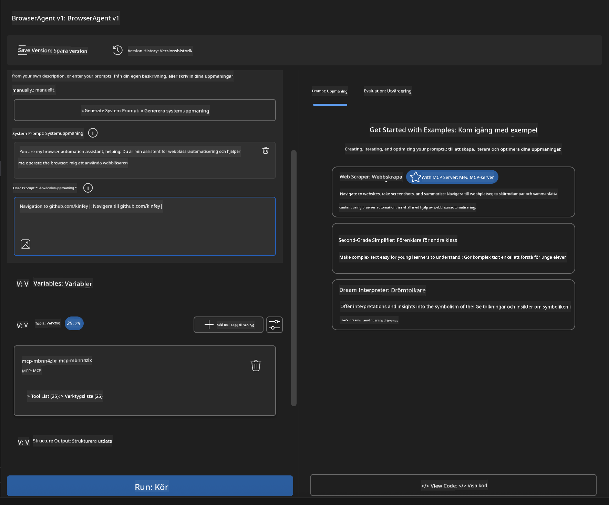

### 🚀 Fas 5: Körning och testning

#### Steg 10: Kör din första automation
1. **Klicka på "Run"** för att starta automationssekvensen  
2. **Följ körningen i realtid**:  
   - Chrome-webbläsaren startar automatiskt  
   - Agenten navigerar till målsidan  
   - Skärmdumpar tas vid varje större steg  
   - Analysresultat strömmas i realtid  

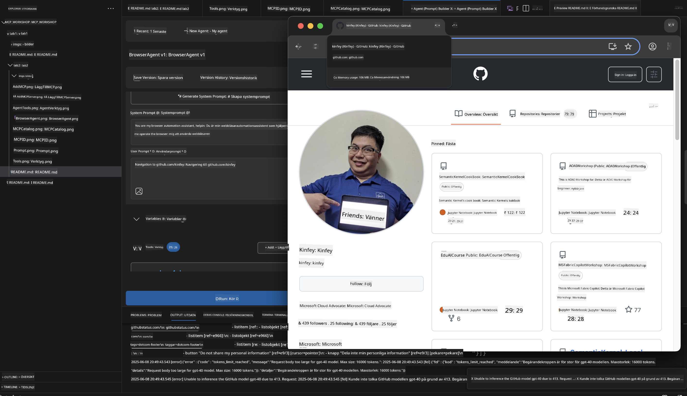

#### Steg 11: Analysera resultat och insikter
Granska den omfattande analysen i Agent Builder-gränssnittet:

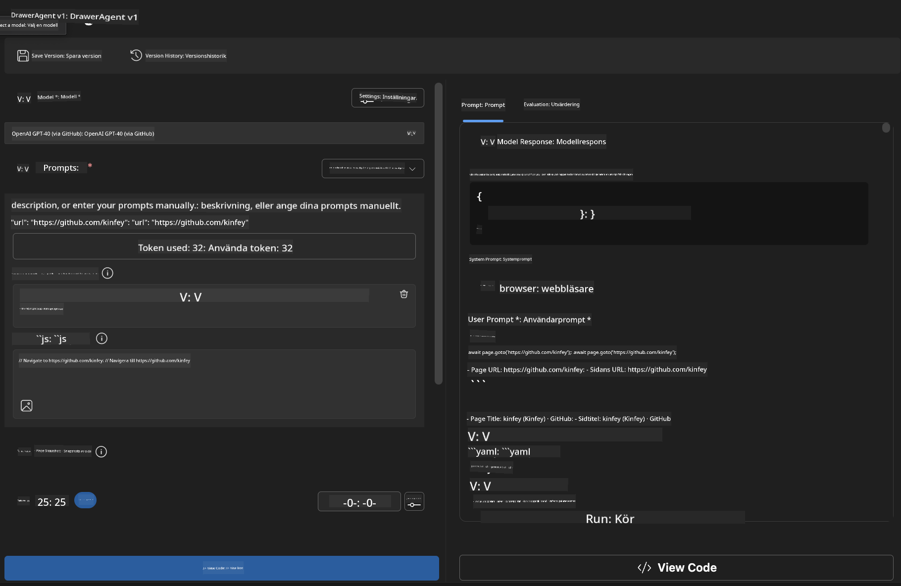

### 🌟 Fas 6: Avancerade funktioner och distribution

#### Steg 12: Exportera och distribuera i produktion
Agent Builder stödjer flera distributionsalternativ:

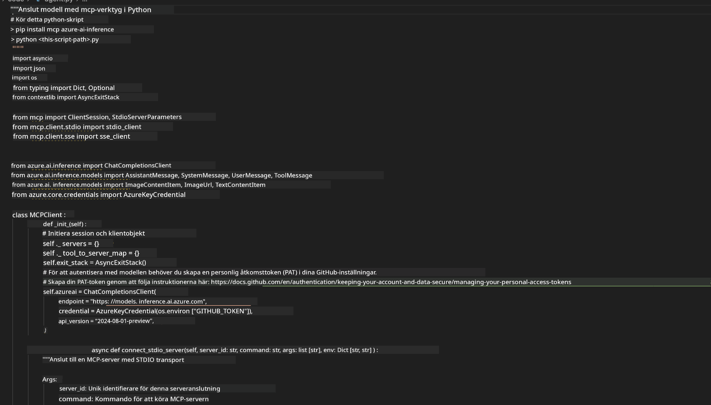

## 🎓 Modul 2 Sammanfattning & Nästa steg

### 🏆 Uppnått mål: MCP-integrationsmästare

**✅ Färdigheter du behärskar:**
- [ ] Förstå MCP-arkitektur och dess fördelar  
- [ ] Navigera Microsofts MCP-serverekosystem  
- [ ] Integrera Playwright MCP med AI Toolkit  
- [ ] Bygga avancerade webbläsarautomationsagenter  
- [ ] Avancerad promptdesign för webautomation  

### 📚 Ytterligare resurser

- **🔗 MCP-specifikation**: [Officiell protokolldokumentation](https://modelcontextprotocol.io/)  
- **🛠️ Playwright API**: [Fullständig metodreferens](https://playwright.dev/docs/api/class-playwright)  
- **🏢 Microsoft MCP-servrar**: [Guide för företagsintegration](https://github.com/microsoft/mcp-servers)  
- **🌍 Communityexempel**: [MCP Server Gallery](https://github.com/modelcontextprotocol/servers)  

**🎉 Grattis!** Du har nu framgångsrikt behärskat MCP-integration och kan bygga produktionsklara AI-agenter med externa verktyg!

### 🔜 Fortsätt till nästa modul

Redo att ta dina MCP-kunskaper till nästa nivå? Gå vidare till **[Modul 3: Avancerad MCP-utveckling med AI Toolkit](../lab3/README.md)** där du lär dig att:
- Skapa egna anpassade MCP-servrar  
- Konfigurera och använda senaste MCP Python SDK  
- Sätta upp MCP Inspector för felsökning  
- Bemästra avancerade arbetsflöden för MCP-serverutveckling
- Bygg en Weather MCP-server från grunden

**Ansvarsfriskrivning**:  
Detta dokument har översatts med hjälp av AI-översättningstjänsten [Co-op Translator](https://github.com/Azure/co-op-translator). Även om vi strävar efter noggrannhet, vänligen observera att automatiska översättningar kan innehålla fel eller brister. Det ursprungliga dokumentet på dess modersmål bör betraktas som den auktoritativa källan. För kritisk information rekommenderas professionell mänsklig översättning. Vi ansvarar inte för några missförstånd eller feltolkningar som uppstår vid användning av denna översättning.