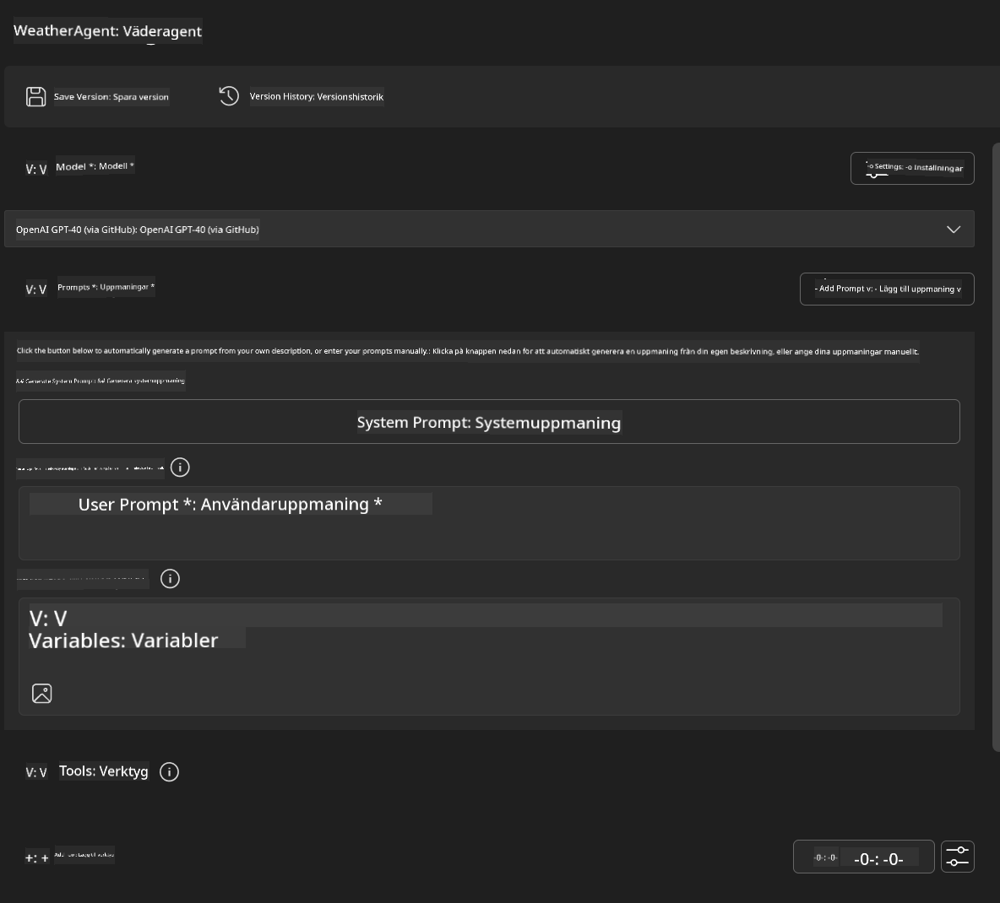
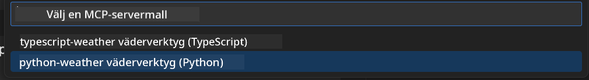
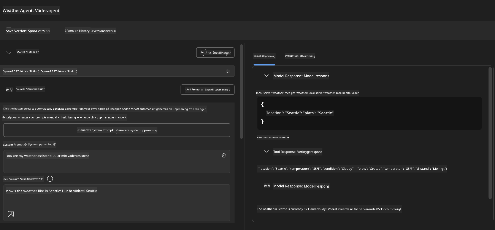
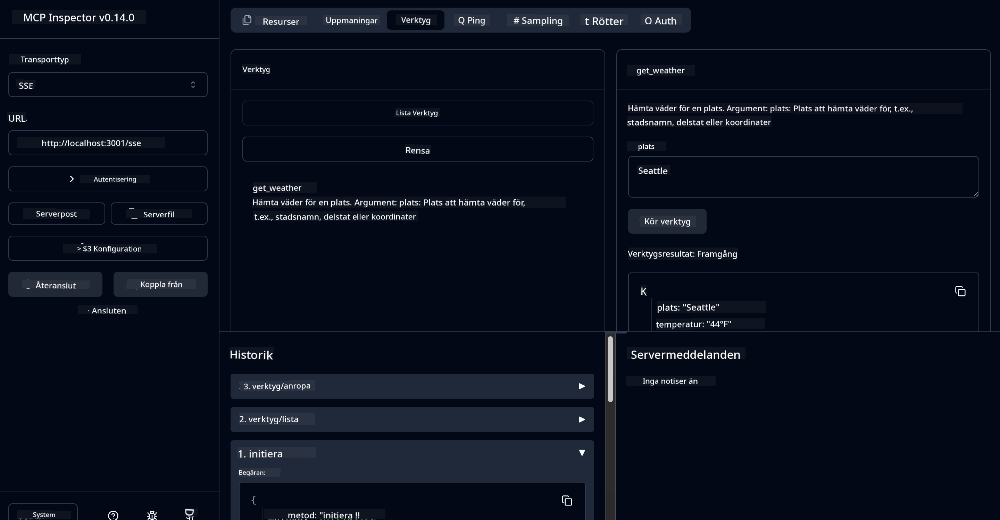

<!--
CO_OP_TRANSLATOR_METADATA:
{
  "original_hash": "dd8da3f75addcef453fe11f02a270217",
  "translation_date": "2025-07-14T08:14:38+00:00",
  "source_file": "10-StreamliningAIWorkflowsBuildingAnMCPServerWithAIToolkit/lab3/README.md",
  "language_code": "sv"
}
-->
# 🔧 Modul 3: Avancerad MCP-utveckling med AI Toolkit


## 🎯 Lärandemål

I slutet av denna labb kommer du att kunna:

- ✅ Skapa egna MCP-servrar med AI Toolkit
- ✅ Konfigurera och använda den senaste MCP Python SDK (v1.9.3)
- ✅ Sätta upp och använda MCP Inspector för felsökning
- ✅ Felsöka MCP-servrar i både Agent Builder och Inspector-miljöer
- ✅ Förstå avancerade arbetsflöden för MCP-serverutveckling

## 📋 Förkunskaper

- Genomförd Lab 2 (MCP Fundamentals)
- VS Code med AI Toolkit-tillägget installerat
- Python 3.10+ miljö
- Node.js och npm för Inspector-uppsättning

## 🏗️ Vad du kommer att bygga

I denna labb skapar du en **Weather MCP Server** som visar:

- Egen MCP-serverimplementation
- Integration med AI Toolkit Agent Builder
- Professionella felsökningsarbetsflöden
- Moderna MCP SDK-användningsmönster

---

## 🔧 Översikt av kärnkomponenter

### 🐍 MCP Python SDK  
Model Context Protocol Python SDK utgör grunden för att bygga egna MCP-servrar. Du kommer att använda version 1.9.3 med förbättrade felsökningsmöjligheter.

### 🔍 MCP Inspector  
Ett kraftfullt felsökningsverktyg som erbjuder:  
- Realtidsövervakning av servern  
- Visualisering av verktygsexekvering  
- Inspektion av nätverksförfrågningar och svar  
- Interaktiv testmiljö  

---

## 📖 Steg-för-steg-implementering

### Steg 1: Skapa en WeatherAgent i Agent Builder

1. **Starta Agent Builder** i VS Code via AI Toolkit-tillägget  
2. **Skapa en ny agent** med följande konfiguration:  
   - Agentnamn: `WeatherAgent`



### Steg 2: Initiera MCP Server-projekt

1. **Gå till Tools** → **Add Tool** i Agent Builder  
2. **Välj "MCP Server"** från alternativen  
3. **Välj "Create A new MCP Server"**  
4. **Välj mallen `python-weather`**  
5. **Namnge din server:** `weather_mcp`



### Steg 3: Öppna och granska projektet

1. **Öppna det genererade projektet** i VS Code  
2. **Granska projektstrukturen:**  
   ```
   weather_mcp/
   ├── src/
   │   ├── __init__.py
   │   └── server.py
   ├── inspector/
   │   ├── package.json
   │   └── package-lock.json
   ├── .vscode/
   │   ├── launch.json
   │   └── tasks.json
   ├── pyproject.toml
   └── README.md
   ```

### Steg 4: Uppgradera till senaste MCP SDK

> **🔍 Varför uppgradera?** Vi vill använda den senaste MCP SDK (v1.9.3) och Inspector-tjänsten (0.14.0) för förbättrade funktioner och bättre felsökningsmöjligheter.

#### 4a. Uppdatera Python-beroenden

**Redigera `pyproject.toml`:** uppdatera [./code/weather_mcp/pyproject.toml](../../../../10-StreamliningAIWorkflowsBuildingAnMCPServerWithAIToolkit/lab3/code/weather_mcp/pyproject.toml)

#### 4b. Uppdatera Inspector-konfiguration

**Redigera `inspector/package.json`:** uppdatera [./code/weather_mcp/inspector/package.json](../../../../10-StreamliningAIWorkflowsBuildingAnMCPServerWithAIToolkit/lab3/code/weather_mcp/inspector/package.json)

#### 4c. Uppdatera Inspector-beroenden

**Redigera `inspector/package-lock.json`:** uppdatera [./code/weather_mcp/inspector/package-lock.json](../../../../10-StreamliningAIWorkflowsBuildingAnMCPServerWithAIToolkit/lab3/code/weather_mcp/inspector/package-lock.json)

> **📝 Notera:** Denna fil innehåller omfattande beroendedefinitioner. Nedan visas den grundläggande strukturen – hela innehållet säkerställer korrekt beroendehantering.

> **⚡ Full Package Lock:** Den kompletta package-lock.json innehåller cirka 3000 rader med beroendedefinitioner. Ovan visas nyckelstrukturen – använd den medföljande filen för fullständig beroendehantering.

### Steg 5: Konfigurera felsökning i VS Code

*Notera: Kopiera filen i angiven sökväg för att ersätta motsvarande lokala fil*

#### 5a. Uppdatera launch-konfiguration

**Redigera `.vscode/launch.json`:**

```json
{
  "version": "0.2.0",
  "configurations": [
    {
      "name": "Attach to Local MCP",
      "type": "debugpy",
      "request": "attach",
      "connect": {
        "host": "localhost",
        "port": 5678
      },
      "presentation": {
        "hidden": true
      },
      "internalConsoleOptions": "neverOpen",
      "postDebugTask": "Terminate All Tasks"
    },
    {
      "name": "Launch Inspector (Edge)",
      "type": "msedge",
      "request": "launch",
      "url": "http://localhost:6274?timeout=60000&serverUrl=http://localhost:3001/sse#tools",
      "cascadeTerminateToConfigurations": [
        "Attach to Local MCP"
      ],
      "presentation": {
        "hidden": true
      },
      "internalConsoleOptions": "neverOpen"
    },
    {
      "name": "Launch Inspector (Chrome)",
      "type": "chrome",
      "request": "launch",
      "url": "http://localhost:6274?timeout=60000&serverUrl=http://localhost:3001/sse#tools",
      "cascadeTerminateToConfigurations": [
        "Attach to Local MCP"
      ],
      "presentation": {
        "hidden": true
      },
      "internalConsoleOptions": "neverOpen"
    }
  ],
  "compounds": [
    {
      "name": "Debug in Agent Builder",
      "configurations": [
        "Attach to Local MCP"
      ],
      "preLaunchTask": "Open Agent Builder",
    },
    {
      "name": "Debug in Inspector (Edge)",
      "configurations": [
        "Launch Inspector (Edge)",
        "Attach to Local MCP"
      ],
      "preLaunchTask": "Start MCP Inspector",
      "stopAll": true
    },
    {
      "name": "Debug in Inspector (Chrome)",
      "configurations": [
        "Launch Inspector (Chrome)",
        "Attach to Local MCP"
      ],
      "preLaunchTask": "Start MCP Inspector",
      "stopAll": true
    }
  ]
}
```

**Redigera `.vscode/tasks.json`:**

```
{
  "version": "2.0.0",
  "tasks": [
    {
      "label": "Start MCP Server",
      "type": "shell",
      "command": "python -m debugpy --listen 127.0.0.1:5678 src/__init__.py sse",
      "isBackground": true,
      "options": {
        "cwd": "${workspaceFolder}",
        "env": {
          "PORT": "3001"
        }
      },
      "problemMatcher": {
        "pattern": [
          {
            "regexp": "^.*$",
            "file": 0,
            "location": 1,
            "message": 2
          }
        ],
        "background": {
          "activeOnStart": true,
          "beginsPattern": ".*",
          "endsPattern": "Application startup complete|running"
        }
      }
    },
    {
      "label": "Start MCP Inspector",
      "type": "shell",
      "command": "npm run dev:inspector",
      "isBackground": true,
      "options": {
        "cwd": "${workspaceFolder}/inspector",
        "env": {
          "CLIENT_PORT": "6274",
          "SERVER_PORT": "6277",
        }
      },
      "problemMatcher": {
        "pattern": [
          {
            "regexp": "^.*$",
            "file": 0,
            "location": 1,
            "message": 2
          }
        ],
        "background": {
          "activeOnStart": true,
          "beginsPattern": "Starting MCP inspector",
          "endsPattern": "Proxy server listening on port"
        }
      },
      "dependsOn": [
        "Start MCP Server"
      ]
    },
    {
      "label": "Open Agent Builder",
      "type": "shell",
      "command": "echo ${input:openAgentBuilder}",
      "presentation": {
        "reveal": "never"
      },
      "dependsOn": [
        "Start MCP Server"
      ],
    },
    {
      "label": "Terminate All Tasks",
      "command": "echo ${input:terminate}",
      "type": "shell",
      "problemMatcher": []
    }
  ],
  "inputs": [
    {
      "id": "openAgentBuilder",
      "type": "command",
      "command": "ai-mlstudio.agentBuilder",
      "args": {
        "initialMCPs": [ "local-server-weather_mcp" ],
        "triggeredFrom": "vsc-tasks"
      }
    },
    {
      "id": "terminate",
      "type": "command",
      "command": "workbench.action.tasks.terminate",
      "args": "terminateAll"
    }
  ]
}
```

---

## 🚀 Köra och testa din MCP-server

### Steg 6: Installera beroenden

Efter att ha gjort konfigurationsändringarna, kör följande kommandon:

**Installera Python-beroenden:**  
```bash
uv sync
```

**Installera Inspector-beroenden:**  
```bash
cd inspector
npm install
```

### Steg 7: Felsök med Agent Builder

1. **Tryck på F5** eller använd konfigurationen **"Debug in Agent Builder"**  
2. **Välj den sammansatta konfigurationen** i felsökningspanelen  
3. **Vänta på att servern startar** och att Agent Builder öppnas  
4. **Testa din weather MCP-server** med naturliga språkfrågor

Ange prompt som denna

SYSTEM_PROMPT

```
You are my weather assistant
```

USER_PROMPT

```
How's the weather like in Seattle
```



### Steg 8: Felsök med MCP Inspector

1. **Använd konfigurationen "Debug in Inspector"** (Edge eller Chrome)  
2. **Öppna Inspector-gränssnittet** på `http://localhost:6274`  
3. **Utforska den interaktiva testmiljön:**  
   - Visa tillgängliga verktyg  
   - Testa verktygsexekvering  
   - Övervaka nätverksförfrågningar  
   - Felsök serverrespons  



---

## 🎯 Viktiga lärdomar

Genom att slutföra denna labb har du:

- [x] **Skapat en egen MCP-server** med AI Toolkit-mallar  
- [x] **Uppgraderat till senaste MCP SDK** (v1.9.3) för förbättrad funktionalitet  
- [x] **Konfigurerat professionella felsökningsarbetsflöden** för både Agent Builder och Inspector  
- [x] **Satt upp MCP Inspector** för interaktiv servertestning  
- [x] **Behärskat VS Code-felsökningskonfigurationer** för MCP-utveckling  

## 🔧 Avancerade funktioner som utforskats

| Funktion | Beskrivning | Användningsfall |
|---------|-------------|-----------------|
| **MCP Python SDK v1.9.3** | Senaste protokollimplementationen | Modern serverutveckling |
| **MCP Inspector 0.14.0** | Interaktivt felsökningsverktyg | Realtidstestning av server |
| **VS Code Debugging** | Integrerad utvecklingsmiljö | Professionellt felsökningsarbetsflöde |
| **Agent Builder Integration** | Direkt AI Toolkit-anslutning | Slut-till-slut agenttestning |

## 📚 Ytterligare resurser

- [MCP Python SDK Documentation](https://modelcontextprotocol.io/docs/sdk/python)  
- [AI Toolkit Extension Guide](https://code.visualstudio.com/docs/ai/ai-toolkit)  
- [VS Code Debugging Documentation](https://code.visualstudio.com/docs/editor/debugging)  
- [Model Context Protocol Specification](https://modelcontextprotocol.io/docs/concepts/architecture)  

---

**🎉 Grattis!** Du har framgångsrikt slutfört Lab 3 och kan nu skapa, felsöka och distribuera egna MCP-servrar med professionella utvecklingsarbetsflöden.

### 🔜 Fortsätt till nästa modul

Redo att använda dina MCP-kunskaper i ett verkligt utvecklingsflöde? Fortsätt till **[Modul 4: Praktisk MCP-utveckling - Egen GitHub Clone Server](../lab4/README.md)** där du kommer att:  
- Bygga en produktionsklar MCP-server som automatiserar GitHub-repositorieoperationer  
- Implementera funktionalitet för kloning av GitHub-repositorier via MCP  
- Integrera egna MCP-servrar med VS Code och GitHub Copilot Agent Mode  
- Testa och distribuera egna MCP-servrar i produktionsmiljöer  
- Lära dig praktisk arbetsflödesautomatisering för utvecklare

**Ansvarsfriskrivning**:  
Detta dokument har översatts med hjälp av AI-översättningstjänsten [Co-op Translator](https://github.com/Azure/co-op-translator). Även om vi strävar efter noggrannhet, vänligen observera att automatiska översättningar kan innehålla fel eller brister. Det ursprungliga dokumentet på dess modersmål bör betraktas som den auktoritativa källan. För kritisk information rekommenderas professionell mänsklig översättning. Vi ansvarar inte för några missförstånd eller feltolkningar som uppstår till följd av användningen av denna översättning.