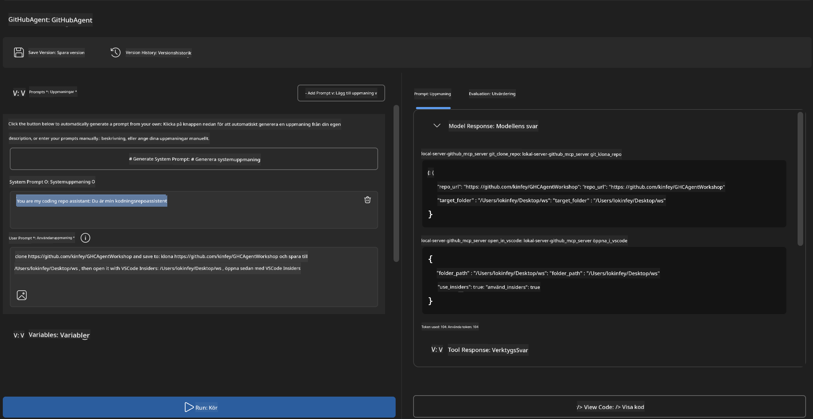
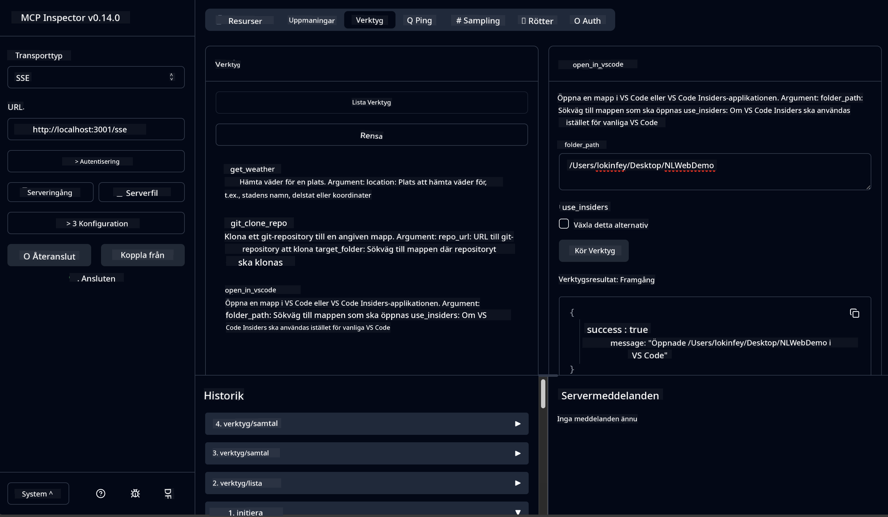

<!--
CO_OP_TRANSLATOR_METADATA:
{
  "original_hash": "f83bc722dc758efffd68667d6a1db470",
  "translation_date": "2025-07-14T08:42:55+00:00",
  "source_file": "10-StreamliningAIWorkflowsBuildingAnMCPServerWithAIToolkit/lab4/README.md",
  "language_code": "sv"
}
-->
# 🐙 Modul 4: Praktisk MCP-utveckling - Anpassad GitHub-klonserver


> **⚡ Snabbstart:** Bygg en produktionsklar MCP-server som automatiserar kloning av GitHub-repositorier och integration med VS Code på bara 30 minuter!

## 🎯 Lärandemål

I slutet av denna labb kommer du att kunna:

- ✅ Skapa en anpassad MCP-server för verkliga utvecklingsflöden
- ✅ Implementera funktionalitet för kloning av GitHub-repositorier via MCP
- ✅ Integrera anpassade MCP-servrar med VS Code och Agent Builder
- ✅ Använda GitHub Copilot Agent Mode med anpassade MCP-verktyg
- ✅ Testa och distribuera anpassade MCP-servrar i produktionsmiljöer

## 📋 Förkunskaper

- Genomförda Labs 1-3 (MCP-grunder och avancerad utveckling)
- Prenumeration på GitHub Copilot ([gratis registrering finns](https://github.com/github-copilot/signup))
- VS Code med AI Toolkit och GitHub Copilot-tillägg
- Git CLI installerat och konfigurerat

## 🏗️ Projektöversikt

### **Verklighetsnära utvecklingsutmaning**
Som utvecklare använder vi ofta GitHub för att klona repositorier och öppna dem i VS Code eller VS Code Insiders. Denna manuella process innebär:
1. Öppna terminal/kommandoprompt
2. Navigera till önskad katalog
3. Köra kommandot `git clone`
4. Öppna VS Code i den klonade katalogen

**Vår MCP-lösning förenklar detta till ett enda intelligent kommando!**

### **Vad du kommer att bygga**
En **GitHub Clone MCP Server** (`git_mcp_server`) som erbjuder:

| Funktion | Beskrivning | Fördel |
|---------|-------------|---------|
| 🔄 **Smart kloning av repositorier** | Klona GitHub-repos med validering | Automatiserad felkontroll |
| 📁 **Intelligent kataloghantering** | Kontrollera och skapa kataloger säkert | Förhindrar överskrivning |
| 🚀 **Plattformsoberoende VS Code-integration** | Öppna projekt i VS Code/Insiders | Sömlös arbetsflödesövergång |
| 🛡️ **Robust felhantering** | Hantera nätverks-, behörighets- och sökvägsproblem | Produktionssäker pålitlighet |

---

## 📖 Steg-för-steg-implementering

### Steg 1: Skapa GitHub-agent i Agent Builder

1. **Starta Agent Builder** via AI Toolkit-tillägget
2. **Skapa en ny agent** med följande konfiguration:
   ```
   Agent Name: GitHubAgent
   ```

3. **Initiera anpassad MCP-server:**
   - Gå till **Verktyg** → **Lägg till verktyg** → **MCP Server**
   - Välj **"Skapa en ny MCP Server"**
   - Välj **Python-mall** för maximal flexibilitet
   - **Servernamn:** `git_mcp_server`

### Steg 2: Konfigurera GitHub Copilot Agent Mode

1. **Öppna GitHub Copilot** i VS Code (Ctrl/Cmd + Shift + P → "GitHub Copilot: Open")
2. **Välj Agentmodell** i Copilot-gränssnittet
3. **Välj Claude 3.7-modellen** för förbättrad resonemangsförmåga
4. **Aktivera MCP-integration** för verktygsåtkomst

> **💡 Proffstips:** Claude 3.7 ger överlägsen förståelse för utvecklingsflöden och felhanteringsmönster.

### Steg 3: Implementera kärnfunktionalitet i MCP-servern

**Använd följande detaljerade prompt med GitHub Copilot Agent Mode:**

```
Create two MCP tools with the following comprehensive requirements:

🔧 TOOL A: clone_repository
Requirements:
- Clone any GitHub repository to a specified local folder
- Return the absolute path of the successfully cloned project
- Implement comprehensive validation:
  ✓ Check if target directory already exists (return error if exists)
  ✓ Validate GitHub URL format (https://github.com/user/repo)
  ✓ Verify git command availability (prompt installation if missing)
  ✓ Handle network connectivity issues
  ✓ Provide clear error messages for all failure scenarios

🚀 TOOL B: open_in_vscode
Requirements:
- Open specified folder in VS Code or VS Code Insiders
- Cross-platform compatibility (Windows/Linux/macOS)
- Use direct application launch (not terminal commands)
- Auto-detect available VS Code installations
- Handle cases where VS Code is not installed
- Provide user-friendly error messages

Additional Requirements:
- Follow MCP 1.9.3 best practices
- Include proper type hints and documentation
- Implement logging for debugging purposes
- Add input validation for all parameters
- Include comprehensive error handling
```

### Steg 4: Testa din MCP-server

#### 4a. Testa i Agent Builder

1. **Starta felsökningskonfigurationen** för Agent Builder
2. **Konfigurera din agent med denna systemprompt:**

```
SYSTEM_PROMPT:
You are my intelligent coding repository assistant. You help developers efficiently clone GitHub repositories and set up their development environment. Always provide clear feedback about operations and handle errors gracefully.
```

3. **Testa med realistiska användarscenarier:**

```
USER_PROMPT EXAMPLES:

Scenario : Basic Clone and Open
"Clone {Your GitHub Repo link such as https://github.com/kinfey/GHCAgentWorkshop
 } and save to {The global path you specify}, then open it with VS Code Insiders"
```



**Förväntade resultat:**
- ✅ Lyckad kloning med sökvägsbekräftelse
- ✅ Automatisk start av VS Code
- ✅ Tydliga felmeddelanden vid ogiltiga scenarier
- ✅ Korrekt hantering av kantfall

#### 4b. Testa i MCP Inspector



---

**🎉 Grattis!** Du har framgångsrikt skapat en praktisk, produktionsklar MCP-server som löser verkliga utvecklingsflödesutmaningar. Din anpassade GitHub-klonserver visar kraften i MCP för att automatisera och förbättra utvecklares produktivitet.

### 🏆 Uppnått:
- ✅ **MCP-utvecklare** - Skapade anpassad MCP-server
- ✅ **Automatiseringsspecialist** - Effektiviserade utvecklingsprocesser  
- ✅ **Integreringsexpert** - Kopplade samman flera utvecklingsverktyg
- ✅ **Produktionsklar** - Byggde lösningar redo för distribution

---

## 🎓 Workshopavslutning: Din resa med Model Context Protocol

**Kära workshopdeltagare,**

Grattis till att du har slutfört alla fyra moduler i Model Context Protocol-workshopen! Du har gått från att förstå grundläggande AI Toolkit-koncept till att bygga produktionsklara MCP-servrar som löser verkliga utvecklingsutmaningar.

### 🚀 Sammanfattning av din läranderesa:

**[Modul 1](../lab1/README.md)**: Du började med att utforska AI Toolkit-grunder, modelltestning och skapade din första AI-agent.

**[Modul 2](../lab2/README.md)**: Du lärde dig MCP-arkitektur, integrerade Playwright MCP och byggde din första webbläsarautomationsagent.

**[Modul 3](../lab3/README.md)**: Du avancerade till anpassad MCP-serverutveckling med Weather MCP-servern och bemästrade felsökningsverktyg.

**[Modul 4](../lab4/README.md)**: Nu har du tillämpat allt för att skapa ett praktiskt verktyg för automatisering av GitHub-repositoriearbetsflöden.

### 🌟 Det du behärskar:

- ✅ **AI Toolkit-ekosystemet**: Modeller, agenter och integrationsmönster
- ✅ **MCP-arkitektur**: Klient-serverdesign, transportprotokoll och säkerhet
- ✅ **Utvecklarverktyg**: Från Playground till Inspector till produktionsdistribution
- ✅ **Anpassad utveckling**: Bygga, testa och distribuera egna MCP-servrar
- ✅ **Praktiska tillämpningar**: Lösa verkliga arbetsflödesutmaningar med AI

### 🔮 Dina nästa steg:

1. **Bygg din egen MCP-server**: Använd dessa färdigheter för att automatisera dina unika arbetsflöden
2. **Gå med i MCP-communityn**: Dela dina skapelser och lär av andra
3. **Utforska avancerad integration**: Koppla MCP-servrar till företagsystem
4. **Bidra till open source**: Hjälp till att förbättra MCP-verktyg och dokumentation

Kom ihåg, denna workshop är bara början. Model Context Protocol-ekosystemet utvecklas snabbt, och du är nu rustad att ligga i framkant av AI-drivna utvecklingsverktyg.

**Tack för ditt deltagande och din vilja att lära!**

Vi hoppas att denna workshop har väckt idéer som kommer att förändra hur du bygger och interagerar med AI-verktyg i din utvecklingsresa.

**Lycka till med kodandet!**

---

**Ansvarsfriskrivning**:  
Detta dokument har översatts med hjälp av AI-översättningstjänsten [Co-op Translator](https://github.com/Azure/co-op-translator). Även om vi strävar efter noggrannhet, vänligen observera att automatiska översättningar kan innehålla fel eller brister. Det ursprungliga dokumentet på dess modersmål bör betraktas som den auktoritativa källan. För kritisk information rekommenderas professionell mänsklig översättning. Vi ansvarar inte för några missförstånd eller feltolkningar som uppstår till följd av användningen av denna översättning.