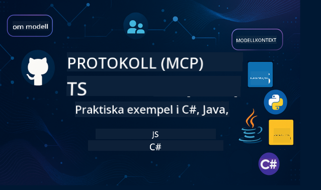

<!--
CO_OP_TRANSLATOR_METADATA:
{
  "original_hash": "2a21391378c12ecfef50f866329dfde0",
  "translation_date": "2025-05-17T05:26:49+00:00",
  "source_file": "README.md",
  "language_code": "sv"
}
-->

Följ dessa steg för att komma igång med dessa resurser:
1. **Gaffla Repositoriet**: Klicka 
2. **Klona Repositoriet**: `git clone https://github.com/microsoft/mcp-for-beginners.git`
3. [**Gå med i Microsoft Azure AI Foundry Discord och träffa experter och andra utvecklare**](https://discord.com/invite/ByRwuEEgH4)

### 🌐 Flerspråkigt Stöd

#### Stöds via GitHub Action (Automatiserat & Alltid Uppdaterat)
[Franska](../fr/README.md) | [Spanska](../es/README.md) | [Tyska](../de/README.md) | [Ryska](../ru/README.md) | [Arabiska](../ar/README.md) | [Persiska (Farsi)](../fa/README.md) | [Urdu](../ur/README.md) | [Kinesiska (Förenklad)](../zh/README.md) | [Kinesiska (Traditionell, Macau)](../mo/README.md) | [Kinesiska (Traditionell, Hongkong)](../hk/README.md) | [Kinesiska (Traditionell, Taiwan)](../tw/README.md) | [Japanska](../ja/README.md) | [Koreanska](../ko/README.md) | [Hindi](../hi/README.md) | [Bengali](../bn/README.md) | [Marathi](../mr/README.md) | [Nepali](../ne/README.md) | [Punjabi (Gurmukhi)](../pa/README.md) | [Portugisiska (Portugal)](../pt/README.md) | [Portugisiska (Brasilien)](../br/README.md) | [Italienska](../it/README.md) | [Polska](../pl/README.md) | [Turkiska](../tr/README.md) | [Grekiska](../el/README.md) | [Thailändska](../th/README.md) | [Svenska](./README.md) | [Danska](../da/README.md) | [Norska](../no/README.md) | [Finska](../fi/README.md) | [Holländska](../nl/README.md) | [Hebreiska](../he/README.md) | [Vietnamesiska](../vi/README.md) | [Indonesiska](../id/README.md) | [Malajiska](../ms/README.md) | [Tagalog (Filipino)](../tl/README.md) | [Swahili](../sw/README.md) | [Ungerska](../hu/README.md) | [Tjeckiska](../cs/README.md) | [Slovakiska](../sk/README.md) | [Rumänska](../ro/README.md) | [Bulgariska](../bg/README.md) | [Serbiska (Kyrilliska)](../sr/README.md) | [Kroatiska](../hr/README.md) | [Slovenska](../sl/README.md)
# 🚀 Ultimat Guide till Modellkontextprotokollet (MCP) Curriculum för Nybörjare

## **Lär dig MCP med Praktiska Kodexempel i C#, Java, JavaScript, Python och TypeScript**

## 🧠 Översikt över Modellkontextprotokollet Curriculum

**Modellkontextprotokollet (MCP)** är ett banbrytande ramverk designat för att standardisera interaktioner mellan AI-modeller och klientapplikationer. Detta open-source curriculum erbjuder en strukturerad inlärningsväg, komplett med praktiska kodexempel och verkliga användningsfall, över populära programmeringsspråk inklusive C#, Java, JavaScript, TypeScript och Python.

Oavsett om du är en AI-utvecklare, systemarkitekt eller mjukvaruingenjör, är denna guide din omfattande resurs för att bemästra MCP-grunder och implementeringsstrategier.

## 🔗 Officiella MCP-resurser

- 📘 [MCP-dokumentation](https://modelcontextprotocol.io/) – Detaljerade handledningar och användarguider  
- 📜 [MCP-specifikation](https://spec.modelcontextprotocol.io/) – Protokollarkitektur och tekniska referenser  
- 🧑‍💻 [MCP GitHub-repository](https://github.com/modelcontextprotocol) – Open-source SDKs, verktyg och kodexempel  

## 🧭 Komplett MCP Curriculum Struktur

### 📌 [Introduktion till MCP](./00-Introduction/README.md)

- Vad är Modellkontextprotokollet?
- Varför standardisering är viktigt i AI-pipelines
- Praktiska användningsfall och fördelar med MCP

### 🧩 [Kärnkoncept Förklarade](./01-CoreConcepts/README.md)

- Förstå klient-serverarkitektur i MCP
- Viktiga protokollkomponenter: förfrågningar, svar och scheman
- MCP-meddelanden och datautbytesmönster

### 🔐 [Säkerhet i MCP](./02-Security/readme.md)

- Identifiera säkerhetshot inom MCP-baserade system
- Tekniker och bästa praxis för att säkra implementationer

### 🚀 [Komma igång med MCP](./03-GettingStarted/README.md)

- Miljöinställningar och konfiguration
- Skapa grundläggande MCP-servrar och klienter
- Integrera MCP med befintliga applikationer

#### 🧮 MCP-kalkylator Exempelprojekt:

  
<strong>Utforska Kodimplementeringar efter Språk</strong>

  - [C# MCP-serverexempel](./03-GettingStarted/samples/csharp/README.md)
  - [Java MCP-kalkylator](./03-GettingStarted/samples/java/calculator/README.md)
  - [JavaScript MCP-demo](./03-GettingStarted/samples/javascript/README.md)
  - [Python MCP-server](../../03-GettingStarted/samples/python/mcp_calculator_server.py)
  - [TypeScript MCP-exempel](./03-GettingStarted/samples/typescript/README.md)

### 🛠️ [Praktisk Implementering](./04-PracticalImplementation/README.md)

- Använda SDKs över olika språk
- Debugging, testning och validering
- Skapa återanvändbara promptmallar och arbetsflöden

#### 💡 MCP Avancerade Kalkylatorprojekt:

  
<strong>Utforska Avancerade Exempel</strong>

  - [Avancerat C#-exempel](./04-PracticalImplementation/samples/csharp/README.md)
  - [Java Container App Exempel](./04-PracticalImplementation/samples/java/containerapp/README.md)
  - [JavaScript Avancerat Exempel](./04-PracticalImplementation/samples/javascript/README.md)
  - [Python Komplex Implementering](../../04-PracticalImplementation/samples/python/mcp_sample.py)
  - [TypeScript Container Exempel](./04-PracticalImplementation/samples/typescript/README.md)

### 🎓 [Avancerade Ämnen i MCP](./05-AdvancedTopics/README.md)

- Multi-modal AI-arbetsflöden och utbyggbarhet
- Säkra skalningsstrategier
- MCP i företagsmiljöer

### 🌍 [Gemenskapsbidrag](./06-CommunityContributions/README.md)

- Hur man bidrar med kod och dokumentation
- Samarbeta via GitHub
- Gemenskapsdrivna förbättringar och feedback

### 📈 [Insikter från Tidig Antagning](./07-CaseStudies/README.md)

- Verkliga implementeringar och vad som fungerade
- Bygga och distribuera MCP-baserade lösningar
- Trender och framtida vägkarta

### 📏 [Bästa Praxis för MCP](./08-BestPractices/README.md)

- Prestandajustering och optimering
- Designa fel-toleranta MCP-system
- Test- och motståndsstrategier

### 📊 [MCP Fallstudier](./09-CaseStudy/Readme.md)

- Djupdykningar i MCP-lösningsarkitekturer
- Distributionsritningar och integrationstips
- Kommenterade diagram och projektgenomgångar

## 🎯 Förkunskaper för att Lära sig MCP

För att få ut det mesta av detta curriculum bör du ha:

- Grundläggande kunskap i C#, Java eller Python
- Förståelse för klient-servermodell och API:er
- (Valfritt) Bekantskap med maskininlärningskoncept

## 🛠️ Hur man Använder Detta Curriculum Effektivt

Varje lektion i denna guide inkluderar:

1. Klara förklaringar av MCP-koncept  
2. Levande kodexempel i flera språk  
3. Övningar för att bygga riktiga MCP-applikationer  
4. Extra resurser för avancerade elever  

## 📜 Licensinformation

Detta innehåll är licensierat under **MIT License**. För villkor och förutsättningar, se [LICENSE](../../LICENSE).

## 🤝 Bidragsriktlinjer

Detta projekt välkomnar bidrag och förslag. De flesta bidrag kräver att du godkänner ett
Contributor License Agreement (CLA) som deklarerar att du har rätt att, och faktiskt gör, ge oss
rättigheterna att använda ditt bidrag. För detaljer, besök <https://cla.opensource.microsoft.com>.

När du skickar en pull-begäran kommer en CLA-bot automatiskt att avgöra om du behöver lämna
en CLA och dekorera PR på lämpligt sätt (t.ex. statuskontroll, kommentar). Följ helt enkelt instruktionerna
som ges av boten. Du behöver bara göra detta en gång över alla repos som använder vår CLA.

Detta projekt har antagit [Microsoft Open Source Code of Conduct](https://opensource.microsoft.com/codeofconduct/).
För mer information se [Code of Conduct FAQ](https://opensource.microsoft.com/codeofconduct/faq/) eller
kontakta [opencode@microsoft.com](mailto:opencode@microsoft.com) med eventuella ytterligare frågor eller kommentarer.

## ™️ Varumärkesanmärkning

Detta projekt kan innehålla varumärken eller logotyper för projekt, produkter eller tjänster. Auktoriserad användning av Microsoft
varumärken eller logotyper är föremål för och måste följa
[Microsofts Varumärkes- & Märkesriktlinjer](https://www.microsoft.com/legal/intellectualproperty/trademarks/usage/general).
Användning av Microsofts varumärken eller logotyper i modifierade versioner av detta projekt får inte orsaka förvirring eller antyda Microsoft-sponsring.
All användning av tredje parts varumärken eller logotyper är föremål för dessa tredje parters policyer.

**Ansvarsfriskrivning**:  
Detta dokument har översatts med hjälp av AI-översättningstjänsten [Co-op Translator](https://github.com/Azure/co-op-translator). Även om vi strävar efter noggrannhet, vänligen notera att automatiserade översättningar kan innehålla fel eller oriktigheter. Det ursprungliga dokumentet på dess originalspråk bör betraktas som den auktoritativa källan. För kritisk information rekommenderas professionell mänsklig översättning. Vi ansvarar inte för eventuella missförstånd eller misstolkningar som uppstår vid användning av denna översättning.