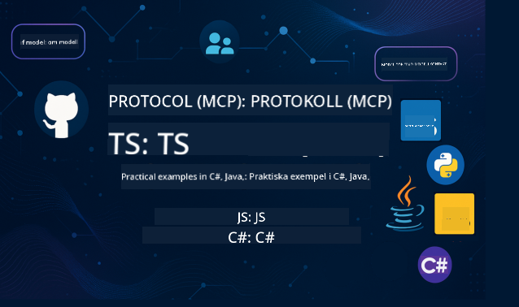

<!--
CO_OP_TRANSLATOR_METADATA:
{
  "original_hash": "866c8877136cb03e1efb9ad633a2f0a6",
  "translation_date": "2025-08-26T17:48:57+00:00",
  "source_file": "README.md",
  "language_code": "sv"
}
-->
 

Följ dessa steg för att komma igång med dessa resurser:
1. **Forka Repositoriet**: Klicka 
2. **Klona Repositoriet**:   `git clone https://github.com/microsoft/mcp-for-beginners.git`
3. [**Gå med i Azure AI Foundry Discord och träffa experter och andra utvecklare**](https://discord.com/invite/ByRwuEEgH4)

### 🌐 Stöd för flera språk

#### Stöds via GitHub Action (Automatiserat & Alltid Uppdaterat)

 [Arabiska](../ar/README.md) | [Bengali](../bn/README.md) | [Bulgariska](../bg/README.md) | [Burmesiska (Myanmar)](../my/README.md) | [Kinesiska (Förenklad)](../zh/README.md) | [Kinesiska (Traditionell, Hongkong)](../hk/README.md) | [Kinesiska (Traditionell, Macau)](../mo/README.md) | [Kinesiska (Traditionell, Taiwan)](../tw/README.md) | [Kroatiska](../hr/README.md) | [Tjeckiska](../cs/README.md) | [Danska](../da/README.md) | [Holländska](../nl/README.md) | [Finska](../fi/README.md) | [Franska](../fr/README.md) | [Tyska](../de/README.md) | [Grekiska](../el/README.md) | [Hebreiska](../he/README.md) | [Hindi](../hi/README.md) | [Ungerska](../hu/README.md) | [Indonesiska](../id/README.md) | [Italienska](../it/README.md) | [Japanska](../ja/README.md) | [Koreanska](../ko/README.md) | [Malajiska](../ms/README.md) | [Marathi](../mr/README.md) | [Nepalesiska](../ne/README.md) | [Norska](../no/README.md) | [Persiska (Farsi)](../fa/README.md) | [Polska](../pl/README.md) | [Portugisiska (Brasilien)](../br/README.md) | [Portugisiska (Portugal)](../pt/README.md) | [Punjabi (Gurmukhi)](../pa/README.md) | [Rumänska](../ro/README.md) | [Ryska](../ru/README.md) | [Serbiska (Kyrilliska)](../sr/README.md) | [Slovakiska](../sk/README.md) | [Slovenska](../sl/README.md) | [Spanska](../es/README.md) | [Swahili](../sw/README.md) | [Svenska](./README.md) | [Tagalog (Filippinska)](../tl/README.md) | [Thailändska](../th/README.md) | [Turkiska](../tr/README.md) | [Ukrainska](../uk/README.md) | [Urdu](../ur/README.md) | [Vietnamesiska](../vi/README.md)

# 🚀 Model Context Protocol (MCP) Kursplan för Nybörjare

## **Lär dig MCP med praktiska kodexempel i C#, Java, JavaScript, Rust, Python och TypeScript**

## 🧠 Översikt av Model Context Protocol Kursplanen

**Model Context Protocol (MCP)** är ett banbrytande ramverk som standardiserar interaktioner mellan AI-modeller och klientapplikationer. Denna öppen källkod-kursplan erbjuder en strukturerad inlärningsväg, komplett med praktiska kodexempel och verkliga användningsfall, på populära programmeringsspråk som C#, Java, JavaScript, TypeScript och Python.

Oavsett om du är AI-utvecklare, systemarkitekt eller mjukvaruingenjör, är denna guide din omfattande resurs för att bemästra MCP-grunderna och implementeringsstrategier.

## 🔗 Officiella MCP-resurser

- 📘 [MCP Dokumentation](https://modelcontextprotocol.io/) – Detaljerade handledningar och användarguider  
- 📜 [MCP Specifikation](https://modelcontextprotocol.io/docs/) – Protokollarkitektur och tekniska referenser  
- 📜 [Original MCP Specifikation](https://spec.modelcontextprotocol.io/) – Äldre tekniska referenser (kan innehålla ytterligare detaljer)  
- 🧑‍💻 [MCP GitHub Repository](https://github.com/modelcontextprotocol) – Öppen källkod SDKs, verktyg och kodexempel
- 🌐 [MCP Community](https://github.com/orgs/modelcontextprotocol/discussions) – Delta i diskussioner och bidra till communityn

## 🧭 Översikt av MCP Kursplanen

### 📚 Komplett Kursstruktur

| Modul | Ämne | Beskrivning | Länk |
|--------|-------|-------------|------|
| **Modul 1-3: Grunderna** | | | |
| 00 | Introduktion till MCP | Översikt av Model Context Protocol och dess betydelse i AI-pipelines | [Läs mer](./00-Introduction/README.md) |
| 01 | Förklaring av Kärnkoncept | Djupgående utforskning av MCP:s kärnkoncept | [Läs mer](./01-CoreConcepts/README.md) |
| 02 | Säkerhet i MCP | Säkerhetshot och bästa praxis | [Läs mer](./02-Security/README.md) |
| 03 | Komma igång med MCP | Miljöinställning, grundläggande servrar/klienter, integration | [Läs mer](./03-GettingStarted/README.md) |
| **Modul 3: Bygga Din Första Server & Klient** | | | |
| 3.1 | Första Servern | Skapa din första MCP-server | [Guide](./03-GettingStarted/01-first-server/README.md) |
| 3.2 | Första Klienten | Utveckla en grundläggande MCP-klient | [Guide](./03-GettingStarted/02-client/README.md) |
| 3.3 | Klient med LLM | Integrera stora språkmodeller | [Guide](./03-GettingStarted/03-llm-client/README.md) |
| 3.4 | VS Code Integration | Använd MCP-servrar i VS Code | [Guide](./03-GettingStarted/04-vscode/README.md) |
| 3.5 | stdio Server | Skapa servrar med stdio-transport | [Guide](./03-GettingStarted/05-stdio-server/README.md) |
| 3.6 | HTTP Streaming | Implementera HTTP-streaming i MCP | [Guide](./03-GettingStarted/06-http-streaming/README.md) |
| 3.7 | AI Toolkit | Använd AI Toolkit med MCP | [Guide](./03-GettingStarted/07-aitk/README.md) |
| 3.8 | Testning | Testa din MCP-serverimplementation | [Guide](./03-GettingStarted/08-testing/README.md) |
| 3.9 | Distribution | Distribuera MCP-servrar till produktion | [Guide](./03-GettingStarted/09-deployment/README.md) |
| **Modul 4-5: Praktiskt & Avancerat** | | | |
| 04 | Praktisk Implementering | SDKs, felsökning, testning, återanvändbara promptmallar | [Läs mer](./04-PracticalImplementation/README.md) |
| 05 | Avancerade Ämnen i MCP | Multimodal AI, skalning, företagsanvändning | [Läs mer](./05-AdvancedTopics/README.md) |
| 5.1 | Azure Integration | MCP-integration med Azure | [Guide](./05-AdvancedTopics/mcp-integration/README.md) |
| 5.2 | Multimodalitet | Arbeta med flera modaliteter | [Guide](./05-AdvancedTopics/mcp-multi-modality/README.md) |
| 5.3 | OAuth2 Demo | Implementera OAuth2-autentisering | [Guide](./05-AdvancedTopics/mcp-oauth2-demo/README.md) |
| 5.4 | Root Contexts | Förstå och implementera root contexts | [Guide](./05-AdvancedTopics/mcp-root-contexts/README.md) |
| 5.5 | Routing | MCP-routingstrategier | [Guide](./05-AdvancedTopics/mcp-routing/README.md) |
| 5.6 | Sampling | Samplingtekniker i MCP | [Guide](./05-AdvancedTopics/mcp-sampling/README.md) |
| 5.7 | Skalning | Skala MCP-implementationer | [Guide](./05-AdvancedTopics/mcp-scaling/README.md) |
| 5.8 | Säkerhet | Avancerade säkerhetsöverväganden | [Guide](./05-AdvancedTopics/mcp-security/README.md) |
| 5.9 | Webbsökning | Implementera webbsökningsfunktioner | [Guide](./05-AdvancedTopics/web-search-mcp/README.md) |
| 5.10 | Realtidsstreaming | Bygg funktionalitet för realtidsstreaming | [Guide](./05-AdvancedTopics/mcp-realtimestreaming/README.md) |
| 5.11 | Realtidssökning | Implementera realtidssökning | [Guide](./05-AdvancedTopics/mcp-realtimesearch/README.md) |
| 5.12 | Entra ID Auth | Autentisering med Microsoft Entra ID | [Guide](./05-AdvancedTopics/mcp-security-entra/README.md) |
| 5.13 | Foundry Integration | Integrera med Azure AI Foundry | [Guide](./05-AdvancedTopics/mcp-foundry-agent-integration/README.md) |
| 5.14 | Context Engineering | Tekniker för effektiv context engineering | [Guide](./05-AdvancedTopics/mcp-contextengineering/README.md) |
| **Modul 6-10: Community & Bästa Praxis** | | | |
| 06 | Communitybidrag | Hur man bidrar till MCP-ekosystemet | [Guide](./06-CommunityContributions/README.md) |
| 07 | Insikter från Tidig Användning | Verkliga implementationsberättelser | [Guide](./07-LessonsFromEarlyAdoption/README.md) |
| 08 | Bästa Praxis för MCP | Prestanda, feltolerans, motståndskraft | [Guide](./08-BestPractices/README.md) |
| 09 | MCP Fallstudier | Praktiska implementeringsexempel | [Guide](./09-CaseStudy/README.md) |
| 10 | Praktisk Workshop | Bygga en MCP-server med AI Toolkit | [Lab](./10-StreamliningAIWorkflowsBuildingAnMCPServerWithAIToolkit/README.md) |

### 💻 Exempelprojekt för Kod

#### Grundläggande MCP Kalkylatorexempel

| Språk | Beskrivning | Länk |
|----------|-------------|------|
| C# | MCP Server Exempel | [Visa Kod](./03-GettingStarted/samples/csharp/README.md) |
| Java | MCP Kalkylator | [Visa Kod](./03-GettingStarted/samples/java/calculator/README.md) |
| JavaScript | MCP Demo | [Visa Kod](./03-GettingStarted/samples/javascript/README.md) |
| Python | MCP Server | [Visa Kod](../../03-GettingStarted/samples/python/mcp_calculator_server.py) |
| TypeScript | MCP Exempel | [Visa Kod](./03-GettingStarted/samples/typescript/README.md) |
| Rust | MCP Exempel | [Visa Kod](./03-GettingStarted/samples/rust/README.md) |

#### Avancerade MCP-Implementationer

| Språk | Beskrivning | Länk |
|----------|-------------|------|
| C# | Avancerat Exempel | [Visa Kod](./04-PracticalImplementation/samples/csharp/README.md) |
| Java med Spring | Exempel på Containerapp | [Visa Kod](./04-PracticalImplementation/samples/java/containerapp/README.md) |
| JavaScript | Avancerat Exempel | [Visa Kod](./04-PracticalImplementation/samples/javascript/README.md) |
| Python | Komplex Implementering | [Visa Kod](../../04-PracticalImplementation/samples/python/READMEmd) |
| TypeScript | Exempel på Container | [Visa Kod](./04-PracticalImplementation/samples/typescript/README.md) |

## 🎯 Förkunskaper för att Lära sig MCP

För att få ut det mesta av denna kursplan bör du ha:

- Grundläggande kunskaper i programmering i minst ett av följande språk: C#, Java, JavaScript, Python eller TypeScript  
- Förståelse för klient-server-modellen och API:er  
- Bekantskap med REST- och HTTP-koncept  
- (Valfritt) Bakgrund inom AI/ML-koncept  

- Delta i våra gemenskapsdiskussioner för stöd  

## 📚 Studievägledning & Resurser

Detta repository innehåller flera resurser för att hjälpa dig navigera och lära dig effektivt:

### Studievägledning

En omfattande [Studievägledning](./study_guide.md) finns tillgänglig för att hjälpa dig navigera i detta repository. Guiden inkluderar:

- En visuell karta över kursplanen som visar alla täckta ämnen  
- Detaljerad genomgång av varje sektion i repositoryt  
- Vägledning om hur man använder exempelprojekt  
- Rekommenderade inlärningsvägar för olika kunskapsnivåer  
- Ytterligare resurser för att komplettera din inlärningsresa  

### Ändringslogg

Vi underhåller en detaljerad [Ändringslogg](./changelog.md) som spårar alla betydande uppdateringar av kursmaterialet, inklusive:

- Nya innehållstillägg  
- Strukturella förändringar  
- Förbättringar av funktioner  
- Dokumentationsuppdateringar  

## 🛠️ Hur man Använder Denna Kursplan Effektivt

Varje lektion i denna guide inkluderar:

1. Klara förklaringar av MCP-koncept  
2. Levande kodexempel på flera språk  
3. Övningar för att bygga riktiga MCP-applikationer  
4. Extra resurser för avancerade elever  

## Evenemang 

### [MCP Dev Days Juli 2025](https://developer.microsoft.com/en-us/reactor/series/S-1563/)  
#### [➡️Titta på Begäran - MCP Dev Days](https://developer.microsoft.com/en-us/reactor/series/S-1563/)  
Förbered dig på två dagar av djupgående teknisk insikt, gemenskapsanslutning och praktisk inlärning under MCP Dev Days, ett virtuellt evenemang tillägnat Model Context Protocol (MCP) — den framväxande standarden som förenar AI-modeller och de verktyg de förlitar sig på.  
Du kan titta på MCP Dev Days genom att registrera dig på vår evenemangssida: https://aka.ms/mcpdevdays.  

#### [Dag 1: MCP Produktivitet, Utvecklingsverktyg & Gemenskap:](https://developer.microsoft.com/en-us/reactor/series/S-1563/)  

Handlar om att ge utvecklare möjlighet att använda MCP i sitt arbetsflöde och fira den fantastiska MCP-gemenskapen. Vi kommer att få sällskap av gemenskapsmedlemmar och partners som Arcade, Block, Okta och Neon för att se hur de samarbetar med Microsoft för att forma ett öppet, utbyggbart MCP-ekosystem.  
- Verkliga demonstrationer över VS Code, Visual Studio, GitHub Copilot och populära gemenskapsverktyg  
- Praktiska, kontextdrivna utvecklingsarbetsflöden  
- Gemenskapsledda sessioner och insikter  
Oavsett om du precis har börjat med MCP eller redan bygger med det, kommer Dag 1 att sätta scenen med inspiration och handlingsbara insikter.  

#### [Dag 2: Bygg MCP-servrar med Självförtroende](https://developer.microsoft.com/en-us/reactor/series/S-1563/)  

Är för MCP-byggare. Vi kommer att gå djupt in i implementeringsstrategier och bästa praxis för att skapa MCP-servrar och integrera MCP i dina AI-arbetsflöden.  

#### Ämnen inkluderar:  

- Bygga MCP-servrar och integrera dem i agentupplevelser  
- Promptdriven utveckling  
- Säkerhetsbästa praxis  
- Använda byggstenar som Functions, ACA och API Management  
- Registeranpassning och verktyg (1P + 3P)  

Om du är utvecklare, verktygsbyggare eller AI-produktstrateg, är denna dag fylld med insikter du behöver för att bygga skalbara, säkra och framtidssäkra MCP-lösningar.  

### MCP Boot Camp Augusti 2025  
Lär dig i intensiva videolektioner hur du skapar MCP-servrar, integrerar med VS Code och distribuerar professionellt på Azure baserat på innehåll från MCP för Nybörjare-kursplanen. Få praktiska färdigheter i en teknik som stora företag redan använder.  

#### [➡️Titta på Begäran MCP Bootcamp | Engelska](https://developer.microsoft.com/en-us/reactor/series/s-1568/)  
#### [➡️Titta på Begäran MCP Bootcamp | Brasilien](https://developer.microsoft.com/en-us/reactor/series/S-1566/)  
#### [➡️Titta på Begäran MCP Bootcamp | Spanska](https://developer.microsoft.com/en-us/reactor/series/S-1567/)  

## 🌟 Tack till Gemenskapen  

Tack till Microsoft Valued Professional [Shivam Goyal](https://www.linkedin.com/in/shivam2003/) för att ha bidragit med viktiga kodexempel.  

## 📜 Licensinformation  

Detta innehåll är licensierat under **MIT-licensen**. För villkor och bestämmelser, se [LICENSE](../../LICENSE).  

## 🤝 Riktlinjer för Bidrag  

Detta projekt välkomnar bidrag och förslag. De flesta bidrag kräver att du godkänner ett  
Contributor License Agreement (CLA) som deklarerar att du har rätt att, och faktiskt gör, ge oss  
rättigheterna att använda ditt bidrag. För detaljer, besök  
<https://cla.opensource.microsoft.com>.  

När du skickar in en pull-begäran kommer en CLA-bot automatiskt att avgöra om du behöver tillhandahålla  
en CLA och dekorera PR:n på lämpligt sätt (t.ex. statuskontroll, kommentar). Följ bara instruktionerna  
som tillhandahålls av boten. Du behöver bara göra detta en gång för alla repos som använder vår CLA.  

Detta projekt har antagit [Microsoft Open Source Code of Conduct](https://opensource.microsoft.com/codeofconduct/).  
För mer information, se [Code of Conduct FAQ](https://opensource.microsoft.com/codeofconduct/faq/) eller  
kontakta [opencode@microsoft.com](mailto:opencode@microsoft.com) med eventuella ytterligare frågor eller kommentarer.  

## 📂 Repositorystruktur  

Repositoryt är organiserat enligt följande:  

- **Kärnkursplan (00-10)**: Huvudinnehållet organiserat i tio sekventiella moduler  
- **images/**: Diagram och illustrationer som används i hela kursplanen  
- **translations/**: Flerspråkigt stöd med automatiserade översättningar  
- **translated_images/**: Lokaliserade versioner av diagram och illustrationer  
- **study_guide.md**: Omfattande guide för att navigera i repositoryt  
- **changelog.md**: Logg över alla betydande ändringar i kursmaterialet  
- **mcp.json**: Konfigurationsfil för MCP-specifikationen  
- **CODE_OF_CONDUCT.md, LICENSE, SECURITY.md, SUPPORT.md**: Dokument för projektstyrning  

## 🎒 Andra Kurser  

Vårt team producerar andra kurser! Kolla in:  

- [AI-agenter för Nybörjare](https://github.com/microsoft/ai-agents-for-beginners?WT.mc_id=academic-105485-koreyst)  
- [Generativ AI för Nybörjare med .NET](https://github.com/microsoft/Generative-AI-for-beginners-dotnet?WT.mc_id=academic-105485-koreyst)  
- [Generativ AI för Nybörjare med JavaScript](https://github.com/microsoft/generative-ai-with-javascript?WT.mc_id=academic-105485-koreyst)  
- [Generativ AI för Nybörjare](https://github.com/microsoft/generative-ai-for-beginners?WT.mc_id=academic-105485-koreyst)  
- [Generativ AI för Nybörjare med Java](https://github.com/microsoft/generative-ai-for-beginners-java?WT.mc_id=academic-105485-koreyst)  
- [ML för Nybörjare](https://aka.ms/ml-beginners?WT.mc_id=academic-105485-koreyst)  
- [Data Science för Nybörjare](https://aka.ms/datascience-beginners?WT.mc_id=academic-105485-koreyst)  
- [AI för Nybörjare](https://aka.ms/ai-beginners?WT.mc_id=academic-105485-koreyst)  
- [Cybersäkerhet för Nybörjare](https://github.com/microsoft/Security-101?WT.mc_id=academic-96948-sayoung)  
- [Webbutveckling för Nybörjare](https://aka.ms/webdev-beginners?WT.mc_id=academic-105485-koreyst)  
- [IoT för Nybörjare](https://aka.ms/iot-beginners?WT.mc_id=academic-105485-koreyst)  
- [XR-utveckling för Nybörjare](https://github.com/microsoft/xr-development-for-beginners?WT.mc_id=academic-105485-koreyst)  
- [Bemästra GitHub Copilot för AI-parprogrammering](https://aka.ms/GitHubCopilotAI?WT.mc_id=academic-105485-koreyst)  
- [Bemästra GitHub Copilot för C#/.NET-utvecklare](https://github.com/microsoft/mastering-github-copilot-for-dotnet-csharp-developers?WT.mc_id=academic-105485-koreyst)  
- [Välj Ditt Eget Copilot-Äventyr](https://github.com/microsoft/CopilotAdventures?WT.mc_id=academic-105485-koreyst)  

## ™️ Varumärkesmeddelande  

Detta projekt kan innehålla varumärken eller logotyper för projekt, produkter eller tjänster. Auktoriserad användning av Microsofts  
varumärken eller logotyper är föremål för och måste följa  
[Microsofts Riktlinjer för Varumärken & Varumärkesanvändning](https://www.microsoft.com/legal/intellectualproperty/trademarks/usage/general).  
Användning av Microsofts varumärken eller logotyper i modifierade versioner av detta projekt får inte orsaka förvirring eller antyda Microsofts sponsring.  
All användning av tredje parts varumärken eller logotyper är föremål för dessa tredje parters policyer.  

---

**Ansvarsfriskrivning**:  
Detta dokument har översatts med hjälp av AI-översättningstjänsten [Co-op Translator](https://github.com/Azure/co-op-translator). Även om vi strävar efter noggrannhet, bör du vara medveten om att automatiska översättningar kan innehålla fel eller felaktigheter. Det ursprungliga dokumentet på dess originalspråk bör betraktas som den auktoritativa källan. För kritisk information rekommenderas professionell mänsklig översättning. Vi ansvarar inte för eventuella missförstånd eller feltolkningar som uppstår vid användning av denna översättning.