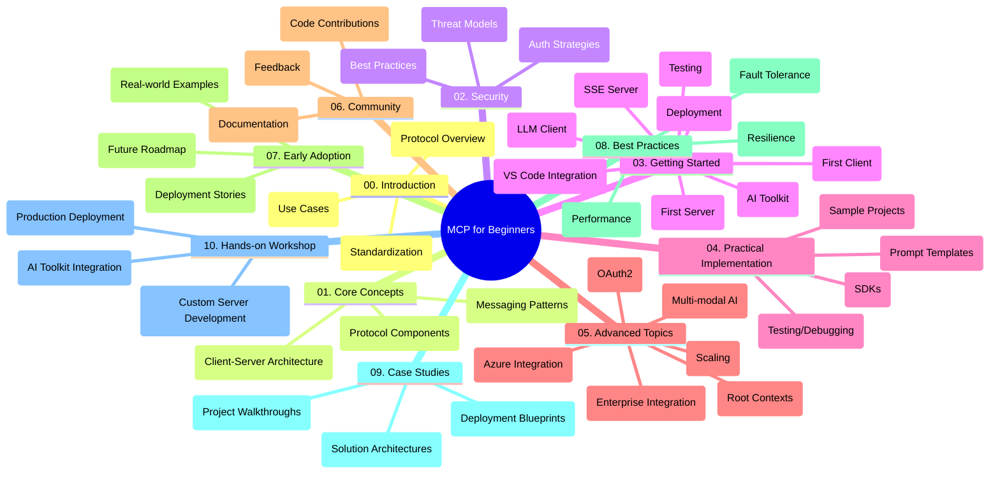

<!--
CO_OP_TRANSLATOR_METADATA:
{
  "original_hash": "a607d4febc94caee9a12b77795f7fc9a",
  "translation_date": "2025-06-11T16:45:06+00:00",
  "source_file": "study_guide.md",
  "language_code": "sv"
}
-->
# Model Context Protocol (MCP) för nybörjare - Studieguide

Denna studieguide ger en översikt över strukturen och innehållet i repot för kursen "Model Context Protocol (MCP) för nybörjare". Använd guiden för att navigera i repot effektivt och få ut det mesta av de tillgängliga resurserna.

## Översikt av repot

Model Context Protocol (MCP) är en standardiserad ram för interaktioner mellan AI-modeller och klientapplikationer. Detta repo erbjuder en heltäckande kurs med praktiska kodexempel i C#, Java, JavaScript, Python och TypeScript, riktad till AI-utvecklare, systemarkitekter och mjukvaruingenjörer.

## Visuell kurskarta

## Repos struktur

Repot är organiserat i tio huvudsektioner, där varje sektion fokuserar på olika aspekter av MCP:

1. **Introduction (00-Introduction/)**
   - Översikt av Model Context Protocol
   - Varför standardisering är viktigt i AI-pipelines
   - Praktiska användningsfall och fördelar

2. **Core Concepts (01-CoreConcepts/)**
   - Klient-serverarkitektur
   - Viktiga protokollkomponenter
   - Meddelandemönster i MCP

3. **Security (02-Security/)**
   - Säkerhetshot i MCP-baserade system
   - Bästa praxis för säker implementation
   - Autentisering och auktoriseringsstrategier

4. **Getting Started (03-GettingStarted/)**
   - Miljöinställning och konfiguration
   - Skapa grundläggande MCP-servrar och klienter
   - Integration med befintliga applikationer
   - Underavsnitt för första servern, första klienten, LLM-klient, VS Code-integration, SSE-server, AI Toolkit, testning och distribution

5. **Practical Implementation (04-PracticalImplementation/)**
   - Använda SDK:er i olika programmeringsspråk
   - Felsökning, testning och valideringstekniker
   - Skapa återanvändbara promptmallar och arbetsflöden
   - Exempelprojekt med implementationsexempel

6. **Advanced Topics (05-AdvancedTopics/)**
   - Multimodala AI-arbetsflöden och utbyggbarhet
   - Säker skalningsstrategi
   - MCP i företagsmiljöer
   - Specialämnen inklusive Azure-integration, multimodalitet, OAuth2, root contexts, routing, sampling, skalning, säkerhet, webb-sökintegration och streaming.

7. **Community Contributions (06-CommunityContributions/)**
   - Hur man bidrar med kod och dokumentation
   - Samarbeta via GitHub
   - Communitydrivna förbättringar och feedback

8. **Lessons from Early Adoption (07-LessonsfromEarlyAdoption/)**
   - Verkliga implementationer och framgångshistorier
   - Bygga och distribuera MCP-baserade lösningar
   - Trender och framtida färdplan

9. **Best Practices (08-BestPractices/)**
   - Prestandaoptimering och finjustering
   - Design av fel-toleranta MCP-system
   - Testning och robusthetsstrategier

10. **Case Studies (09-CaseStudy/)**
    - Djupdykningar i MCP-lösningsarkitekturer
    - Distributionsplaner och integrationstips
    - Annoterade diagram och projektgenomgångar

11. **Hands-on Workshop (10-StreamliningAIWorkflowsBuildingAnMCPServerWithAIToolkit/)**
    - Omfattande praktisk workshop som kombinerar MCP med Microsofts AI Toolkit för VS Code
    - Bygga intelligenta applikationer som kopplar AI-modeller till verkliga verktyg
    - Praktiska moduler som täcker grunder, egen serverutveckling och produktionsdistributionsstrategier

## Exempelprojekt

Repot innehåller flera exempelprojekt som visar MCP-implementation i olika programmeringsspråk:

### Grundläggande MCP-kalkylatorexempel
- C# MCP Server Example
- Java MCP Calculator
- JavaScript MCP Demo
- Python MCP Server
- TypeScript MCP Example

### Avancerade MCP-kalkylatorprojekt
- Advanced C# Sample
- Java Container App Example
- JavaScript Advanced Sample
- Python Complex Implementation
- TypeScript Container Sample

## Ytterligare resurser

Repot innehåller stödresurser:

- **Images folder**: Innehåller diagram och illustrationer som används i hela kursen
- **Translations**: Flerspråkigt stöd med automatiska översättningar av dokumentation
- **Official MCP Resources**:
  - [MCP Documentation](https://modelcontextprotocol.io/)
  - [MCP Specification](https://spec.modelcontextprotocol.io/)
  - [MCP GitHub Repository](https://github.com/modelcontextprotocol)

## Hur man använder detta repo

1. **Sekventiellt lärande**: Följ kapitlen i ordning (00 till 10) för en strukturerad inlärningsupplevelse.
2. **Språkspecifikt fokus**: Om du är intresserad av ett särskilt programmeringsspråk, utforska exemplen i respektive språkmappar.
3. **Praktisk implementation**: Börja med avsnittet "Getting Started" för att ställa in din miljö och skapa din första MCP-server och klient.
4. **Avancerad utforskning**: När du känner dig bekväm med grunderna, fördjupa dig i avancerade ämnen för att bredda din kunskap.
5. **Community-engagemang**: Gå med i [Azure AI Foundry Discord](https://discord.com/invite/ByRwuEEgH4) för att koppla ihop med experter och andra utvecklare.

## Bidra

Detta repo välkomnar bidrag från communityn. Se avsnittet Community Contributions för vägledning om hur du kan bidra.

---

*Denna studieguide skapades den 11 juni 2025 och ger en översikt över repot vid det datumet. Innehållet i repot kan ha uppdaterats sedan dess.*

**Ansvarsfriskrivning**:  
Detta dokument har översatts med hjälp av AI-översättningstjänsten [Co-op Translator](https://github.com/Azure/co-op-translator). Även om vi strävar efter noggrannhet, vänligen observera att automatiska översättningar kan innehålla fel eller brister. Det ursprungliga dokumentet på dess modersmål bör betraktas som den auktoritativa källan. För kritisk information rekommenderas professionell mänsklig översättning. Vi ansvarar inte för eventuella missförstånd eller feltolkningar som uppstår vid användning av denna översättning.