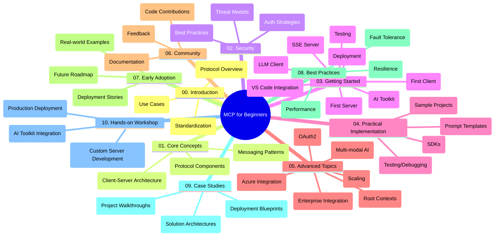

<!--
CO_OP_TRANSLATOR_METADATA:
{
  "original_hash": "a607d4febc94caee9a12b77795f7fc9a",
  "translation_date": "2025-07-13T15:15:04+00:00",
  "source_file": "study_guide.md",
  "language_code": "sv"
}
-->
# Model Context Protocol (MCP) för nybörjare - Studieguid

Denna studieguid ger en översikt över repository-strukturen och innehållet för kursen "Model Context Protocol (MCP) för nybörjare". Använd denna guide för att navigera i repositoryt effektivt och få ut det mesta av de tillgängliga resurserna.

## Översikt av repositoryt

Model Context Protocol (MCP) är ett standardiserat ramverk för interaktioner mellan AI-modeller och klientapplikationer. Detta repository erbjuder en omfattande kurs med praktiska kodexempel i C#, Java, JavaScript, Python och TypeScript, utformad för AI-utvecklare, systemarkitekter och mjukvaruingenjörer.

## Visuell kursöversikt

## Repositorystruktur

Repositoryt är organiserat i tio huvudsektioner, där varje fokuserar på olika aspekter av MCP:

1. **Introduktion (00-Introduction/)**
   - Översikt av Model Context Protocol
   - Varför standardisering är viktigt i AI-pipelines
   - Praktiska användningsfall och fördelar

2. **Kärnkoncept (01-CoreConcepts/)**
   - Klient-server-arkitektur
   - Viktiga protokollkomponenter
   - Meddelandemönster i MCP

3. **Säkerhet (02-Security/)**
   - Säkerhetshot i MCP-baserade system
   - Bästa praxis för att säkra implementationer
   - Autentiserings- och auktoriseringsstrategier

4. **Kom igång (03-GettingStarted/)**
   - Miljöuppsättning och konfiguration
   - Skapa grundläggande MCP-servrar och klienter
   - Integration med befintliga applikationer
   - Underavsnitt för första server, första klient, LLM-klient, VS Code-integration, SSE-server, AI Toolkit, testning och distribution

5. **Praktisk implementation (04-PracticalImplementation/)**
   - Använda SDK:er i olika programmeringsspråk
   - Felsökning, testning och valideringstekniker
   - Skapa återanvändbara promptmallar och arbetsflöden
   - Exempelprojekt med implementationsexempel

6. **Avancerade ämnen (05-AdvancedTopics/)**
   - Multimodala AI-arbetsflöden och utbyggbarhet
   - Säker skalningsstrategi
   - MCP i företagsmiljöer
   - Specialämnen inklusive Azure-integration, multimodalitet, OAuth2, root contexts, routing, sampling, skalning, säkerhet, webbsökintegration och streaming.

7. **Community-bidrag (06-CommunityContributions/)**
   - Hur man bidrar med kod och dokumentation
   - Samarbete via GitHub
   - Community-drivna förbättringar och feedback

8. **Lärdomar från tidig adoption (07-LessonsfromEarlyAdoption/)**
   - Verkliga implementationer och framgångshistorier
   - Bygga och distribuera MCP-baserade lösningar
   - Trender och framtida färdplan

9. **Bästa praxis (08-BestPractices/)**
   - Prestandaoptimering och tuning
   - Design av fel-toleranta MCP-system
   - Testning och robusthetsstrategier

10. **Fallstudier (09-CaseStudy/)**
    - Djupdykningar i MCP-lösningsarkitekturer
    - Distributionsplaner och integrationstips
    - Annoterade diagram och projektgenomgångar

11. **Praktisk workshop (10-StreamliningAIWorkflowsBuildingAnMCPServerWithAIToolkit/)**
    - Omfattande praktisk workshop som kombinerar MCP med Microsofts AI Toolkit för VS Code
    - Bygga intelligenta applikationer som kopplar AI-modeller till verkliga verktyg
    - Praktiska moduler som täcker grunder, egen serverutveckling och produktionsdistributionsstrategier

## Exempelprojekt

Repositoryt innehåller flera exempelprojekt som visar MCP-implementation i olika programmeringsspråk:

### Grundläggande MCP-kalkylatorexempel
- C# MCP-serverexempel
- Java MCP-kalkylator
- JavaScript MCP-demo
- Python MCP-server
- TypeScript MCP-exempel

### Avancerade MCP-kalkylatorprojekt
- Avancerat C#-exempel
- Java containerapp-exempel
- JavaScript avancerat exempel
- Python komplex implementation
- TypeScript containerexempel

## Ytterligare resurser

Repositoryt innehåller stödresurser:

- **Images-mapp**: Innehåller diagram och illustrationer som används i kursen
- **Översättningar**: Flerspråkigt stöd med automatiska översättningar av dokumentationen
- **Officiella MCP-resurser**:
  - [MCP Documentation](https://modelcontextprotocol.io/)
  - [MCP Specification](https://spec.modelcontextprotocol.io/)
  - [MCP GitHub Repository](https://github.com/modelcontextprotocol)

## Hur man använder detta repository

1. **Sekventiellt lärande**: Följ kapitlen i ordning (00 till 10) för en strukturerad inlärningsupplevelse.
2. **Språkspecifik fokus**: Om du är intresserad av ett särskilt programmeringsspråk, utforska mappstrukturerna med exempel för implementationer i ditt föredragna språk.
3. **Praktisk implementation**: Börja med avsnittet "Kom igång" för att sätta upp din miljö och skapa din första MCP-server och klient.
4. **Avancerad utforskning**: När du känner dig bekväm med grunderna, fördjupa dig i de avancerade ämnena för att bredda din kunskap.
5. **Community-engagemang**: Gå med i [Azure AI Foundry Discord](https://discord.com/invite/ByRwuEEgH4) för att knyta kontakter med experter och andra utvecklare.

## Bidra

Detta repository välkomnar bidrag från communityn. Se avsnittet Community Contributions för vägledning om hur du kan bidra.

---

*Denna studieguid skapades den 11 juni 2025 och ger en översikt över repositoryt från och med det datumet. Innehållet i repositoryt kan ha uppdaterats sedan dess.*

**Ansvarsfriskrivning**:  
Detta dokument har översatts med hjälp av AI-översättningstjänsten [Co-op Translator](https://github.com/Azure/co-op-translator). Även om vi strävar efter noggrannhet, vänligen observera att automatiska översättningar kan innehålla fel eller brister. Det ursprungliga dokumentet på dess modersmål bör betraktas som den auktoritativa källan. För kritisk information rekommenderas professionell mänsklig översättning. Vi ansvarar inte för eventuella missförstånd eller feltolkningar som uppstår vid användning av denna översättning.