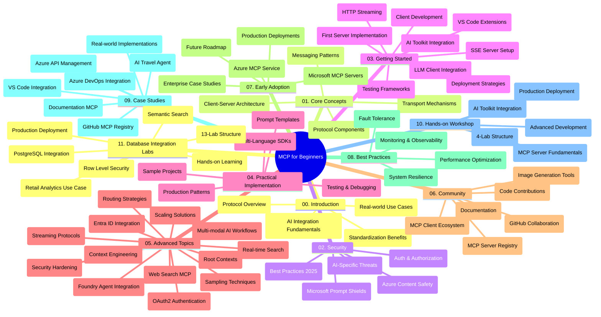

<!--
CO_OP_TRANSLATOR_METADATA:
{
  "original_hash": "aa1ce97bc694b08faf3018bab6d275b9",
  "translation_date": "2025-09-30T17:46:33+00:00",
  "source_file": "study_guide.md",
  "language_code": "sv"
}
-->
# Model Context Protocol (MCP) för Nybörjare - Studievägledning

Denna studievägledning ger en översikt över struktur och innehåll i "Model Context Protocol (MCP) för Nybörjare"-curriculum. Använd denna guide för att navigera i repositoryn effektivt och dra nytta av de tillgängliga resurserna.

## Repositoryöversikt

Model Context Protocol (MCP) är ett standardiserat ramverk för interaktioner mellan AI-modeller och klientapplikationer. Ursprungligen skapat av Anthropic, MCP underhålls nu av den bredare MCP-communityn via den officiella GitHub-organisationen. Denna repository erbjuder en omfattande curriculum med praktiska kodexempel i C#, Java, JavaScript, Python och TypeScript, utformad för AI-utvecklare, systemarkitekter och mjukvaruingenjörer.

## Visuell Curriculumkarta

## Repositorystruktur

Repositoryn är organiserad i elva huvudsektioner, var och en fokuserad på olika aspekter av MCP:

1. **Introduktion (00-Introduction/)**
   - Översikt över Model Context Protocol
   - Varför standardisering är viktigt i AI-pipelines
   - Praktiska användningsområden och fördelar

2. **Kärnkoncept (01-CoreConcepts/)**
   - Klient-server-arkitektur
   - Viktiga protokollkomponenter
   - Meddelandemönster i MCP

3. **Säkerhet (02-Security/)**
   - Säkerhetshot i MCP-baserade system
   - Bästa praxis för att säkra implementationer
   - Strategier för autentisering och auktorisering
   - **Omfattande säkerhetsdokumentation**:
     - MCP Security Best Practices 2025
     - Azure Content Safety Implementation Guide
     - MCP Security Controls and Techniques
     - MCP Best Practices Quick Reference
   - **Viktiga säkerhetsämnen**:
     - Prompt injection och verktygsförgiftning
     - Sessionskapning och förvirrade proxyproblem
     - Token-passthrough-sårbarheter
     - Överdrivna behörigheter och åtkomstkontroll
     - Leverantörskedjesäkerhet för AI-komponenter
     - Microsoft Prompt Shields-integration

4. **Komma igång (03-GettingStarted/)**
   - Miljöinställning och konfiguration
   - Skapa grundläggande MCP-servrar och klienter
   - Integration med befintliga applikationer
   - Innehåller sektioner för:
     - Första serverimplementationen
     - Klientutveckling
     - LLM-klientintegration
     - VS Code-integration
     - Server-Sent Events (SSE)-server
     - HTTP-streaming
     - AI Toolkit-integration
     - Teststrategier
     - Implementeringsriktlinjer

5. **Praktisk implementation (04-PracticalImplementation/)**
   - Använda SDK:er i olika programmeringsspråk
   - Debugging, testning och valideringstekniker
   - Skapa återanvändbara promptmallar och arbetsflöden
   - Exempelprojekt med implementationsdetaljer

6. **Avancerade ämnen (05-AdvancedTopics/)**
   - Tekniker för kontextingenjörskonst
   - Foundry-agentintegration
   - Multimodala AI-arbetsflöden
   - OAuth2-autentiseringsdemonstrationer
   - Realtidssökning
   - Realtidsstreaming
   - Implementering av root contexts
   - Routingstrategier
   - Samplingtekniker
   - Skalningsmetoder
   - Säkerhetsöverväganden
   - Entra ID-säkerhetsintegration
   - Webbsökningsintegration

7. **Communitybidrag (06-CommunityContributions/)**
   - Hur man bidrar med kod och dokumentation
   - Samarbeta via GitHub
   - Community-drivna förbättringar och feedback
   - Använda olika MCP-klienter (Claude Desktop, Cline, VSCode)
   - Arbeta med populära MCP-servrar inklusive bildgenerering

8. **Lärdomar från tidig adoption (07-LessonsfromEarlyAdoption/)**
   - Implementeringar och framgångshistorier från verkligheten
   - Bygga och distribuera MCP-baserade lösningar
   - Trender och framtida roadmap
   - **Microsoft MCP Servers Guide**: Omfattande guide till 10 produktionsklara Microsoft MCP-servrar inklusive:
     - Microsoft Learn Docs MCP Server
     - Azure MCP Server (15+ specialiserade connectors)
     - GitHub MCP Server
     - Azure DevOps MCP Server
     - MarkItDown MCP Server
     - SQL Server MCP Server
     - Playwright MCP Server
     - Dev Box MCP Server
     - Azure AI Foundry MCP Server
     - Microsoft 365 Agents Toolkit MCP Server

9. **Bästa praxis (08-BestPractices/)**
   - Prestandajustering och optimering
   - Designa fel-toleranta MCP-system
   - Test- och motståndsstrategier

10. **Fallstudier (09-CaseStudy/)**
    - **Sju omfattande fallstudier** som visar MCP:s mångsidighet i olika scenarier:
    - **Azure AI Travel Agents**: Multi-agent orkestrering med Azure OpenAI och AI Search
    - **Azure DevOps Integration**: Automatisering av arbetsflöden med YouTube-datauppdateringar
    - **Realtidsdokumentationshämtning**: Python-konsolklient med HTTP-streaming
    - **Interaktiv studieplansgenerator**: Chainlit-webbapp med konversations-AI
    - **Dokumentation i editor**: VS Code-integration med GitHub Copilot-arbetsflöden
    - **Azure API Management**: Företagsintegration med MCP-server
    - **GitHub MCP Registry**: Ekosystemutveckling och agentisk integrationsplattform
    - Implementeringsexempel som sträcker sig över företagsintegration, utvecklarproduktivitet och ekosystemutveckling

11. **Praktisk workshop (10-StreamliningAIWorkflowsBuildingAnMCPServerWithAIToolkit/)**
    - Omfattande praktisk workshop som kombinerar MCP med AI Toolkit
    - Bygga intelligenta applikationer som kopplar AI-modeller med verkliga verktyg
    - Praktiska moduler som täcker grunderna, utveckling av anpassade servrar och produktionsimplementeringsstrategier
    - **Labstruktur**:
      - Lab 1: MCP Server Fundamentals
      - Lab 2: Advanced MCP Server Development
      - Lab 3: AI Toolkit Integration
      - Lab 4: Production Deployment and Scaling
    - Lab-baserat lärande med steg-för-steg-instruktioner

12. **MCP Server Database Integration Labs (11-MCPServerHandsOnLabs/)**
    - **Omfattande 13-labs lärandebana** för att bygga produktionsklara MCP-servrar med PostgreSQL-integration
    - **Implementering av detaljhandelsanalys från verkligheten** med Zava Retail-användningsfall
    - **Mönster på företagsnivå** inklusive Row Level Security (RLS), semantisk sökning och multi-tenant dataåtkomst
    - **Komplett labstruktur**:
      - **Labs 00-03: Grunder** - Introduktion, Arkitektur, Säkerhet, Miljöinställning
      - **Labs 04-06: Bygga MCP-servern** - Databasedesign, MCP-serverimplementation, Verktygsutveckling
      - **Labs 07-09: Avancerade funktioner** - Semantisk sökning, Testning & Debugging, VS Code-integration
      - **Labs 10-12: Produktion & bästa praxis** - Implementering, Övervakning, Optimering
    - **Teknologier som täcks**: FastMCP-ramverk, PostgreSQL, Azure OpenAI, Azure Container Apps, Application Insights
    - **Lärandemål**: Produktionsklara MCP-servrar, databasintegrationsmönster, AI-driven analys, företagsäkerhet

## Ytterligare resurser

Repositoryn innehåller stödjande resurser:

- **Bilder-mapp**: Innehåller diagram och illustrationer som används i hela curriculumet
- **Översättningar**: Flerspråkigt stöd med automatiserade översättningar av dokumentation
- **Officiella MCP-resurser**:
  - [MCP Dokumentation](https://modelcontextprotocol.io/)
  - [MCP Specifikation](https://spec.modelcontextprotocol.io/)
  - [MCP GitHub Repository](https://github.com/modelcontextprotocol)

## Hur man använder denna repository

1. **Sekventiellt lärande**: Följ kapitlen i ordning (00 till 11) för en strukturerad lärandeupplevelse.
2. **Språkspecifik fokus**: Om du är intresserad av ett specifikt programmeringsspråk, utforska samples-mapparna för implementationer i ditt föredragna språk.
3. **Praktisk implementation**: Börja med sektionen "Komma igång" för att ställa in din miljö och skapa din första MCP-server och klient.
4. **Avancerad utforskning**: När du är bekväm med grunderna, fördjupa dig i de avancerade ämnena för att utöka din kunskap.
5. **Communityengagemang**: Gå med i MCP-communityn via GitHub-diskussioner och Discord-kanaler för att ansluta till experter och andra utvecklare.

## MCP-klienter och verktyg

Curriculumet täcker olika MCP-klienter och verktyg:

1. **Officiella klienter**:
   - Visual Studio Code 
   - MCP i Visual Studio Code
   - Claude Desktop
   - Claude i VSCode 
   - Claude API

2. **Communityklienter**:
   - Cline (terminalbaserad)
   - Cursor (kodredigerare)
   - ChatMCP
   - Windsurf

3. **MCP-hanteringsverktyg**:
   - MCP CLI
   - MCP Manager
   - MCP Linker
   - MCP Router

## Populära MCP-servrar

Repositoryn introducerar olika MCP-servrar, inklusive:

1. **Officiella Microsoft MCP-servrar**:
   - Microsoft Learn Docs MCP Server
   - Azure MCP Server (15+ specialiserade connectors)
   - GitHub MCP Server
   - Azure DevOps MCP Server
   - MarkItDown MCP Server
   - SQL Server MCP Server
   - Playwright MCP Server
   - Dev Box MCP Server
   - Azure AI Foundry MCP Server
   - Microsoft 365 Agents Toolkit MCP Server

2. **Officiella referensservrar**:
   - Filesystem
   - Fetch
   - Memory
   - Sequential Thinking

3. **Bildgenerering**:
   - Azure OpenAI DALL-E 3
   - Stable Diffusion WebUI
   - Replicate

4. **Utvecklingsverktyg**:
   - Git MCP
   - Terminal Control
   - Code Assistant

5. **Specialiserade servrar**:
   - Salesforce
   - Microsoft Teams
   - Jira & Confluence

## Bidra

Denna repository välkomnar bidrag från communityn. Se sektionen Communitybidrag för vägledning om hur du effektivt kan bidra till MCP-ekosystemet.

## Ändringslogg

| Datum | Ändringar |
|------|---------||
| 29 september 2025 | - Lade till sektionen 11-MCPServerHandsOnLabs med omfattande 13-labs lärandebana för databasintegration - Uppdaterade Visuell Curriculumkarta för att inkludera Database Integration Labs - Förbättrade repositorystruktur för att reflektera elva huvudsektioner - Lade till detaljerad beskrivning av PostgreSQL-integration, detaljhandelsanalysanvändningsfall och företagsmönster - Uppdaterade navigeringsvägledning för att inkludera sektionerna 00-11 |
| 26 september 2025 | - Lade till GitHub MCP Registry-fallstudie till sektionen 09-CaseStudy - Uppdaterade Fallstudier för att reflektera sju omfattande fallstudier - Förbättrade fallstudiebeskrivningar med specifika implementationsdetaljer - Uppdaterade Visuell Curriculumkarta för att inkludera GitHub MCP Registry - Reviderade studievägledningsstruktur för att reflektera ekosystemutvecklingsfokus |
| 18 juli 2025 | - Uppdaterade repositorystruktur för att inkludera Microsoft MCP Servers Guide - Lade till omfattande lista över 10 produktionsklara Microsoft MCP-servrar - Förbättrade sektionen Populära MCP-servrar med Officiella Microsoft MCP-servrar - Uppdaterade sektionen Fallstudier med faktiska fil-exempel - Lade till Labstrukturdetaljer för Praktisk Workshop |
| 16 juli 2025 | - Uppdaterade repositorystruktur för att reflektera aktuellt innehåll - Lade till sektionen MCP-klienter och verktyg - Lade till sektionen Populära MCP-servrar - Uppdaterade Visuell Curriculumkarta med alla aktuella ämnen - Förbättrade sektionen Avancerade ämnen med alla specialiserade områden - Uppdaterade Fallstudier för att reflektera faktiska exempel - Klargjorde MCP:s ursprung som skapat av Anthropic |
| 11 juni 2025 | - Initial skapelse av studievägledningen - Lade till Visuell Curriculumkarta - Skisserade repositorystruktur - Inkluderade exempelprojekt och ytterligare resurser |

---

*Denna studievägledning uppdaterades den 29 september 2025 och ger en översikt över repositoryn per detta datum. Repositoryns innehåll kan uppdateras efter detta datum.*

---

**Ansvarsfriskrivning**:  
Detta dokument har översatts med hjälp av AI-översättningstjänsten [Co-op Translator](https://github.com/Azure/co-op-translator). Även om vi strävar efter noggrannhet, bör det noteras att automatiserade översättningar kan innehålla fel eller felaktigheter. Det ursprungliga dokumentet på dess originalspråk bör betraktas som den auktoritativa källan. För kritisk information rekommenderas professionell mänsklig översättning. Vi ansvarar inte för eventuella missförstånd eller feltolkningar som uppstår vid användning av denna översättning.