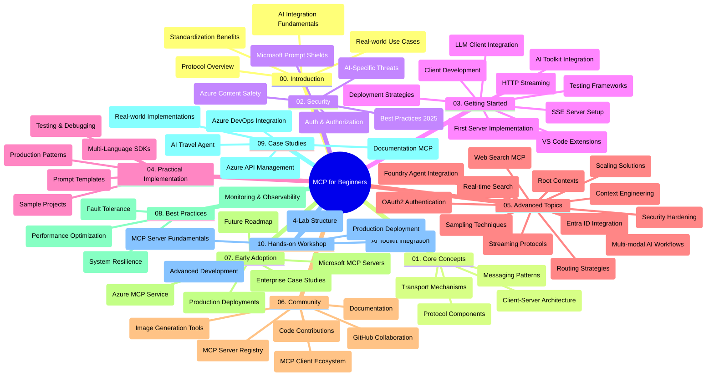

<!--
CO_OP_TRANSLATOR_METADATA:
{
  "original_hash": "e2c6ed897fa98fa08e0146101776c7ff",
  "translation_date": "2025-07-18T09:56:17+00:00",
  "source_file": "study_guide.md",
  "language_code": "sv"
}
-->
# Model Context Protocol (MCP) för nybörjare – Studieguid

Denna studieguid ger en översikt över repository-strukturen och innehållet för kursplanen "Model Context Protocol (MCP) för nybörjare". Använd denna guide för att navigera i repositoryt effektivt och få ut det mesta av de tillgängliga resurserna.

## Översikt av repositoryt

Model Context Protocol (MCP) är ett standardiserat ramverk för interaktioner mellan AI-modeller och klientapplikationer. Ursprungligen skapat av Anthropic, underhålls MCP nu av den bredare MCP-gemenskapen via den officiella GitHub-organisationen. Detta repository erbjuder en omfattande kursplan med praktiska kodexempel i C#, Java, JavaScript, Python och TypeScript, utformad för AI-utvecklare, systemarkitekter och mjukvaruingenjörer.

## Visuell kurskarta

## Repositorystruktur

Repositoryt är organiserat i tio huvudsektioner, där varje fokuserar på olika aspekter av MCP:

1. **Introduktion (00-Introduction/)**
   - Översikt av Model Context Protocol
   - Varför standardisering är viktigt i AI-pipelines
   - Praktiska användningsfall och fördelar

2. **Kärnkoncept (01-CoreConcepts/)**
   - Klient-server-arkitektur
   - Viktiga protokollkomponenter
   - Meddelandemönster i MCP

3. **Säkerhet (02-Security/)**
   - Säkerhetshot i MCP-baserade system
   - Bästa praxis för säkra implementationer
   - Autentiserings- och auktoriseringsstrategier
   - **Omfattande säkerhetsdokumentation**:
     - MCP Security Best Practices 2025
     - Azure Content Safety Implementation Guide
     - MCP Security Controls and Techniques
     - MCP Best Practices Quick Reference
   - **Viktiga säkerhetsämnen**:
     - Prompt injection och tool poisoning-attacker
     - Session hijacking och confused deputy-problem
     - Token passthrough-sårbarheter
     - Överdrivna behörigheter och åtkomstkontroll
     - Supply chain-säkerhet för AI-komponenter
     - Microsoft Prompt Shields-integration

4. **Kom igång (03-GettingStarted/)**
   - Miljöuppsättning och konfiguration
   - Skapa grundläggande MCP-servrar och klienter
   - Integration med befintliga applikationer
   - Innehåller avsnitt för:
     - Första serverimplementationen
     - Klientutveckling
     - LLM-klientintegration
     - VS Code-integration
     - Server-Sent Events (SSE) server
     - HTTP-streaming
     - AI Toolkit-integration
     - Teststrategier
     - Driftsättningsriktlinjer

5. **Praktisk implementation (04-PracticalImplementation/)**
   - Använda SDK:er i olika programmeringsspråk
   - Felsökning, testning och valideringstekniker
   - Skapa återanvändbara promptmallar och arbetsflöden
   - Exempelprojekt med implementationsexempel

6. **Avancerade ämnen (05-AdvancedTopics/)**
   - Context engineering-tekniker
   - Foundry agent-integration
   - Multimodala AI-arbetsflöden
   - OAuth2-autentiseringsdemo
   - Realtidssökfunktioner
   - Realtidsstreaming
   - Root contexts-implementation
   - Routingstrategier
   - Sampling-tekniker
   - Skalningsmetoder
   - Säkerhetsaspekter
   - Entra ID-säkerhetsintegration
   - Webbsökintegration

7. **Communitybidrag (06-CommunityContributions/)**
   - Hur man bidrar med kod och dokumentation
   - Samarbete via GitHub
   - Communitydrivna förbättringar och feedback
   - Använda olika MCP-klienter (Claude Desktop, Cline, VSCode)
   - Arbeta med populära MCP-servrar inklusive bildgenerering

8. **Lärdomar från tidig adoption (07-LessonsfromEarlyAdoption/)**
   - Verkliga implementationer och framgångshistorier
   - Bygga och driftsätta MCP-baserade lösningar
   - Trender och framtida färdplan
   - **Microsoft MCP Servers Guide**: Omfattande guide till 10 produktionsklara Microsoft MCP-servrar inklusive:
     - Microsoft Learn Docs MCP Server
     - Azure MCP Server (15+ specialiserade connectors)
     - GitHub MCP Server
     - Azure DevOps MCP Server
     - MarkItDown MCP Server
     - SQL Server MCP Server
     - Playwright MCP Server
     - Dev Box MCP Server
     - Azure AI Foundry MCP Server
     - Microsoft 365 Agents Toolkit MCP Server

9. **Bästa praxis (08-BestPractices/)**
   - Prestandaoptimering och tuning
   - Design av fel-toleranta MCP-system
   - Test- och resiliensstrategier

10. **Fallstudier (09-CaseStudy/)**
    - Exempel på integration med Azure API Management
    - Exempel på resebyråimplementation
    - Azure DevOps-integration med YouTube-uppdateringar
    - Dokumentations-MCP-implementationsexempel
    - Implementationsexempel med detaljerad dokumentation

11. **Praktisk workshop (10-StreamliningAIWorkflowsBuildingAnMCPServerWithAIToolkit/)**
    - Omfattande praktisk workshop som kombinerar MCP med AI Toolkit
    - Bygga intelligenta applikationer som kopplar AI-modeller till verkliga verktyg
    - Praktiska moduler som täcker grunder, anpassad serverutveckling och produktionsdriftsättningsstrategier
    - **Labstruktur**:
      - Lab 1: MCP Server Fundamentals
      - Lab 2: Advanced MCP Server Development
      - Lab 3: AI Toolkit Integration
      - Lab 4: Production Deployment and Scaling
    - Lab-baserad inlärningsmetod med steg-för-steg-instruktioner

## Ytterligare resurser

Repositoryt innehåller stödresurser:

- **Images-mapp**: Innehåller diagram och illustrationer som används i kursplanen
- **Översättningar**: Flerspråkigt stöd med automatiska översättningar av dokumentationen
- **Officiella MCP-resurser**:
  - [MCP Documentation](https://modelcontextprotocol.io/)
  - [MCP Specification](https://spec.modelcontextprotocol.io/)
  - [MCP GitHub Repository](https://github.com/modelcontextprotocol)

## Hur man använder detta repository

1. **Sekventiellt lärande**: Följ kapitlen i ordning (00 till 10) för en strukturerad inlärningsupplevelse.
2. **Språkspecifikt fokus**: Om du är intresserad av ett särskilt programmeringsspråk, utforska mappstrukturerna med exempel för implementationer i ditt föredragna språk.
3. **Praktisk implementation**: Börja med avsnittet "Kom igång" för att sätta upp din miljö och skapa din första MCP-server och klient.
4. **Avancerad utforskning**: När du känner dig bekväm med grunderna, fördjupa dig i de avancerade ämnena för att bredda din kunskap.
5. **Community-engagemang**: Gå med i MCP-gemenskapen via GitHub-diskussioner och Discord-kanaler för att knyta kontakter med experter och andra utvecklare.

## MCP-klienter och verktyg

Kursplanen täcker olika MCP-klienter och verktyg:

1. **Officiella klienter**:
   - Visual Studio Code
   - MCP i Visual Studio Code
   - Claude Desktop
   - Claude i VSCode
   - Claude API

2. **Community-klienter**:
   - Cline (terminalbaserad)
   - Cursor (kodredigerare)
   - ChatMCP
   - Windsurf

3. **MCP-hanteringsverktyg**:
   - MCP CLI
   - MCP Manager
   - MCP Linker
   - MCP Router

## Populära MCP-servrar

Repositoryt presenterar olika MCP-servrar, inklusive:

1. **Officiella Microsoft MCP-servrar**:
   - Microsoft Learn Docs MCP Server
   - Azure MCP Server (15+ specialiserade connectors)
   - GitHub MCP Server
   - Azure DevOps MCP Server
   - MarkItDown MCP Server
   - SQL Server MCP Server
   - Playwright MCP Server
   - Dev Box MCP Server
   - Azure AI Foundry MCP Server
   - Microsoft 365 Agents Toolkit MCP Server

2. **Officiella referensservrar**:
   - Filesystem
   - Fetch
   - Memory
   - Sequential Thinking

3. **Bildgenerering**:
   - Azure OpenAI DALL-E 3
   - Stable Diffusion WebUI
   - Replicate

4. **Utvecklingsverktyg**:
   - Git MCP
   - Terminal Control
   - Code Assistant

5. **Specialiserade servrar**:
   - Salesforce
   - Microsoft Teams
   - Jira & Confluence

## Bidra

Detta repository välkomnar bidrag från communityn. Se avsnittet Community Contributions för vägledning om hur du effektivt kan bidra till MCP-ekosystemet.

## Ändringslogg

| Datum | Ändringar |
|-------|-----------|
| 18 juli 2025 | - Uppdaterad repositorystruktur för att inkludera Microsoft MCP Servers Guide - Lagt till omfattande lista med 10 produktionsklara Microsoft MCP-servrar - Förbättrad sektion Populära MCP-servrar med Officiella Microsoft MCP-servrar - Uppdaterad Fallstudier med faktiska fil-exempel - Lagt till Labstruktur för Praktisk workshop |
| 16 juli 2025 | - Uppdaterad repositorystruktur för att spegla aktuellt innehåll - Lagt till sektion MCP Clients and Tools - Lagt till sektion Populära MCP-servrar - Uppdaterad Visuell kurskarta med alla aktuella ämnen - Förbättrad Avancerade ämnen med alla specialområden - Uppdaterad Fallstudier med faktiska exempel - Klargjort MCP:s ursprung som skapat av Anthropic |
| 11 juni 2025 | - Initial skapelse av studieguiden - Lagt till Visuell kurskarta - Skisserad repositorystruktur - Inkluderade exempelprojekt och ytterligare resurser |

---

*Denna studieguid uppdaterades den 18 juli 2025 och ger en översikt över repositoryt per detta datum. Innehållet i repositoryt kan uppdateras efter detta datum.*

**Ansvarsfriskrivning**:  
Detta dokument har översatts med hjälp av AI-översättningstjänsten [Co-op Translator](https://github.com/Azure/co-op-translator). Även om vi strävar efter noggrannhet, vänligen observera att automatiska översättningar kan innehålla fel eller brister. Det ursprungliga dokumentet på dess modersmål bör betraktas som den auktoritativa källan. För kritisk information rekommenderas professionell mänsklig översättning. Vi ansvarar inte för några missförstånd eller feltolkningar som uppstår vid användning av denna översättning.