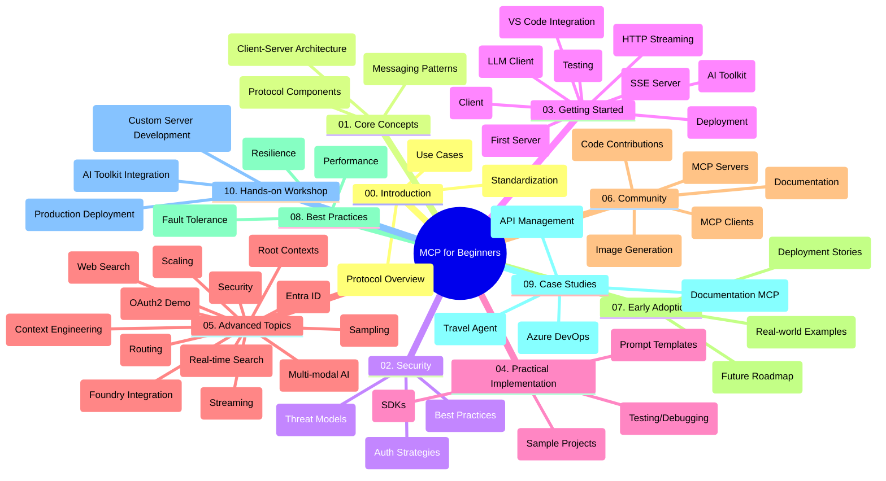

<!--
CO_OP_TRANSLATOR_METADATA:
{
  "original_hash": "5f321ea583cf087a94e47ee74c62b504",
  "translation_date": "2025-07-17T06:08:48+00:00",
  "source_file": "study_guide.md",
  "language_code": "sv"
}
-->
# Model Context Protocol (MCP) för nybörjare – Studieguidе

Denna studieguidе ger en översikt över repots struktur och innehåll för kursen "Model Context Protocol (MCP) för nybörjare". Använd guiden för att navigera i repot effektivt och få ut det mesta av de tillgängliga resurserna.

## Översikt av repot

Model Context Protocol (MCP) är ett standardiserat ramverk för interaktioner mellan AI-modeller och klientapplikationer. Ursprungligen skapat av Anthropic, underhålls MCP nu av den bredare MCP-gemenskapen via den officiella GitHub-organisationen. Detta repo erbjuder en omfattande kurs med praktiska kodexempel i C#, Java, JavaScript, Python och TypeScript, riktad till AI-utvecklare, systemarkitekter och mjukvaruingenjörer.

## Visuell kursöversikt

## Repos struktur

Repot är organiserat i tio huvudsektioner, där varje fokuserar på olika aspekter av MCP:

1. **Introduction (00-Introduction/)**
   - Översikt av Model Context Protocol
   - Varför standardisering är viktigt i AI-flöden
   - Praktiska användningsfall och fördelar

2. **Core Concepts (01-CoreConcepts/)**
   - Klient-server-arkitektur
   - Viktiga protokollkomponenter
   - Meddelandemönster i MCP

3. **Security (02-Security/)**
   - Säkerhetshot i MCP-baserade system
   - Bästa praxis för att säkra implementationer
   - Autentiserings- och auktoriseringsstrategier

4. **Getting Started (03-GettingStarted/)**
   - Miljöuppsättning och konfiguration
   - Skapa grundläggande MCP-servrar och klienter
   - Integration med befintliga applikationer
   - Innehåller avsnitt för:
     - Första serverimplementationen
     - Klientutveckling
     - LLM-klientintegration
     - VS Code-integration
     - Server-Sent Events (SSE) server
     - HTTP-streaming
     - AI Toolkit-integration
     - Teststrategier
     - Driftsättningsriktlinjer

5. **Practical Implementation (04-PracticalImplementation/)**
   - Använda SDK:er i olika programmeringsspråk
   - Felsökning, testning och valideringstekniker
   - Skapa återanvändbara promptmallar och arbetsflöden
   - Exempelprojekt med implementationsexempel

6. **Advanced Topics (05-AdvancedTopics/)**
   - Tekniker för kontextdesign
   - Foundry-agentintegration
   - Multimodala AI-arbetsflöden
   - OAuth2-autentiseringsdemonstrationer
   - Realtidssökning
   - Realtidsstreaming
   - Implementation av root contexts
   - Routingstrategier
   - Samplingstekniker
   - Skalningsmetoder
   - Säkerhetsaspekter
   - Entra ID-säkerhetsintegration
   - Webb-sökintegration

7. **Community Contributions (06-CommunityContributions/)**
   - Hur man bidrar med kod och dokumentation
   - Samarbete via GitHub
   - Gemenskapsdrivna förbättringar och feedback
   - Använda olika MCP-klienter (Claude Desktop, Cline, VSCode)
   - Arbeta med populära MCP-servrar inklusive bildgenerering

8. **Lessons from Early Adoption (07-LessonsfromEarlyAdoption/)**
   - Verkliga implementationer och framgångshistorier
   - Bygga och driftsätta MCP-baserade lösningar
   - Trender och framtida färdplan

9. **Best Practices (08-BestPractices/)**
   - Prestandaoptimering och finjustering
   - Design av fel-toleranta MCP-system
   - Test- och robusthetsstrategier

10. **Case Studies (09-CaseStudy/)**
    - Fallstudie: Azure API Management-integration
    - Fallstudie: Resebyråimplementation
    - Fallstudie: Azure DevOps-integration med YouTube
    - Implementationsexempel med detaljerad dokumentation

11. **Hands-on Workshop (10-StreamliningAIWorkflowsBuildingAnMCPServerWithAIToolkit/)**
    - Omfattande praktisk workshop som kombinerar MCP med AI Toolkit
    - Bygga intelligenta applikationer som kopplar AI-modeller till verkliga verktyg
    - Praktiska moduler som täcker grunder, egen serverutveckling och produktionsdriftsättning
    - Lab-baserad inlärningsmetod med steg-för-steg-instruktioner

## Ytterligare resurser

Repot innehåller stödresurser:

- **Images-mapp**: Innehåller diagram och illustrationer som används i kursen
- **Översättningar**: Flerspråkigt stöd med automatiska översättningar av dokumentationen
- **Officiella MCP-resurser**:
  - [MCP Documentation](https://modelcontextprotocol.io/)
  - [MCP Specification](https://spec.modelcontextprotocol.io/)
  - [MCP GitHub Repository](https://github.com/modelcontextprotocol)

## Hur man använder detta repo

1. **Sekventiellt lärande**: Följ kapitlen i ordning (00 till 10) för en strukturerad inlärningsupplevelse.
2. **Språkspecifikt fokus**: Om du är intresserad av ett särskilt programmeringsspråk, utforska samples-katalogerna för implementationer i ditt favorit språk.
3. **Praktisk implementation**: Börja med avsnittet "Getting Started" för att sätta upp din miljö och skapa din första MCP-server och klient.
4. **Avancerad utforskning**: När du känner dig bekväm med grunderna, fördjupa dig i avancerade ämnen för att bredda din kunskap.
5. **Gemenskapsengagemang**: Gå med i MCP-gemenskapen via GitHub-diskussioner och Discord-kanaler för att knyta kontakter med experter och andra utvecklare.

## MCP-klienter och verktyg

Kursen täcker olika MCP-klienter och verktyg:

1. **Officiella klienter**:
   - Visual Studio Code
   - MCP i Visual Studio Code
   - Claude Desktop
   - Claude i VSCode
   - Claude API

2. **Gemenskapsklienter**:
   - Cline (terminalbaserad)
   - Cursor (kodredigerare)
   - ChatMCP
   - Windsurf

3. **MCP-hanteringsverktyg**:
   - MCP CLI
   - MCP Manager
   - MCP Linker
   - MCP Router

## Populära MCP-servrar

Repot presenterar olika MCP-servrar, inklusive:

1. **Officiella referensservrar**:
   - Filesystem
   - Fetch
   - Memory
   - Sequential Thinking

2. **Bildgenerering**:
   - Azure OpenAI DALL-E 3
   - Stable Diffusion WebUI
   - Replicate

3. **Utvecklingsverktyg**:
   - Git MCP
   - Terminal Control
   - Code Assistant

4. **Specialiserade servrar**:
   - Salesforce
   - Microsoft Teams
   - Jira & Confluence

## Bidra

Detta repo välkomnar bidrag från gemenskapen. Se avsnittet Community Contributions för vägledning om hur du effektivt kan bidra till MCP-ekosystemet.

## Ändringslogg

| Datum | Ändringar |
|-------|-----------|
| 16 juli 2025 | - Uppdaterad repos struktur för att spegla aktuellt innehåll - Tillagd sektion för MCP Clients and Tools - Tillagd sektion för Popular MCP Servers - Uppdaterad Visuell kursöversikt med alla aktuella ämnen - Förbättrad Advanced Topics-sektion med alla specialområden - Uppdaterade Case Studies med faktiska exempel - Klargjort MCP:s ursprung som skapat av Anthropic |
| 11 juni 2025 | - Initial skapelse av studieguiden - Tillagd Visuell kursöversikt - Skissad repos struktur - Inkluderade exempelprojekt och ytterligare resurser |

---

*Denna studieguidе uppdaterades den 16 juli 2025 och ger en översikt över repot per detta datum. Repo-innehållet kan ha uppdaterats efter detta datum.*

**Ansvarsfriskrivning**:  
Detta dokument har översatts med hjälp av AI-översättningstjänsten [Co-op Translator](https://github.com/Azure/co-op-translator). Även om vi strävar efter noggrannhet, vänligen observera att automatiska översättningar kan innehålla fel eller brister. Det ursprungliga dokumentet på dess modersmål bör betraktas som den auktoritativa källan. För kritisk information rekommenderas professionell mänsklig översättning. Vi ansvarar inte för några missförstånd eller feltolkningar som uppstår vid användning av denna översättning.