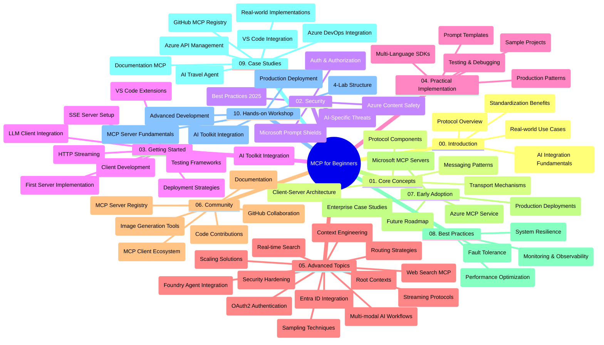

<!--
CO_OP_TRANSLATOR_METADATA:
{
  "original_hash": "719117a0a5f34ade7b5dfb61ee06fb13",
  "translation_date": "2025-09-26T18:31:29+00:00",
  "source_file": "study_guide.md",
  "language_code": "sv"
}
-->
# Model Context Protocol (MCP) för Nybörjare - Studievägledning

Denna studievägledning ger en översikt över struktur och innehåll i "Model Context Protocol (MCP) för Nybörjare"-läroplanen. Använd denna guide för att navigera i repositoryt effektivt och utnyttja de tillgängliga resurserna på bästa sätt.

## Repositoryöversikt

Model Context Protocol (MCP) är ett standardiserat ramverk för interaktioner mellan AI-modeller och klientapplikationer. Ursprungligen skapat av Anthropic, underhålls MCP nu av den bredare MCP-communityn via den officiella GitHub-organisationen. Detta repository erbjuder en omfattande läroplan med praktiska kodexempel i C#, Java, JavaScript, Python och TypeScript, utformad för AI-utvecklare, systemarkitekter och mjukvaruingenjörer.

## Visuell Läroplansöversikt

## Repositorystruktur

Repositoryt är organiserat i tio huvudsektioner, var och en med fokus på olika aspekter av MCP:

1. **Introduktion (00-Introduction/)**
   - Översikt över Model Context Protocol
   - Varför standardisering är viktigt i AI-pipelines
   - Praktiska användningsområden och fördelar

2. **Kärnkoncept (01-CoreConcepts/)**
   - Klient-server-arkitektur
   - Viktiga protokollkomponenter
   - Meddelandemönster i MCP

3. **Säkerhet (02-Security/)**
   - Säkerhetshot i MCP-baserade system
   - Bästa praxis för att säkra implementationer
   - Strategier för autentisering och auktorisering
   - **Omfattande Säkerhetsdokumentation**:
     - MCP Security Best Practices 2025
     - Azure Content Safety Implementation Guide
     - MCP Security Controls and Techniques
     - MCP Best Practices Quick Reference
   - **Viktiga Säkerhetsämnen**:
     - Prompt injection och verktygsförgiftning
     - Sessionkapning och confused deputy-problem
     - Token passthrough-sårbarheter
     - Överdrivna behörigheter och åtkomstkontroll
     - Leverantörskedjesäkerhet för AI-komponenter
     - Microsoft Prompt Shields-integration

4. **Komma igång (03-GettingStarted/)**
   - Miljöinställning och konfiguration
   - Skapa grundläggande MCP-servrar och klienter
   - Integration med befintliga applikationer
   - Innehåller avsnitt för:
     - Första serverimplementationen
     - Klientutveckling
     - LLM-klientintegration
     - VS Code-integration
     - Server-Sent Events (SSE)-server
     - HTTP-streaming
     - AI Toolkit-integration
     - Teststrategier
     - Implementeringsriktlinjer

5. **Praktisk Implementation (04-PracticalImplementation/)**
   - Användning av SDK:er i olika programmeringsspråk
   - Debugging, testning och valideringstekniker
   - Skapa återanvändbara promptmallar och arbetsflöden
   - Exempelprojekt med implementationsdetaljer

6. **Avancerade Ämnen (05-AdvancedTopics/)**
   - Tekniker för kontextdesign
   - Foundry-agentintegration
   - Multimodala AI-arbetsflöden
   - OAuth2-autentiseringsdemonstrationer
   - Realtidssökning
   - Realtidsstreaming
   - Implementering av root contexts
   - Routingstrategier
   - Samplingtekniker
   - Skalningsmetoder
   - Säkerhetsöverväganden
   - Entra ID-säkerhetsintegration
   - Webbsökningsintegration

7. **Communitybidrag (06-CommunityContributions/)**
   - Hur man bidrar med kod och dokumentation
   - Samarbeta via GitHub
   - Community-drivna förbättringar och feedback
   - Användning av olika MCP-klienter (Claude Desktop, Cline, VSCode)
   - Arbeta med populära MCP-servrar inklusive bildgenerering

8. **Lärdomar från Tidig Användning (07-LessonsfromEarlyAdoption/)**
   - Implementeringar och framgångshistorier från verkligheten
   - Bygga och implementera MCP-baserade lösningar
   - Trender och framtida vägkartor
   - **Microsoft MCP Servers Guide**: Omfattande guide till 10 produktionsklara Microsoft MCP-servrar inklusive:
     - Microsoft Learn Docs MCP Server
     - Azure MCP Server (15+ specialiserade anslutningar)
     - GitHub MCP Server
     - Azure DevOps MCP Server
     - MarkItDown MCP Server
     - SQL Server MCP Server
     - Playwright MCP Server
     - Dev Box MCP Server
     - Azure AI Foundry MCP Server
     - Microsoft 365 Agents Toolkit MCP Server

9. **Bästa Praxis (08-BestPractices/)**
   - Prestandajustering och optimering
   - Designa fel-toleranta MCP-system
   - Testning och motståndsstrategier

10. **Fallstudier (09-CaseStudy/)**
    - **Sju omfattande fallstudier** som visar MCP:s mångsidighet i olika scenarier:
    - **Azure AI Travel Agents**: Multi-agent orkestrering med Azure OpenAI och AI-sökning
    - **Azure DevOps Integration**: Automatisering av arbetsflöden med YouTube-datauppdateringar
    - **Realtidsdokumentationshämtning**: Python-konsolklient med HTTP-streaming
    - **Interaktiv Studieplansgenerator**: Chainlit-webbapp med konversations-AI
    - **Dokumentation i Editor**: VS Code-integration med GitHub Copilot-arbetsflöden
    - **Azure API Management**: Företagsintegration med MCP-serverutveckling
    - **GitHub MCP Registry**: Ekosystemutveckling och agentisk integrationsplattform
    - Implementeringsexempel som sträcker sig över företagsintegration, utvecklarproduktivitet och ekosystemutveckling

11. **Praktisk Workshop (10-StreamliningAIWorkflowsBuildingAnMCPServerWithAIToolkit/)**
    - Omfattande praktisk workshop som kombinerar MCP med AI Toolkit
    - Bygga intelligenta applikationer som kopplar AI-modeller till verkliga verktyg
    - Praktiska moduler som täcker grunderna, utveckling av anpassade servrar och produktionsimplementeringsstrategier
    - **Labstruktur**:
      - Lab 1: MCP Server Fundamentals
      - Lab 2: Avancerad MCP Server-utveckling
      - Lab 3: AI Toolkit-integration
      - Lab 4: Produktionsimplementering och skalning
    - Lab-baserat lärande med steg-för-steg-instruktioner

## Ytterligare Resurser

Repositoryt innehåller stödresurser:

- **Images-mapp**: Innehåller diagram och illustrationer som används i hela läroplanen
- **Översättningar**: Flerspråkigt stöd med automatiserade översättningar av dokumentation
- **Officiella MCP-resurser**:
  - [MCP Documentation](https://modelcontextprotocol.io/)
  - [MCP Specification](https://spec.modelcontextprotocol.io/)
  - [MCP GitHub Repository](https://github.com/modelcontextprotocol)

## Hur man Använder Detta Repository

1. **Sekventiellt Lärande**: Följ kapitlen i ordning (00 till 10) för en strukturerad lärandeupplevelse.
2. **Språkspecifikt Fokus**: Om du är intresserad av ett specifikt programmeringsspråk, utforska samples-mapparna för implementationer i ditt föredragna språk.
3. **Praktisk Implementation**: Börja med avsnittet "Komma igång" för att ställa in din miljö och skapa din första MCP-server och klient.
4. **Avancerad Utforskning**: När du är bekväm med grunderna, fördjupa dig i de avancerade ämnena för att utöka din kunskap.
5. **Communityengagemang**: Gå med i MCP-communityn via GitHub-diskussioner och Discord-kanaler för att ansluta till experter och andra utvecklare.

## MCP-klienter och Verktyg

Läroplanen täcker olika MCP-klienter och verktyg:

1. **Officiella Klienter**:
   - Visual Studio Code 
   - MCP i Visual Studio Code
   - Claude Desktop
   - Claude i VSCode 
   - Claude API

2. **Communityklienter**:
   - Cline (terminalbaserad)
   - Cursor (kodredigerare)
   - ChatMCP
   - Windsurf

3. **MCP-hanteringsverktyg**:
   - MCP CLI
   - MCP Manager
   - MCP Linker
   - MCP Router

## Populära MCP-servrar

Repositoryt introducerar olika MCP-servrar, inklusive:

1. **Officiella Microsoft MCP-servrar**:
   - Microsoft Learn Docs MCP Server
   - Azure MCP Server (15+ specialiserade anslutningar)
   - GitHub MCP Server
   - Azure DevOps MCP Server
   - MarkItDown MCP Server
   - SQL Server MCP Server
   - Playwright MCP Server
   - Dev Box MCP Server
   - Azure AI Foundry MCP Server
   - Microsoft 365 Agents Toolkit MCP Server

2. **Officiella Referensservrar**:
   - Filesystem
   - Fetch
   - Memory
   - Sequential Thinking

3. **Bildgenerering**:
   - Azure OpenAI DALL-E 3
   - Stable Diffusion WebUI
   - Replicate

4. **Utvecklingsverktyg**:
   - Git MCP
   - Terminal Control
   - Code Assistant

5. **Specialiserade Servrar**:
   - Salesforce
   - Microsoft Teams
   - Jira & Confluence

## Bidra

Detta repository välkomnar bidrag från communityn. Se avsnittet Communitybidrag för vägledning om hur du effektivt kan bidra till MCP-ekosystemet.

## Ändringslogg

| Datum | Ändringar |
|------|---------|
| 26 september 2025 | - Lade till GitHub MCP Registry-fallstudie i avsnittet 09-CaseStudy - Uppdaterade Fallstudier för att inkludera sju omfattande fallstudier - Förbättrade fallstudiebeskrivningar med specifika implementationsdetaljer - Uppdaterade Visuell Läroplansöversikt för att inkludera GitHub MCP Registry - Reviderade studievägledningsstruktur för att reflektera ekosystemutvecklingsfokus |
| 18 juli 2025 | - Uppdaterade repositorystruktur för att inkludera Microsoft MCP Servers Guide - Lade till omfattande lista över 10 produktionsklara Microsoft MCP-servrar - Förbättrade avsnittet Populära MCP-servrar med Officiella Microsoft MCP-servrar - Uppdaterade Fallstudier med faktiska fil-exempel - Lade till Labstrukturdetaljer för Praktisk Workshop |
| 16 juli 2025 | - Uppdaterade repositorystruktur för att reflektera aktuellt innehåll - Lade till MCP-klienter och Verktyg-avsnitt - Lade till Populära MCP-servrar-avsnitt - Uppdaterade Visuell Läroplansöversikt med alla aktuella ämnen - Förbättrade Avancerade Ämnen-avsnittet med alla specialiserade områden - Uppdaterade Fallstudier för att reflektera faktiska exempel - Klargjorde MCP:s ursprung som skapat av Anthropic |
| 11 juni 2025 | - Initial skapelse av studievägledningen - Lade till Visuell Läroplansöversikt - Skisserade repositorystruktur - Inkluderade exempelprojekt och ytterligare resurser |

---

*Denna studievägledning uppdaterades den 26 september 2025 och ger en översikt över repositoryt per detta datum. Repositoryinnehåll kan ha uppdaterats efter detta datum.*

---

