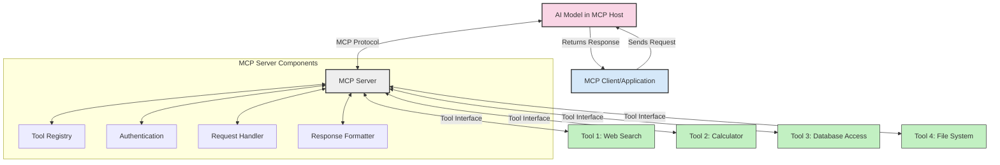
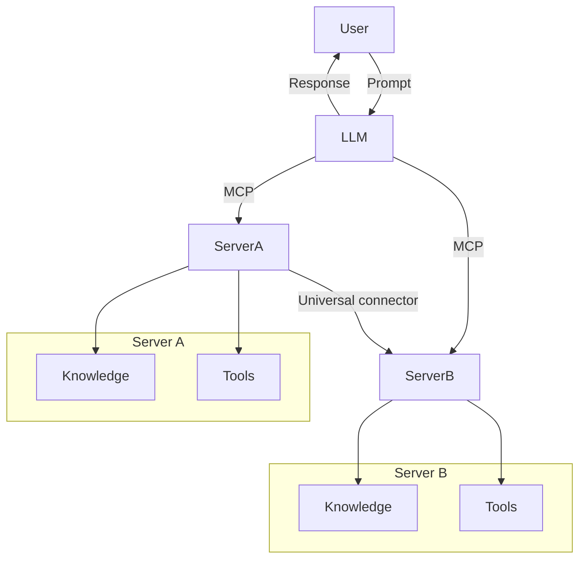

<!--
CO_OP_TRANSLATOR_METADATA:
{
  "original_hash": "02301140adbd807ecf0f17720fa307bc",
  "translation_date": "2025-05-17T06:07:21+00:00",
  "source_file": "00-Introduction/README.md",
  "language_code": "sw"
}
-->
# Utangulizi wa Itifaki ya Muktadha wa Modeli (MCP): Kwa Nini Ni Muhimu kwa Programu za AI Zinazoweza Kupimika

Programu za AI za kizazi ni hatua kubwa mbele kwani mara nyingi huruhusu mtumiaji kuingiliana na programu kwa kutumia vidokezo vya lugha ya asili. Hata hivyo, kadri muda na rasilimali zinavyowekezwa katika programu hizo, unataka kuhakikisha unaweza kuunganisha kwa urahisi utendakazi na rasilimali kwa njia ambayo ni rahisi kupanua, kwamba programu yako inaweza kukidhi zaidi ya modeli moja inayotumiwa, na uzito wake. Kwa kifupi, kujenga programu za Gen AI ni rahisi kuanza nazo lakini zinapokua na kuwa ngumu zaidi, unahitaji kuanza kufafanua usanifu na uwezekano mkubwa utahitaji kutegemea kiwango ili kuhakikisha programu zako zinajengwa kwa njia thabiti. Hapa ndipo MCP inakuja kupanga mambo, kutoa kiwango.

---

## **🔍 Itifaki ya Muktadha wa Modeli (MCP) ni Nini?**

**Itifaki ya Muktadha wa Modeli (MCP)** ni **kiolesura cha wazi, kilichosanifishwa** kinachoruhusu Mifano Mikubwa ya Lugha (LLMs) kuingiliana bila shida na zana za nje, API, na vyanzo vya data. Inatoa usanifu thabiti ili kuongeza utendakazi wa modeli za AI zaidi ya data yao ya mafunzo, kuwezesha mifumo ya AI yenye akili, inayoweza kupimika, na inayojibu zaidi.

---

## **🎯 Kwa Nini Usanifishaji katika AI Ni Muhimu**

Kadri programu za AI za kizazi zinavyokuwa ngumu zaidi, ni muhimu kupitisha viwango vinavyohakikisha **uwezo wa kupimika, upanuzi**, na **uwezo wa kutunza**. MCP inashughulikia mahitaji haya kwa:

- Kuunganisha miunganisho ya modeli na zana
- Kupunguza suluhisho maalum, dhaifu
- Kuruhusu modeli nyingi kuishi pamoja ndani ya mfumo mmoja

---

## **📚 Malengo ya Kujifunza**

Mwisho wa makala hii, utaweza:

- Kufafanua **Itifaki ya Muktadha wa Modeli (MCP)** na matumizi yake
- Kuelewa jinsi MCP inavyosanifisha mawasiliano ya modeli na zana
- Kutambua vipengele vya msingi vya usanifu wa MCP
- Kuchunguza matumizi halisi ya MCP katika muktadha wa biashara na maendeleo

---

## **💡 Kwa Nini Itifaki ya Muktadha wa Modeli (MCP) Ni Mabadiliko Makubwa**

### **🔗 MCP Inasuluhisha Ukatishaji katika Mwingiliano wa AI**

Kabla ya MCP, kuunganisha modeli na zana kulihitaji:

- Kanuni maalum kwa kila jozi ya zana-modeli
- API zisizo za kawaida kwa kila muuzaji
- Mivunjiko ya mara kwa mara kutokana na masasisho
- Uwezo mdogo wa kupimika na zana zaidi

### **✅ Faida za Usanifishaji wa MCP**

| **Faida**                  | **Maelezo**                                                                   |
|----------------------------|-------------------------------------------------------------------------------|
| Uwezo wa kufanya kazi pamoja| LLMs hufanya kazi bila shida na zana kutoka kwa wauzaji tofauti                |
| Thabiti                    | Tabia ya sare kwenye majukwaa na zana                                         |
| Uwezo wa kutumia tena      | Zana zilizojengwa mara moja zinaweza kutumika kwenye miradi na mifumo          |
| Maendeleo ya haraka        | Punguza muda wa maendeleo kwa kutumia kiolesura kilichosanifishwa, cha plug-and-play |

---

## **🧱 Muhtasari wa Usanifu wa MCP wa Kiwango cha Juu**

MCP inafuata **mfano wa mteja-server**, ambapo:

- **MCP Hosts** huendesha modeli za AI
- **MCP Clients** huanzisha maombi
- **MCP Servers** hutumikia muktadha, zana, na uwezo

### **Vipengele Muhimu:**

- **Rasilimali** – Data tuli au inayobadilika kwa modeli  
- **Vidokezo** – Mitiririko ya kazi iliyowekwa awali kwa kizazi kinachoongozwa  
- **Zana** – Kazi zinazoweza kutekelezwa kama utafutaji, hesabu  
- **Sampuli** – Tabia ya kiwakala kupitia mwingiliano wa kurudia

---

## Jinsi MCP Servers Zinavyofanya Kazi

Seva za MCP zinafanya kazi kwa njia ifuatayo:

- **Mtiririko wa Maombi**: 
    1. Mteja wa MCP hutuma ombi kwa Modeli ya AI inayofanya kazi katika MCP Host.
    2. Modeli ya AI inatambua wakati inahitaji zana au data za nje.
    3. Modeli ina wasiliano na Seva ya MCP kwa kutumia itifaki iliyosanifishwa.

- **Utendaji wa Seva ya MCP**:
    - Rejesta ya Zana: Hudumisha orodha ya zana zinazopatikana na uwezo wao.
    - Uthibitishaji: Inathibitisha ruhusa za ufikiaji wa zana.
    - Mshughulikiaji wa Maombi: Inashughulikia maombi ya zana yanayoingia kutoka kwa modeli.
    - Muundaji wa Majibu: Huunda matokeo ya zana kwa muundo ambao modeli inaweza kuelewa.

- **Utekelezaji wa Zana**: 
    - Seva inaelekeza maombi kwa zana za nje zinazofaa
    - Zana hufanya kazi zao maalum (utafutaji, hesabu, maswali ya hifadhidata, nk.)
    - Matokeo yanarudishwa kwa modeli kwa muundo thabiti.

- **Ujumuishaji wa Majibu**: 
    - Modeli ya AI inajumuisha matokeo ya zana katika majibu yake.
    - Jibu la mwisho linatumwa tena kwa programu ya mteja.

## 👨‍💻 Jinsi ya Kujenga Seva ya MCP (Kwa Mifano)

Seva za MCP hukuruhusu kupanua uwezo wa LLM kwa kutoa data na utendakazi. 

Uko tayari kujaribu? Hapa kuna mifano ya kuunda seva rahisi ya MCP katika lugha tofauti:

- **Mfano wa Python**: https://github.com/modelcontextprotocol/python-sdk

- **Mfano wa TypeScript**: https://github.com/modelcontextprotocol/typescript-sdk

- **Mfano wa Java**: https://github.com/modelcontextprotocol/java-sdk

- **Mfano wa C#/.NET**: https://github.com/modelcontextprotocol/csharp-sdk

## 🌍 Matumizi Halisi ya MCP

MCP inawezesha matumizi mbalimbali kwa kupanua uwezo wa AI:

| **Matumizi**                | **Maelezo**                                                                   |
|-----------------------------|-------------------------------------------------------------------------------|
| Muunganisho wa Data ya Biashara | Unganisha LLMs na hifadhidata, CRM, au zana za ndani                      |
| Mifumo ya AI ya Kiwakala    | Wezesha mawakala wa kujitegemea na ufikiaji wa zana na mitiririko ya maamuzi  |
| Programu za Multi-modal     | Unganisha zana za maandishi, picha, na sauti ndani ya programu moja ya AI    |
| Muunganisho wa Data ya Wakati Halisi | Leta data ya moja kwa moja katika mwingiliano wa AI kwa matokeo sahihi, ya sasa |

### 🧠 MCP = Kiwango cha Ulimwengu kwa Mwingiliano wa AI

Itifaki ya Muktadha wa Modeli (MCP) inafanya kazi kama kiwango cha ulimwengu kwa mwingiliano wa AI, kama vile USB-C ilivyosanifisha miunganisho ya kifaa. Katika ulimwengu wa AI, MCP hutoa kiolesura thabiti, kuruhusu modeli (wateja) kuunganisha bila shida na zana za nje na watoa data (seva). Hii inafuta hitaji la itifaki mbalimbali, maalum kwa kila API au chanzo cha data.

Chini ya MCP, zana inayooana na MCP (inayojulikana kama seva ya MCP) inafuata kiwango kilichounganishwa. Seva hizi zinaweza kuorodhesha zana au vitendo wanavyotoa na kutekeleza vitendo hivyo vinapoombwa na wakala wa AI. Majukwaa ya wakala wa AI yanayounga mkono MCP yana uwezo wa kugundua zana zinazopatikana kutoka kwa seva na kuzitumia kupitia itifaki hii sanifu.

### 💡 Urahisi wa ufikiaji wa maarifa

Zaidi ya kutoa zana, MCP pia inawezesha ufikiaji wa maarifa. Inawezesha programu kutoa muktadha kwa mifano mikubwa ya lugha (LLMs) kwa kuziunganisha na vyanzo mbalimbali vya data. Kwa mfano, seva ya MCP inaweza kuwakilisha hifadhi ya hati ya kampuni, kuruhusu mawakala kupata taarifa husika kwa mahitaji. Seva nyingine inaweza kushughulikia vitendo maalum kama kutuma barua pepe au kusasisha rekodi. Kutoka kwa mtazamo wa wakala, hizi ni zana tu ambazo inaweza kutumia—baadhi ya zana hurudisha data (muktadha wa maarifa), wakati nyingine hufanya vitendo. MCP inasimamia zote kwa ufanisi.

Wakala anayounganisha na seva ya MCP hujifunza kiotomatiki uwezo wa seva inayopatikana na data inayopatikana kupitia muundo sanifu. Usanifishaji huu unaruhusu upatikanaji wa zana kwa nguvu. Kwa mfano, kuongeza seva mpya ya MCP kwenye mfumo wa wakala hufanya kazi zake zitumike mara moja bila kuhitaji usanifu zaidi wa maagizo ya wakala.

Muunganisho huu ulioimarishwa unalingana na mtiririko ulioonyeshwa kwenye mchoro wa mermaid, ambapo seva hutoa zana na maarifa, kuhakikisha ushirikiano bila shida katika mifumo.

### 👉 Mfano: Suluhisho la Wakala Linaloweza Kupimika

## 🔐 Faida za Kivitendo za MCP

Hizi ni baadhi ya faida za kivitendo za kutumia MCP:

- **Uhalisia**: Modeli zinaweza kufikia taarifa za kisasa zaidi ya data yao ya mafunzo
- **Upanuzi wa Uwezo**: Modeli zinaweza kutumia zana maalum kwa kazi ambazo hazikufunzwa kwa ajili yake
- **Kupunguza Halusinasi**: Vyanzo vya data vya nje hutoa msingi wa ukweli
- **Faragha**: Data nyeti inaweza kubaki katika mazingira salama badala ya kuingizwa katika vidokezo

## 📌 Muhtasari Muhimu

Haya ni muhtasari muhimu kwa kutumia MCP:

- **MCP** inasanifisha jinsi modeli za AI zinavyowasiliana na zana na data
- Inakuza **upanuzi, uthabiti, na uwezo wa kufanya kazi pamoja**
- MCP husaidia **kupunguza muda wa maendeleo, kuboresha uaminifu, na kupanua uwezo wa modeli**
- Usanifu wa mteja-server **unawezesha programu za AI zinazoweza kubadilika, kupanuliwa**

## 🧠 Zoezi

Fikiria kuhusu programu ya AI unayopenda kujenga.

- Ni **zana au data gani za nje** zinaweza kuongeza uwezo wake?
- Je, MCP inaweza kufanya muunganisho **uwe rahisi na wa kuaminika zaidi?**

## Rasilimali Ziada

- [Hifadhi ya MCP GitHub](https://github.com/modelcontextprotocol)

## Kinachofuata

Kinachofuata: [Sura ya 1: Dhana za Msingi](/01-CoreConcepts/README.md)

**Kanusho**: 
Hati hii imetafsiriwa kwa kutumia huduma ya tafsiri ya AI [Co-op Translator](https://github.com/Azure/co-op-translator). Ingawa tunajitahidi kwa usahihi, tafadhali fahamu kwamba tafsiri za kiotomatiki zinaweza kuwa na makosa au kutokuwa sahihi. Hati ya awali katika lugha yake asili inapaswa kuzingatiwa kama chanzo cha mamlaka. Kwa habari muhimu, tafsiri ya kibinadamu ya kitaalamu inapendekezwa. Hatuwajibiki kwa maelewano au tafsiri zisizo sahihi zinazotokana na matumizi ya tafsiri hii.