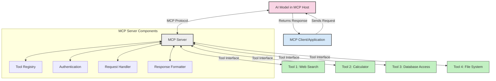
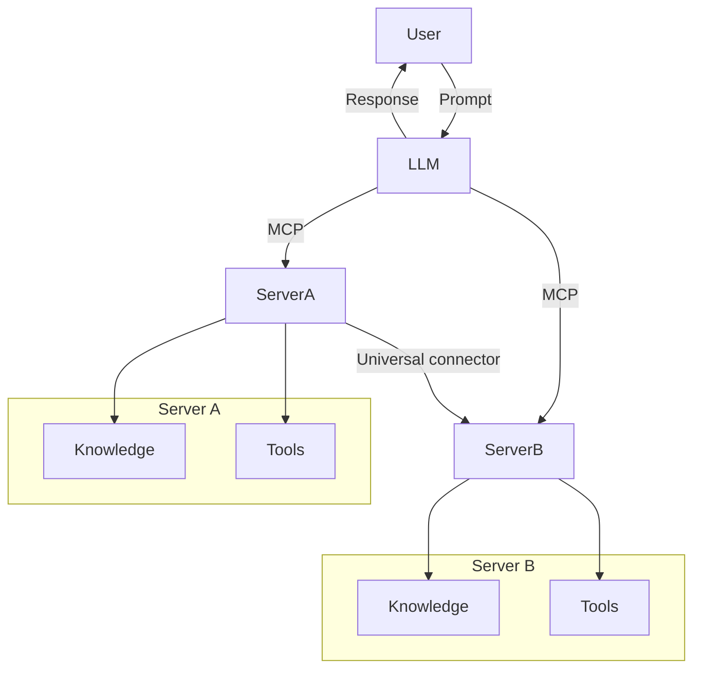

<!--
CO_OP_TRANSLATOR_METADATA:
{
  "original_hash": "cf84f987e1b771d2201408e110dfd2db",
  "translation_date": "2025-05-20T17:52:45+00:00",
  "source_file": "00-Introduction/README.md",
  "language_code": "sw"
}
-->
# Utangulizi kwa Model Context Protocol (MCP): Kwa Nini Inahitajika kwa Maombi ya AI Yanayoweza Kupanuka

Maombi ya AI yanayotengeneza vitu ni hatua kubwa mbele kwani mara nyingi huruhusu mtumiaji kuingiliana na programu kwa kutumia maagizo ya lugha ya kawaida. Hata hivyo, kadri muda na rasilimali zinavyozidi kutumika katika maombi kama haya, unataka kuhakikisha unaweza kuunganisha kwa urahisi vipengele na rasilimali kwa njia ambayo ni rahisi kupanua, programu yako inaweza kushughulikia matumizi ya zaidi ya mfano mmoja, na changamoto zake. Kwa kifupi, kuunda maombi ya Gen AI ni rahisi kuanzia, lakini yanapokua na kuwa magumu zaidi, unahitaji kuanza kufafanua usanifu na huenda ukahitaji kutegemea kiwango cha viwango ili kuhakikisha maombi yako yamejengwa kwa njia thabiti. Hapa ndipo MCP inakuja kuandaa mambo, kutoa kiwango cha viwango.

---

## **🔍 MCP ni Nini?**

**Model Context Protocol (MCP)** ni **kiolesura wazi, kilichosanifiwa** kinachowezesha Large Language Models (LLMs) kuunganishwa kwa urahisi na zana za nje, API, na vyanzo vya data. Hutoa usanifu thabiti wa kuboresha utendaji wa modeli za AI zaidi ya data walizofunzwa nayo, kuruhusu mifumo ya AI kuwa smart, inayoweza kupanuka, na inayojibu kwa haraka.

---

## **🎯 Kwa Nini Viwango Katika AI Ni Muhimu**

Kadri maombi ya AI yanayotengeneza vitu yanavyokuwa magumu zaidi, ni muhimu kuanzisha viwango vinavyohakikisha **uwezo wa kupanuka, upanuzi**, na **utunzaji rahisi**. MCP inashughulikia mahitaji haya kwa:

- Kuunganisha matumizi ya zana na modeli kwa njia moja
- Kupunguza suluhisho dhaifu na za kipekee
- Kuruhusu modeli nyingi kuwepo ndani ya mfumo mmoja

---

## **📚 Malengo ya Kujifunza**

Mwisho wa makala hii, utaweza:

- Kufafanua **Model Context Protocol (MCP)** na matumizi yake
- Kuelewa jinsi MCP inavyosanifisha mawasiliano kati ya modeli na zana
- Kubaini vipengele muhimu vya usanifu wa MCP
- Kuchunguza matumizi halisi ya MCP katika biashara na maendeleo

---

## **💡 Kwa Nini Model Context Protocol (MCP) Ni Mabadiliko Makubwa**

### **🔗 MCP Inatatua Tatizo la Kugawanyika kwa Mwingiliano wa AI**

Kabla ya MCP, kuunganisha modeli na zana kulihitaji:

- Msimbo maalum kwa kila jozi ya zana na modeli
- API zisizo za viwango kwa kila muuzaji
- Kuvunjika mara kwa mara kutokana na masasisho
- Ugumu wa kupanuka kwa zana zaidi

### **✅ Manufaa ya Viwango vya MCP**

| **Manufaa**              | **Maelezo**                                                                   |
|--------------------------|-------------------------------------------------------------------------------|
| Ulinganifu               | LLMs zinafanya kazi kwa urahisi na zana kutoka kwa wauzaji tofauti           |
| Ulinganifu wa Tabia      | Tabia sawa kwenye majukwaa na zana zote                                      |
| Urejelezaji              | Zana zilizojengwa mara moja zinaweza kutumika kwenye miradi na mifumo mingi  |
| Kuongeza Kasi ya Maendeleo | Kupunguza muda wa maendeleo kwa kutumia kiolesura cha viwango, rahisi kutumia |

---

## **🧱 Muhtasari wa Usanifu wa MCP wa Juu**

MCP inafuata **mfano wa mteja-mtumiaji (client-server)**, ambapo:

- **MCP Hosts** huendesha modeli za AI
- **MCP Clients** huanzisha maombi
- **MCP Servers** hutumikia muktadha, zana, na uwezo

### **Vipengele Muhimu:**

- **Rasilimali** – Data ya static au inayobadilika kwa modeli  
- **Maagizo (Prompts)** – Mifumo iliyopangwa kwa ajili ya uongozaji wa utengenezaji  
- **Zana** – Kazi zinazotekelezwa kama utafutaji, hesabu  
- **Sampling** – Tabia ya kiwakala kupitia mwingiliano wa kurudia

---

## Jinsi MCP Servers Wanavyofanya Kazi

MCP servers hufanya kazi kwa njia ifuatayo:

- **Mtiririko wa Maombi**:  
    1. MCP Client hutuma ombi kwa Modeli ya AI inayofanya kazi kwenye MCP Host.  
    2. Modeli ya AI hutambua wakati inahitaji zana au data za nje.  
    3. Modeli huwasiliana na MCP Server kwa kutumia itifaki iliyosanifiwa.

- **Utendaji wa MCP Server**:  
    - Rekodi ya Zana: Inahifadhi orodha ya zana zilizopo na uwezo wake.  
    - Uthibitishaji: Huthibitisha ruhusa za kutumia zana.  
    - Mshughulikiaji wa Maombi: Hushughulikia maombi yanayotoka kwa modeli kwa ajili ya zana.  
    - Mtoaji Majibu: Huandaa matokeo ya zana kwa muundo unaoeleweka na modeli.

- **Utekelezaji wa Zana**:  
    - Server hupeleka maombi kwa zana za nje zinazofaa  
    - Zana hufanya kazi maalum (tafutaji, hesabu, maswali ya database, n.k.)  
    - Matokeo hurudishwa kwa modeli kwa muundo thabiti.

- **Kumaliza Majibu**:  
    - Modeli ya AI huingiza matokeo ya zana kwenye jibu lake.  
    - Jibu la mwisho hutumwa tena kwa programu ya mteja.

## 👨‍💻 Jinsi ya Kuunda MCP Server (Kwa Mifano)

MCP servers hukuwezesha kupanua uwezo wa LLM kwa kutoa data na utendaji.

Uko tayari kujaribu? Hapa kuna mifano ya kuunda MCP server rahisi kwa lugha mbalimbali:

- **Mfano wa Python**: https://github.com/modelcontextprotocol/python-sdk

- **Mfano wa TypeScript**: https://github.com/modelcontextprotocol/typescript-sdk

- **Mfano wa Java**: https://github.com/modelcontextprotocol/java-sdk

- **Mfano wa C#/.NET**: https://github.com/modelcontextprotocol/csharp-sdk

## 🌍 Matumizi Halisi ya MCP

MCP inaruhusu matumizi mbalimbali kwa kupanua uwezo wa AI:

| **Matumizi**               | **Maelezo**                                                                 |
|----------------------------|-----------------------------------------------------------------------------|
| Muunganisho wa Data za Biashara | Kuunganisha LLM na database, CRM, au zana za ndani                        |
| Mifumo ya AI ya Wakala     | Kuruhusu mawakala huru kutumia zana na michakato ya maamuzi                 |
| Maombi ya Modalities Mbalimbali | Kuunganisha zana za maandishi, picha, na sauti ndani ya programu moja ya AI |
| Muunganisho wa Data ya Muda Halisi | Kuleta data ya moja kwa moja katika mwingiliano wa AI kwa matokeo sahihi na ya sasa |

### 🧠 MCP = Kiwango cha Ulimwengu kwa Mwingiliano wa AI

Model Context Protocol (MCP) hutumika kama kiwango cha ulimwengu kwa mwingiliano wa AI, kama vile USB-C ilivyosanifisha muunganisho wa vifaa vya umeme. Katika ulimwengu wa AI, MCP hutoa kiolesura thabiti, kuruhusu modeli (wateja) kuunganishwa kwa urahisi na zana na watoa data wa nje (server). Hii inaondoa hitaji la itifaki tofauti na za kipekee kwa kila API au chanzo cha data.

Chini ya MCP, zana inayolingana na MCP (inayoitwa MCP server) inafuata kiwango kimoja. Servers hizi zinaweza kuorodhesha zana au vitendo vinavyotolewa na kutekeleza vitendo hivyo wakati wa ombi kutoka kwa wakala wa AI. Majukwaa ya wakala wa AI yanayounga mkono MCP yana uwezo wa kugundua zana zilizopo kutoka kwa servers na kuzitumia kupitia itifaki hii ya viwango.

### 💡 Inarahisisha Upatikanaji wa Maarifa

Zaidi ya kutoa zana, MCP pia inarahisisha upatikanaji wa maarifa. Inaruhusu maombi kutoa muktadha kwa LLM kwa kuziunganisha na vyanzo mbalimbali vya data. Kwa mfano, MCP server inaweza kuwakilisha hifadhidata ya nyaraka za kampuni, kuruhusu mawakala kupata taarifa muhimu kwa wakati. Server nyingine inaweza kushughulikia vitendo maalum kama kutuma barua pepe au kusasisha rekodi. Kutazama kwa wakala, hizi ni zana tu anazoweza kutumia—baadhi hurejesha data (muktadha wa maarifa), wengine hufanya vitendo. MCP inasimamia vyema zote mbili.

Mwakala anayejumuika na MCP server hujifunza moja kwa moja uwezo uliopo na data inayopatikana kupitia muundo wa viwango. Usanifishaji huu unaruhusu upatikanaji wa zana kwa wakati halisi. Kwa mfano, kuongeza MCP server mpya kwenye mfumo wa wakala hufanya kazi zake zitatumika mara moja bila haja ya kurekebisha maagizo ya wakala.

Uunganisho huu rahisi unaendana na mtiririko unaoonyeshwa kwenye mchoro wa mermaid, ambapo servers hutoa zana na maarifa, kuhakikisha ushirikiano rahisi kati ya mifumo.

### 👉 Mfano: Suluhisho la Wakala linaloweza Kupanuka

## 🔐 Manufaa Halisi ya MCP

Haya ni manufaa halisi ya kutumia MCP:

- **Uchangu**: Modeli zinaweza kupata taarifa za hivi punde zaidi kuliko data walizofunzwa nayo  
- **Upanuzi wa Uwezo**: Modeli zinaweza kutumia zana maalum kwa kazi ambazo hazijafunzwa kwao  
- **Kupunguza Taarifa zisizo sahihi**: Vyanzo vya data vya nje hutoa msingi wa ukweli  
- **Faragha**: Data nyeti inaweza kubaki katika mazingira salama badala ya kuwekwa katika maagizo

## 📌 Muhimu Kumbuka

Haya ni mambo muhimu ya kukumbuka kuhusu MCP:

- **MCP** inasanifisha jinsi modeli za AI zinavyowasiliana na zana na data  
- Inakuza **upanuzi, uthabiti, na ulinganifu**  
- MCP husaidia **kupunguza muda wa maendeleo, kuboresha uaminifu, na kupanua uwezo wa modeli**  
- Muundo wa mteja-mtumiaji **urahisisha maombi ya AI yenye ufanisi na yanayoweza kupanuka**

## 🧠 Zoefisho

Fikiria kuhusu programu ya AI unayotaka kuunda.

- Ni **zana za nje au data gani** zinaweza kuongeza uwezo wake?  
- MCP inaweza kufanyaje kuunganishwa kuwa **rahisi na thabiti zaidi?**

## Rasilimali Zaidi

- [MCP GitHub Repository](https://github.com/modelcontextprotocol)

## Nini Kinachofuata

Ifuatayo: [Sura 1: Dhana Muhimu](/01-CoreConcepts/README.md)

**Kasi ya Majukumu**:  
Hati hii imetafsiriwa kwa kutumia huduma ya tafsiri ya AI [Co-op Translator](https://github.com/Azure/co-op-translator). Ingawa tunajitahidi kwa usahihi, tafadhali fahamu kuwa tafsiri za kiotomatiki zinaweza kuwa na makosa au upungufu wa usahihi. Hati asili katika lugha yake ya asili inapaswa kuzingatiwa kama chanzo cha mamlaka. Kwa taarifa muhimu, tafsiri ya mtaalamu wa kibinadamu inapendekezwa. Hatubebei dhamana kwa kutoelewana au tafsiri potofu zitokanazo na matumizi ya tafsiri hii.