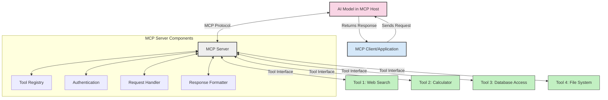
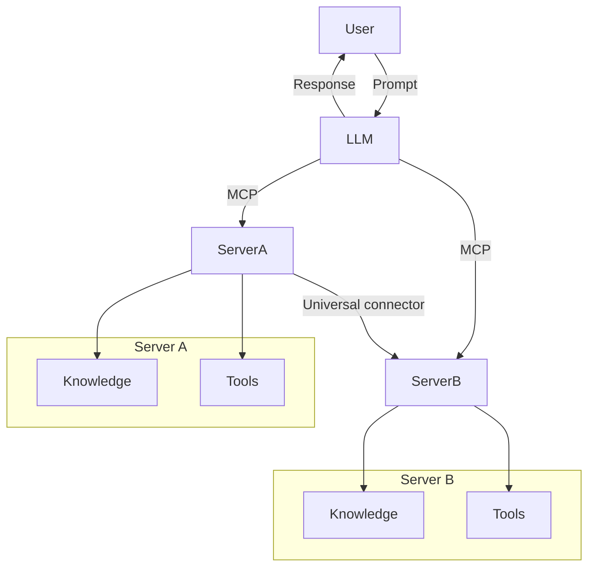

<!--
CO_OP_TRANSLATOR_METADATA:
{
  "original_hash": "1d88dee994dcbb3fa52c271d0c0817b5",
  "translation_date": "2025-05-20T22:13:52+00:00",
  "source_file": "00-Introduction/README.md",
  "language_code": "sw"
}
-->
# Utangulizi wa Itifaki ya Muktadha wa Mfano (MCP): Kwa Nini Inahitajika kwa Programu za AI Zinazoweza Kupanuka

Programu za AI zinazozalisha maudhui ni hatua kubwa mbele kwani mara nyingi huruhusu mtumiaji kuingiliana na programu kwa kutumia maagizo ya lugha ya asili. Hata hivyo, kadri muda na rasilimali zinavyoongezwa katika programu hizi, unataka kuhakikisha unaweza kuunganisha kwa urahisi vipengele na rasilimali kwa njia inayorahisisha upanuzi, programu yako iweze kuendana na matumizi ya mifano mingi, na kushughulikia changamoto mbalimbali za mifano. Kwa kifupi, kujenga programu za Gen AI ni rahisi mwanzoni, lakini zinapokua na kuwa ngumu zaidi, unahitaji kuanza kufafanua usanifu na huenda ukahitaji kutegemea kiwango cha kawaida kuhakikisha programu zako zinajengwa kwa njia thabiti. Hapa ndipo MCP inakuja kupanga mambo na kutoa kiwango cha kawaida.

---

## **🔍 Itifaki ya Muktadha wa Mfano (MCP) ni Nini?**

**Itifaki ya Muktadha wa Mfano (MCP)** ni **kiolesura wazi, kilichosawazishwa** kinachowezesha Mifano Mikubwa ya Lugha (LLMs) kuingiliana kwa urahisi na zana za nje, APIs, na vyanzo vya data. Inatoa usanifu thabiti wa kuboresha uwezo wa modeli za AI zaidi ya data walizofunzwa nayo, kuwezesha mifumo ya AI kuwa smarter, inayoweza kupanuka, na yenye majibu bora.

---

## **🎯 Kwa Nini Usawazishaji Katika AI ni Muhimu**

Kadri programu za AI zinazozalisha maudhui zinavyoongezeka kuwa ngumu, ni muhimu kuanzisha viwango vinavyohakikisha **uwezo wa kupanuka, upanuzi**, na **utunzaji rahisi**. MCP inashughulikia mahitaji haya kwa:

- Kuweka pamoja ujumuishaji wa modeli na zana
- Kupunguza suluhisho ngumu za kipekee zisizodumu
- Kuruhusu mifano mingi kuishi ndani ya mfumo mmoja

---

## **📚 Malengo ya Kujifunza**

Mwisho wa makala hii, utaweza:

- Kuelezea **Itifaki ya Muktadha wa Mfano (MCP)** na matumizi yake
- Kuelewa jinsi MCP inavyosawazisha mawasiliano kati ya modeli na zana
- Kutambua vipengele vikuu vya usanifu wa MCP
- Kuchunguza matumizi halisi ya MCP katika biashara na maendeleo

---

## **💡 Kwa Nini Itifaki ya Muktadha wa Mfano (MCP) ni Mabadiliko Makubwa**

### **🔗 MCP Inatatua Mgawanyiko Katika Mwingiliano wa AI**

Kabla ya MCP, kuunganisha mifano na zana kulihitaji:

- Msimbo maalum kwa kila jozi ya zana na mfano
- APIs zisizo za kawaida kwa kila muuzaji
- Kuvunjika mara kwa mara kutokana na masasisho
- Ugumu wa kupanuka kwa zana zaidi

### **✅ Manufaa ya Usawazishaji wa MCP**

| **Manufaa**               | **Maelezo**                                                                    |
|---------------------------|--------------------------------------------------------------------------------|
| Uwezo wa Kushirikiana     | LLMs zinafanya kazi kwa urahisi na zana kutoka kwa wauzaji mbalimbali           |
| Ulinganifu                | Tabia sawa kwenye majukwaa na zana zote                                       |
| Matumizi Tena             | Zana zilizojengwa mara moja zinaweza kutumika kwenye miradi na mifumo mbalimbali|
| Kuongeza Kasi ya Maendeleo | Punguza muda wa maendeleo kwa kutumia violesura vilivyosanifiwa na rahisi kutumia|

---

## **🧱 Muhtasari wa Usanifu wa Juu wa MCP**

MCP inafuata **mfano wa mteja-mtoaji**, ambapo:

- **MCP Hosts** huendesha mifano ya AI  
- **MCP Clients** huanzisha maombi  
- **MCP Servers** hutoa muktadha, zana, na uwezo

### **Vipengele Muhimu:**

- **Rasilimali** – Data imara au inayobadilika kwa mifano  
- **Maagizo** – Mipango iliyowekwa awali kwa uzalishaji ulioratibiwa  
- **Zana** – Kazi zinazotekelezwa kama utafutaji, mahesabu  
- **Uchambuzi** – Tabia ya wakala kupitia mwingiliano wa kurudia

---

## Jinsi MCP Servers Hufanya Kazi

Seva za MCP hufanya kazi kwa njia ifuatayo:

- **Mtiririko wa Maombi**:  
    1. MCP Client hutuma ombi kwa Mfano wa AI unaoendeshwa katika MCP Host.  
    2. Mfano wa AI hutambua anapohitaji zana au data za nje.  
    3. Mfano huwasiliana na MCP Server kwa kutumia itifaki iliyosanifiwa.

- **Uwezo wa MCP Server**:  
    - Katalogi ya Zana: Huendeleza orodha ya zana zilizopo na uwezo wake.  
    - Uthibitishaji: Huthibitisha ruhusa za kupata zana.  
    - Mshughulikiaji wa Maombi: Hushughulikia maombi yanayotoka kwa mfano kwa zana.  
    - Mtoaji wa Majibu: Huandaa matokeo ya zana katika muundo unaoeleweka na mfano.

- **Utekelezaji wa Zana**:  
    - Seva hupeleka maombi kwa zana za nje zinazofaa  
    - Zana hufanya kazi maalum (utafutaji, mahesabu, maswali ya hifadhidata, n.k.)  
    - Matokeo hurudishwa kwa mfano kwa muundo thabiti.

- **Kumalizia Majibu**:  
    - Mfano wa AI huingiza matokeo ya zana katika jibu lake.  
    - Jibu la mwisho hutumwa kwa programu ya mteja.

## 👨‍💻 Jinsi ya Kujenga MCP Server (Kwa Mifano)

Seva za MCP zinakuwezesha kuongeza uwezo wa LLM kwa kutoa data na kazi.

Uko tayari kujaribu? Hapa kuna mifano ya kuunda seva rahisi ya MCP kwa lugha mbalimbali:

- **Mfano wa Python**: https://github.com/modelcontextprotocol/python-sdk

- **Mfano wa TypeScript**: https://github.com/modelcontextprotocol/typescript-sdk

- **Mfano wa Java**: https://github.com/modelcontextprotocol/java-sdk

- **Mfano wa C#/.NET**: https://github.com/modelcontextprotocol/csharp-sdk

## 🌍 Matumizi Halisi ya MCP

MCP inaruhusu matumizi mbalimbali kwa kuongeza uwezo wa AI:

| **Matumizi**                | **Maelezo**                                                                    |
|----------------------------|--------------------------------------------------------------------------------|
| Uunganishaji wa Data za Biashara | Kuunganisha LLM na hifadhidata, CRMs, au zana za ndani                      |
| Mifumo ya AI Inayojiendesha Peke Yake | Kuwezesha mawakala huru kupata zana na kufuata taratibu za maamuzi         |
| Programu za Multi-modal    | Kuunganisha zana za maandishi, picha, na sauti ndani ya programu moja ya AI    |
| Uunganishaji wa Data za Wakati Halisi | Kuleta data ya moja kwa moja katika mwingiliano wa AI kwa matokeo sahihi zaidi|

### 🧠 MCP = Kiwango cha Kawaida cha Mwingiliano wa AI

Itifaki ya Muktadha wa Mfano (MCP) inafanya kazi kama kiwango cha kawaida cha ulimwengu wa AI, kama vile USB-C ilivyosanikisha viunganishi vya vifaa. Katika dunia ya AI, MCP hutoa kiolesura thabiti, kuruhusu mifano (wateja) kuunganishwa kwa urahisi na zana na watoa data wa nje (waseriveri). Hii inaondoa haja ya itifaki tofauti na maalum kwa kila API au chanzo cha data.

Chini ya MCP, zana inayolingana na MCP (inayojulikana kama seva ya MCP) hufuata kiwango cha pamoja. Seva hizi zinaweza kuorodhesha zana au vitendo vinavyotolewa na kutekeleza vitendo hivyo inapobidiwa na wakala wa AI. Majukwaa ya wakala wa AI yanayounga mkono MCP yana uwezo wa kugundua zana zilizopo kutoka kwa waseriveri na kuzitumia kupitia itifaki hii ya kawaida.

### 💡 Inawezesha upatikanaji wa maarifa

Mbali na kutoa zana, MCP pia huwezesha upatikanaji wa maarifa. Inaruhusu programu kutoa muktadha kwa mifano mikubwa ya lugha (LLMs) kwa kuziunganisha na vyanzo mbalimbali vya data. Kwa mfano, seva ya MCP inaweza kuwakilisha hazina ya nyaraka ya kampuni, ikiruhusu mawakala kupata taarifa muhimu wanapohitaji. Seva nyingine inaweza kushughulikia vitendo maalum kama kutuma barua pepe au kusasisha rekodi. Kwa mtazamo wa wakala, hizi ni zana anazoweza kutumia—baadhi hurejesha data (muktadha wa maarifa), wengine hufanya vitendo. MCP hushughulikia vyote kwa ufanisi.

Mwakala anayejumuika na seva ya MCP hujifunza moja kwa moja uwezo wa seva na data inayopatikana kupitia muundo wa kawaida. Usanifishaji huu unaruhusu upatikanaji wa zana kwa njia ya mabadiliko. Kwa mfano, kuongeza seva mpya ya MCP kwenye mfumo wa wakala hufanya kazi zake kupatikana mara moja bila hitaji la kubadilisha maagizo ya wakala.

Uunganishaji huu rahisi unaendana na mtiririko unaoonyeshwa kwenye mchoro wa mermaid, ambapo waseriveri hutoa zana na maarifa, kuhakikisha ushirikiano mzuri kati ya mifumo.

### 👉 Mfano: Suluhisho la Wakala Linaloweza Kupanuka

## 🔐 Manufaa Halisi ya MCP

Hapa ni manufaa halisi ya kutumia MCP:

- **Uchunguzi wa Habari Mpya**: Mifano inaweza kupata taarifa za sasa zaidi ya data walizofunzwa nayo  
- **Kupanua Uwezo**: Mifano inaweza kutumia zana maalum kwa kazi ambazo hawakufunzwa kwao  
- **Kupunguza Mawazo Yasiyo Sahihi**: Vyanzo vya data vya nje hutoa msingi wa ukweli  
- **Faragha**: Data nyeti inaweza kubaki katika mazingira salama badala ya kuingizwa katika maagizo

## 📌 Muhimu Kuzingatia

Haya ni mambo muhimu ya kukumbuka kuhusu MCP:

- **MCP** inasawazisha jinsi mifano ya AI inavyowasiliana na zana na data  
- Inakuza **upanuzi, ulinganifu, na uwezo wa kushirikiana**  
- MCP husaidia **kupunguza muda wa maendeleo, kuboresha uaminifu, na kuongeza uwezo wa modeli**  
- Usanifu wa mteja-mtoaji **unawezesha programu za AI kuwa rahisi kubadilika na kupanuka**

## 🧠 Zoef

Fikiria kuhusu programu ya AI unayotaka kuijenga.

- Ni **zana au data za nje** zipi zinaweza kuongeza uwezo wake?  
- MCP ingeweza vipi kufanya ujumuishaji kuwa **rahisi na wa kuaminika zaidi?**

## Rasilimali Zaidi

- [MCP GitHub Repository](https://github.com/modelcontextprotocol)

## Nini Kifuatao

Ifuatayo: [Sura ya 1: Dhana Muhimu](/01-CoreConcepts/README.md)

**Kang’amuzi**:  
Hati hii imetafsiriwa kwa kutumia huduma ya tafsiri ya AI [Co-op Translator](https://github.com/Azure/co-op-translator). Ingawa tunajitahidi kuwa sahihi, tafadhali fahamu kwamba tafsiri za kiotomatiki zinaweza kuwa na makosa au upungufu wa usahihi. Hati asili katika lugha yake ya asili inapaswa kuzingatiwa kama chanzo cha uhakika. Kwa taarifa muhimu, tafsiri ya kitaalamu inayofanywa na binadamu inapendekezwa. Hatuna dhamana kwa kutoelewana au tafsiri potofu zinazotokana na matumizi ya tafsiri hii.