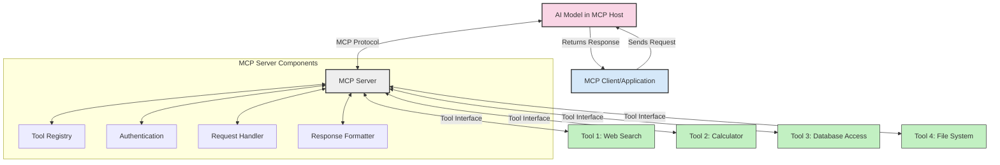
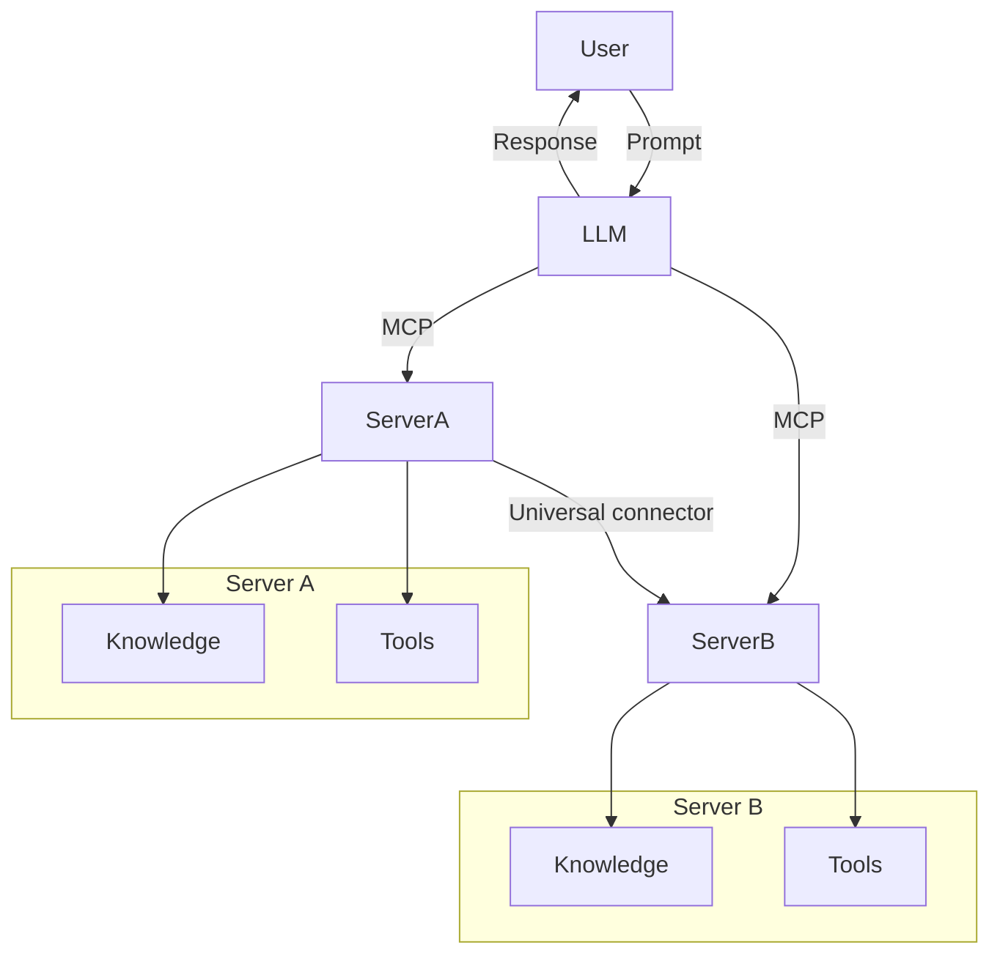
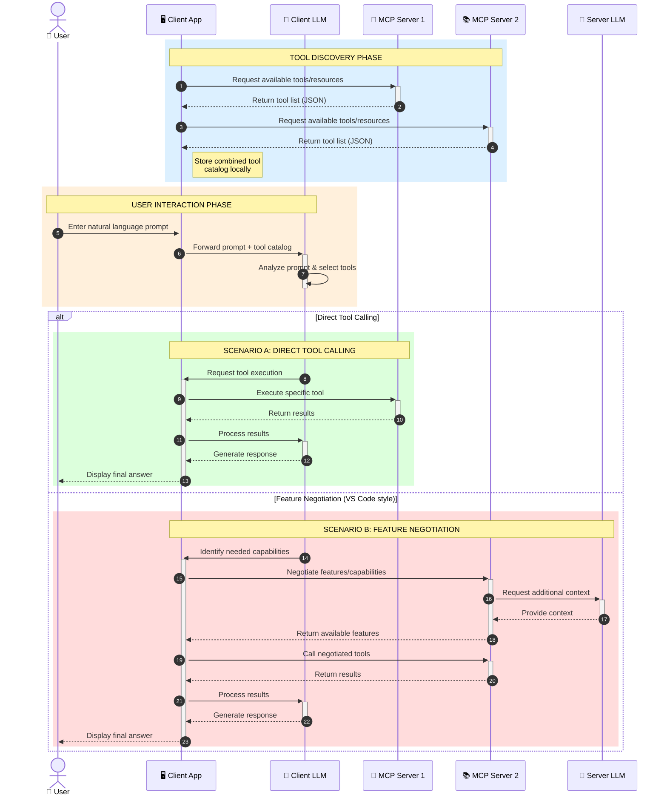

<!--
CO_OP_TRANSLATOR_METADATA:
{
  "original_hash": "25a94c681cf43612ff394d8cf78a74de",
  "translation_date": "2025-05-27T16:10:37+00:00",
  "source_file": "00-Introduction/README.md",
  "language_code": "sw"
}
-->
# Utangulizi wa Itifaki ya Muktadha wa Mfano (MCP): Kwa Nini Ni Muhimu kwa Programu za AI Zinazoweza Kupanuka

Programu za AI zinazotengeneza maudhui ni hatua kubwa mbele kwani mara nyingi huruhusu mtumiaji kuingiliana na programu kwa kutumia lugha ya kawaida. Hata hivyo, kadri muda na rasilimali zinavyoongezwa kwenye programu hizi, unataka kuhakikisha unaweza kuunganisha vipengele na rasilimali kwa urahisi kwa njia inayorahisisha kuongeza vipengele zaidi, programu yako iweze kuendana na modeli zaidi ya moja, na kushughulikia changamoto mbalimbali za modeli. Kwa kifupi, kuunda programu za Gen AI ni rahisi kuanzia, lakini zinapokua na kuwa ngumu zaidi, unahitaji kuanza kufafanua usanifu na uwezekano wa kutegemea kiwango cha viwango ili kuhakikisha programu zako zinajengwa kwa njia thabiti. Hapa ndipo MCP inakuja kupanga mambo na kutoa kiwango cha viwango.

---

## **🔍 Itifaki ya Muktadha wa Mfano (MCP) ni Nini?**

**Itifaki ya Muktadha wa Mfano (MCP)** ni **kiolesura wazi, kilichosawazishwa** kinachowezesha Modeli Kubwa za Lugha (LLMs) kuingiliana kwa urahisi na zana za nje, API, na vyanzo vya data. Inatoa usanifu thabiti wa kuboresha utendaji wa modeli za AI zaidi ya data walizopata mafunzo, kuwezesha mifumo ya AI kuwa smart, inayoweza kupanuka, na inayojibu haraka.

---

## **🎯 Kwa Nini Viwango katika AI Ni Muhimu**

Kadri programu za AI zinazotengeneza maudhui zinavyokuwa ngumu zaidi, ni muhimu kuanzisha viwango vinavyohakikisha **uwezo wa kupanuka, kuongeza vipengele**, na **utunzaji wa muda mrefu**. MCP inashughulikia mahitaji haya kwa:

- Kuunganisha mchakato wa modeli na zana
- Kupunguza suluhisho finyu na za mara moja
- Kuruhusu modeli nyingi kuishi ndani ya mfumo mmoja

---

## **📚 Malengo ya Kujifunza**

Mwisho wa makala hii, utaweza:

- Kufafanua **Itifaki ya Muktadha wa Mfano (MCP)** na matumizi yake
- Kuelewa jinsi MCP inavyosawazisha mawasiliano kati ya modeli na zana
- Kutambua vipengele vikuu vya usanifu wa MCP
- Kuchunguza matumizi halisi ya MCP katika biashara na muktadha wa maendeleo

---

## **💡 Kwa Nini Itifaki ya Muktadha wa Mfano (MCP) Ni Mabadiliko Makubwa**

### **🔗 MCP Inatatua Tatizo la Kugawanyika kwa Mwitikio wa AI**

Kabla ya MCP, kuunganisha modeli na zana kulihitaji:

- Msimbo maalum kwa kila mchanganyiko wa zana na modeli
- API zisizokuwa za kawaida kwa kila muuzaji
- Kuvunjika mara kwa mara kutokana na masasisho
- Ugumu wa kupanuka kwa zana zaidi

### **✅ Manufaa ya Usawazishaji wa MCP**

| **Manufaa**              | **Maelezo**                                                                |
|--------------------------|----------------------------------------------------------------------------|
| Uwezo wa Kuweza Kufanya Kazi Pamoja | LLM zinafanya kazi bila mshono na zana kutoka kwa wauzaji tofauti       |
| Ulinganifu               | Tabia moja kwa moja katika majukwaa na zana mbalimbali                      |
| Urejeleaji               | Zana zilizojengwa mara moja zinaweza kutumika katika miradi na mifumo mingi |
| Kuongeza Kasi ya Maendeleo | Punguza muda wa maendeleo kwa kutumia violesura vilivyosanifiwa, vya plug-and-play |

---

## **🧱 Muhtasari wa Usanifu wa MCP wa Kiwango cha Juu**

MCP inafuata **mfano wa mteja-mtumiaji**, ambapo:

- **MCP Hosts** huendesha modeli za AI
- **MCP Clients** huanzisha maombi
- **MCP Servers** hutumikia muktadha, zana, na uwezo

### **Vipengele Muhimu:**

- **Rasilimali** – Data ya kudumu au inayobadilika kwa modeli  
- **Maelekezo** – Mchakato uliowekwa awali wa kuongoza uzalishaji  
- **Zana** – Kazi zinazotekelezwa kama utafutaji, mahesabu  
- **Uchaguzi wa Sampuli** – Tabia ya wakala kupitia mwingiliano wa kurudiwa

---

## Jinsi MCP Servers Wanavyofanya Kazi

MCP servers hufanya kazi kwa njia ifuatayo:

- **Mtiririko wa Ombi**:  
    1. MCP Client hutuma ombi kwa Modeli ya AI inayofanya kazi katika MCP Host.  
    2. Modeli ya AI hutambua linapohitaji zana au data za nje.  
    3. Modeli huwasiliana na MCP Server kwa kutumia itifaki iliyosanifiwa.

- **Utendaji wa MCP Server**:  
    - Katalogi ya Zana: Huendeleza orodha ya zana zinazopatikana na uwezo wake.  
    - Uthibitishaji: Huhakiki ruhusa za kufikia zana.  
    - Mtendaji wa Maombi: Huandaa maombi yanayotoka kwa modeli.  
    - Muundo wa Majibu: Huandaa matokeo ya zana kwa muundo unaoeleweka na modeli.

- **Utekelezaji wa Zana**:  
    - Server hupeleka maombi kwa zana za nje zinazofaa  
    - Zana hufanya kazi maalum (tafutaji, mahesabu, maswali ya hifadhidata, n.k.)  
    - Matokeo hurudishwa kwa modeli kwa muundo thabiti.

- **Kumalizia Majibu**:  
    - Modeli ya AI huingiza matokeo ya zana katika jibu lake.  
    - Jibu la mwisho hurudishwa kwa programu ya mteja.

## 👨‍💻 Jinsi ya Kujenga MCP Server (Kwa Mifano)

MCP servers hukuwezesha kuongeza uwezo wa LLM kwa kutoa data na utendaji.

Uko tayari kujaribu? Hapa kuna mifano ya kuunda MCP server rahisi kwa lugha mbalimbali:

- **Mfano wa Python**: https://github.com/modelcontextprotocol/python-sdk

- **Mfano wa TypeScript**: https://github.com/modelcontextprotocol/typescript-sdk

- **Mfano wa Java**: https://github.com/modelcontextprotocol/java-sdk

- **Mfano wa C#/.NET**: https://github.com/modelcontextprotocol/csharp-sdk

## 🌍 Matumizi Halisi ya MCP

MCP inaruhusu matumizi mbalimbali kwa kuongeza uwezo wa AI:

| **Matumizi**               | **Maelezo**                                                                 |
|----------------------------|-----------------------------------------------------------------------------|
| Uunganishaji wa Data za Biashara | Kuunganisha LLM na hifadhidata, CRM, au zana za ndani                        |
| Mifumo ya AI yenye Wakala | Kuwezesha mawakala huru wenye ufikiaji wa zana na mchakato wa maamuzi        |
| Programu za Multi-modal   | Kuunganisha zana za maandishi, picha, na sauti katika programu moja ya AI    |
| Uunganishaji wa Data kwa Muda Halisi | Kuleta data ya moja kwa moja katika mwingiliano wa AI kwa matokeo sahihi na ya sasa |

### 🧠 MCP = Kiwango cha Ulimwengu kwa Mwitikio wa AI

Itifaki ya Muktadha wa Mfano (MCP) inafanya kazi kama kiwango cha ulimwengu kwa mwingiliano wa AI, kama vile USB-C ilivyosanikisha viunganishi vya vifaa vya umeme. Katika ulimwengu wa AI, MCP hutoa kiolesura thabiti, kuruhusu modeli (wateja) kuunganishwa kwa urahisi na zana za nje na watoa data (server). Hii inaondoa haja ya itifaki mbalimbali za kawaida kwa kila API au chanzo cha data.

Chini ya MCP, zana zinazofaa na MCP (zinazoitwa MCP server) hufuata kiwango kimoja. Servers hizi zinaweza kuorodhesha zana au vitendo vinavyotolewa na kutekeleza vitendo hivyo wakati vinapoombwa na wakala wa AI. Majukwaa ya wakala wa AI yanayounga mkono MCP yana uwezo wa kugundua zana zinazopatikana kutoka kwa servers na kuziita kupitia itifaki hii ya viwango.

### 💡 Huongeza Upatikanaji wa Maarifa

Zaidi ya kutoa zana, MCP pia hurahisisha upatikanaji wa maarifa. Inaruhusu programu kutoa muktadha kwa modeli kubwa za lugha (LLMs) kwa kuziunganisha na vyanzo mbalimbali vya data. Kwa mfano, MCP server inaweza kuwakilisha hifadhi ya nyaraka ya kampuni, kuruhusu mawakala kupata taarifa muhimu kwa wakati. Server nyingine inaweza kushughulikia vitendo maalum kama kutuma barua pepe au kusasisha rekodi. Kwa mtazamo wa wakala, hizi ni zana anazoweza kutumia—baadhi hurejesha data (muktadha wa maarifa), wengine hufanya vitendo. MCP husimamia vyote vyote kwa ufanisi.

Wakala anayounganishwa na MCP server hujifunza moja kwa moja uwezo wa server na data inayopatikana kupitia muundo thabiti. Usanifu huu huruhusu upatikanaji wa zana kwa njia ya mabadiliko. Kwa mfano, kuongeza MCP server mpya kwenye mfumo wa wakala hufanya kazi zake zifanyike mara moja bila hitaji la kubadilisha maelekezo ya wakala.

Uunganisho huu rahisi unaendana na mtiririko unaoonyeshwa kwenye mchoro wa mermaid, ambapo servers hutoa zana na maarifa, kuhakikisha ushirikiano usio na mshono kati ya mifumo.

### 👉 Mfano: Suluhisho la Wakala Linaloweza Kupanuka

### 🔄 Matukio ya Juu ya MCP na Muunganisho wa LLM upande wa Mteja

Zaidi ya usanifu wa msingi wa MCP, kuna matukio ya juu ambapo mteja na server wote wana LLM, kuruhusu mwingiliano wa hali ya juu:

## 🔐 Manufaa Halisi ya MCP

Hapa kuna manufaa halisi ya kutumia MCP:

- **Ufreshi**: Modeli zinaweza kupata taarifa za sasa zaidi ya data ya mafunzo yao  
- **Kupanua Uwezo**: Modeli zinaweza kutumia zana maalum kwa kazi ambazo hazikufundishwa  
- **Kupunguza Mawazo Yasiyo Sahihi**: Vyanzo vya data vya nje hutoa msingi wa ukweli  
- **Faragha**: Data nyeti inaweza kubaki katika mazingira salama badala ya kuwekwa katika maelekezo

## 📌 Muhimu Kumbuka

Haya ni mambo muhimu ya kukumbuka kuhusu MCP:

- **MCP** inasanikisha jinsi modeli za AI zinavyowasiliana na zana na data  
- Inakuza **kuongezeka kwa vipengele, ulinganifu, na uwezo wa kufanya kazi pamoja**  
- MCP husaidia **kupunguza muda wa maendeleo, kuboresha uaminifu, na kuongeza uwezo wa modeli**  
- Muundo wa mteja-server **unaruhusu programu za AI kuwa na ufanisi na uwezo wa kupanuka**

## 🧠 Zoefu

Fikiria kuhusu programu ya AI unayotaka kuunda.

- Ni **zana au data za nje** gani zinaweza kuongeza uwezo wake?  
- MCP inaweza kufanya uunganishaji kuwa **rahisi na wa kuaminika vipi?**

## Rasilimali Zaidi

- [MCP GitHub Repository](https://github.com/modelcontextprotocol)

## Nini Kifuatayo

Ifuatayo: [Sura ya 1: Dhana za Msingi](/01-CoreConcepts/README.md)

**Kiadhibu**:  
Hati hii imetafsiriwa kwa kutumia huduma ya tafsiri ya AI [Co-op Translator](https://github.com/Azure/co-op-translator). Ingawa tunajitahidi kuhakikisha usahihi, tafadhali fahamu kuwa tafsiri za kiotomatiki zinaweza kuwa na makosa au kasoro. Hati ya asili katika lugha yake ya asili inapaswa kuzingatiwa kama chanzo cha kuaminika. Kwa taarifa muhimu, tafsiri ya kitaalamu inayofanywa na binadamu inapendekezwa. Hatubeba dhamana kwa kutoelewana au tafsiri potofu zinazotokana na matumizi ya tafsiri hii.