```mermaid
---
title: Advanced MCP Scenarios with Client-Server LLM Integration
description: A sequence diagram showing the detailed interaction flow between user, client application, client LLM, multiple MCP servers, and server LLM, illustrating tool discovery, user interaction, direct tool calling, and feature negotiation phases
---
sequenceDiagram
    autonumber
    actor User as 👤 User
    participant ClientApp as 🖥️ Client App
    participant ClientLLM as 🧠 Client LLM
    participant Server1 as 🔧 MCP Server 1
    participant Server2 as 📚 MCP Server 2
    participant ServerLLM as 🤖 Server LLM
    
    %% Discovery Phase
    rect rgb(220, 240, 255)
        Note over ClientApp, Server2: TOOL DISCOVERY PHASE
        ClientApp->>+Server1: Request available tools/resources
        Server1-->>-ClientApp: Return tool list (JSON)
        ClientApp->>+Server2: Request available tools/resources
        Server2-->>-ClientApp: Return tool list (JSON)
        Note right of ClientApp: Store combined tool<br/>catalog locally
    end
    
    %% User Interaction
    rect rgb(255, 240, 220)
        Note over User, ClientLLM: USER INTERACTION PHASE
        User->>+ClientApp: Enter natural language prompt
        ClientApp->>+ClientLLM: Forward prompt + tool catalog
        ClientLLM->>-ClientLLM: Analyze prompt & select tools
    end
    
    %% Scenario A: Direct Tool Calling
    alt Direct Tool Calling
        rect rgb(220, 255, 220)
            Note over ClientApp, Server1: SCENARIO A: DIRECT TOOL CALLING
            ClientLLM->>+ClientApp: Request tool execution
            ClientApp->>+Server1: Execute specific tool
            Server1-->>-ClientApp: Return results
            ClientApp->>+ClientLLM: Process results
            ClientLLM-->>-ClientApp: Generate response
            ClientApp-->>-User: Display final answer
        end
    
    %% Scenario B: Feature Negotiation (VS Code style)
    else Feature Negotiation (VS Code style)
        rect rgb(255, 220, 220)
            Note over ClientApp, ServerLLM: SCENARIO B: FEATURE NEGOTIATION
            ClientLLM->>+ClientApp: Identify needed capabilities
            ClientApp->>+Server2: Negotiate features/capabilities
            Server2->>+ServerLLM: Request additional context
            ServerLLM-->>-Server2: Provide context
            Server2-->>-ClientApp: Return available features
            ClientApp->>+Server2: Call negotiated tools
            Server2-->>-ClientApp: Return results
            ClientApp->>+ClientLLM: Process results
            ClientLLM-->>-ClientApp: Generate response
            ClientApp-->>-User: Display final answer
        end
    end
```

<!--
CO_OP_TRANSLATOR_METADATA:
{
  "original_hash": "1446979020432f512c883848d7eca144",
  "translation_date": "2025-05-29T21:52:38+00:00",
  "source_file": "00-Introduction/README.md",
  "language_code": "sw"
}
-->
# Utangulizi wa Model Context Protocol (MCP): Kwa Nini Ni Muhimu kwa Maombi ya AI Yanayoweza Kupanuka

Maombi ya AI yanayotengeneza vitu ni hatua kubwa mbele kwani mara nyingi huruhusu mtumiaji kuwasiliana na programu kwa kutumia lugha ya asili. Hata hivyo, kadri muda na rasilimali zinavyoongezwa kwenye programu hizi, unataka kuhakikisha unaweza kuunganisha kwa urahisi vipengele na rasilimali kwa njia ambayo ni rahisi kupanua, programu yako inaweza kushughulikia matumizi ya modeli zaidi ya moja, na kushughulikia changamoto mbalimbali za modeli. Kwa kifupi, kujenga programu za Gen AI ni rahisi mwanzoni, lakini zinapokua na kuwa ngumu zaidi, unahitaji kuanza kufafanua usanifu na huenda ukahitaji kutegemea kiwango cha kawaida ili kuhakikisha programu zako zinajengwa kwa njia inayofanana. Hapa ndipo MCP inakuja kupanga mambo na kutoa kiwango cha kawaida.

---

## **🔍 Model Context Protocol (MCP) ni Nini?**

**Model Context Protocol (MCP)** ni **kiolesura kilichofunguliwa na kimepangwa kwa viwango** kinachowezesha Large Language Models (LLMs) kuunganishwa kwa urahisi na zana za nje, API, na vyanzo vya data. Kinatoa usanifu thabiti wa kuboresha utendaji wa modeli za AI zaidi ya data walizofunzwa nayo, kuwezesha mifumo ya AI kuwa na akili zaidi, inayoweza kupanuka, na yenye majibu bora.

---

## **🎯 Kwa Nini Kuwepo kwa Viwango Katika AI Ni Muhimu**

Kadri maombi ya AI yanayotengeneza vitu yanavyoongezeka ugumu, ni muhimu kuanzisha viwango vinavyohakikisha **uwezo wa kupanuka, urahisi wa kuongeza vipengele**, na **uwezo wa kudumisha**. MCP inashughulikia mahitaji haya kwa:

- Kuunganisha matumizi ya modeli na zana kwa njia moja
- Kupunguza suluhisho za kawaida zinazovunjika mara kwa mara
- Kuruhusu modeli nyingi kuishi pamoja katika mfumo mmoja

---

## **📚 Malengo ya Kujifunza**

Mwisho wa makala hii, utaweza:

- Kueleza **Model Context Protocol (MCP)** na matumizi yake
- Kuelewa jinsi MCP inavyopanga mawasiliano kati ya modeli na zana
- Kutambua vipengele vikuu vya usanifu wa MCP
- Kuchunguza matumizi halisi ya MCP katika muktadha wa biashara na maendeleo

---

## **💡 Kwa Nini Model Context Protocol (MCP) Ni Mabadiliko Makubwa**

### **🔗 MCP Inatatua Tatizo la Kugawanyika kwa Mwingiliano wa AI**

Kabla ya MCP, kuunganisha modeli na zana kulihitaji:

- Msimbo maalum kwa kila jozi ya zana na modeli
- API zisizo za kawaida kwa kila muuzaji
- Kuvunjika mara kwa mara kutokana na masasisho
- Ugumu wa kupanuka kwa zana nyingi

### **✅ Manufaa ya Kuwepo kwa Viwango vya MCP**

| **Manufaa**              | **Maelezo**                                                                 |
|--------------------------|------------------------------------------------------------------------------|
| Uwezo wa Kuweza Kufanya Kazi Pamoja | LLMs zinaweza kufanya kazi kwa urahisi na zana kutoka kwa wauzaji mbalimbali  |
| Ulinganifu               | Tabia moja kwa moja kwenye majukwaa na zana zote                             |
| Urejeleaji               | Zana zinazojengwa mara moja zinaweza kutumika katika miradi na mifumo mingi |
| Kuongeza Kasi ya Maendeleo | Kupunguza muda wa maendeleo kwa kutumia kiolesura cha kawaida, rahisi kutumia |

---

## **🧱 Muhtasari wa Usanifu wa MCP wa Ngazi ya Juu**

MCP hufuata **mfano wa mteja-mtumiaji**, ambapo:

- **MCP Hosts** huendesha modeli za AI
- **MCP Clients** huanzisha maombi
- **MCP Servers** hutumikia muktadha, zana, na uwezo

### **Vipengele Vikuu:**

- **Rasilimali** – Data ya kimya au inayobadilika kwa modeli  
- **Maelekezo** – Mipango iliyowekwa kabla kwa ajili ya kizazi kinachoongozwa  
- **Zana** – Kazi zinazotekelezwa kama utafutaji, hesabu  
- **Kuchagua Sampuli** – Tabia ya wakala kupitia mwingiliano wa kurudia

---

## Jinsi MCP Servers Zinavyofanya Kazi

MCP servers hufanya kazi kwa njia ifuatayo:

- **Mtiririko wa Maombi**:  
    1. MCP Client hutuma ombi kwa Modeli ya AI inayotendeka katika MCP Host.  
    2. Modeli ya AI hutambua wakati inahitaji zana au data za nje.  
    3. Modeli husiliana na MCP Server kwa kutumia itifaki ya kawaida.  

- **Uendeshaji wa MCP Server**:  
    - Kumbukumbu ya Zana: Huhifadhi orodha ya zana zinazopatikana na uwezo wake.  
    - Uthibitishaji: Huthibitisha ruhusa za kufikia zana.  
    - Msimamizi wa Maombi: Hushughulikia maombi ya zana yanayotoka kwa modeli.  
    - Mtafiti wa Majibu: Huunda muundo wa matokeo ya zana kwa namna modeli inaweza kuelewa.  

- **Utekelezaji wa Zana**:  
    - Server hupitisha maombi kwa zana za nje zinazofaa  
    - Zana hufanya kazi maalum (kama utafutaji, hesabu, maswali ya database, nk)  
    - Matokeo hurudishwa kwa modeli kwa muundo thabiti.  

- **Kukamilisha Majibu**:  
    - Modeli ya AI huingiza matokeo ya zana katika jibu lake.  
    - Jibu la mwisho hutumwa kurudi kwa programu ya mteja.

## 👨‍💻 Jinsi ya Kujenga MCP Server (Kwa Mifano)

MCP servers huruhusu kuongeza uwezo wa LLM kwa kutoa data na utendaji.

Uko tayari kujaribu? Hapa kuna mifano ya kuunda MCP server rahisi kwa lugha mbalimbali:

- **Mfano wa Python**: https://github.com/modelcontextprotocol/python-sdk

- **Mfano wa TypeScript**: https://github.com/modelcontextprotocol/typescript-sdk

- **Mfano wa Java**: https://github.com/modelcontextprotocol/java-sdk

- **Mfano wa C#/.NET**: https://github.com/modelcontextprotocol/csharp-sdk

## 🌍 Matumizi Halisi ya MCP

MCP huwezesha matumizi mbalimbali kwa kuongeza uwezo wa AI:

| **Matumizi**               | **Maelezo**                                                                 |
|----------------------------|------------------------------------------------------------------------------|
| Uunganishaji wa Data za Biashara | Kuunganisha LLM na database, CRM, au zana za ndani                         |
| Mifumo ya AI ya Wakala     | Kuruhusu mawakala huru kutumia zana na michakato ya kufanya maamuzi          |
| Maombi ya Multi-modal      | Kuunganisha zana za maandishi, picha, na sauti katika programu moja ya AI   |
| Uunganishaji wa Data za Wakati Halisi | Kuleta data ya moja kwa moja katika mwingiliano wa AI kwa matokeo sahihi zaidi |

### 🧠 MCP = Kiwango cha Kawaida cha Mwingiliano wa AI

Model Context Protocol (MCP) hufanya kazi kama kiwango cha kawaida cha mwingiliano wa AI, kama vile USB-C ilivyopanga viunganishi vya vifaa vya kielektroniki. Katika ulimwengu wa AI, MCP hutoa kiolesura thabiti, kuruhusu modeli (wateja) kuunganishwa kwa urahisi na zana za nje na watoa data (server). Hii inaondoa haja ya itifaki mbalimbali za kawaida kwa kila API au chanzo cha data.

Chini ya MCP, zana zinazolingana na MCP (zinazoitwa MCP server) hufuata kiwango kimoja. Servers hizi zinaweza kuorodhesha zana au vitendo vinavyotoa na kutekeleza vitendo hivyo vinapohitajika na wakala wa AI. Majukwaa ya wakala wa AI yanayounga mkono MCP yana uwezo wa kugundua zana zinazopatikana kutoka kwa servers na kuvitumia kupitia itifaki hii ya kawaida.

### 💡 Huwawezesha Kupata Maarifa

Zaidi ya kutoa zana, MCP pia hurahisisha upatikanaji wa maarifa. Inaruhusu maombi kutoa muktadha kwa LLM kwa kuziunganisha na vyanzo mbalimbali vya data. Kwa mfano, MCP server inaweza kuwakilisha hazina ya nyaraka ya kampuni, kuruhusu mawakala kupata taarifa muhimu wanapohitaji. Server nyingine inaweza kushughulikia vitendo maalum kama kutuma barua pepe au kusasisha rekodi. Kwa mtazamo wa wakala, hizi ni zana anazoweza kutumia—baadhi ya zana hurudisha data (muktadha wa maarifa), wakati zingine hufanya vitendo. MCP inasimamia vyote kwa ufanisi.

Mwakala anayejumuika na MCP server hujifunza moja kwa moja uwezo wa server na data zinazopatikana kupitia muundo wa kawaida. Ulinganifu huu huruhusu zana kupatikana kwa wakati halisi. Kwa mfano, kuongeza MCP server mpya kwenye mfumo wa wakala hufanya kazi zake ziweze kutumika mara moja bila hitaji la kubadilisha maagizo ya wakala.

Uunganishaji huu rahisi unaendana na mtiririko unaoonyeshwa kwenye mchoro wa mermaid, ambapo servers hutoa zana na maarifa, kuhakikisha ushirikiano mzuri kati ya mifumo.

### 👉 Mfano: Suluhisho la Wakala Linaloweza Kupanuka

### 🔄 Mifano ya Juu ya MCP kwa Uunganishaji wa LLM upande wa Mteja

Zaidi ya usanifu wa msingi wa MCP, kuna hali za juu ambapo mteja na server wote wana LLM, kuruhusu mwingiliano wa hali ya juu:

## 🔐 Manufaa Halisi ya MCP

Haya ni manufaa halisi ya kutumia MCP:

- **Uhalisi wa Taarifa**: Modeli zinaweza kupata taarifa za hivi karibuni zaidi ya data walizofunzwa nayo  
- **Kupanua Uwezo**: Modeli zinaweza kutumia zana maalum kwa kazi ambazo hazikufunzwa kufanya  
- **Kupunguza Mawazo Yasiyo Sahihi**: Vyanzo vya data vya nje hutoa msingi wa ukweli  
- **Faragha**: Data nyeti inaweza kubaki katika mazingira salama badala ya kuwekwa ndani ya maagizo  

## 📌 Muhimu Kukumbuka

Haya ni mambo muhimu ya kukumbuka kuhusu MCP:

- **MCP** huweka kiwango cha jinsi modeli za AI zinavyoshirikiana na zana na data  
- Hukuza **urahisi wa kuongeza vipengele, ulinganifu, na uwezo wa kufanya kazi pamoja**  
- MCP husaidia **kupunguza muda wa maendeleo, kuboresha uaminifu, na kuongeza uwezo wa modeli**  
- Usanifu wa mteja-server **huruhusu maombi ya AI kuwa rahisi kubadilika na kupanuka**

## 🧠 Zoefleo

Fikiria kuhusu programu ya AI unayotaka kuijenga.

- Ni **zana au data za nje** zipi zinaweza kuongeza uwezo wake?  
- MCP inaweza kufanya uunganishaji kuwa **rahisi na wa kuaminika vipi?**

## Rasilimali Zaidi

- [MCP GitHub Repository](https://github.com/modelcontextprotocol)

## Nini Kifuatayo

Ifuatayo: [Sura 1: Dhana za Msingi](/01-CoreConcepts/README.md)

**Kang’amuzi**:  
Hati hii imetafsiriwa kwa kutumia huduma ya tafsiri ya AI [Co-op Translator](https://github.com/Azure/co-op-translator). Ingawa tunajitahidi kuhakikisha usahihi, tafadhali fahamu kuwa tafsiri za moja kwa moja zinaweza kuwa na makosa au upungufu wa usahihi. Hati asili katika lugha yake ya asili inapaswa kuzingatiwa kama chanzo cha mamlaka. Kwa taarifa muhimu, tafsiri ya kitaalamu inayofanywa na binadamu inapendekezwa. Hatubeba dhamana kwa kutoelewana au tafsiri potofu zinazotokana na matumizi ya tafsiri hii.