```mermaid
---
title: Advanced MCP Scenarios with Client-Server LLM Integration
description: A sequence diagram showing the detailed interaction flow between user, client application, client LLM, multiple MCP servers, and server LLM, illustrating tool discovery, user interaction, direct tool calling, and feature negotiation phases
---
sequenceDiagram
    autonumber
    actor User as 👤 User
    participant ClientApp as 🖥️ Client App
    participant ClientLLM as 🧠 Client LLM
    participant Server1 as 🔧 MCP Server 1
    participant Server2 as 📚 MCP Server 2
    participant ServerLLM as 🤖 Server LLM
    
    %% Discovery Phase
    rect rgb(220, 240, 255)
        Note over ClientApp, Server2: TOOL DISCOVERY PHASE
        ClientApp->>+Server1: Request available tools/resources
        Server1-->>-ClientApp: Return tool list (JSON)
        ClientApp->>+Server2: Request available tools/resources
        Server2-->>-ClientApp: Return tool list (JSON)
        Note right of ClientApp: Store combined tool<br/>catalog locally
    end
    
    %% User Interaction
    rect rgb(255, 240, 220)
        Note over User, ClientLLM: USER INTERACTION PHASE
        User->>+ClientApp: Enter natural language prompt
        ClientApp->>+ClientLLM: Forward prompt + tool catalog
        ClientLLM->>-ClientLLM: Analyze prompt & select tools
    end
    
    %% Scenario A: Direct Tool Calling
    alt Direct Tool Calling
        rect rgb(220, 255, 220)
            Note over ClientApp, Server1: SCENARIO A: DIRECT TOOL CALLING
            ClientLLM->>+ClientApp: Request tool execution
            ClientApp->>+Server1: Execute specific tool
            Server1-->>-ClientApp: Return results
            ClientApp->>+ClientLLM: Process results
            ClientLLM-->>-ClientApp: Generate response
            ClientApp-->>-User: Display final answer
        end
    
    %% Scenario B: Feature Negotiation (VS Code style)
    else Feature Negotiation (VS Code style)
        rect rgb(255, 220, 220)
            Note over ClientApp, ServerLLM: SCENARIO B: FEATURE NEGOTIATION
            ClientLLM->>+ClientApp: Identify needed capabilities
            ClientApp->>+Server2: Negotiate features/capabilities
            Server2->>+ServerLLM: Request additional context
            ServerLLM-->>-Server2: Provide context
            Server2-->>-ClientApp: Return available features
            ClientApp->>+Server2: Call negotiated tools
            Server2-->>-ClientApp: Return results
            ClientApp->>+ClientLLM: Process results
            ClientLLM-->>-ClientApp: Generate response
            ClientApp-->>-User: Display final answer
        end
    end
```

<!--
CO_OP_TRANSLATOR_METADATA:
{
  "original_hash": "105c2ddbb77bc38f7e9df009e1b06e45",
  "translation_date": "2025-07-13T15:37:30+00:00",
  "source_file": "00-Introduction/README.md",
  "language_code": "sw"
}
-->
# Utangulizi wa Itifaki ya Muktadha wa Mfano (MCP): Kwa Nini Inahitajika kwa Programu za AI Zinazoweza Kupanuka

Programu za AI zinazotengeneza maudhui ni hatua kubwa mbele kwani mara nyingi huruhusu mtumiaji kuingiliana na programu kwa kutumia maagizo ya lugha ya asili. Hata hivyo, kadri muda na rasilimali zinavyoongezwa kwenye programu hizi, unataka kuhakikisha unaweza kuunganisha kwa urahisi vipengele na rasilimali kwa njia ambayo ni rahisi kupanua, programu yako iweze kushughulikia matumizi ya zaidi ya mfano mmoja, na kushughulikia changamoto mbalimbali za mifano. Kwa kifupi, kujenga programu za Gen AI ni rahisi kuanza nazo, lakini zinapokua na kuwa ngumu zaidi, unahitaji kuanza kufafanua usanifu na huenda ukahitaji kutegemea kiwango cha kawaida ili kuhakikisha programu zako zinajengwa kwa njia thabiti. Hapa ndipo MCP inapoingia kupanga mambo na kutoa kiwango cha kawaida.

---

## **🔍 Itifaki ya Muktadha wa Mfano (MCP) ni Nini?**

**Itifaki ya Muktadha wa Mfano (MCP)** ni **kiolesura wazi, kilichopangwa kwa viwango** kinachowezesha Mifano Mikubwa ya Lugha (LLMs) kuingiliana kwa urahisi na zana za nje, API, na vyanzo vya data. Inatoa usanifu thabiti wa kuboresha utendaji wa mifano ya AI zaidi ya data walizofunzwa nayo, kuwezesha mifumo ya AI kuwa smart, inayoweza kupanuka, na inayojibu haraka.

---

## **🎯 Kwa Nini Kiwango cha Kawaida Katika AI Ni Muhimu**

Kadri programu za AI zinazotengeneza maudhui zinavyoongezeka ugumu, ni muhimu kuanzisha viwango vinavyohakikisha **uwezo wa kupanuka, urahisi wa kuongeza vipengele**, na **utunzaji wa muda mrefu**. MCP inashughulikia mahitaji haya kwa:

- Kuunganisha matumizi ya zana na mifano kwa njia moja
- Kupunguza suluhisho za kipekee zisizo imara
- Kuruhusu mifano mingi kuishi pamoja ndani ya mfumo mmoja

---

## **📚 Malengo ya Kujifunza**

Mwisho wa makala hii, utaweza:

- Kufafanua **Itifaki ya Muktadha wa Mfano (MCP)** na matumizi yake
- Kuelewa jinsi MCP inavyopanga mawasiliano kati ya mfano na zana
- Kutambua vipengele vikuu vya usanifu wa MCP
- Kuchunguza matumizi halisi ya MCP katika muktadha wa biashara na maendeleo

---

## **💡 Kwa Nini Itifaki ya Muktadha wa Mfano (MCP) Ni Mabadiliko Makubwa**

### **🔗 MCP Inatatua Tatizo la Kugawanyika kwa Mwingiliano wa AI**

Kabla ya MCP, kuunganisha mifano na zana kulihitaji:

- Msimbo maalum kwa kila jozi ya zana na mfano
- API zisizo za kawaida kwa kila muuzaji
- Kuvunjika mara kwa mara kutokana na masasisho
- Ugumu wa kupanuka kwa zana zaidi

### **✅ Manufaa ya Kiwango cha MCP**

| **Manufaa**              | **Maelezo**                                                                |
|--------------------------|----------------------------------------------------------------------------|
| Uwezo wa Kuingiliana     | LLMs hufanya kazi kwa urahisi na zana kutoka kwa wauzaji tofauti           |
| Ulinganifu               | Tabia sawa katika majukwaa na zana zote                                   |
| Urejelezaji              | Zana zilizojengwa mara moja zinaweza kutumika katika miradi na mifumo mingi|
| Kuongeza Kasi ya Maendeleo| Kupunguza muda wa maendeleo kwa kutumia violesura vya kawaida, rahisi kutumia|

---

## **🧱 Muhtasari wa Usanifu wa MCP wa Ngazi ya Juu**

MCP inafuata **mfano wa mteja-mtumiaji**, ambapo:

- **MCP Hosts** huendesha mifano ya AI
- **MCP Clients** huanzisha maombi
- **MCP Servers** hutoa muktadha, zana, na uwezo

### **Vipengele Muhimu:**

- **Rasilimali** – Data za kudumu au zinazobadilika kwa mifano  
- **Maagizo** – Mipango iliyotanguliwa kwa ajili ya uundaji wa maudhui kwa mwongozo  
- **Zana** – Kazi zinazotekelezwa kama utafutaji, mahesabu  
- **Uchambuzi** – Tabia ya kiwakala kupitia mwingiliano wa kurudia

---

## Jinsi MCP Servers Zinavyofanya Kazi

Seva za MCP hufanya kazi kwa njia ifuatayo:

- **Mtiririko wa Maombi**:  
    1. MCP Client hutuma ombi kwa Mfano wa AI unaoendesha kwenye MCP Host.  
    2. Mfano wa AI hutambua wakati unahitaji zana au data za nje.  
    3. Mfano huwasiliana na MCP Server kwa kutumia itifaki ya kawaida.

- **Uendeshaji wa MCP Server**:  
    - Kumbukumbu ya Zana: Huhifadhi orodha ya zana zinazopatikana na uwezo wake.  
    - Uthibitishaji: Huthibitisha ruhusa za kufikia zana.  
    - Mshughulikiaji wa Maombi: Hushughulikia maombi yanayotoka kwa mfano kwa zana.  
    - Mtoaji wa Majibu: Huandaa matokeo ya zana kwa muundo unaoeleweka na mfano.

- **Utekelezaji wa Zana**:  
    - Seva hutuma maombi kwa zana za nje zinazofaa  
    - Zana hufanya kazi zao maalum (kama utafutaji, mahesabu, maswali ya hifadhidata, n.k.)  
    - Matokeo hurudishwa kwa mfano kwa muundo thabiti.

- **Kumaliza Majibu**:  
    - Mfano wa AI huingiza matokeo ya zana katika jibu lake.  
    - Jibu la mwisho hutumwa kwa programu ya mteja.

## 👨‍💻 Jinsi ya Kujenga MCP Server (Kwa Mifano)

Seva za MCP hukuwezesha kuongeza uwezo wa LLM kwa kutoa data na utendaji.

Uko tayari kujaribu? Hapa kuna mifano ya kuunda seva rahisi ya MCP kwa lugha tofauti:

- **Mfano wa Python**: https://github.com/modelcontextprotocol/python-sdk

- **Mfano wa TypeScript**: https://github.com/modelcontextprotocol/typescript-sdk

- **Mfano wa Java**: https://github.com/modelcontextprotocol/java-sdk

- **Mfano wa C#/.NET**: https://github.com/modelcontextprotocol/csharp-sdk

## 🌍 Matumizi Halisi ya MCP

MCP inaruhusu matumizi mbalimbali kwa kuongeza uwezo wa AI:

| **Matumizi**                | **Maelezo**                                                                |
|----------------------------|----------------------------------------------------------------------------|
| Uunganishaji wa Data za Biashara | Kuunganisha LLM na hifadhidata, CRM, au zana za ndani                      |
| Mifumo ya AI ya Wakala     | Kuwezesha mawakala huru kupata zana na kufuata taratibu za maamuzi          |
| Programu za Multi-modal    | Kuunganisha zana za maandishi, picha, na sauti ndani ya programu moja ya AI |
| Uunganishaji wa Data ya Wakati Halisi | Kuleta data ya moja kwa moja katika mwingiliano wa AI kwa matokeo sahihi zaidi|

### 🧠 MCP = Kiwango cha Kawaida cha Mwingiliano wa AI

Itifaki ya Muktadha wa Mfano (MCP) ni kama kiwango cha kawaida cha ulimwengu wa AI, kama vile USB-C ilivyoweka viwango vya muunganisho wa vifaa. Katika ulimwengu wa AI, MCP hutoa kiolesura thabiti, kuruhusu mifano (wateja) kuunganishwa kwa urahisi na zana za nje na watoa data (seva). Hii inaondoa haja ya itifaki tofauti na za kipekee kwa kila API au chanzo cha data.

Chini ya MCP, zana inayolingana na MCP (inayojulikana kama seva ya MCP) hufuata kiwango kimoja. Seva hizi zinaweza kuorodhesha zana au vitendo vinavyotolewa na kutekeleza vitendo hivyo inapohitajika na wakala wa AI. Majukwaa ya wakala wa AI yanayounga mkono MCP yana uwezo wa kugundua zana zinazopatikana kutoka kwa seva na kuzitumia kupitia itifaki hii ya kawaida.

### 💡 Inarahisisha upatikanaji wa maarifa

Zaidi ya kutoa zana, MCP pia hurahisisha upatikanaji wa maarifa. Inaruhusu programu kutoa muktadha kwa mifano mikubwa ya lugha (LLMs) kwa kuziunganisha na vyanzo mbalimbali vya data. Kwa mfano, seva ya MCP inaweza kuwakilisha hifadhidata ya nyaraka ya kampuni, kuruhusu mawakala kupata taarifa muhimu wanapohitaji. Seva nyingine inaweza kushughulikia vitendo maalum kama kutuma barua pepe au kusasisha rekodi. Kwa mtazamo wa wakala, hizi ni zana anazoweza kutumia—baadhi hurejesha data (muktadha wa maarifa), wengine hufanya vitendo. MCP inasimamia vyote kwa ufanisi.

Wakala anayejumuika na seva ya MCP hujifunza moja kwa moja uwezo wa seva na data inayopatikana kupitia muundo wa kawaida. Kiwango hiki huruhusu upatikanaji wa zana kwa wakati halisi. Kwa mfano, kuongeza seva mpya ya MCP kwenye mfumo wa wakala hufanya kazi zake zipatikane mara moja bila hitaji la kubadilisha maagizo ya wakala.

Uunganishaji huu uliorahisishwa unaendana na mtiririko unaoonyeshwa kwenye mchoro wa mermaid, ambapo seva hutoa zana na maarifa, kuhakikisha ushirikiano usio na mshono kati ya mifumo.

### 👉 Mfano: Suluhisho la Wakala Linaloweza Kupanuka

### 🔄 Muktadha wa Juu wa MCP na Uunganishaji wa LLM upande wa Mteja

Zaidi ya usanifu wa msingi wa MCP, kuna matukio ya juu ambapo mteja na seva wote wana LLM, kuruhusu mwingiliano wa hali ya juu zaidi:

## 🔐 Manufaa ya Kivitendo ya MCP

Hapa ni manufaa ya kivitendo ya kutumia MCP:

- **Ufreshi**: Mifano inaweza kupata taarifa za hivi karibuni zaidi ya data walizofunzwa nayo  
- **Kupanua Uwezo**: Mifano inaweza kutumia zana maalum kwa kazi ambazo hawakufunzwa kwa ajili yake  
- **Kupunguza Mawazo Potofu**: Vyanzo vya data vya nje hutoa msingi wa ukweli  
- **Faragha**: Data nyeti inaweza kubaki katika mazingira salama badala ya kuingizwa katika maagizo

## 📌 Muhimu Kumbuka

Haya ni mambo muhimu ya kukumbuka kuhusu MCP:

- **MCP** huweka viwango vya jinsi mifano ya AI inavyowasiliana na zana na data  
- Hukuza **upanukufu, ulinganifu, na uwezo wa kuingiliana**  
- MCP husaidia **kupunguza muda wa maendeleo, kuboresha uaminifu, na kuongeza uwezo wa mifano**  
- Usanifu wa mteja-mtumiaji **huruhusu programu za AI kuwa rahisi kubadilika na kupanuka**

## 🧠 Zoefu

Fikiria kuhusu programu ya AI unayopenda kuijenga.

- Ni **zana au data za nje** zipi zinaweza kuongeza uwezo wake?  
- MCP inaweza kufanya uunganishaji kuwa **rahisi na wa kuaminika vipi?**

## Rasilimali Zaidi

- [MCP GitHub Repository](https://github.com/modelcontextprotocol)

## Nini Kifuatacho

Ifuatayo: [Sura 1: Dhana Muhimu](../01-CoreConcepts/README.md)

**Kiarifu cha Kutotegemea**:  
Hati hii imetafsiriwa kwa kutumia huduma ya tafsiri ya AI [Co-op Translator](https://github.com/Azure/co-op-translator). Ingawa tunajitahidi kwa usahihi, tafadhali fahamu kwamba tafsiri za kiotomatiki zinaweza kuwa na makosa au upungufu wa usahihi. Hati ya asili katika lugha yake ya asili inapaswa kuchukuliwa kama chanzo cha mamlaka. Kwa taarifa muhimu, tafsiri ya kitaalamu inayofanywa na binadamu inapendekezwa. Hatubebei dhamana kwa kutoelewana au tafsiri potofu zinazotokana na matumizi ya tafsiri hii.