<!--
CO_OP_TRANSLATOR_METADATA:
{
  "original_hash": "0df1ee78a6dd8300f3a040ca5b411c2e",
<<<<<<< HEAD
  "translation_date": "2025-08-18T19:09:20+00:00",
=======
  "translation_date": "2025-08-18T14:14:37+00:00",
>>>>>>> origin/main
  "source_file": "00-Introduction/README.md",
  "language_code": "sw"
}
-->
<<<<<<< HEAD
# Utangulizi wa Model Context Protocol (MCP): Kwa Nini Ni Muhimu kwa Programu za AI Zinazoweza Kupanuka

_(Bofya picha hapo juu kutazama video ya somo hili)_

Programu za AI zinazozalisha maudhui ni hatua kubwa mbele kwani mara nyingi huruhusu mtumiaji kuingiliana na programu kwa kutumia maelekezo ya lugha ya kawaida. Hata hivyo, kadri muda na rasilimali zaidi zinavyowekezwa katika programu hizi, unataka kuhakikisha kuwa unaweza kuunganisha kwa urahisi vipengele na rasilimali kwa njia ambayo ni rahisi kupanua, kwamba programu yako inaweza kushughulikia zaidi ya modeli moja inayotumika, na kushughulikia tofauti za modeli mbalimbali. Kwa ufupi, kujenga programu za Gen AI ni rahisi mwanzoni, lakini kadri zinavyokua na kuwa ngumu zaidi, unahitaji kuanza kufafanua usanifu na huenda ukahitaji kutegemea kiwango cha kawaida ili kuhakikisha programu zako zinajengwa kwa njia thabiti. Hapa ndipo MCP inapoingia kusaidia kupanga mambo na kutoa kiwango cha kawaida.

---

## **🔍 Model Context Protocol (MCP) ni Nini?**

**Model Context Protocol (MCP)** ni **kiunganishi cha wazi, kilichosanifishwa** kinachoruhusu Large Language Models (LLMs) kuingiliana bila matatizo na zana za nje, API, na vyanzo vya data. Inatoa usanifu thabiti wa kuboresha utendaji wa modeli za AI zaidi ya data yao ya mafunzo, na kuwezesha mifumo ya AI kuwa bora, inayoweza kupanuka, na inayojibu kwa haraka.
=======
# Utangulizi wa Itifaki ya Muktadha wa Modeli (MCP): Kwa Nini Ni Muhimu kwa Programu za AI Zinazoweza Kupanuka

_(Bonyeza picha hapo juu kutazama video ya somo hili)_

Programu za AI zinazozalisha maudhui ni hatua kubwa mbele kwani mara nyingi huruhusu mtumiaji kuingiliana na programu kwa kutumia maelekezo ya lugha ya kawaida. Hata hivyo, kadri muda na rasilimali zaidi zinavyowekezwa kwenye programu kama hizo, unataka kuhakikisha kuwa unaweza kuunganisha kwa urahisi vipengele na rasilimali kwa njia ambayo ni rahisi kupanua, kwamba programu yako inaweza kuhudumia zaidi ya modeli moja inayotumika, na kushughulikia changamoto mbalimbali za modeli. Kwa ufupi, kujenga programu za Gen AI ni rahisi mwanzoni, lakini zinapokua na kuwa ngumu zaidi, unahitaji kuanza kufafanua usanifu na huenda ukahitaji kutegemea kiwango fulani ili kuhakikisha programu zako zinajengwa kwa njia thabiti. Hapa ndipo MCP inapoingia kusaidia kupanga mambo na kutoa kiwango.

---

## **🔍 Itifaki ya Muktadha wa Modeli (MCP) ni Nini?**

**Itifaki ya Muktadha wa Modeli (MCP)** ni **kiolesura cha wazi na kilichosanifishwa** kinachoruhusu Modeli Kubwa za Lugha (LLMs) kuingiliana kwa urahisi na zana za nje, API, na vyanzo vya data. Inatoa usanifu thabiti wa kuboresha utendaji wa modeli za AI zaidi ya data zao za mafunzo, kuwezesha mifumo ya AI yenye akili zaidi, inayoweza kupanuka, na inayojibika.
>>>>>>> origin/main

---

## **🎯 Kwa Nini Usanifishaji Katika AI Ni Muhimu**

<<<<<<< HEAD
Kadri programu za AI zinazozalisha maudhui zinavyokuwa ngumu zaidi, ni muhimu kupitisha viwango vinavyohakikisha **uwezo wa kupanuka, kubadilika, kudumika,** na **kuepuka kufungiwa na muuzaji mmoja.** MCP inashughulikia mahitaji haya kwa:

- Kuunganisha modeli na zana kwa njia moja
- Kupunguza suluhisho za kawaida zisizo thabiti
- Kuruhusu modeli nyingi kutoka kwa wauzaji tofauti kuishi pamoja katika mfumo mmoja

**Note:** Ingawa MCP inajitangaza kama kiwango cha wazi, hakuna mipango ya kusanifisha MCP kupitia mashirika yoyote ya viwango vilivyopo kama IEEE, IETF, W3C, ISO, au mashirika mengine ya viwango.
=======
Kadri programu za AI zinazozalisha maudhui zinavyokuwa ngumu zaidi, ni muhimu kupitisha viwango vinavyohakikisha **uwezo wa kupanuka, kubadilika, kudumika,** na **kuepuka utegemezi wa muuzaji mmoja.** MCP inakidhi mahitaji haya kwa:

- Kuunganisha modeli na zana kwa njia moja
- Kupunguza suluhisho dhaifu na za kipekee
- Kuruhusu modeli nyingi kutoka kwa wauzaji tofauti kuishi pamoja katika mfumo mmoja

**Kumbuka:** Ingawa MCP inajitangaza kama kiwango cha wazi, hakuna mipango ya kuisanifisha kupitia mashirika yoyote ya viwango vilivyopo kama IEEE, IETF, W3C, ISO, au shirika lingine lolote la viwango.
>>>>>>> origin/main

---

## **📚 Malengo ya Kujifunza**

Mwisho wa makala hii, utaweza:

<<<<<<< HEAD
- Kufafanua **Model Context Protocol (MCP)** na matumizi yake
- Kuelewa jinsi MCP inavyosanifisha mawasiliano kati ya modeli na zana
- Kutambua vipengele vya msingi vya usanifu wa MCP
- Kuchunguza matumizi ya MCP katika mazingira ya biashara na maendeleo

---

## **💡 Kwa Nini Model Context Protocol (MCP) Ni Mabadiliko Makubwa**

### **🔗 MCP Inasuluhisha Ufarakanisho Katika Mawasiliano ya AI**
=======
- Kufafanua **Itifaki ya Muktadha wa Modeli (MCP)** na matumizi yake
- Kuelewa jinsi MCP inavyosanifisha mawasiliano kati ya modeli na zana
- Kutambua vipengele vya msingi vya usanifu wa MCP
- Kuchunguza matumizi halisi ya MCP katika mazingira ya biashara na maendeleo

---

## **💡 Kwa Nini Itifaki ya Muktadha wa Modeli (MCP) Ni Mabadiliko Makubwa**

### **🔗 MCP Inatatua Mgawanyiko Katika Mwingiliano wa AI**
>>>>>>> origin/main

Kabla ya MCP, kuunganisha modeli na zana kulihitaji:

- Nambari maalum kwa kila jozi ya zana na modeli
- API zisizo sanifu kwa kila muuzaji
- Kuvunjika mara kwa mara kutokana na masasisho
<<<<<<< HEAD
- Uwezo mdogo wa kupanuka na zana zaidi
=======
- Uwezo mdogo wa kupanuka kwa zana zaidi
>>>>>>> origin/main

### **✅ Faida za Usanifishaji wa MCP**

| **Faida**                 | **Maelezo**                                                                     |
|---------------------------|---------------------------------------------------------------------------------|
<<<<<<< HEAD
| Uingiliano                | LLMs zinafanya kazi bila matatizo na zana kutoka kwa wauzaji tofauti            |
| Uthabiti                  | Tabia thabiti katika majukwaa na zana                                           |
| Urejelezaji               | Zana zilizojengwa mara moja zinaweza kutumika katika miradi na mifumo mbalimbali |
| Maendeleo ya Haraka       | Kupunguza muda wa maendeleo kwa kutumia viunganishi vilivyosanifishwa           |

---

## **🧱 Muhtasari wa Usanifu wa MCP kwa Kiwango cha Juu**

MCP inafuata **mfano wa mteja na seva**, ambapo:
=======
| Uingiliano                | LLMs hufanya kazi kwa urahisi na zana kutoka kwa wauzaji tofauti                |
| Thabiti                   | Tabia thabiti kwenye majukwaa na zana                                           |
| Urejelezaji               | Zana zilizojengwa mara moja zinaweza kutumika katika miradi na mifumo mbalimbali |
| Maendeleo ya Haraka       | Kupunguza muda wa maendeleo kwa kutumia kiolesura sanifu na rahisi              |

---

## **🧱 Muhtasari wa Juu wa Usanifu wa MCP**

MCP inafuata **mfano wa mteja-seva**, ambapo:
>>>>>>> origin/main

- **MCP Hosts** huendesha modeli za AI
- **MCP Clients** huanzisha maombi
- **MCP Servers** hutoa muktadha, zana, na uwezo

### **Vipengele Muhimu:**

<<<<<<< HEAD
- **Rasilimali** – Data ya kudumu au inayobadilika kwa modeli  
- **Maelekezo** – Mifumo iliyotayarishwa kwa kizazi kilichopangwa  
=======
- **Rasilimali** – Data tuli au inayobadilika kwa ajili ya modeli  
- **Maelekezo** – Mipangilio iliyotangulia kwa ajili ya kizazi kilichoongozwa  
>>>>>>> origin/main
- **Zana** – Kazi zinazoweza kutekelezwa kama utafutaji, mahesabu  
- **Uchambuzi** – Tabia ya kiwakala kupitia mwingiliano wa kurudia

---

<<<<<<< HEAD
## Jinsi Seva za MCP Zinavyofanya Kazi

Seva za MCP zinafanya kazi kwa njia ifuatayo:

- **Mtiririko wa Maombi**:
    1. Ombi linaanzishwa na mtumiaji wa mwisho au programu inayofanya kazi kwa niaba yao.
    2. **MCP Client** hutuma ombi kwa **MCP Host**, ambayo inasimamia muda wa modeli ya AI.
    3. **Modeli ya AI** inapokea maelekezo ya mtumiaji na inaweza kuomba ufikiaji wa zana au data za nje kupitia simu moja au zaidi za zana.
    4. **MCP Host**, si modeli moja kwa moja, huwasiliana na **MCP Server(s)** zinazofaa kwa kutumia itifaki iliyosanifishwa.
- **Utendaji wa MCP Host**:
    - **Usajili wa Zana**: Hudumisha orodha ya zana zinazopatikana na uwezo wake.
    - **Uthibitishaji**: Hukagua ruhusa za ufikiaji wa zana.
    - **Mshughulikiaji wa Maombi**: Hushughulikia maombi ya zana yanayoingia kutoka kwa modeli.
    - **Muundaji wa Majibu**: Huunda matokeo ya zana kwa muundo ambao modeli inaweza kuelewa.
- **Utendaji wa Seva za MCP**:
    - **MCP Host** husambaza simu za zana kwa **MCP Servers**, kila moja ikitoa kazi maalum (mfano: utafutaji, mahesabu, maswali ya hifadhidata).
    - **MCP Servers** hufanya operesheni zao na kurudisha matokeo kwa **MCP Host** kwa muundo thabiti.
    - **MCP Host** huunda na kusambaza matokeo haya kwa **Modeli ya AI**.
- **Ukamilishaji wa Majibu**:
=======
## Jinsi MCP Servers Zinavyofanya Kazi

Seva za MCP hufanya kazi kwa njia ifuatayo:

- **Mtiririko wa Ombi**:
    1. Ombi linaanzishwa na mtumiaji wa mwisho au programu inayofanya kazi kwa niaba yao.
    2. **MCP Client** hutuma ombi kwa **MCP Host**, ambayo husimamia muda wa modeli ya AI.
    3. **Modeli ya AI** hupokea maelekezo ya mtumiaji na inaweza kuomba ufikiaji wa zana za nje au data kupitia simu moja au zaidi za zana.
    4. **MCP Host**, si modeli moja kwa moja, huwasiliana na **MCP Server(s)** zinazofaa kwa kutumia itifaki sanifu.
- **Utendaji wa MCP Host**:
    - **Orodha ya Zana**: Hudumisha orodha ya zana zinazopatikana na uwezo wake.
    - **Uthibitishaji**: Huthibitisha ruhusa za ufikiaji wa zana.
    - **Kishughulikia Ombi**: Hushughulikia maombi ya zana yanayoingia kutoka kwa modeli.
    - **Muundo wa Majibu**: Hupanga matokeo ya zana kwa muundo ambao modeli inaweza kuelewa.
- **Utekelezaji wa MCP Server**:
    - **MCP Host** hupeleka simu za zana kwa **MCP Server(s)** moja au zaidi, kila moja ikitoa kazi maalum (mfano, utafutaji, mahesabu, maswali ya hifadhidata).
    - **MCP Servers** hufanya shughuli zao husika na kurudisha matokeo kwa **MCP Host** kwa muundo thabiti.
    - **MCP Host** hupanga na kupeleka matokeo haya kwa **Modeli ya AI**.
- **Kukamilisha Jibu**:
>>>>>>> origin/main
    - **Modeli ya AI** hujumuisha matokeo ya zana katika jibu la mwisho.
    - **MCP Host** hutuma jibu hili kwa **MCP Client**, ambayo huwasilisha kwa mtumiaji wa mwisho au programu inayotuma ombi.

<<<<<<< HEAD
## 👨‍💻 Jinsi ya Kujenga Seva ya MCP (Kwa Mifano)

Seva za MCP huruhusu kupanua uwezo wa LLM kwa kutoa data na utendaji.

Uko tayari kujaribu? Hapa kuna SDK maalum za lugha na/au stack na mifano ya kuunda seva rahisi za MCP katika lugha/stacks tofauti:
=======
## 👨‍💻 Jinsi ya Kujenga MCP Server (Kwa Mifano)

Seva za MCP hukuruhusu kupanua uwezo wa LLM kwa kutoa data na utendaji.

Uko tayari kujaribu? Hapa kuna SDK maalum za lugha na/au stack zenye mifano ya kuunda seva rahisi za MCP katika lugha/stack tofauti:
>>>>>>> origin/main

- **Python SDK**: https://github.com/modelcontextprotocol/python-sdk

- **TypeScript SDK**: https://github.com/modelcontextprotocol/typescript-sdk

- **Java SDK**: https://github.com/modelcontextprotocol/java-sdk

- **C#/.NET SDK**: https://github.com/modelcontextprotocol/csharp-sdk

## 🌍 Matumizi Halisi ya MCP

MCP inawezesha matumizi mbalimbali kwa kupanua uwezo wa AI:

<<<<<<< HEAD
| **Matumizi**                 | **Maelezo**                                                                     |
|------------------------------|---------------------------------------------------------------------------------|
| Muunganisho wa Data ya Biashara | Kuunganisha LLMs na hifadhidata, CRMs, au zana za ndani                      |
| Mifumo ya AI ya Kiwakala     | Kuwezesha mawakala wa kujitegemea na ufikiaji wa zana na mifumo ya maamuzi      |
| Programu za Multi-modal      | Kuchanganya zana za maandishi, picha, na sauti katika programu moja ya AI       |
| Muunganisho wa Data ya Wakati Halisi | Kuleta data ya moja kwa moja katika mwingiliano wa AI kwa matokeo sahihi zaidi |

### 🧠 MCP = Kiwango cha Ulimwengu kwa Mawasiliano ya AI

Model Context Protocol (MCP) hufanya kazi kama kiwango cha ulimwengu kwa mawasiliano ya AI, sawa na jinsi USB-C ilivyosanifisha viunganishi vya vifaa vya kimwili. Katika ulimwengu wa AI, MCP hutoa kiunganishi thabiti, kuruhusu modeli (wateja) kuunganishwa bila matatizo na zana za nje na watoa data (seva). Hii huondoa hitaji la itifaki za kipekee, zisizo sanifu kwa kila API au chanzo cha data.

Chini ya MCP, zana inayolingana na MCP (inayojulikana kama seva ya MCP) hufuata kiwango kilichosanifishwa. Seva hizi zinaweza kuorodhesha zana au vitendo wanavyotoa na kutekeleza vitendo hivyo wanapohitajika na wakala wa AI. Majukwaa ya wakala wa AI yanayounga mkono MCP yana uwezo wa kugundua zana zinazopatikana kutoka kwa seva na kuzitumia kupitia itifaki hii ya kawaida.

### 💡 Kuwezesha Ufikiaji wa Maarifa

Mbali na kutoa zana, MCP pia huwezesha ufikiaji wa maarifa. Inaruhusu programu kutoa muktadha kwa modeli kubwa za lugha (LLMs) kwa kuzihusisha na vyanzo mbalimbali vya data. Kwa mfano, seva ya MCP inaweza kuwakilisha hifadhidata ya nyaraka za kampuni, kuruhusu mawakala kupata taarifa husika wanapohitajika. Seva nyingine inaweza kushughulikia vitendo maalum kama kutuma barua pepe au kusasisha rekodi. Kutoka kwa mtazamo wa wakala, hizi ni zana tu zinazoweza kutumia—baadhi ya zana hurudisha data (muktadha wa maarifa), wakati nyingine hufanya vitendo. MCP inasimamia vyote kwa ufanisi.

Wakala anayejumuika na seva ya MCP hujifunza kiotomatiki uwezo wa seva na data inayopatikana kupitia muundo wa kawaida. Usanifishaji huu huwezesha upatikanaji wa zana kwa njia ya nguvu. Kwa mfano, kuongeza seva mpya ya MCP kwenye mfumo wa wakala hufanya kazi zake zitumike mara moja bila hitaji la kubadilisha maelekezo ya wakala.

Muunganisho huu ulio rahisi unalingana na mtiririko ulioonyeshwa kwenye mchoro ufuatao, ambapo seva hutoa zana na maarifa, kuhakikisha ushirikiano bila matatizo kati ya mifumo.
=======
| **Matumizi**                | **Maelezo**                                                                     |
|-----------------------------|---------------------------------------------------------------------------------|
| Ujumuishaji wa Data ya Biashara | Kuunganisha LLMs na hifadhidata, CRM, au zana za ndani                      |
| Mifumo ya AI ya Kiwakala    | Kuwezesha mawakala wa kujitegemea na ufikiaji wa zana na mtiririko wa maamuzi  |
| Programu za Multi-modal     | Kuchanganya zana za maandishi, picha, na sauti ndani ya programu moja ya AI    |
| Ujumuishaji wa Data ya Wakati Halisi | Kuleta data ya moja kwa moja katika mwingiliano wa AI kwa matokeo sahihi zaidi |

### 🧠 MCP = Kiwango cha Ulimwengu kwa Mwingiliano wa AI

Itifaki ya Muktadha wa Modeli (MCP) hufanya kazi kama kiwango cha ulimwengu kwa mwingiliano wa AI, kama vile USB-C ilivyosimamia miunganisho ya vifaa. Katika ulimwengu wa AI, MCP hutoa kiolesura thabiti, kuruhusu modeli (wateja) kuunganishwa kwa urahisi na zana za nje na watoa data (seva). Hii huondoa hitaji la itifaki za kipekee kwa kila API au chanzo cha data.

Chini ya MCP, zana inayooana na MCP (inayojulikana kama MCP server) hufuata kiwango sanifu. Seva hizi zinaweza kuorodhesha zana au vitendo wanavyotoa na kutekeleza vitendo hivyo zinapoombwa na wakala wa AI. Majukwaa ya wakala wa AI yanayounga mkono MCP yana uwezo wa kugundua zana zinazopatikana kutoka kwa seva na kuzitumia kupitia itifaki hii sanifu.

### 💡 Kuwezesha Ufikiaji wa Maarifa

Zaidi ya kutoa zana, MCP pia huwezesha ufikiaji wa maarifa. Inaruhusu programu kutoa muktadha kwa modeli kubwa za lugha (LLMs) kwa kuzihusisha na vyanzo mbalimbali vya data. Kwa mfano, MCP server inaweza kuwakilisha hifadhi ya nyaraka za kampuni, kuruhusu mawakala kupata taarifa husika wanapohitaji. Seva nyingine inaweza kushughulikia vitendo maalum kama kutuma barua pepe au kusasisha rekodi. Kutoka kwa mtazamo wa wakala, hizi ni zana tu zinazoweza kutumia—zingine zana hurudisha data (muktadha wa maarifa), wakati zingine hufanya vitendo. MCP inasimamia vyote kwa ufanisi.

Wakala anayeunganishwa na MCP server hujifunza kiotomatiki uwezo wa seva na data inayopatikana kupitia muundo sanifu. Usanifishaji huu huwezesha upatikanaji wa zana kwa njia ya nguvu. Kwa mfano, kuongeza MCP server mpya kwenye mfumo wa wakala hufanya kazi zake kupatikana mara moja bila hitaji la kubadilisha maagizo ya wakala.

Mtiririko huu wa ujumuishaji unalingana na mchoro ulioonyeshwa hapa chini, ambapo seva hutoa zana na maarifa, kuhakikisha ushirikiano usio na mshono kati ya mifumo.
>>>>>>> origin/main

### 👉 Mfano: Suluhisho la Wakala Linaloweza Kupanuka

<<<<<<< HEAD
### 🔄 Matukio ya Juu ya MCP na Muunganisho wa LLM Upande wa Mteja

Zaidi ya usanifu wa msingi wa MCP, kuna matukio ya juu ambapo mteja na seva zote zina LLMs, kuwezesha mwingiliano wa hali ya juu zaidi. Katika mchoro ufuatao, **Client App** inaweza kuwa IDE yenye zana kadhaa za MCP zinazopatikana kwa matumizi na LLM:
=======
### 🔄 Matukio ya Juu ya MCP na Ujumuishaji wa LLM Upande wa Mteja

Zaidi ya usanifu wa msingi wa MCP, kuna matukio ya juu ambapo mteja na seva zote zina LLMs, kuwezesha mwingiliano wa hali ya juu zaidi. Katika mchoro ufuatao, **Client App** inaweza kuwa IDE yenye zana kadhaa za MCP zinazopatikana kwa matumizi ya LLM:
>>>>>>> origin/main

```mermaid
---
title: Advanced MCP Scenarios with Client-Server LLM Integration
description: A sequence diagram showing the detailed interaction flow between user, client application, client LLM, multiple MCP servers, and server LLM, illustrating tool discovery, user interaction, direct tool calling, and feature negotiation phases
---
sequenceDiagram
    autonumber
    actor User as 👤 User
    participant ClientApp as 🖥️ Client App
    participant ClientLLM as 🧠 Client LLM
    participant Server1 as 🔧 MCP Server 1
    participant Server2 as 📚 MCP Server 2
    participant ServerLLM as 🤖 Server LLM
    
    %% Discovery Phase
    rect rgb(220, 240, 255)
        Note over ClientApp, Server2: TOOL DISCOVERY PHASE
        ClientApp->>+Server1: Request available tools/resources
        Server1-->>-ClientApp: Return tool list (JSON)
        ClientApp->>+Server2: Request available tools/resources
        Server2-->>-ClientApp: Return tool list (JSON)
        Note right of ClientApp: Store combined tool<br/>catalog locally
    end
    
    %% User Interaction
    rect rgb(255, 240, 220)
        Note over User, ClientLLM: USER INTERACTION PHASE
        User->>+ClientApp: Enter natural language prompt
        ClientApp->>+ClientLLM: Forward prompt + tool catalog
        ClientLLM->>-ClientLLM: Analyze prompt & select tools
    end
    
    %% Scenario A: Direct Tool Calling
    alt Direct Tool Calling
        rect rgb(220, 255, 220)
            Note over ClientApp, Server1: SCENARIO A: DIRECT TOOL CALLING
            ClientLLM->>+ClientApp: Request tool execution
            ClientApp->>+Server1: Execute specific tool
            Server1-->>-ClientApp: Return results
            ClientApp->>+ClientLLM: Process results
            ClientLLM-->>-ClientApp: Generate response
            ClientApp-->>-User: Display final answer
        end
    
    %% Scenario B: Feature Negotiation (VS Code style)
    else Feature Negotiation (VS Code style)
        rect rgb(255, 220, 220)
            Note over ClientApp, ServerLLM: SCENARIO B: FEATURE NEGOTIATION
            ClientLLM->>+ClientApp: Identify needed capabilities
            ClientApp->>+Server2: Negotiate features/capabilities
            Server2->>+ServerLLM: Request additional context
            ServerLLM-->>-Server2: Provide context
            Server2-->>-ClientApp: Return available features
            ClientApp->>+Server2: Call negotiated tools
            Server2-->>-ClientApp: Return results
            ClientApp->>+ClientLLM: Process results
            ClientLLM-->>-ClientApp: Generate response
            ClientApp-->>-User: Display final answer
        end
    end
```

## 🔐 Faida za Kivitendo za MCP

Hizi ni faida za kivitendo za kutumia MCP:

<<<<<<< HEAD
- **Uhalisia wa Data**: Modeli zinaweza kufikia taarifa za kisasa zaidi ya data yao ya mafunzo
- **Upanuzi wa Uwezo**: Modeli zinaweza kutumia zana maalum kwa kazi ambazo hazikufundishwa
- **Kupunguza Makosa**: Vyanzo vya data vya nje vinatoa msingi wa ukweli
- **Faragha**: Data nyeti inaweza kubaki katika mazingira salama badala ya kuingizwa kwenye maelekezo

## 📌 Mambo Muhimu ya Kuzingatia

Haya ni mambo muhimu ya kuzingatia kuhusu MCP:

- **MCP** husanifisha jinsi modeli za AI zinavyoshirikiana na zana na data
- Inakuza **uwezo wa kupanuka, uthabiti, na uingiliano**
- MCP husaidia **kupunguza muda wa maendeleo, kuboresha uaminifu, na kupanua uwezo wa modeli**
- Usanifu wa mteja na seva **unaruhusu programu za AI zinazobadilika na kupanuka**
=======
- **Uhalisia wa Data Mpya**: Modeli zinaweza kufikia taarifa za kisasa zaidi ya data zao za mafunzo  
- **Upanuzi wa Uwezo**: Modeli zinaweza kutumia zana maalum kwa kazi ambazo hazikufunzwa nazo  
- **Kupunguza Makosa ya Kubuni**: Vyanzo vya data vya nje hutoa msingi wa ukweli  
- **Faragha**: Data nyeti inaweza kubaki katika mazingira salama badala ya kuingizwa kwenye maelekezo  

## 📌 Mambo Muhimu ya Kukumbuka

Haya ni mambo muhimu ya kukumbuka kuhusu MCP:

- **MCP** husanifisha jinsi modeli za AI zinavyoshirikiana na zana na data  
- Inakuza **uwezo wa kupanuka, uthabiti, na uingiliano**  
- MCP husaidia **kupunguza muda wa maendeleo, kuboresha uaminifu, na kupanua uwezo wa modeli**  
- Usanifu wa mteja-seva **unaruhusu programu za AI zinazobadilika na kupanuka**  
>>>>>>> origin/main

## 🧠 Zoezi

Fikiria kuhusu programu ya AI unayopenda kujenga.

<<<<<<< HEAD
- Ni **zana au data za nje** zipi zinaweza kuboresha uwezo wake?
- MCP inaweza kufanya muunganisho kuwa **rahisi na wa kuaminika** vipi?

## Rasilimali za Ziada

- [MCP GitHub Repository](https://github.com/modelcontextprotocol)
=======
- Ni **zana au data gani za nje** zinaweza kuboresha uwezo wake?  
- MCP inaweza kufanya ujumuishaji kuwa **rahisi na wa kuaminika vipi?**  

## Rasilimali za Ziada

- [Hifadhi ya MCP GitHub](https://github.com/modelcontextprotocol)
>>>>>>> origin/main

## Kinachofuata

Ifuatayo: [Sura ya 1: Dhana za Msingi](../01-CoreConcepts/README.md)

**Kanusho**:  
<<<<<<< HEAD
Hati hii imetafsiriwa kwa kutumia huduma ya tafsiri ya AI [Co-op Translator](https://github.com/Azure/co-op-translator). Ingawa tunajitahidi kwa usahihi, tafadhali fahamu kuwa tafsiri za kiotomatiki zinaweza kuwa na makosa au kutokuwa sahihi. Hati ya asili katika lugha yake ya awali inapaswa kuzingatiwa kama chanzo cha mamlaka. Kwa taarifa muhimu, inashauriwa kutumia huduma ya tafsiri ya kitaalamu ya binadamu. Hatutawajibika kwa maelewano mabaya au tafsiri zisizo sahihi zinazotokana na matumizi ya tafsiri hii.
=======
Hati hii imetafsiriwa kwa kutumia huduma ya kutafsiri ya AI [Co-op Translator](https://github.com/Azure/co-op-translator). Ingawa tunajitahidi kwa usahihi, tafadhali fahamu kuwa tafsiri za kiotomatiki zinaweza kuwa na makosa au kutokuwa sahihi. Hati asilia katika lugha yake ya awali inapaswa kuzingatiwa kama chanzo cha mamlaka. Kwa taarifa muhimu, tafsiri ya kitaalamu ya binadamu inapendekezwa. Hatutawajibika kwa kutoelewana au tafsiri zisizo sahihi zinazotokana na matumizi ya tafsiri hii.
>>>>>>> origin/main
