<!--
CO_OP_TRANSLATOR_METADATA:
{
  "original_hash": "0df1ee78a6dd8300f3a040ca5b411c2e",
  "translation_date": "2025-08-19T14:45:43+00:00",
  "source_file": "00-Introduction/README.md",
  "language_code": "sw"
}
-->
# Utangulizi wa Itifaki ya Muktadha wa Mfano (MCP): Kwa Nini Ni Muhimu kwa Programu za AI Zinazoweza Kupanuka

_(Bonyeza picha hapo juu kutazama video ya somo hili)_

Programu za AI zinazozalisha maudhui ni hatua kubwa mbele kwani mara nyingi huruhusu mtumiaji kuingiliana na programu kwa kutumia maelekezo ya lugha ya kawaida. Hata hivyo, kadri muda na rasilimali zaidi zinavyowekezwa kwenye programu kama hizi, unataka kuhakikisha kuwa unaweza kuunganisha kwa urahisi vipengele na rasilimali kwa njia ambayo ni rahisi kupanua, kwamba programu yako inaweza kuhudumia zaidi ya mfano mmoja unaotumika, na kushughulikia changamoto mbalimbali za mifano. Kwa ufupi, kujenga programu za Gen AI ni rahisi mwanzoni, lakini zinapokua na kuwa ngumu zaidi, unahitaji kuanza kufafanua usanifu na huenda ukahitaji kutegemea kiwango cha kawaida ili kuhakikisha programu zako zinajengwa kwa njia thabiti. Hapa ndipo MCP inapoingia kusaidia kupanga mambo na kutoa kiwango cha kawaida.

---

## **🔍 Itifaki ya Muktadha wa Mfano (MCP) ni Nini?**

**Itifaki ya Muktadha wa Mfano (MCP)** ni **kiolesura cha wazi na sanifu** kinachoruhusu Mifano Mikubwa ya Lugha (LLMs) kuingiliana bila shida na zana za nje, API, na vyanzo vya data. Inatoa usanifu thabiti wa kuboresha utendaji wa mifano ya AI zaidi ya data yao ya mafunzo, kuwezesha mifumo ya AI kuwa bora, inayoweza kupanuka, na inayojibu kwa haraka.

---

## **🎯 Kwa Nini Usanifishaji Katika AI Ni Muhimu**

Kadri programu za AI zinazozalisha maudhui zinavyokuwa ngumu zaidi, ni muhimu kupitisha viwango vinavyohakikisha **uwezo wa kupanuka, kubadilika, kudumishwa,** na **kuepuka kufungiwa na muuzaji mmoja.** MCP inashughulikia mahitaji haya kwa:

- Kuunganisha ujumuishaji wa zana na mifano
- Kupunguza suluhisho za kawaida zisizo imara
- Kuruhusu mifano mingi kutoka kwa wauzaji tofauti kuishi katika mfumo mmoja

**Kumbuka:** Ingawa MCP inajitangaza kama kiwango cha wazi, hakuna mipango ya kusanifisha MCP kupitia mashirika yoyote ya viwango vilivyopo kama IEEE, IETF, W3C, ISO, au shirika lingine lolote la viwango.

---

## **📚 Malengo ya Kujifunza**

Mwisho wa makala hii, utaweza:

- Kufafanua **Itifaki ya Muktadha wa Mfano (MCP)** na matumizi yake
- Kuelewa jinsi MCP inavyosanifisha mawasiliano kati ya mifano na zana
- Kutambua vipengele vya msingi vya usanifu wa MCP
- Kuchunguza matumizi ya MCP katika mazingira ya biashara na maendeleo

---

## **💡 Kwa Nini Itifaki ya Muktadha wa Mfano (MCP) Ni Mabadiliko Makubwa**

### **🔗 MCP Inatatua Changamoto za Ujumuishaji wa AI**

Kabla ya MCP, kuunganisha mifano na zana kulihitaji:

- Nambari maalum kwa kila jozi ya zana na mfano
- API zisizo sanifu kwa kila muuzaji
- Kuvunjika mara kwa mara kutokana na masasisho
- Uwezo mdogo wa kupanuka na zana zaidi

### **✅ Faida za Usanifishaji wa MCP**

| **Faida**               | **Maelezo**                                                                     |
|--------------------------|---------------------------------------------------------------------------------|
| Uingiliano              | LLMs hufanya kazi bila shida na zana kutoka kwa wauzaji tofauti                 |
| Thabiti                 | Tabia thabiti katika majukwaa na zana                                           |
| Uwezo wa Kutumika Tena  | Zana zilizojengwa mara moja zinaweza kutumika katika miradi na mifumo mingine   |
| Maendeleo ya Haraka     | Kupunguza muda wa maendeleo kwa kutumia kiolesura sanifu na rahisi             |

---

## **🧱 Muhtasari wa Usanifu wa Juu wa MCP**

MCP hufuata **mfano wa mteja-seva**, ambapo:

- **Wenyeji wa MCP** huendesha mifano ya AI
- **Wateja wa MCP** huanzisha maombi
- **Seva za MCP** hutumikia muktadha, zana, na uwezo

### **Vipengele Muhimu:**

- **Rasilimali** – Data tuli au inayobadilika kwa mifano  
- **Maelekezo** – Mifumo iliyotanguliwa kwa kizazi kinachoelekezwa  
- **Zana** – Kazi zinazoweza kutekelezwa kama utafutaji, mahesabu  
- **Uchambuzi** – Tabia ya kiwakala kupitia mwingiliano wa kurudia  

---

## Jinsi Seva za MCP Zinavyofanya Kazi

Seva za MCP hufanya kazi kwa njia ifuatayo:

- **Mtiririko wa Ombi**:
    1. Ombi linaanzishwa na mtumiaji wa mwisho au programu inayofanya kazi kwa niaba yao.
    2. **Mteja wa MCP** hutuma ombi kwa **Mwenyeji wa MCP**, ambaye husimamia muda wa mfano wa AI.
    3. **Mfano wa AI** hupokea maelekezo ya mtumiaji na huenda ukaomba ufikiaji wa zana za nje au data kupitia miito ya zana.
    4. **Mwenyeji wa MCP**, si mfano moja kwa moja, huwasiliana na **Seva za MCP** zinazofaa kwa kutumia itifaki sanifu.
- **Utendaji wa Mwenyeji wa MCP**:
    - **Rejesta ya Zana**: Hudumisha orodha ya zana zinazopatikana na uwezo wao.
    - **Uthibitishaji**: Huthibitisha ruhusa za ufikiaji wa zana.
    - **Kishughulikia Ombi**: Hushughulikia maombi ya zana yanayoingia kutoka kwa mfano.
    - **Muundo wa Jibu**: Huunda matokeo ya zana kwa muundo ambao mfano unaweza kuelewa.
- **Utekelezaji wa Seva za MCP**:
    - **Mwenyeji wa MCP** hupeleka miito ya zana kwa **Seva za MCP**, kila moja ikitoa kazi maalum (mfano, utafutaji, mahesabu, maswali ya hifadhidata).
    - **Seva za MCP** hufanya kazi zao na kurudisha matokeo kwa **Mwenyeji wa MCP** kwa muundo thabiti.
    - **Mwenyeji wa MCP** huunda na kupeleka matokeo haya kwa **Mfano wa AI**.
- **Ukamilishaji wa Jibu**:
    - **Mfano wa AI** hujumuisha matokeo ya zana katika jibu la mwisho.
    - **Mwenyeji wa MCP** hutuma jibu hili kwa **Mteja wa MCP**, ambaye huliwasilisha kwa mtumiaji wa mwisho au programu inayotuma ombi.

## 👨‍💻 Jinsi ya Kujenga Seva ya MCP (Kwa Mifano)

Seva za MCP hukuruhusu kupanua uwezo wa LLM kwa kutoa data na utendaji.

Tayari kujaribu? Hapa kuna SDK maalum za lugha na/au mifumo na mifano ya kuunda seva rahisi za MCP katika lugha/mifumo tofauti:

- **Python SDK**: https://github.com/modelcontextprotocol/python-sdk

- **TypeScript SDK**: https://github.com/modelcontextprotocol/typescript-sdk

- **Java SDK**: https://github.com/modelcontextprotocol/java-sdk

- **C#/.NET SDK**: https://github.com/modelcontextprotocol/csharp-sdk

## 🌍 Matumizi Halisi ya MCP

MCP inawezesha matumizi mbalimbali kwa kupanua uwezo wa AI:

| **Matumizi**                | **Maelezo**                                                                   |
|-----------------------------|-------------------------------------------------------------------------------|
| Ujumuishaji wa Data ya Biashara | Kuunganisha LLMs na hifadhidata, CRMs, au zana za ndani                     |
| Mifumo ya AI ya Kiwakala    | Kuwezesha mawakala wa kujitegemea wenye ufikiaji wa zana na mifumo ya maamuzi |
| Programu za Multi-modal     | Kuchanganya zana za maandishi, picha, na sauti katika programu moja ya AI     |
| Ujumuishaji wa Data ya Wakati Halisi | Kuleta data ya moja kwa moja katika mwingiliano wa AI kwa matokeo sahihi zaidi |

### 🧠 MCP = Kiwango cha Ulimwengu kwa Mwingiliano wa AI

Itifaki ya Muktadha wa Mfano (MCP) hufanya kazi kama kiwango cha ulimwengu kwa mwingiliano wa AI, sawa na jinsi USB-C ilivyosanifisha miunganisho ya vifaa. Katika ulimwengu wa AI, MCP hutoa kiolesura thabiti, kuruhusu mifano (wateja) kuunganishwa bila shida na zana za nje na watoa data (seva). Hii huondoa hitaji la itifaki tofauti, maalum kwa kila API au chanzo cha data.

Chini ya MCP, zana inayooana na MCP (inayojulikana kama seva ya MCP) hufuata kiwango sanifu. Seva hizi zinaweza kuorodhesha zana au vitendo wanavyotoa na kutekeleza vitendo hivyo vinapoombwa na wakala wa AI. Majukwaa ya wakala wa AI yanayounga mkono MCP yana uwezo wa kugundua zana zinazopatikana kutoka kwa seva na kuzitumia kupitia itifaki hii sanifu.

### 💡 Kuwezesha Ufikiaji wa Maarifa

Zaidi ya kutoa zana, MCP pia huwezesha ufikiaji wa maarifa. Inaruhusu programu kutoa muktadha kwa mifano mikubwa ya lugha (LLMs) kwa kuziunganisha na vyanzo mbalimbali vya data. Kwa mfano, seva ya MCP inaweza kuwakilisha hifadhi ya nyaraka za kampuni, kuruhusu mawakala kupata taarifa husika kwa mahitaji. Seva nyingine inaweza kushughulikia vitendo maalum kama kutuma barua pepe au kusasisha rekodi. Kutoka kwa mtazamo wa wakala, hizi ni zana tu zinazoweza kutumia—baadhi zana hurudisha data (muktadha wa maarifa), wakati zingine hufanya vitendo. MCP husimamia vyote kwa ufanisi.

Wakala anayeunganishwa na seva ya MCP hujifunza kiotomatiki uwezo wa seva na data inayopatikana kupitia muundo sanifu. Usanifishaji huu huwezesha upatikanaji wa zana kwa njia ya nguvu. Kwa mfano, kuongeza seva mpya ya MCP kwenye mfumo wa wakala hufanya kazi zake zitumike mara moja bila hitaji la usanifu zaidi wa maagizo ya wakala.

Mtiririko huu wa ujumuishaji unalingana na mchoro ulioonyeshwa hapa chini, ambapo seva hutoa zana na maarifa, kuhakikisha ushirikiano wa bila mshono kati ya mifumo.

### 👉 Mfano: Suluhisho la Wakala Linaloweza Kupanuka

### 🔄 Matukio ya Juu ya MCP na Ujumuishaji wa LLM Upande wa Mteja

Zaidi ya usanifu wa msingi wa MCP, kuna matukio ya juu ambapo mteja na seva zote zina LLMs, kuwezesha mwingiliano wa hali ya juu zaidi. Katika mchoro ufuatao, **Programu ya Mteja** inaweza kuwa IDE yenye zana kadhaa za MCP zinazopatikana kwa matumizi na LLM:

```mermaid
---
title: Advanced MCP Scenarios with Client-Server LLM Integration
description: A sequence diagram showing the detailed interaction flow between user, client application, client LLM, multiple MCP servers, and server LLM, illustrating tool discovery, user interaction, direct tool calling, and feature negotiation phases
---
sequenceDiagram
    autonumber
    actor User as 👤 User
    participant ClientApp as 🖥️ Client App
    participant ClientLLM as 🧠 Client LLM
    participant Server1 as 🔧 MCP Server 1
    participant Server2 as 📚 MCP Server 2
    participant ServerLLM as 🤖 Server LLM
    
    %% Discovery Phase
    rect rgb(220, 240, 255)
        Note over ClientApp, Server2: TOOL DISCOVERY PHASE
        ClientApp->>+Server1: Request available tools/resources
        Server1-->>-ClientApp: Return tool list (JSON)
        ClientApp->>+Server2: Request available tools/resources
        Server2-->>-ClientApp: Return tool list (JSON)
        Note right of ClientApp: Store combined tool<br/>catalog locally
    end
    
    %% User Interaction
    rect rgb(255, 240, 220)
        Note over User, ClientLLM: USER INTERACTION PHASE
        User->>+ClientApp: Enter natural language prompt
        ClientApp->>+ClientLLM: Forward prompt + tool catalog
        ClientLLM->>-ClientLLM: Analyze prompt & select tools
    end
    
    %% Scenario A: Direct Tool Calling
    alt Direct Tool Calling
        rect rgb(220, 255, 220)
            Note over ClientApp, Server1: SCENARIO A: DIRECT TOOL CALLING
            ClientLLM->>+ClientApp: Request tool execution
            ClientApp->>+Server1: Execute specific tool
            Server1-->>-ClientApp: Return results
            ClientApp->>+ClientLLM: Process results
            ClientLLM-->>-ClientApp: Generate response
            ClientApp-->>-User: Display final answer
        end
    
    %% Scenario B: Feature Negotiation (VS Code style)
    else Feature Negotiation (VS Code style)
        rect rgb(255, 220, 220)
            Note over ClientApp, ServerLLM: SCENARIO B: FEATURE NEGOTIATION
            ClientLLM->>+ClientApp: Identify needed capabilities
            ClientApp->>+Server2: Negotiate features/capabilities
            Server2->>+ServerLLM: Request additional context
            ServerLLM-->>-Server2: Provide context
            Server2-->>-ClientApp: Return available features
            ClientApp->>+Server2: Call negotiated tools
            Server2-->>-ClientApp: Return results
            ClientApp->>+ClientLLM: Process results
            ClientLLM-->>-ClientApp: Generate response
            ClientApp-->>-User: Display final answer
        end
    end
```

## 🔐 Faida za Kivitendo za MCP

Hapa kuna faida za kivitendo za kutumia MCP:

- **Uhalisia wa Data**: Mifano inaweza kufikia taarifa za kisasa zaidi ya data yao ya mafunzo  
- **Upanuzi wa Uwezo**: Mifano inaweza kutumia zana maalum kwa kazi ambazo haikufunzwa  
- **Kupunguza Makosa**: Vyanzo vya data vya nje hutoa msingi wa ukweli  
- **Faragha**: Data nyeti inaweza kubaki katika mazingira salama badala ya kuingizwa kwenye maelekezo  

## 📌 Mambo Muhimu ya Kukumbuka

Haya ni mambo muhimu ya kukumbuka kuhusu MCP:

- **MCP** husanifisha jinsi mifano ya AI inavyoshirikiana na zana na data  
- Inakuza **uwezo wa kupanuka, uthabiti, na uingiliano**  
- MCP husaidia **kupunguza muda wa maendeleo, kuboresha uaminifu, na kupanua uwezo wa mifano**  
- Usanifu wa mteja-seva **huruhusu programu za AI zinazobadilika na kupanuka**  

## 🧠 Zoezi

Fikiria kuhusu programu ya AI unayopenda kujenga.

- Ni **zana au data za nje** zipi zinaweza kuboresha uwezo wake?  
- MCP inaweza kufanya ujumuishaji kuwa **rahisi na wa kuaminika** vipi?  

## Rasilimali za Ziada

- [Hifadhi ya MCP GitHub](https://github.com/modelcontextprotocol)

## Kinachofuata

Ifuatayo: [Sura ya 1: Dhana za Msingi](../01-CoreConcepts/README.md)

**Kanusho**:  
Hati hii imetafsiriwa kwa kutumia huduma ya tafsiri ya AI [Co-op Translator](https://github.com/Azure/co-op-translator). Ingawa tunajitahidi kwa usahihi, tafadhali fahamu kuwa tafsiri za kiotomatiki zinaweza kuwa na makosa au kutokuwa sahihi. Hati ya asili katika lugha yake ya awali inapaswa kuzingatiwa kama chanzo cha mamlaka. Kwa taarifa muhimu, inashauriwa kutumia huduma ya tafsiri ya binadamu ya kitaalamu. Hatutawajibika kwa maelewano mabaya au tafsiri zisizo sahihi zinazotokana na matumizi ya tafsiri hii.