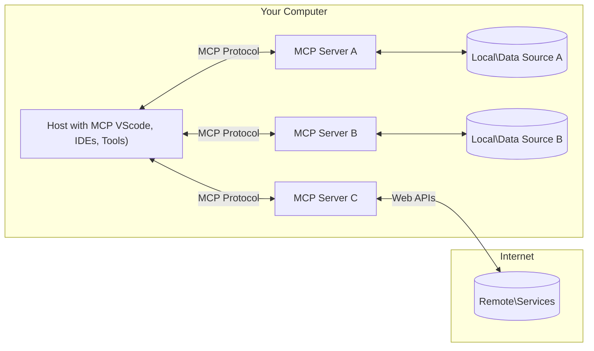

<!--
CO_OP_TRANSLATOR_METADATA:
{
  "original_hash": "355b12a5970c5c9e6db0bee970c751ba",
  "translation_date": "2025-07-13T16:16:47+00:00",
  "source_file": "01-CoreConcepts/README.md",
  "language_code": "sw"
}
-->
# 📖 MCP Dhana Muhimu: Kumudu Itifaki ya Muktadha wa Mfano kwa Uunganishaji wa AI

[Model Context Protocol (MCP)](https://github.com/modelcontextprotocol) ni mfumo wenye nguvu na uliopangwa kwa viwango unaoboreshwa kwa mawasiliano kati ya Modeli Kubwa za Lugha (LLMs) na zana za nje, programu, na vyanzo vya data. Mwongozo huu ulioboreshwa kwa SEO utakuelekeza kupitia dhana kuu za MCP, kuhakikisha unaelewa usanifu wake wa mteja-mtumiaji, vipengele muhimu, mbinu za mawasiliano, na mbinu bora za utekelezaji.

## Muhtasari

Somo hili linachunguza usanifu wa msingi na vipengele vinavyounda mfumo wa Model Context Protocol (MCP). Utajifunza kuhusu usanifu wa mteja-mtumiaji, vipengele muhimu, na mbinu za mawasiliano zinazochochea mwingiliano wa MCP.

## 👩‍🎓 Malengo Muhimu ya Kujifunza

Mwisho wa somo hili, utakuwa umeweza:

- Kuelewa usanifu wa mteja-mtumiaji wa MCP.
- Kutambua majukumu na wajibu wa Hosts, Clients, na Servers.
- Kuchambua sifa kuu zinazofanya MCP kuwa tabaka la uunganishaji lenye kubadilika.
- Kujifunza jinsi taarifa zinavyosambaa ndani ya mfumo wa MCP.
- Kupata maarifa ya vitendo kupitia mifano ya msimbo katika .NET, Java, Python, na JavaScript.

## 🔎 Usanifu wa MCP: Mtazamo wa Kina

Mfumo wa MCP umejengwa kwa mfano wa mteja-mtumiaji. Muundo huu wa moduli unaruhusu programu za AI kuingiliana na zana, hifadhidata, APIs, na rasilimali za muktadha kwa ufanisi. Hebu tugawanye usanifu huu katika vipengele vyake vya msingi.

Katika msingi wake, MCP hufuata usanifu wa mteja-mtumiaji ambapo programu mwenyeji inaweza kuungana na seva nyingi:



- **MCP Hosts**: Programu kama VSCode, Claude Desktop, IDEs, au zana za AI zinazotaka kupata data kupitia MCP
- **MCP Clients**: Wateja wa itifaki wanaoshikilia muunganisho wa 1:1 na seva
- **MCP Servers**: Programu nyepesi zinazotoa uwezo maalum kupitia Itifaki ya Muktadha wa Mfano iliyopangwa
- **Vyanzo vya Data vya Ndani**: Faili, hifadhidata, na huduma za kompyuta yako ambazo seva za MCP zinaweza kufikia kwa usalama
- **Huduma za Mbali**: Mifumo ya nje inayopatikana mtandaoni ambayo seva za MCP zinaweza kuungana nayo kupitia APIs.

Itifaki ya MCP ni kiwango kinachoendelea kuboreshwa, unaweza kuona masasisho ya hivi karibuni kwenye [maelezo ya itifaki](https://modelcontextprotocol.io/specification/2025-06-18/)

### 1. Hosts

Katika Model Context Protocol (MCP), Hosts huchukua nafasi muhimu kama kiolesura kikuu ambacho watumiaji hutumia kuingiliana na itifaki. Hosts ni programu au mazingira yanayoanzisha muunganisho na seva za MCP kupata data, zana, na maelekezo. Mifano ya Hosts ni pamoja na mazingira ya maendeleo yaliyojumuishwa (IDEs) kama Visual Studio Code, zana za AI kama Claude Desktop, au mawakala waliotengenezwa maalum kwa kazi fulani.

**Hosts** ni programu za LLM zinazozindua muunganisho. Wanahakikisha:

- Kutekeleza au kuingiliana na modeli za AI ili kuzalisha majibu.
- Kuanzisha muunganisho na seva za MCP.
- Kusimamia mtiririko wa mazungumzo na kiolesura cha mtumiaji.
- Kudhibiti ruhusa na vizingiti vya usalama.
- Kushughulikia idhini ya mtumiaji kwa kushiriki data na utekelezaji wa zana.

### 2. Clients

Clients ni vipengele muhimu vinavyorahisisha mwingiliano kati ya Hosts na seva za MCP. Clients hufanya kazi kama madalali, kuruhusu Hosts kufikia na kutumia uwezo unaotolewa na seva za MCP. Wanachukua jukumu muhimu kuhakikisha mawasiliano laini na kubadilishana data kwa ufanisi ndani ya usanifu wa MCP.

**Clients** ni viunganishi ndani ya programu mwenyeji. Wanahakikisha:

- Kutuma maombi kwa seva zenye maelekezo/instruksheni.
- Kujadiliana uwezo na seva.
- Kusimamia maombi ya utekelezaji wa zana kutoka kwa modeli.
- Kuchakata na kuonyesha majibu kwa watumiaji.

### 3. Servers

Seva zinahusika na kushughulikia maombi kutoka kwa wateja wa MCP na kutoa majibu yanayofaa. Zinadhibiti shughuli mbalimbali kama kupata data, utekelezaji wa zana, na uzalishaji wa maelekezo. Seva huhakikisha mawasiliano kati ya wateja na Hosts ni ya ufanisi na ya kuaminika, na kudumisha uadilifu wa mchakato wa mwingiliano.

**Servers** ni huduma zinazotoa muktadha na uwezo. Wanahakikisha:

- Kusajili sifa zinazopatikana (rasilimali, maelekezo, zana)
- Kupokea na kutekeleza simu za zana kutoka kwa mteja
- Kutoa taarifa za muktadha ili kuboresha majibu ya modeli
- Kurudisha matokeo kwa mteja
- Kudumisha hali katika mwingiliano inapohitajika

Seva zinaweza kuundwa na mtu yeyote ili kuongeza uwezo wa modeli kwa kazi maalum.

### 4. Sifa za Seva

Seva katika Model Context Protocol (MCP) hutoa vipengele vya msingi vinavyowezesha mwingiliano tajiri kati ya wateja, hosts, na modeli za lugha. Sifa hizi zimeundwa kuboresha uwezo wa MCP kwa kutoa muktadha uliopangwa, zana, na maelekezo.

Seva za MCP zinaweza kutoa mojawapo ya sifa zifuatazo:

#### 📑 Rasilimali

Rasilimali katika Model Context Protocol (MCP) zinajumuisha aina mbalimbali za muktadha na data zinazoweza kutumika na watumiaji au modeli za AI. Hizi ni pamoja na:

- **Data za Muktadha**: Taarifa na muktadha ambao watumiaji au modeli za AI wanaweza kutumia kwa maamuzi na utekelezaji wa kazi.
- **Misingi ya Maarifa na Hifadhidata za Nyaraka**: Mkusanyiko wa data iliyopangwa na isiyopangwa, kama makala, mikataba, na karatasi za utafiti, zinazotoa maarifa na taarifa muhimu.
- **Faili za Ndani na Hifadhidata**: Data iliyohifadhiwa ndani ya vifaa au hifadhidata, inayopatikana kwa usindikaji na uchambuzi.
- **APIs na Huduma za Mtandao**: Kiolesura na huduma za nje zinazotoa data na uwezo zaidi, kuruhusu uunganishaji na rasilimali na zana mbalimbali mtandaoni.

Mfano wa rasilimali unaweza kuwa muundo wa hifadhidata au faili inayoweza kufikiwa kama ifuatavyo:

```text
file://log.txt
database://schema
```

### 🤖 Maelekezo

Maelekezo katika Model Context Protocol (MCP) yanajumuisha templeti mbalimbali zilizotanguliwa na mifumo ya mwingiliano iliyoundwa kurahisisha mtiririko wa kazi za mtumiaji na kuboresha mawasiliano. Hizi ni pamoja na:

- **Ujumbe na Mtiririko wa Kazi uliopangwa**: Ujumbe na michakato iliyopangwa inayowaongoza watumiaji kupitia kazi na mwingiliano maalum.
- **Mifumo ya Mwingiliano Iliyoainishwa Kabla**: Mfululizo wa hatua na majibu yaliyopangwa yanayorahisisha mawasiliano thabiti na yenye ufanisi.
- **Templeti Maalum za Mazungumzo**: Templeti zinazoweza kubadilishwa kwa aina maalum za mazungumzo, kuhakikisha mwingiliano unaofaa na wa muktadha.

Templeti ya maelekezo inaweza kuonekana kama ifuatavyo:

```markdown
Generate a product slogan based on the following {{product}} with the following {{keywords}}
```

#### ⛏️ Zana

Zana katika Model Context Protocol (MCP) ni kazi ambazo modeli ya AI inaweza kutekeleza kufanya kazi maalum. Zana hizi zimeundwa kuongeza uwezo wa modeli ya AI kwa kutoa operesheni zilizopangwa na za kuaminika. Vipengele muhimu ni:

- **Kazi za modeli ya AI kutekeleza**: Zana ni kazi zinazotekelezwa ambazo modeli ya AI inaweza kuitumia kutekeleza kazi mbalimbali.
- **Jina la kipekee na Maelezo**: Kila zana ina jina la kipekee na maelezo ya kina yanayoelezea madhumuni na utendaji wake.
- **Vigezo na Matokeo**: Zana zinakubali vigezo maalum na kurudisha matokeo yaliyopangwa, kuhakikisha matokeo thabiti na yanayotarajiwa.
- **Kazi Zilizojitenga**: Zana hufanya kazi zilizojitenga kama utafutaji mtandaoni, mahesabu, na maswali ya hifadhidata.

Mfano wa zana unaweza kuonekana kama ifuatavyo:

```typescript
server.tool(
  "GetProducts",
  {
    pageSize: z.string().optional(),
    pageCount: z.string().optional()
  }, () => {
    // return results from API
  }
)
```

## Sifa za Mteja

Katika Model Context Protocol (MCP), wateja hutoa sifa kadhaa muhimu kwa seva, kuboresha utendaji na mwingiliano ndani ya itifaki. Moja ya sifa maarufu ni Sampuli.

### 👉 Sampuli

- **Tabia za Wakala Zinazoanzishwa na Seva**: Wateja huruhusu seva kuanzisha vitendo au tabia maalum kwa uhuru, kuboresha uwezo wa mfumo.
- **Mwingiliano wa Kurudia na LLM**: Sifa hii inaruhusu mwingiliano wa kurudia na modeli kubwa za lugha (LLMs), kuwezesha usindikaji wa kazi ngumu na wa mfululizo.
- **Kuomba Ukomo Zaidi wa Modeli**: Seva zinaweza kuomba ukomo zaidi kutoka kwa modeli, kuhakikisha majibu ni kamili na yanayofaa muktadha.

## Mtiririko wa Taarifa katika MCP

Model Context Protocol (MCP) inaeleza mtiririko uliopangwa wa taarifa kati ya hosts, clients, servers, na modeli. Kuelewa mtiririko huu husaidia kufafanua jinsi maombi ya mtumiaji yanavyosindikwa na jinsi zana za nje na data zinavyounganishwa katika majibu ya modeli.

- **Host Anaanzisha Muunganisho**  
  Programu mwenyeji (kama IDE au kiolesura cha mazungumzo) huanzisha muunganisho na seva ya MCP, kawaida kupitia STDIO, WebSocket, au usafirishaji mwingine unaoungwa mkono.

- **Mazungumzo ya Uwezo**  
  Mteja (aliyejumuishwa ndani ya host) na seva hubadilishana taarifa kuhusu sifa, zana, rasilimali, na matoleo ya itifaki wanayounga mkono. Hii huhakikisha pande zote zinaelewa uwezo uliopo kwa kikao.

- **Ombi la Mtumiaji**  
  Mtumiaji huingiliana na host (mfano, kuingiza maelekezo au amri). Host hukusanya maingizo haya na kuyapeleka kwa mteja kwa usindikaji.

- **Matumizi ya Rasilimali au Zana**  
  - Mteja anaweza kuomba muktadha au rasilimali zaidi kutoka kwa seva (kama faili, rekodi za hifadhidata, au makala za msingi wa maarifa) ili kuongeza uelewa wa modeli.
  - Ikiwa modeli inaona zana inahitajika (mfano, kupata data, kufanya mahesabu, au kuita API), mteja hutuma ombi la kuitisha zana kwa seva, akibainisha jina la zana na vigezo.

- **Utekelezaji wa Seva**  
  Seva hupokea ombi la rasilimali au zana, hufanya operesheni zinazohitajika (kama kuendesha kazi, kuuliza hifadhidata, au kupata faili), na kurudisha matokeo kwa mteja kwa muundo uliopangwa.

- **Uzalishaji wa Majibu**  
  Mteja huunganisha majibu ya seva (data za rasilimali, matokeo ya zana, n.k.) katika mwingiliano unaoendelea wa modeli. Modeli hutumia taarifa hii kuzalisha jibu kamili na linalofaa muktadha.

- **Uwasilishaji wa Matokeo**  
  Host hupokea matokeo ya mwisho kutoka kwa mteja na kuwasilisha kwa mtumiaji, mara nyingi ikiwa ni pamoja na maandishi yaliyotengenezwa na modeli na matokeo yoyote ya utekelezaji wa zana au utafutaji wa rasilimali.

Mtiririko huu unaruhusu MCP kuunga mkono programu za AI zenye mwingiliano wa hali ya juu, zenye ufahamu wa muktadha kwa kuunganisha modeli na zana za nje na vyanzo vya data kwa urahisi.

## Maelezo ya Itifaki

MCP (Model Context Protocol) imejengwa juu ya [JSON-RPC 2.0](https://www.jsonrpc.org/), ikitoa muundo wa ujumbe uliopangwa, usioegemea lugha kwa mawasiliano kati ya hosts, clients, na servers. Msingi huu unaruhusu mwingiliano wa kuaminika, uliopangwa, na unaoweza kupanuliwa kati ya majukwaa na lugha mbalimbali za programu.

### Sifa Muhimu za Itifaki

MCP inaongeza JSON-RPC 2.0 kwa miongozo ya ziada kwa kuitisha zana, upatikanaji wa rasilimali, na usimamizi wa maelekezo. Inasaidia tabaka mbalimbali za usafirishaji (STDIO, WebSocket, SSE) na kuruhusu mawasiliano salama, yanayoweza kupanuliwa, na yasiyoegemea lugha kati ya vipengele.

#### 🧢 Itifaki ya Msingi

- **Muundo wa Ujumbe wa JSON-RPC**: Maombi na majibu yote hutumia maelezo ya JSON-RPC 2.0, kuhakikisha muundo thabiti kwa simu za njia, vigezo, matokeo, na usimamizi wa makosa.
- **Muunganisho wenye Hali**: Vikao vya MCP hudumisha hali kati ya maombi mengi, kuunga mkono mazungumzo yanayoendelea, mkusanyiko wa muktadha, na usimamizi wa rasilimali.
- **Mazungumzo ya Uwezo**: Wakati wa kuanzisha muunganisho, wateja na seva hubadilishana taarifa kuhusu sifa zinazoungwa mkono, matoleo ya itifaki, zana, na rasilimali. Hii huhakikisha pande zote zinaelewa uwezo wa kila mmoja na zinaweza kubadilika ipasavyo.

#### ➕ Zana Zaidi

Hapa chini ni baadhi ya zana na nyongeza za itifaki ambazo MCP hutoa kuboresha uzoefu wa msanidi na kuwezesha matukio ya hali ya juu:

- **Chaguzi za Usanidi**: MCP inaruhusu usanidi wa vigezo vya kikao kwa njia ya mabadiliko, kama ruhusa za zana, upatikanaji wa rasilimali, na mipangilio ya modeli, iliyobinafsishwa kwa kila mwingiliano.
- **Ufuatiliaji wa Maendeleo**: Operesheni zinazochukua muda mrefu zinaweza kutoa taarifa za maendeleo, kuruhusu violesura vya mtumiaji vinavyojibu na uzoefu bora wakati wa kazi ngumu.
- **Kughairi Maombi**: Wateja wanaweza kughairi maombi yanayoendelea, kuruhusu watumiaji kuingilia kati operesheni ambazo hazihitajiki tena au zinachukua muda mrefu.
- **Ripoti za Makosa**: Ujumbe na nambari za makosa zilizopangwa husaidia kugundua matatizo, kushughulikia kushindwa kwa hila, na kutoa mrejesho unaoweza kutekelezeka kwa watumiaji na wasanidi.
- **Kufuatilia Kumbukumbu**: Wateja na seva wanaweza kutoa kumbukumbu zilizopangwa kwa ajili ya ukaguzi, utatuzi wa matatizo, na ufuatiliaji wa mwingiliano wa itifaki.

Kwa kutumia sifa hizi za itifaki, MCP huhakikisha mawasiliano thabiti, salama, na yenye kubadilika kati ya modeli za lugha na zana au vyanzo vya data vya nje.

### 🔐 Mambo ya Usalama

Utekelezaji wa MCP unapaswa kufuata kanuni kadhaa muhimu za usalama kuhakikisha mwingiliano salama na wa kuaminika:

- **Idhini na Udhibiti wa Mtumiaji**: Watumiaji lazima watoe idhini wazi kabla ya data yoyote kufikiwa au operesheni kufanywa. Wanapaswa kuwa na udhibiti wazi juu ya data inayoshirikiwa na hatua zinazoruhusiwa, zikiwa na violesura vya mtumiaji vinavyorahisisha ukaguzi na idhini ya shughuli.
- **Faragha ya Data**: Data za watumiaji zinapaswa kufichwa tu kwa idhini wazi na kulindwa kwa udhibiti wa upatikanaji unaofaa. Utekelezaji wa MCP lazima ulinde dhidi ya usambazaji usioidhinishwa wa data na kuhakikisha faragha inahifadhiwa katika mwingiliano wote.
- **Usalama wa Zana**: Kabla ya kuitisha zana yoyote, idhini wazi ya mtumiaji inahitajika. Watumiaji wanapaswa kuelewa kazi ya kila zana, na mipaka thabiti ya usalama lazima itekelezwe kuzuia utekelezaji usiofaa au hatari wa zana.

Kwa kufuata kanuni hizi, MCP huhakikisha kuwa imani, faragha, na usalama wa mtumiaji vinadumishwa katika
MCP inajumuisha dhana na mifumo kadhaa iliyojengwa ndani kwa ajili ya kusimamia usalama na idhini katika itifaki nzima:

1. **Udhibiti wa Ruhusa za Zana**:  
  Wateja wanaweza kubainisha ni zana gani mfano unaruhusiwa kutumia wakati wa kikao. Hii inahakikisha kuwa zana zilizoruhusiwa wazi ndizo zinazopatikana, kupunguza hatari ya shughuli zisizokusudiwa au hatari. Ruhusa zinaweza kusanidiwa kwa mabadiliko kulingana na mapendeleo ya mtumiaji, sera za shirika, au muktadha wa mazungumzo.

2. **Uthibitishaji**:  
  Seva zinaweza kuhitaji uthibitishaji kabla ya kutoa ruhusa za kutumia zana, rasilimali, au shughuli nyeti. Hii inaweza kuhusisha funguo za API, tokeni za OAuth, au mbinu nyingine za uthibitishaji. Uthibitishaji sahihi huhakikisha kuwa wateja na watumiaji waliothibitishwa tu ndio wanaweza kutumia uwezo wa seva.

3. **Uthibitishaji wa Vigezo**:  
  Uthibitishaji wa vigezo unatekelezwa kwa kila mara zana inapotumika. Kila zana huainisha aina, muundo, na vizingiti vinavyotarajiwa kwa vigezo vyake, na seva huhakikisha maombi yanayopokelewa yanakidhi vigezo hivyo. Hii inazuia pembejeo zisizo sahihi au hatari kufikia utekelezaji wa zana na husaidia kudumisha uadilifu wa shughuli.

4. **Kudhibiti Kiwango cha Matumizi**:  
  Ili kuzuia matumizi mabaya na kuhakikisha usawa wa rasilimali za seva, seva za MCP zinaweza kutekeleza udhibiti wa kiwango cha wito wa zana na upatikanaji wa rasilimali. Kiwango hiki kinaweza kutumika kwa mtumiaji mmoja, kikao, au kwa ujumla, na husaidia kulinda dhidi ya mashambulizi ya kukatiza huduma au matumizi makubwa ya rasilimali.

Kwa kuunganisha mifumo hii, MCP hutoa msingi salama wa kuunganisha mifano ya lugha na zana za nje na vyanzo vya data, huku ikiwapa watumiaji na waendelezaji udhibiti wa kina juu ya upatikanaji na matumizi.

## Ujumbe wa Itifaki

Mawasiliano ya MCP hutumia ujumbe wa JSON uliopangwa ili kuwezesha mawasiliano wazi na ya kuaminika kati ya wateja, seva, na mifano. Aina kuu za ujumbe ni:

- **Ombi la Mteja**  
  Hutumwa kutoka kwa mteja kwenda kwa seva, ujumbe huu kawaida unajumuisha:
  - Amri au maelekezo ya mtumiaji
  - Historia ya mazungumzo kwa muktadha
  - Usanidi wa zana na ruhusa
  - Metadata yoyote ya ziada au taarifa za kikao

- **Jibu la Mfano**  
  Hurejeshwa na mfano (kupitia mteja), ujumbe huu una:
  - Maandishi yaliyotengenezwa au ukamilishaji kulingana na maelekezo na muktadha
  - Maelekezo ya wito wa zana ikiwa mfano unaona zana inapaswa kuitwa
  - Marejeleo ya rasilimali au muktadha wa ziada inapohitajika

- **Ombi la Zana**  
  Hutumwa kutoka kwa mteja kwenda kwa seva wakati zana inahitaji kutekelezwa. Ujumbe huu unajumuisha:
  - Jina la zana inayotakiwa kuitwa
  - Vigezo vinavyohitajika na zana (vimehakikiwa kulingana na muundo wa zana)
  - Taarifa za muktadha au vitambulisho vya kufuatilia ombi

- **Jibu la Zana**  
  Hurejeshwa na seva baada ya kutekeleza zana. Ujumbe huu hutoa:
  - Matokeo ya utekelezaji wa zana (data iliyopangwa au maudhui)
  - Makosa au taarifa za hali ikiwa wito wa zana ulishindikana
  - Kwa hiari, metadata au kumbukumbu za ziada zinazohusiana na utekelezaji

Ujumbe huu uliopangwa huhakikisha kila hatua katika mchakato wa MCP ni wazi, inafuatiliwa, na inaweza kupanuliwa, ikisaidia hali za juu kama mazungumzo ya mizunguko mingi, mnyororo wa zana, na usimamizi thabiti wa makosa.

## Muhimu Kukumbuka

- MCP hutumia usanifu wa mteja-seva kuunganisha mifano na uwezo wa nje
- Mfumo unajumuisha wateja, mwenyeji, seva, zana, na vyanzo vya data
- Mawasiliano yanaweza kufanyika kupitia STDIO, SSE, au WebSockets
- Zana ndizo vitengo vya msingi vya utendaji vinavyowasilishwa kwa mifano
- Itifaki za mawasiliano zilizopangwa huhakikisha maingiliano thabiti

## Zoef

Buni zana rahisi ya MCP itakayokuwa na manufaa katika eneo lako. Bainisha:
1. Jina la zana hiyo
2. Vigezo itakavyokubali
3. Matokeo itakayorudisha
4. Jinsi mfano unaweza kutumia zana hii kutatua matatizo ya mtumiaji


---

## Ifuatayo

Ifuatayo: [Sura ya 2: Usalama](../02-Security/README.md)

**Kiarifu cha Kutotegemea**:  
Hati hii imetafsiriwa kwa kutumia huduma ya tafsiri ya AI [Co-op Translator](https://github.com/Azure/co-op-translator). Ingawa tunajitahidi kwa usahihi, tafadhali fahamu kwamba tafsiri za kiotomatiki zinaweza kuwa na makosa au upungufu wa usahihi. Hati ya asili katika lugha yake ya asili inapaswa kuchukuliwa kama chanzo cha mamlaka. Kwa taarifa muhimu, tafsiri ya kitaalamu inayofanywa na binadamu inapendekezwa. Hatubebei dhamana kwa kutoelewana au tafsiri potofu zinazotokana na matumizi ya tafsiri hii.