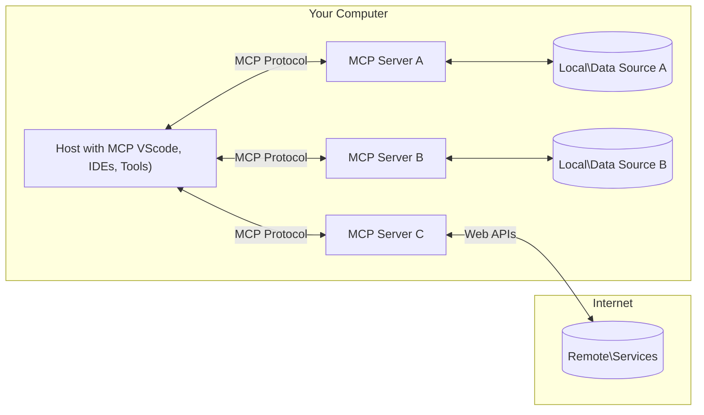

<!--
CO_OP_TRANSLATOR_METADATA:
{
  "original_hash": "b3b4a6ad10c3c0edbf7fa7cfa0ec496b",
  "translation_date": "2025-07-02T07:28:32+00:00",
  "source_file": "01-CoreConcepts/README.md",
  "language_code": "sw"
}
-->
# 📖 MCP Misingi ya Msingi: Kuweza Kufanya Kazi na Itifaki ya Muktadha wa Mfano kwa Uunganishaji wa AI

[Model Context Protocol (MCP)](https://github.com/modelcontextprotocol) ni mfumo wenye nguvu na uliopangwa kwa viwango unaoleta ufanisi katika mawasiliano kati ya Modeli Kubwa za Lugha (LLMs) na zana za nje, programu, na vyanzo vya data. Mwongozo huu ulioboreshwa kwa SEO utakuelekeza kupitia dhana kuu za MCP, kuhakikisha unaelewa muundo wa mteja-mtumiaji wake, vipengele muhimu, mbinu za mawasiliano, na mbinu bora za utekelezaji.

## Muhtasari

Somo hili linachunguza muundo wa msingi na vipengele vinavyojumuisha ekosistimu ya Model Context Protocol (MCP). Utajifunza kuhusu muundo wa mteja-mtumiaji, vipengele muhimu, na mbinu za mawasiliano zinazochochea mwingiliano wa MCP.

## 👩‍🎓 Malengo Muhimu ya Kujifunza

Mwisho wa somo hili, utakuwa umeweza:

- Kuelewa muundo wa mteja-mtumiaji wa MCP.
- Kutambua majukumu na wajibu wa Hosts, Clients, na Servers.
- Kuchambua sifa kuu zinazofanya MCP kuwa tabaka la uunganishaji lenye kubadilika.
- Kujifunza jinsi taarifa zinavyotiririka ndani ya ekosistimu ya MCP.
- Kupata maarifa ya vitendo kupitia mifano ya msimbo katika .NET, Java, Python, na JavaScript.

## 🔎 Muundo wa MCP: Mtazamo wa Kina

Ekosistimu ya MCP imejengwa juu ya mfano wa mteja-mtumiaji. Muundo huu wa moduli huruhusu programu za AI kuingiliana na zana, hifadhidata, APIs, na rasilimali za muktadha kwa ufanisi. Tuchambue muundo huu kwa vipengele vyake muhimu.

Katika msingi wake, MCP hufuata muundo wa mteja-mtumiaji ambapo programu mwenyeji inaweza kuunganishwa na seva nyingi:



- **MCP Hosts**: Programu kama VSCode, Claude Desktop, IDEs, au zana za AI zinazotaka kupata data kupitia MCP
- **MCP Clients**: Wateja wa itifaki wanaodumisha muunganisho wa 1:1 na seva
- **MCP Servers**: Programu nyepesi zinazotoa uwezo maalum kupitia Itifaki ya Muktadha wa Mfano iliyopangwa
- **Vyanzo vya Data vya Ndani**: Faili, hifadhidata, na huduma za kompyuta yako ambazo seva za MCP zinaweza kufikia kwa usalama
- **Huduma za Mbali**: Mifumo ya nje inayopatikana mtandaoni ambayo seva za MCP zinaweza kuunganishwa nayo kupitia APIs.

Itifaki ya MCP ni kiwango kinachobadilika; unaweza kuona masasisho ya hivi karibuni kwenye [maelezo ya itifaki](https://modelcontextprotocol.io/specification/2025-06-18/)

### 1. Hosts

Katika Model Context Protocol (MCP), Hosts hucheza jukumu muhimu kama kiolesura cha msingi ambacho watumiaji hutumia kuingiliana na itifaki. Hosts ni programu au mazingira yanayoanzisha muunganisho na seva za MCP ili kupata data, zana, na maelekezo. Mifano ya Hosts ni pamoja na mazingira ya maendeleo yaliyojumuishwa (IDEs) kama Visual Studio Code, zana za AI kama Claude Desktop, au mawakala waliotengenezwa maalum kwa kazi fulani.

**Hosts** ni programu za LLM zinazozindua muunganisho. Wanahakikisha:

- Kutekeleza au kuingiliana na modeli za AI kuzalisha majibu.
- Kuanzisha muunganisho na seva za MCP.
- Kusimamia mtiririko wa mazungumzo na kiolesura cha mtumiaji.
- Kudhibiti ruhusa na vizingiti vya usalama.
- Kushughulikia idhini ya mtumiaji kwa kushiriki data na utekelezaji wa zana.

### 2. Clients

Clients ni vipengele muhimu vinavyorahisisha mwingiliano kati ya Hosts na seva za MCP. Clients hufanya kazi kama madalali, kuwezesha Hosts kupata na kutumia uwezo unaotolewa na seva za MCP. Wanahakikisha mawasiliano laini na kubadilishana data kwa ufanisi ndani ya muundo wa MCP.

**Clients** ni viunganishi ndani ya programu mwenyeji. Wanahakikisha:

- Kutuma maombi kwa seva pamoja na maelekezo/maagizo.
- Kujadiliana uwezo na seva.
- Kusimamia maombi ya utekelezaji wa zana kutoka kwa modeli.
- Kusindika na kuonyesha majibu kwa watumiaji.

### 3. Servers

Seva zinahusika na kushughulikia maombi kutoka kwa wateja wa MCP na kutoa majibu yanayofaa. Zinadhibiti shughuli mbalimbali kama kupata data, utekelezaji wa zana, na uzalishaji wa maelekezo. Seva zinahakikisha mawasiliano kati ya wateja na Hosts ni yenye ufanisi na kuaminika, zikidumisha uadilifu wa mchakato wa mwingiliano.

**Servers** ni huduma zinazotoa muktadha na uwezo. Wanahakikisha:

- Kusajili vipengele vinavyopatikana (rasilimali, maelekezo, zana)
- Kupokea na kutekeleza simu za zana kutoka kwa mteja
- Kutoa taarifa za muktadha ili kuboresha majibu ya modeli
- Kurudisha matokeo kwa mteja
- Kudumisha hali katika mwingiliano inapohitajika

Seva zinaweza kutengenezwa na mtu yeyote kuongeza uwezo wa modeli kwa kazi maalum.

### 4. Vipengele vya Seva

Seva katika Model Context Protocol (MCP) hutoa vipengele vya msingi vinavyowezesha mwingiliano tajiri kati ya wateja, hosts, na modeli za lugha. Vipengele hivi vimeundwa kuboresha uwezo wa MCP kwa kutoa muktadha uliopangwa, zana, na maelekezo.

Seva za MCP zinaweza kutoa mojawapo ya vipengele vifuatavyo:

#### 📑 Rasilimali

Rasilimali katika Model Context Protocol (MCP) ni aina mbalimbali za muktadha na data zinazoweza kutumika na watumiaji au modeli za AI. Hizi ni pamoja na:

- **Data za Muktadha**: Taarifa na muktadha ambao watumiaji au modeli za AI wanaweza kutumia kwa maamuzi na utekelezaji wa kazi.
- **Misingi ya Maarifa na Hifadhidata za Nyaraka**: Mkusanyiko wa data zilizopangwa na zisizopangwa, kama makala, mikataba, na karatasi za utafiti, zinazotoa maarifa muhimu.
- **Faili za Ndani na Hifadhidata**: Data iliyohifadhiwa ndani ya vifaa au hifadhidata, inapatikana kwa ajili ya usindikaji na uchambuzi.
- **APIs na Huduma za Mtandao**: Kiolesura cha nje na huduma zinazotoa data na uwezo zaidi, kuwezesha uunganishaji na rasilimali na zana mbalimbali mtandaoni.

Mfano wa rasilimali inaweza kuwa muundo wa hifadhidata au faili inayoweza kufikiwa kama ifuatavyo:

```text
file://log.txt
database://schema
```

### 🤖 Maelekezo

Maelekezo katika Model Context Protocol (MCP) ni templeti mbalimbali zilizotanguliwa na mifumo ya mwingiliano iliyoundwa kurahisisha mtiririko wa kazi za mtumiaji na kuboresha mawasiliano. Hizi ni pamoja na:

- **Ujumbe na Mtiririko wa Kazi uliopangwa awali**: Ujumbe na michakato iliyopangwa inayowaongoza watumiaji kupitia kazi na mwingiliano maalum.
- **Mifumo ya Mwingiliano Iliyoainishwa Kabla**: Mfuatano uliopangwa wa hatua na majibu unaorahisisha mawasiliano thabiti na yenye ufanisi.
- **Templeti Maalum za Mazungumzo**: Templeti zinazoweza kubadilishwa kulingana na aina maalum za mazungumzo, kuhakikisha mwingiliano unaofaa na wenye muktadha.

Mfano wa templeti ya maelekezo unaweza kuonekana kama ifuatavyo:

```markdown
Generate a product slogan based on the following {{product}} with the following {{keywords}}
```

#### ⛏️ Zana

Zana katika Model Context Protocol (MCP) ni kazi ambazo modeli ya AI inaweza kutekeleza kufanya kazi maalum. Zana hizi zimeundwa kuongeza uwezo wa modeli ya AI kwa kutoa operesheni zilizo na muundo na zinazotegemewa. Vipengele muhimu ni:

- **Kazi zinazotekelezwa na modeli ya AI**: Zana ni kazi zinazoweza kuitwa na modeli ya AI kutekeleza kazi mbalimbali.
- **Jina la Kipekee na Maelezo**: Kila zana ina jina la kipekee na maelezo ya kina yanayoelezea kusudi na kazi yake.
- **Vigezo na Matokeo**: Zana zinapokea vigezo maalum na kurudisha matokeo yaliyo na muundo, kuhakikisha matokeo thabiti na yanayoweza kutabirika.
- **Kazi Zilizojitenga**: Zana hufanya kazi zilizo wazi kama utafutaji mtandaoni, hesabu, na maswali ya hifadhidata.

Mfano wa zana unaweza kuonekana kama ifuatavyo:

```typescript
server.tool(
  "GetProducts",
  {
    pageSize: z.string().optional(),
    pageCount: z.string().optional()
  }, () => {
    // return results from API
  }
)
```

## Vipengele vya Mteja

Katika Model Context Protocol (MCP), wateja hutoa vipengele kadhaa muhimu kwa seva, kuboresha utendaji na mwingiliano ndani ya itifaki. Moja ya vipengele vinavyoonekana ni Sampuli.

### 👉 Sampuli

- **Tabia za Wakala Zinazoanzishwa na Seva**: Wateja huruhusu seva kuanzisha vitendo au tabia maalum kwa kujitegemea, kuongeza uwezo wa mfumo.
- **Mwingiliano wa Kurudia na LLM**: Kipengele hiki huruhusu mwingiliano wa kurudia na modeli kubwa za lugha (LLMs), kuwezesha usindikaji wa kazi kwa hatua nyingi na changamano zaidi.
- **Kuomba Kukamilisha Zaidi kutoka kwa Modeli**: Seva zinaweza kuomba kukamilishwa zaidi kutoka kwa modeli, kuhakikisha majibu ni kamili na yanayofaa kwa muktadha.

## Mtiririko wa Taarifa katika MCP

Model Context Protocol (MCP) hufafanua mtiririko uliopangwa wa taarifa kati ya hosts, clients, servers, na modeli. Kuelewa mtiririko huu husaidia kufafanua jinsi maombi ya mtumiaji yanavyoshughulikiwa na jinsi zana za nje na data zinavyoingizwa katika majibu ya modeli.

- **Host Anaanzisha Muunganisho**  
  Programu mwenyeji (kama IDE au kiolesura cha mazungumzo) huanzisha muunganisho na seva ya MCP, kawaida kupitia STDIO, WebSocket, au usafirishaji mwingine unaoungwa mkono.

- **Majadiliano ya Uwezo**  
  Mteja (aliyeko ndani ya host) na seva hubadilishana taarifa kuhusu vipengele wanavyounga mkono, zana, rasilimali, na matoleo ya itifaki. Hii huhakikisha pande zote zinaelewa uwezo uliopo kwa kikao.

- **Ombi la Mtumiaji**  
  Mtumiaji huingiliana na host (mfano, kuingiza maelekezo au amri). Host hukusanya maingizo haya na kuyapeleka kwa mteja kwa usindikaji.

- **Matumizi ya Rasilimali au Zana**  
  - Mteja anaweza kuomba muktadha zaidi au rasilimali kutoka kwa seva (kama faili, rekodi za hifadhidata, au makala za misingi ya maarifa) ili kuongeza uelewa wa modeli.
  - Ikiwa modeli inaona zana inahitajika (mfano, kupata data, kufanya hesabu, au kuita API), mteja hutuma ombi la kuitwa kwa zana kwa seva, akibainisha jina la zana na vigezo.

- **Utekelezaji wa Seva**  
  Seva hupokea ombi la rasilimali au zana, hufanya operesheni zinazohitajika (kama kuendesha kazi, kuuliza hifadhidata, au kupata faili), na kurudisha matokeo kwa mteja kwa muundo uliopangwa.

- **Uzalishaji wa Majibu**  
  Mteja huunganisha majibu ya seva (data za rasilimali, matokeo ya zana, n.k.) katika mwingiliano unaoendelea wa modeli. Modeli hutumia taarifa hii kutoa jibu kamili na linalofaa kwa muktadha.

- **Uwasilishaji wa Matokeo**  
  Host hupokea matokeo ya mwisho kutoka kwa mteja na kuonyesha kwa mtumiaji, mara nyingi ikiwa ni pamoja na maandishi yaliyotengenezwa na modeli na matokeo yoyote kutoka kwa utekelezaji wa zana au utafutaji wa rasilimali.

Mtiririko huu huruhusu MCP kuunga mkono programu za AI zenye mwingiliano wa hali ya juu, zenye uelewa wa muktadha kwa kuunganisha modeli na zana za nje na vyanzo vya data kwa urahisi.

## Maelezo ya Itifaki

MCP (Model Context Protocol) imejengwa juu ya [JSON-RPC 2.0](https://www.jsonrpc.org/), ikitoa muundo wa ujumbe uliopangwa, usioegemea lugha, kwa mawasiliano kati ya hosts, clients, na servers. Msingi huu unaruhusu mwingiliano wa kuaminika, uliopangwa, na unaoweza kupanuliwa kati ya majukwaa na lugha mbalimbali za programu.

### Vipengele Muhimu vya Itifaki

MCP inaongeza JSON-RPC 2.0 kwa miongozo ya ziada kwa kuitwa kwa zana, upatikanaji wa rasilimali, na usimamizi wa maelekezo. Inasaidia tabaka mbalimbali za usafirishaji (STDIO, WebSocket, SSE) na kuwezesha mawasiliano salama, yanayoweza kupanuliwa, na yasiyegemea lugha kati ya vipengele.

#### 🧢 Itifaki ya Msingi

- **Muundo wa Ujumbe wa JSON-RPC**: Maombi na majibu yote hutumia maelezo ya JSON-RPC 2.0, kuhakikisha muundo thabiti kwa simu za njia, vigezo, matokeo, na usimamizi wa makosa.
- **Muunganisho unaodumisha Hali**: Vikao vya MCP hudumisha hali kati ya maombi mengi, kuunga mkono mazungumzo yanayoendelea, mkusanyiko wa muktadha, na usimamizi wa rasilimali.
- **Majadiliano ya Uwezo**: Wakati wa kuanzisha muunganisho, wateja na seva hubadilishana taarifa kuhusu vipengele vinavyounga mkono, matoleo ya itifaki, zana, na rasilimali. Hii huhakikisha pande zote zinaelewa uwezo wa kila mmoja na zinaweza kubadilika ipasavyo.

#### ➕ Zana Zaidi

Hapa chini ni baadhi ya zana za ziada na nyongeza za itifaki ambazo MCP hutoa kuboresha uzoefu wa mtengenezaji na kuwezesha matukio ya hali ya juu:

- **Chaguzi za Usanidi**: MCP huruhusu usanidi wa vigezo vya kikao kwa njia ya mabadiliko, kama ruhusa za zana, upatikanaji wa rasilimali, na mipangilio ya modeli, iliyobinafsishwa kwa kila mwingiliano.
- **Ufuatiliaji wa Maendeleo**: Operesheni zinazochukua muda mrefu zinaweza kutoa taarifa za maendeleo, kuwezesha kiolesura cha mtumiaji cha haraka na uzoefu bora wakati wa kazi ngumu.
- **Kughairi Maombi**: Wateja wanaweza kughairi maombi yanayoendelea, kuruhusu watumiaji kuingilia kati operesheni zisizohitajika au zinazoendelea kupita kiasi.
- **Ripoti za Makosa**: Ujumbe na nambari za makosa zilizopangwa husaidia kugundua matatizo, kushughulikia kushindwa kwa hila, na kutoa mrejesho wa vitendo kwa watumiaji na watengenezaji.
- **Kufuatilia (Logging)**: Wateja na seva wanaweza kutoa kumbukumbu zilizo na muundo kwa ajili ya ukaguzi, utatuzi wa matatizo, na ufuatiliaji wa mwingiliano wa itifaki.

Kwa kutumia vipengele hivi vya itifaki, MCP huhakikisha mawasiliano imara, salama, na yenye kubadilika kati ya modeli za lugha na zana au vyanzo vya data vya nje.

### 🔐 Mambo ya Usalama

Utekelezaji wa MCP unapaswa kufuata kanuni kadhaa muhimu za usalama ili kuhakikisha mwingiliano salama na wa kuaminika:

- **Idhini na Udhibiti wa Mtumiaji**: Watumiaji wanapaswa kutoa idhini wazi kabla ya data yoyote kufikiwa au operesheni kutekelezwa. Wanapaswa kuwa na udhibiti wazi juu ya data inayoshirikiwa na vitendo vinavyoruhusiwa, vinavyoungwa mkono na kiolesura rahisi cha mtumiaji kwa ukaguzi na idhini ya shughuli.
- **Faragha ya Data**: Data za watumiaji zinapaswa kufichwa tu kwa idhini wazi na kulindwa kwa udhibiti unaofaa wa upatikanaji. Utekelezaji wa MCP unapaswa kulinda dhidi ya usambazaji wa data usioidhinishwa na kuhakikisha faragha inadumishwa katika mwingiliano yote.
- **Usalama wa Zana**: Kabla ya kuitumia zana yoyote, idhini wazi ya mtumiaji inahitajika. Watumiaji wanapaswa kuelewa kazi ya kila zana, na mipaka imara ya usalama inapaswa kuwekwa kuzuia utekelezaji usio

**Kiadhabu**:  
Hati hii imetafsiriwa kwa kutumia huduma ya tafsiri ya AI [Co-op Translator](https://github.com/Azure/co-op-translator). Ingawa tunajitahidi kwa usahihi, tafadhali fahamu kwamba tafsiri za kiotomatiki zinaweza kuwa na makosa au upungufu wa usahihi. Hati asili katika lugha yake ya asili inapaswa kuchukuliwa kama chanzo cha mamlaka. Kwa taarifa muhimu, tafsiri ya kitaalamu inayofanywa na binadamu inapendekezwa. Hatuna dhamana kwa kutoelewana au tafsiri potofu zitakazotokana na matumizi ya tafsiri hii.