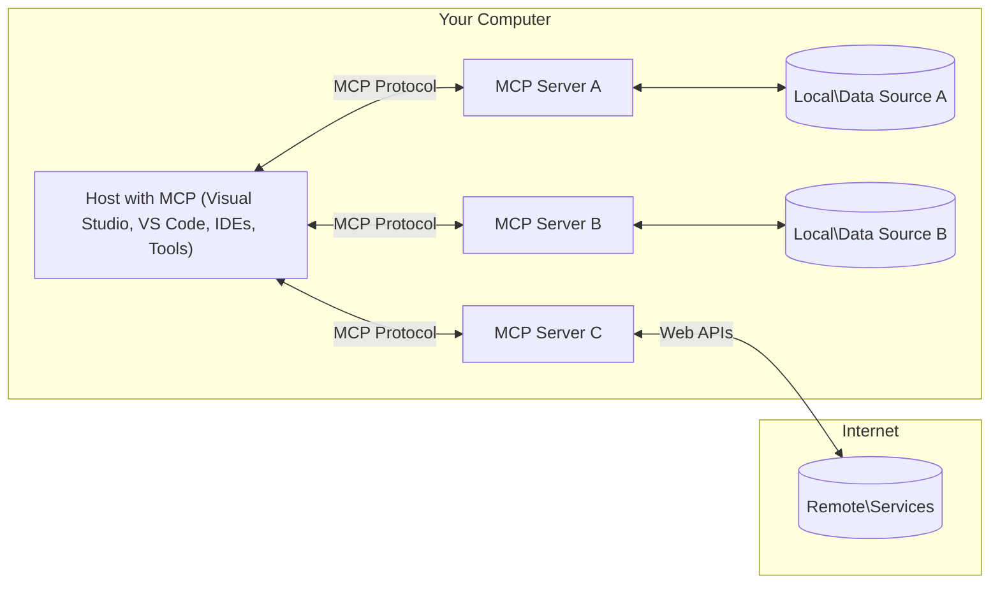

<!--
CO_OP_TRANSLATOR_METADATA:
{
  "original_hash": "0a6a7bcb289c024a91289e0444cb370b",
  "translation_date": "2025-08-19T14:24:55+00:00",
  "source_file": "01-CoreConcepts/README.md",
  "language_code": "sw"
}
-->
# MCP Misingi ya Kimsingi: Kuelewa Itifaki ya Muktadha wa Mfano kwa Muunganisho wa AI

[](https://youtu.be/earDzWGtE84)

_(Bofya picha hapo juu kutazama video ya somo hili)_

[Model Context Protocol (MCP)](https://gi- **Idhini ya Mtumiaji**: Ufikiaji wa data na operesheni zote zinahitaji idhini ya wazi kutoka kwa mtumiaji kabla ya utekelezaji. Watumiaji wanapaswa kuelewa wazi ni data gani itakayofikiwa na ni hatua gani zitakazochukuliwa, huku wakipewa udhibiti wa kina wa ruhusa na idhini.

- **Ulinzi wa Faragha ya Data**: Data ya mtumiaji inapaswa kufichuliwa tu kwa idhini ya wazi na lazima ilindwe na udhibiti madhubuti wa ufikiaji katika mzunguko mzima wa mwingiliano. Utekelezaji lazima uzuie usambazaji wa data bila idhini na kudumisha mipaka ya faragha.

- **Usalama wa Utekelezaji wa Zana**: Kila mwito wa zana unahitaji idhini ya wazi ya mtumiaji pamoja na ufahamu wa wazi wa utendaji wa zana, vigezo, na athari zinazoweza kutokea. Mipaka madhubuti ya usalama lazima izuie utekelezaji wa zana usiohitajika, usio salama, au wenye nia mbaya.

- **Usalama wa Tabaka la Usafirishaji**: Njia zote za mawasiliano zinapaswa kutumia mbinu sahihi za usimbaji na uthibitishaji. Muunganisho wa mbali unapaswa kutekeleza itifaki salama za usafirishaji na usimamizi sahihi wa hati za kuingia.

#### Miongozo ya Utekelezaji:

- **Usimamizi wa Ruhusa**: Tekeleza mifumo ya ruhusa ya kina inayoruhusu watumiaji kudhibiti ni seva, zana, na rasilimali gani zinapatikana  
- **Uthibitishaji na Idhini**: Tumia mbinu salama za uthibitishaji (OAuth, funguo za API) pamoja na usimamizi sahihi wa tokeni na muda wake  
- **Uthibitishaji wa Ingizo**: Thibitisha vigezo vyote na data ya ingizo kulingana na miundo iliyofafanuliwa ili kuzuia mashambulizi ya sindikizo  
- **Kumbukumbu za Ukaguzi**: Dumisha kumbukumbu za kina za operesheni zote kwa ufuatiliaji wa usalama na kufuata sheria  

## Muhtasari

Somo hili linachunguza usanifu wa msingi na vipengele vinavyounda mfumo wa Model Context Protocol (MCP). Utajifunza kuhusu usanifu wa mteja-seva, vipengele muhimu, na mifumo ya mawasiliano inayowezesha mwingiliano wa MCP.

## Malengo Muhimu ya Kujifunza

Mwisho wa somo hili, utakuwa na uwezo wa:

- Kuelewa usanifu wa mteja-seva wa MCP.
- Kutambua majukumu na wajibu wa Wenyeji, Wateja, na Seva.
- Kuchambua vipengele vya msingi vinavyofanya MCP kuwa safu rahisi ya muunganisho.
- Kujifunza jinsi taarifa zinavyosafiri ndani ya mfumo wa MCP.
- Kupata maarifa ya vitendo kupitia mifano ya msimbo katika .NET, Java, Python, na JavaScript.

## Usanifu wa MCP: Uchambuzi wa Kina

Mfumo wa MCP umejengwa juu ya modeli ya mteja-seva. Muundo huu wa moduli unaruhusu programu za AI kuingiliana na zana, hifadhidata, API, na rasilimali za muktadha kwa ufanisi. Hebu tuchambue usanifu huu katika vipengele vyake vya msingi.

Kwa msingi wake, MCP inafuata usanifu wa mteja-seva ambapo programu mwenyeji inaweza kuunganishwa na seva nyingi:



- **Wenyeji wa MCP**: Programu kama VSCode, Claude Desktop, IDE, au zana za AI zinazotaka kufikia data kupitia MCP  
- **Wateja wa MCP**: Wateja wa itifaki wanaodumisha muunganisho wa 1:1 na seva  
- **Seva za MCP**: Programu nyepesi zinazofichua uwezo maalum kupitia Model Context Protocol iliyosawazishwa  
- **Vyanzo vya Data vya Ndani**: Faili za kompyuta yako, hifadhidata, na huduma ambazo seva za MCP zinaweza kufikia kwa usalama  
- **Huduma za Mbali**: Mifumo ya nje inayopatikana kupitia mtandao ambayo seva za MCP zinaweza kuunganishwa nayo kupitia API.

Itifaki ya MCP ni kiwango kinachobadilika kinachotumia toleo la tarehe (muundo wa YYYY-MM-DD). Toleo la sasa la itifaki ni **2025-06-18**. Unaweza kuona masasisho ya hivi karibuni ya [maelezo ya itifaki](https://modelcontextprotocol.io/specification/2025-06-18/)

### 1. Wenyeji

Katika Model Context Protocol (MCP), **Wenyeji** ni programu za AI zinazohudumu kama kiolesura cha msingi ambacho watumiaji wanatumia kuingiliana na itifaki. Wenyeji husimamia na kudhibiti muunganisho na seva nyingi za MCP kwa kuunda wateja wa MCP maalum kwa kila muunganisho wa seva. Mifano ya Wenyeji ni pamoja na:

- **Programu za AI**: Claude Desktop, Visual Studio Code, Claude Code  
- **Mazingira ya Maendeleo**: IDE na wahariri wa msimbo wenye muunganisho wa MCP  
- **Programu Maalum**: Mawakala wa AI na zana zilizojengwa kwa madhumuni maalum  

**Wenyeji** ni programu zinazoratibu mwingiliano wa modeli za AI. Wanatekeleza:

- **Kuratibu Modeli za AI**: Kutekeleza au kuingiliana na LLM ili kutoa majibu na kuratibu mtiririko wa kazi za AI  
- **Kudhibiti Muunganisho wa Wateja**: Kuunda na kudumisha mteja mmoja wa MCP kwa kila muunganisho wa seva ya MCP  
- **Kudhibiti Kiolesura cha Mtumiaji**: Kushughulikia mtiririko wa mazungumzo, mwingiliano wa mtumiaji, na uwasilishaji wa majibu  
- **Kutekeleza Usalama**: Kudhibiti ruhusa, vikwazo vya usalama, na uthibitishaji  
- **Kushughulikia Idhini ya Mtumiaji**: Kusimamia idhini ya mtumiaji kwa kushiriki data na utekelezaji wa zana  

### 2. Wateja

**Wateja** ni vipengele muhimu vinavyodumisha muunganisho wa moja kwa moja kati ya Wenyeji na seva za MCP. Kila mteja wa MCP huanzishwa na Mwenyeji kuunganishwa na seva maalum ya MCP, kuhakikisha njia za mawasiliano zilizoandaliwa na salama. Wateja wengi huruhusu Wenyeji kuunganishwa na seva nyingi kwa wakati mmoja.

**Wateja** ni vipengele vya kiunganishi ndani ya programu mwenyeji. Wanatekeleza:

- **Mawasiliano ya Itifaki**: Kutuma maombi ya JSON-RPC 2.0 kwa seva na maelekezo  
- **Majadiliano ya Uwezo**: Kujadiliana vipengele vinavyoungwa mkono na matoleo ya itifaki na seva wakati wa kuanzisha  
- **Utekelezaji wa Zana**: Kusimamia maombi ya utekelezaji wa zana kutoka kwa modeli na kuchakata majibu  
- **Sasisho za Wakati Halisi**: Kushughulikia arifa na sasisho za wakati halisi kutoka kwa seva  
- **Usindikaji wa Majibu**: Kuchakata na kuunda majibu ya seva kwa kuonyesha kwa watumiaji  

### 3. Seva

**Seva** ni programu zinazotoa muktadha, zana, na uwezo kwa wateja wa MCP. Zinaweza kutekelezwa ndani (kwenye mashine sawa na Mwenyeji) au mbali (kwenye majukwaa ya nje), na zinawajibika kushughulikia maombi ya wateja na kutoa majibu yaliyoandaliwa. Seva hufichua utendaji maalum kupitia Model Context Protocol iliyosawazishwa.

**Seva** ni huduma zinazotoa muktadha na uwezo. Zinatekeleza:

- **Usajili wa Vipengele**: Kusajili na kufichua vipengele vinavyopatikana (rasilimali, maelekezo, zana) kwa wateja  
- **Usindikaji wa Maombi**: Kupokea na kutekeleza maombi ya zana, maombi ya rasilimali, na maombi ya maelekezo kutoka kwa wateja  
- **Utoaji wa Muktadha**: Kutoa taarifa za muktadha na data ili kuboresha majibu ya modeli  
- **Usimamizi wa Hali**: Kudumisha hali ya kikao na kushughulikia mwingiliano wa hali wakati inahitajika  
- **Arifa za Wakati Halisi**: Kutuma arifa kuhusu mabadiliko ya uwezo na sasisho kwa wateja waliounganishwa  

Seva zinaweza kuundwa na mtu yeyote ili kupanua uwezo wa modeli kwa utendaji maalum, na zinaunga mkono hali za utekelezaji wa ndani na wa mbali.

### 4. Vipengele vya Seva

Seva katika Model Context Protocol (MCP) hutoa **vipengele** vitatu vya msingi vinavyofafanua sehemu za msingi za mwingiliano tajiri kati ya wateja, wenyeji, na modeli za lugha. Vipengele hivi vinaelezea aina za taarifa za muktadha na hatua zinazopatikana kupitia itifaki.

Seva za MCP zinaweza kufichua mchanganyiko wowote wa vipengele vitatu vya msingi:

#### Rasilimali

**Rasilimali** ni vyanzo vya data vinavyotoa taarifa za muktadha kwa programu za AI. Zinawakilisha maudhui ya tuli au ya kubadilika yanayoweza kuboresha uelewa wa modeli na kufanya maamuzi:

- **Data ya Muktadha**: Taarifa zilizopangwa na muktadha kwa matumizi ya modeli za AI  
- **Misingi ya Maarifa**: Hifadhi za nyaraka, makala, miongozo, na karatasi za utafiti  
- **Vyanzo vya Data vya Ndani**: Faili, hifadhidata, na taarifa za mfumo wa ndani  
- **Data ya Nje**: Majibu ya API, huduma za mtandao, na data ya mfumo wa mbali  
- **Maudhui ya Kubadilika**: Data ya wakati halisi inayosasishwa kulingana na hali za nje  

Rasilimali zinatambuliwa na URIs na zinaunga mkono ugunduzi kupitia `resources/list` na upatikanaji kupitia `resources/read`:

```text
file://documents/project-spec.md
database://production/users/schema
api://weather/current
```

#### Maelekezo

**Maelekezo** ni templeti zinazoweza kutumika tena zinazosaidia kuunda mwingiliano na modeli za lugha. Zinatoa mifumo ya mwingiliano iliyosawazishwa na mtiririko wa kazi uliotemplatiwa:

- **Mwingiliano wa Kitempleti**: Ujumbe uliopangwa awali na vianzilishi vya mazungumzo  
- **Templeti za Mtiririko wa Kazi**: Mfululizo uliosawazishwa kwa kazi za kawaida na mwingiliano  
- **Mifano ya Few-shot**: Templeti za msingi wa mfano kwa maelekezo ya modeli  
- **Maelekezo ya Mfumo**: Maelekezo ya msingi yanayofafanua tabia ya modeli na muktadha  
- **Templeti za Kubadilika**: Maelekezo yenye vigezo vinavyobadilika kulingana na muktadha maalum  

Maelekezo yanaunga mkono uingizwaji wa vigezo na yanaweza kugunduliwa kupitia `prompts/list` na kupatikana kwa `prompts/get`:

```markdown
Generate a {{task_type}} for {{product}} targeting {{audience}} with the following requirements: {{requirements}}
```

#### Zana

**Zana** ni kazi zinazoweza kutekelezwa ambazo modeli za AI zinaweza kuziita ili kutekeleza hatua maalum. Zinawakilisha "vitenzi" vya mfumo wa MCP, kuwezesha modeli kuingiliana na mifumo ya nje:

- **Kazi Zinazoweza Kutekelezwa**: Operesheni za pekee ambazo modeli zinaweza kuziita na vigezo maalum  
- **Muunganisho wa Mfumo wa Nje**: Miito ya API, maswali ya hifadhidata, operesheni za faili, hesabu  
- **Utambulisho wa Kipekee**: Kila zana ina jina tofauti, maelezo, na muundo wa vigezo  
- **I/O Iliyosawazishwa**: Zana zinakubali vigezo vilivyothibitishwa na kurudisha majibu yaliyoandaliwa, yaliyopangwa  
- **Uwezo wa Hatua**: Kuwezesha modeli kutekeleza hatua halisi na kupata data ya moja kwa moja  

Zana zinafafanuliwa na JSON Schema kwa uthibitishaji wa vigezo na kugunduliwa kupitia `tools/list` na kutekelezwa kupitia `tools/call`:

```typescript
server.tool(
  "search_products", 
  {
    query: z.string().describe("Search query for products"),
    category: z.string().optional().describe("Product category filter"),
    max_results: z.number().default(10).describe("Maximum results to return")
  }, 
  async (params) => {
    // Execute search and return structured results
    return await productService.search(params);
  }
);
```

## Vipengele vya Mteja

Katika Model Context Protocol (MCP), **wateja** wanaweza kufichua vipengele vinavyowezesha seva kuomba uwezo wa ziada kutoka kwa programu mwenyeji. Vipengele hivi vya upande wa mteja huruhusu utekelezaji wa seva tajiri zaidi, wa mwingiliano zaidi, unaoweza kufikia uwezo wa modeli za AI na mwingiliano wa mtumiaji.

### Sampuli

**Sampuli** huruhusu seva kuomba ukamilishaji wa modeli za lugha kutoka kwa programu ya AI ya mteja. Kipengele hiki kinawezesha seva kufikia uwezo wa LLM bila kujumuisha utegemezi wa modeli zao wenyewe:

- **Ufikiaji Huru wa Modeli**: Seva zinaweza kuomba ukamilishaji bila kujumuisha SDK za LLM au kusimamia ufikiaji wa modeli  
- **AI Inayoanzishwa na Seva**: Inawezesha seva kuunda maudhui kwa uhuru kwa kutumia modeli ya AI ya mteja  
- **Mwingiliano wa LLM wa Kurejelea**: Inasaidia hali ngumu ambapo seva zinahitaji msaada wa AI kwa usindikaji  
- **Uundaji wa Maudhui ya Kubadilika**: Inaruhusu seva kuunda majibu ya muktadha kwa kutumia modeli ya mwenyeji  

Sampuli huanzishwa kupitia njia ya `sampling/complete`, ambapo seva hutuma maombi ya ukamilishaji kwa wateja.

### Utoaji  

**Utoaji** unawezesha seva kuomba taarifa ya ziada au uthibitisho kutoka kwa watumiaji kupitia kiolesura cha mteja:

- **Maombi ya Ingizo la Mtumiaji**: Seva zinaweza kuomba taarifa ya ziada inapohitajika kwa utekelezaji wa zana  
- **Vidirisha vya Uthibitisho**: Kuomba idhini ya mtumiaji kwa operesheni nyeti au zenye athari kubwa  
- **Mtiririko wa Kazi wa Mwingiliano**: Kuwezesha seva kuunda mwingiliano wa hatua kwa hatua na mtumiaji  
- **Ukusanyaji wa Vigezo vya Kubadilika**: Kukusanya vigezo vilivyokosekana au vya hiari wakati wa utekelezaji wa zana  

Maombi ya utoaji hufanywa kwa kutumia njia ya `elicitation/request` ili kukusanya ingizo la mtumiaji kupitia kiolesura cha mteja.

### Kumbukumbu

**Kumbukumbu** huruhusu seva kutuma ujumbe wa kumbukumbu ulioandaliwa kwa wateja kwa ajili ya urekebishaji, ufuatiliaji, na mwonekano wa operesheni:

- **Msaada wa Urekebishaji**: Kuwezesha seva kutoa kumbukumbu za kina za utekelezaji kwa utatuzi wa matatizo  
- **Ufuatiliaji wa Operesheni**: Kutuma masasisho ya hali na vipimo vya utendaji kwa wateja  
- **Ripoti ya Makosa**: Kutoa muktadha wa kina wa makosa na taarifa za uchunguzi  
- **Njia za Ukaguzi**: Kuunda kumbukumbu za kina za operesheni za seva na maamuzi  

Ujumbe wa kumbukumbu hutumwa kwa wateja ili kutoa uwazi katika operesheni za seva na kuwezesha urekebishaji.

## Mtiririko wa Taarifa katika MCP

Model Context Protocol (MCP) inafafanua mtiririko uliopangwa wa taarifa kati ya wenyeji, wateja, seva, na modeli. Kuelewa mtiririko huu husaidia kufafanua jinsi maombi ya mtumiaji yanavyosindikwa na jinsi zana za nje na data zinavyounganishwa katika majibu ya modeli.

- **Mwenyeji Anaanzisha Muunganisho**  
  Programu mwenyeji (kama IDE au kiolesura cha mazungumzo) huanzisha muunganisho na seva ya MCP, kwa kawaida kupitia STDIO, WebSocket, au njia nyingine inayoungwa mkono.

- **Majadiliano ya Uwezo**  
  Mteja (aliyejumuishwa katika mwenyeji) na seva hubadilishana taarifa kuhusu vipengele vinavyoungwa mkono, zana, rasilimali, na matoleo ya itifaki. Hii inahakikisha pande zote mbili zinaelewa uwezo gani unapatikana kwa kikao.

- **Ombi la Mtumiaji**  
  Mtumiaji huingiliana na mwenyeji (mfano, kuingiza maelekezo au amri). Mwenyeji hukusanya ingizo hili na kulipitisha kwa mteja kwa usindikaji.

- **Matumizi ya
- **Usimamizi wa Mzunguko wa Maisha**: Husimamia uanzishaji wa muunganisho, mazungumzo ya uwezo, na kumaliza kikao kati ya wateja na seva  
- **Vipengele vya Seva**: Huwezesha seva kutoa utendaji wa msingi kupitia zana, rasilimali, na maelekezo  
- **Vipengele vya Mteja**: Huwezesha seva kuomba sampuli kutoka kwa LLMs, kuchochea maoni ya mtumiaji, na kutuma ujumbe wa kumbukumbu  
- **Arifa za Wakati Halisi**: Inasaidia arifa za asinkroni kwa masasisho ya mabadiliko bila kuhitaji uchunguzi  

#### Vipengele Muhimu:

- **Mazungumzo ya Toleo la Itifaki**: Hutumia toleo la msingi wa tarehe (YYYY-MM-DD) kuhakikisha utangamano  
- **Ugunduzi wa Uwezo**: Wateja na seva hubadilishana taarifa za vipengele vinavyoungwa mkono wakati wa uanzishaji  
- **Vikao vya Hali**: Hudumisha hali ya muunganisho katika mwingiliano mbalimbali kwa mwendelezo wa muktadha  

### Safu ya Usafirishaji

**Safu ya Usafirishaji** husimamia njia za mawasiliano, muundo wa ujumbe, na uthibitishaji kati ya washiriki wa MCP:

#### Mbinu za Usafirishaji Zinazoungwa Mkono:

1. **Usafirishaji wa STDIO**:  
   - Hutumia mito ya pembejeo/pato la kawaida kwa mawasiliano ya moja kwa moja ya mchakato  
   - Inafaa kwa michakato ya ndani kwenye mashine moja bila mzigo wa mtandao  
   - Hutumika sana kwa utekelezaji wa seva za MCP za ndani  

2. **Usafirishaji wa HTTP Unaoweza Kutiririka**:  
   - Hutumia HTTP POST kwa ujumbe wa mteja-kwa-seva  
   - Tukio la Matukio Yanayotumwa na Seva (SSE) ni chaguo kwa utiririshaji wa seva-kwa-mteja  
   - Huwezesha mawasiliano ya seva ya mbali kupitia mitandao  
   - Inasaidia uthibitishaji wa kawaida wa HTTP (tokeni za kubeba, funguo za API, vichwa maalum)  
   - MCP inapendekeza OAuth kwa uthibitishaji salama wa msingi wa tokeni  

#### Utoaji wa Usafirishaji:

Safu ya usafirishaji hutoa maelezo ya mawasiliano kutoka kwa safu ya data, ikiruhusu muundo wa ujumbe wa JSON-RPC 2.0 sawa katika mbinu zote za usafirishaji. Utoaji huu huruhusu programu kubadilisha kati ya seva za ndani na za mbali bila shida.

### Masuala ya Usalama

Utekelezaji wa MCP lazima uzingatie kanuni kadhaa muhimu za usalama ili kuhakikisha mwingiliano salama, wa kuaminika, na salama katika operesheni zote za itifaki:

- **Idhini na Udhibiti wa Mtumiaji**: Watumiaji lazima watoe idhini ya wazi kabla ya data yoyote kufikiwa au operesheni kufanywa. Wanapaswa kuwa na udhibiti wazi juu ya data gani inashirikiwa na ni vitendo gani vinavyoruhusiwa, vikisaidiwa na miingiliano ya mtumiaji ya angavu kwa ukaguzi na idhini ya shughuli.  

- **Faragha ya Data**: Data ya mtumiaji inapaswa kufichuliwa tu kwa idhini ya wazi na lazima ilindwe na udhibiti sahihi wa ufikiaji. Utekelezaji wa MCP lazima ulinde dhidi ya usambazaji wa data usioidhinishwa na kuhakikisha faragha inahifadhiwa katika mwingiliano wote.  

- **Usalama wa Zana**: Kabla ya kutumia zana yoyote, idhini ya wazi ya mtumiaji inahitajika. Watumiaji wanapaswa kuwa na uelewa wazi wa utendaji wa kila zana, na mipaka madhubuti ya usalama lazima itekelezwe ili kuzuia utekelezaji wa zana usio wa kawaida au usio salama.  

Kwa kufuata kanuni hizi za usalama, MCP inahakikisha uaminifu wa mtumiaji, faragha, na usalama vinadumishwa katika mwingiliano wote wa itifaki huku ikiruhusu ujumuishaji wenye nguvu wa AI.

## Mifano ya Nambari: Vipengele Muhimu

Hapa chini kuna mifano ya nambari katika lugha kadhaa maarufu za programu inayoonyesha jinsi ya kutekeleza vipengele muhimu vya seva ya MCP na zana.

### Mfano wa .NET: Kuunda Seva Rahisi ya MCP na Zana

Huu ni mfano wa vitendo wa nambari ya .NET unaoonyesha jinsi ya kutekeleza seva rahisi ya MCP na zana maalum. Mfano huu unaonyesha jinsi ya kufafanua na kusajili zana, kushughulikia maombi, na kuunganisha seva kwa kutumia Itifaki ya Muktadha wa Mfano.

```csharp
using System;
using System.Threading.Tasks;
using ModelContextProtocol.Server;
using ModelContextProtocol.Server.Transport;
using ModelContextProtocol.Server.Tools;

public class WeatherServer
{
    public static async Task Main(string[] args)
    {
        // Create an MCP server
        var server = new McpServer(
            name: "Weather MCP Server",
            version: "1.0.0"
        );
        
        // Register our custom weather tool
        server.AddTool<string, WeatherData>("weatherTool", 
            description: "Gets current weather for a location",
            execute: async (location) => {
                // Call weather API (simplified)
                var weatherData = await GetWeatherDataAsync(location);
                return weatherData;
            });
        
        // Connect the server using stdio transport
        var transport = new StdioServerTransport();
        await server.ConnectAsync(transport);
        
        Console.WriteLine("Weather MCP Server started");
        
        // Keep the server running until process is terminated
        await Task.Delay(-1);
    }
    
    private static async Task<WeatherData> GetWeatherDataAsync(string location)
    {
        // This would normally call a weather API
        // Simplified for demonstration
        await Task.Delay(100); // Simulate API call
        return new WeatherData { 
            Temperature = 72.5,
            Conditions = "Sunny",
            Location = location
        };
    }
}

public class WeatherData
{
    public double Temperature { get; set; }
    public string Conditions { get; set; }
    public string Location { get; set; }
}
```

### Mfano wa Java: Vipengele vya Seva ya MCP

Mfano huu unaonyesha seva ya MCP na usajili wa zana sawa na mfano wa .NET hapo juu, lakini umetekelezwa kwa Java.

```java
import io.modelcontextprotocol.server.McpServer;
import io.modelcontextprotocol.server.McpToolDefinition;
import io.modelcontextprotocol.server.transport.StdioServerTransport;
import io.modelcontextprotocol.server.tool.ToolExecutionContext;
import io.modelcontextprotocol.server.tool.ToolResponse;

public class WeatherMcpServer {
    public static void main(String[] args) throws Exception {
        // Create an MCP server
        McpServer server = McpServer.builder()
            .name("Weather MCP Server")
            .version("1.0.0")
            .build();
            
        // Register a weather tool
        server.registerTool(McpToolDefinition.builder("weatherTool")
            .description("Gets current weather for a location")
            .parameter("location", String.class)
            .execute((ToolExecutionContext ctx) -> {
                String location = ctx.getParameter("location", String.class);
                
                // Get weather data (simplified)
                WeatherData data = getWeatherData(location);
                
                // Return formatted response
                return ToolResponse.content(
                    String.format("Temperature: %.1f°F, Conditions: %s, Location: %s", 
                    data.getTemperature(), 
                    data.getConditions(), 
                    data.getLocation())
                );
            })
            .build());
        
        // Connect the server using stdio transport
        try (StdioServerTransport transport = new StdioServerTransport()) {
            server.connect(transport);
            System.out.println("Weather MCP Server started");
            // Keep server running until process is terminated
            Thread.currentThread().join();
        }
    }
    
    private static WeatherData getWeatherData(String location) {
        // Implementation would call a weather API
        // Simplified for example purposes
        return new WeatherData(72.5, "Sunny", location);
    }
}

class WeatherData {
    private double temperature;
    private String conditions;
    private String location;
    
    public WeatherData(double temperature, String conditions, String location) {
        this.temperature = temperature;
        this.conditions = conditions;
        this.location = location;
    }
    
    public double getTemperature() {
        return temperature;
    }
    
    public String getConditions() {
        return conditions;
    }
    
    public String getLocation() {
        return location;
    }
}
```

### Mfano wa Python: Kujenga Seva ya MCP

Katika mfano huu tunaonyesha jinsi ya kujenga seva ya MCP kwa Python. Pia unaonyeshwa njia mbili tofauti za kuunda zana.

```python
#!/usr/bin/env python3
import asyncio
from mcp.server.fastmcp import FastMCP
from mcp.server.transports.stdio import serve_stdio

# Create a FastMCP server
mcp = FastMCP(
    name="Weather MCP Server",
    version="1.0.0"
)

@mcp.tool()
def get_weather(location: str) -> dict:
    """Gets current weather for a location."""
    # This would normally call a weather API
    # Simplified for demonstration
    return {
        "temperature": 72.5,
        "conditions": "Sunny",
        "location": location
    }

# Alternative approach using a class
class WeatherTools:
    @mcp.tool()
    def forecast(self, location: str, days: int = 1) -> dict:
        """Gets weather forecast for a location for the specified number of days."""
        # This would normally call a weather API forecast endpoint
        # Simplified for demonstration
        return {
            "location": location,
            "forecast": [
                {"day": i+1, "temperature": 70 + i, "conditions": "Partly Cloudy"}
                for i in range(days)
            ]
        }

# Instantiate the class to register its tools
weather_tools = WeatherTools()

# Start the server using stdio transport
if __name__ == "__main__":
    asyncio.run(serve_stdio(mcp))
```

### Mfano wa JavaScript: Kuunda Seva ya MCP

Mfano huu unaonyesha uundaji wa seva ya MCP kwa JavaScript na jinsi ya kusajili zana mbili zinazohusiana na hali ya hewa.

```javascript
// Using the official Model Context Protocol SDK
import { McpServer } from "@modelcontextprotocol/sdk/server/mcp.js";
import { StdioServerTransport } from "@modelcontextprotocol/sdk/server/stdio.js";
import { z } from "zod"; // For parameter validation

// Create an MCP server
const server = new McpServer({
  name: "Weather MCP Server",
  version: "1.0.0"
});

// Define a weather tool
server.tool(
  "weatherTool",
  {
    location: z.string().describe("The location to get weather for")
  },
  async ({ location }) => {
    // This would normally call a weather API
    // Simplified for demonstration
    const weatherData = await getWeatherData(location);
    
    return {
      content: [
        { 
          type: "text", 
          text: `Temperature: ${weatherData.temperature}°F, Conditions: ${weatherData.conditions}, Location: ${weatherData.location}` 
        }
      ]
    };
  }
);

// Define a forecast tool
server.tool(
  "forecastTool",
  {
    location: z.string(),
    days: z.number().default(3).describe("Number of days for forecast")
  },
  async ({ location, days }) => {
    // This would normally call a weather API
    // Simplified for demonstration
    const forecast = await getForecastData(location, days);
    
    return {
      content: [
        { 
          type: "text", 
          text: `${days}-day forecast for ${location}: ${JSON.stringify(forecast)}` 
        }
      ]
    };
  }
);

// Helper functions
async function getWeatherData(location) {
  // Simulate API call
  return {
    temperature: 72.5,
    conditions: "Sunny",
    location: location
  };
}

async function getForecastData(location, days) {
  // Simulate API call
  return Array.from({ length: days }, (_, i) => ({
    day: i + 1,
    temperature: 70 + Math.floor(Math.random() * 10),
    conditions: i % 2 === 0 ? "Sunny" : "Partly Cloudy"
  }));
}

// Connect the server using stdio transport
const transport = new StdioServerTransport();
server.connect(transport).catch(console.error);

console.log("Weather MCP Server started");
```

Mfano huu wa JavaScript unaonyesha jinsi ya kuunda mteja wa MCP anayejumuika na seva, kutuma maelekezo, na kushughulikia majibu ikiwa ni pamoja na miito yoyote ya zana iliyofanywa.

## Usalama na Idhini

MCP inajumuisha dhana kadhaa zilizojengwa ndani na mifumo ya kusimamia usalama na idhini katika itifaki:

1. **Udhibiti wa Ruhusa za Zana**:  
   Wateja wanaweza kubainisha ni zana gani mfano unaruhusiwa kutumia wakati wa kikao. Hii inahakikisha kwamba zana zilizoidhinishwa tu zinapatikana, kupunguza hatari ya operesheni zisizotarajiwa au zisizo salama. Ruhusa zinaweza kusanidiwa kwa njia ya nguvu kulingana na mapendeleo ya mtumiaji, sera za shirika, au muktadha wa mwingiliano.  

2. **Uthibitishaji**:  
   Seva zinaweza kuhitaji uthibitishaji kabla ya kutoa ufikiaji wa zana, rasilimali, au operesheni nyeti. Hii inaweza kuhusisha funguo za API, tokeni za OAuth, au mifumo mingine ya uthibitishaji. Uthibitishaji sahihi unahakikisha kwamba wateja na watumiaji wanaoaminika pekee wanaweza kutumia uwezo wa seva.  

3. **Uthibitishaji wa Vigezo**:  
   Uthibitishaji wa vigezo unatekelezwa kwa miito yote ya zana. Kila zana hufafanua aina zinazotarajiwa, miundo, na vikwazo vya vigezo vyake, na seva inathibitisha maombi yanayoingia ipasavyo. Hii huzuia pembejeo mbovu au yenye nia mbaya kufikia utekelezaji wa zana na husaidia kudumisha uadilifu wa operesheni.  

4. **Upunguzaji wa Kiwango**:  
   Ili kuzuia matumizi mabaya na kuhakikisha matumizi ya haki ya rasilimali za seva, seva za MCP zinaweza kutekeleza upunguzaji wa kiwango kwa miito ya zana na ufikiaji wa rasilimali. Viwango vya kiwango vinaweza kutumika kwa kila mtumiaji, kwa kila kikao, au kwa ujumla, na husaidia kulinda dhidi ya mashambulizi ya kukataa huduma au matumizi ya rasilimali kupita kiasi.  

Kwa kuchanganya mifumo hii, MCP hutoa msingi salama wa kuunganisha mifano ya lugha na zana za nje na vyanzo vya data, huku ikiwapa watumiaji na watengenezaji udhibiti wa kina juu ya ufikiaji na matumizi.

## Ujumbe wa Itifaki na Mtiririko wa Mawasiliano

Mawasiliano ya MCP hutumia ujumbe uliopangwa wa **JSON-RPC 2.0** kuwezesha mwingiliano wazi na wa kuaminika kati ya majesiti, wateja, na seva. Itifaki hufafanua mifumo maalum ya ujumbe kwa aina tofauti za operesheni:

### Aina za Ujumbe Muhimu:

#### **Ujumbe wa Uanzishaji**  
- **Ombi la `initialize`**: Huanzisha muunganisho na kujadili toleo la itifaki na uwezo  
- **Jibu la `initialize`**: Linathibitisha vipengele vinavyoungwa mkono na taarifa za seva  
- **`notifications/initialized`**: Inaashiria kwamba uanzishaji umekamilika na kikao kiko tayari  

#### **Ujumbe wa Ugunduzi**  
- **Ombi la `tools/list`**: Kugundua zana zinazopatikana kutoka kwa seva  
- **Ombi la `resources/list`**: Orodhesha rasilimali zinazopatikana (vyanzo vya data)  
- **Ombi la `prompts/list`**: Kupata templeti za maelekezo zinazopatikana  

#### **Ujumbe wa Utekelezaji**  
- **Ombi la `tools/call`**: Kutekeleza zana maalum na vigezo vilivyotolewa  
- **Ombi la `resources/read`**: Kupata maudhui kutoka kwa rasilimali maalum  
- **Ombi la `prompts/get`**: Kupata templeti ya maelekezo na vigezo vya hiari  

#### **Ujumbe wa Upande wa Mteja**  
- **Ombi la `sampling/complete`**: Seva inaomba kukamilisha LLM kutoka kwa mteja  
- **`elicitation/request`**: Seva inaomba maoni ya mtumiaji kupitia kiolesura cha mteja  
- **Ujumbe wa Kumbukumbu**: Seva inatuma ujumbe wa kumbukumbu uliopangwa kwa mteja  

#### **Ujumbe wa Arifa**  
- **`notifications/tools/list_changed`**: Seva inaarifu mteja kuhusu mabadiliko ya zana  
- **`notifications/resources/list_changed`**: Seva inaarifu mteja kuhusu mabadiliko ya rasilimali  
- **`notifications/prompts/list_changed`**: Seva inaarifu mteja kuhusu mabadiliko ya maelekezo  

### Muundo wa Ujumbe:

Ujumbe wote wa MCP hufuata muundo wa JSON-RPC 2.0 na:  
- **Ujumbe wa Ombi**: Unajumuisha `id`, `method`, na `params` ya hiari  
- **Ujumbe wa Jibu**: Unajumuisha `id` na aidha `result` au `error`  
- **Ujumbe wa Arifa**: Unajumuisha `method` na `params` ya hiari (hakuna `id` au jibu linalotarajiwa)  

Mawasiliano haya yaliyopangwa huhakikisha mwingiliano wa kuaminika, unaoweza kufuatiliwa, na unaoweza kupanuliwa unaounga mkono hali za juu kama masasisho ya wakati halisi, mnyororo wa zana, na utunzaji thabiti wa makosa.

## Mambo Muhimu ya Kuzingatia

- **Muundo**: MCP hutumia muundo wa mteja-seva ambapo majesiti husimamia miunganisho mingi ya mteja kwa seva  
- **Washiriki**: Mfumo unajumuisha majesiti (programu za AI), wateja (viunganishi vya itifaki), na seva (watoa uwezo)  
- **Mbinu za Usafirishaji**: Mawasiliano yanaunga mkono STDIO (ya ndani) na HTTP inayoweza kutiririka na SSE ya hiari (ya mbali)  
- **Vipengele Muhimu**: Seva hufichua zana (kazi zinazoweza kutekelezwa), rasilimali (vyanzo vya data), na maelekezo (templeti)  
- **Vipengele vya Mteja**: Seva zinaweza kuomba sampuli (ukamilishaji wa LLM), uchochezi (maoni ya mtumiaji), na kumbukumbu kutoka kwa wateja  
- **Msingi wa Itifaki**: Imejengwa juu ya JSON-RPC 2.0 na toleo la msingi wa tarehe (sasa: 2025-06-18)  
- **Uwezo wa Wakati Halisi**: Inasaidia arifa kwa masasisho ya mabadiliko na usawazishaji wa wakati halisi  
- **Usalama Kwanza**: Idhini ya wazi ya mtumiaji, ulinzi wa faragha ya data, na usafirishaji salama ni mahitaji ya msingi  

## Zoezi

Buni zana rahisi ya MCP ambayo itakuwa muhimu katika uwanja wako. Fafanua:  
1. Jina la zana hiyo  
2. Vigezo ambavyo itakubali  
3. Matokeo ambayo itarudisha  
4. Jinsi mfano unaweza kutumia zana hii kutatua matatizo ya mtumiaji  

---

## Kinachofuata

Kinachofuata: [Sura ya 2: Usalama](../02-Security/README.md)

**Kanusho**:  
Hati hii imetafsiriwa kwa kutumia huduma ya tafsiri ya AI [Co-op Translator](https://github.com/Azure/co-op-translator). Ingawa tunajitahidi kuhakikisha usahihi, tafadhali fahamu kuwa tafsiri za kiotomatiki zinaweza kuwa na makosa au kutokuwa sahihi. Hati asilia katika lugha yake ya awali inapaswa kuchukuliwa kama chanzo cha mamlaka. Kwa taarifa muhimu, tafsiri ya kitaalamu ya binadamu inapendekezwa. Hatutawajibika kwa kutoelewana au tafsiri zisizo sahihi zinazotokana na matumizi ya tafsiri hii.