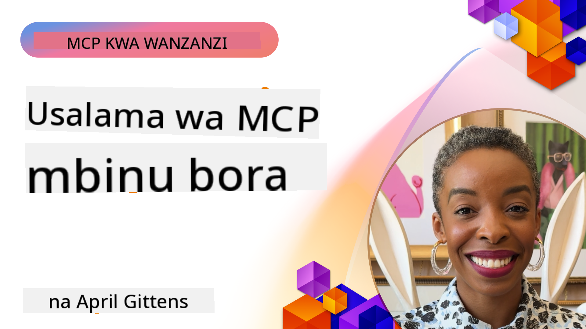

<!--
CO_OP_TRANSLATOR_METADATA:
{
  "original_hash": "1c767a35642f753127dc08545c25a290",
  "translation_date": "2025-08-19T14:36:19+00:00",
  "source_file": "02-Security/README.md",
  "language_code": "sw"
}
-->
# Usalama wa MCP: Ulinzi Kamili kwa Mifumo ya AI

_(Bofya picha hapo juu kutazama video ya somo hili)_

Usalama ni msingi wa usanifu wa mifumo ya AI, ndiyo sababu tunaupa kipaumbele kama sehemu yetu ya pili. Hii inalingana na kanuni ya Microsoft ya **Secure by Design** kutoka [Secure Future Initiative](https://www.microsoft.com/security/blog/2025/04/17/microsofts-secure-by-design-journey-one-year-of-success/).

Model Context Protocol (MCP) inaleta uwezo mpya wenye nguvu kwa programu zinazoendeshwa na AI huku ikianzisha changamoto za kipekee za usalama zinazozidi hatari za kawaida za programu. Mifumo ya MCP inakabiliwa na masuala ya usalama yaliyopo (kama usimbaji salama, upatikanaji wa chini kabisa, usalama wa mnyororo wa usambazaji) pamoja na vitisho vipya maalum vya AI kama sindano ya maelekezo (prompt injection), uchafuzi wa zana, utekaji wa vikao, mashambulizi ya naibu aliyedanganywa, udhaifu wa kupitisha tokeni, na mabadiliko ya uwezo wa nguvu.

Somo hili linachunguza hatari muhimu zaidi za usalama katika utekelezaji wa MCP—ikijumuisha uthibitishaji, ruhusa, ruhusa za kupita kiasi, sindano isiyo ya moja kwa moja ya maelekezo, usalama wa vikao, matatizo ya naibu aliyedanganywa, usimamizi wa tokeni, na udhaifu wa mnyororo wa usambazaji. Utajifunza vidhibiti vya utekelezaji na miongozo bora ya kupunguza hatari hizi huku ukitumia suluhisho za Microsoft kama Prompt Shields, Azure Content Safety, na GitHub Advanced Security kuimarisha utekelezaji wako wa MCP.

## Malengo ya Kujifunza

Ifikapo mwisho wa somo hili, utaweza:

- **Kutambua Vitisho Maalum vya MCP**: Kutambua hatari za kipekee za usalama katika mifumo ya MCP kama sindano ya maelekezo, uchafuzi wa zana, ruhusa za kupita kiasi, utekaji wa vikao, matatizo ya naibu aliyedanganywa, udhaifu wa kupitisha tokeni, na hatari za mnyororo wa usambazaji
- **Kutumia Vidhibiti vya Usalama**: Kutekeleza hatua madhubuti kama uthibitishaji thabiti, upatikanaji wa chini kabisa, usimamizi salama wa tokeni, vidhibiti vya usalama wa vikao, na uhakiki wa mnyororo wa usambazaji
- **Kutumia Suluhisho za Usalama za Microsoft**: Kuelewa na kutumia Microsoft Prompt Shields, Azure Content Safety, na GitHub Advanced Security kwa ulinzi wa mzigo wa kazi wa MCP
- **Kuthibitisha Usalama wa Zana**: Kutambua umuhimu wa uthibitishaji wa metadata ya zana, ufuatiliaji wa mabadiliko ya nguvu, na kujilinda dhidi ya mashambulizi ya sindano isiyo ya moja kwa moja ya maelekezo
- **Kujumuisha Miongozo Bora**: Kuchanganya misingi ya usalama iliyothibitishwa (kama usimbaji salama, kuimarisha seva, zero trust) na vidhibiti maalum vya MCP kwa ulinzi kamili

# Usanifu wa Usalama wa MCP na Vidhibiti

Utekelezaji wa kisasa wa MCP unahitaji mbinu za usalama za tabaka nyingi zinazoshughulikia vitisho vya kawaida vya programu na vile maalum vya AI. Maelezo ya MCP yanayoendelea kubadilika yanaendelea kuimarisha vidhibiti vyake vya usalama, kuwezesha ujumuishaji bora na usanifu wa usalama wa biashara na miongozo bora iliyothibitishwa.

Utafiti kutoka [Ripoti ya Ulinzi wa Kidijitali ya Microsoft](https://aka.ms/mddr) unaonyesha kuwa **asilimia 98 ya uvunjaji wa usalama ulioripotiwa ungeweza kuzuiwa kwa usafi thabiti wa usalama**. Mkakati bora wa ulinzi unachanganya mazoea ya msingi ya usalama na vidhibiti maalum vya MCP—hatua za msingi za usalama zilizothibitishwa ndizo zenye athari kubwa zaidi katika kupunguza hatari ya jumla ya usalama.

## Mazingira ya Sasa ya Usalama

> **Note:** Taarifa hii inaonyesha viwango vya usalama vya MCP kufikia **Agosti 18, 2025**. Itifaki ya MCP inaendelea kubadilika haraka, na utekelezaji wa siku zijazo unaweza kuanzisha mifumo mipya ya uthibitishaji na vidhibiti vilivyoboreshwa. Daima rejelea [Maelezo ya MCP ya Sasa](https://spec.modelcontextprotocol.io/), [Hifadhi ya MCP GitHub](https://github.com/modelcontextprotocol), na [nyaraka za miongozo bora ya usalama](https://modelcontextprotocol.io/specification/2025-06-18/basic/security_best_practices) kwa mwongozo wa hivi karibuni.

### Mageuzi ya Uthibitishaji wa MCP

Maelezo ya MCP yamebadilika sana katika mbinu yake ya uthibitishaji na ruhusa:

- **Mbinu ya Awali**: Maelezo ya awali yaliwataka watengenezaji kutekeleza seva za uthibitishaji maalum, huku seva za MCP zikifanya kazi kama Seva za Uidhinishaji za OAuth 2.0 zikisimamia uthibitishaji wa watumiaji moja kwa moja
- **Kiwango cha Sasa (2025-06-18)**: Maelezo yaliyosasishwa yanaruhusu seva za MCP kuhamisha uthibitishaji kwa watoa huduma wa kitambulisho wa nje (kama Microsoft Entra ID), kuboresha hali ya usalama na kupunguza ugumu wa utekelezaji
- **Usalama wa Safu ya Usafiri**: Msaada ulioboreshwa kwa mifumo salama ya usafiri yenye mifumo sahihi ya uthibitishaji kwa miunganisho ya ndani (STDIO) na ya mbali (Streamable HTTP)

## Usalama wa Uthibitishaji na Ruhusa

### Changamoto za Sasa za Usalama

Utekelezaji wa kisasa wa MCP unakabiliwa na changamoto kadhaa za uthibitishaji na ruhusa:

### Hatari na Njia za Mashambulizi

- **Mantiki ya Ruhusa Isiyosanifiwa Vizuri**: Utekelezaji mbovu wa ruhusa katika seva za MCP unaweza kufichua data nyeti na kutumia vibaya vidhibiti vya upatikanaji
- **Kompromasi ya Tokeni ya OAuth**: Wizi wa tokeni za seva za MCP za ndani unawawezesha washambuliaji kujifanya seva na kufikia huduma za chini
- **Udhaifu wa Kupitisha Tokeni**: Ushughulikiaji mbaya wa tokeni huunda njia za kupitisha vidhibiti vya usalama na mapengo ya uwajibikaji
- **Ruhusa za Kupita Kiasi**: Seva za MCP zenye ruhusa nyingi zinakiuka kanuni za upatikanaji wa chini kabisa na kupanua nyuso za mashambulizi

#### Kupitisha Tokeni: Muundo wa Hatari Sana

**Kupitisha tokeni kunakatazwa kabisa** katika maelezo ya sasa ya ruhusa ya MCP kutokana na athari kubwa za usalama:

##### Kupitishwa kwa Vidhibiti vya Usalama
- Seva za MCP na API za chini hutekeleza vidhibiti muhimu vya usalama (kama upunguzaji wa kiwango, uthibitishaji wa maombi, ufuatiliaji wa trafiki) vinavyotegemea uthibitishaji sahihi wa tokeni
- Matumizi ya moja kwa moja ya tokeni za mteja kwa API hupuuza ulinzi huu muhimu, na kudhoofisha usanifu wa usalama

##### Changamoto za Uwajibikaji na Ukaguzi  
- Seva za MCP haziwezi kutofautisha kati ya wateja wanaotumia tokeni zilizotolewa na mifumo ya juu, na kuvunja njia za ukaguzi
- Magogo ya seva za rasilimali za chini yanaonyesha asili za maombi zisizo sahihi badala ya wapatanishi halisi wa seva za MCP
- Uchunguzi wa matukio na ukaguzi wa kufuata sheria huwa mgumu zaidi

##### Hatari za Utoroshaji wa Data
- Madai ya tokeni yasiyothibitishwa yanawawezesha wahusika waovu wenye tokeni zilizoibiwa kutumia seva za MCP kama njia za kutorosha data
- Ukiukaji wa mipaka ya uaminifu huruhusu mifumo ya upatikanaji isiyoidhinishwa inayopuuza vidhibiti vya usalama vilivyokusudiwa

##### Njia za Mashambulizi ya Huduma Nyingi
- Tokeni zilizokompromasi zinazokubaliwa na huduma nyingi huruhusu harakati za upande katika mifumo iliyounganishwa
- Dhana za uaminifu kati ya huduma zinaweza kuvunjwa wakati asili za tokeni haziwezi kuthibitishwa

### Vidhibiti vya Usalama na Hatua za Kupunguza

**Mahitaji Muhimu ya Usalama:**

> **LAZIMA**: Seva za MCP **HAZIRUHUSIWI** kukubali tokeni zozote ambazo hazikutolewa mahsusi kwa seva ya MCP

#### Vidhibiti vya Uthibitishaji na Ruhusa

- **Ukaguzi Mkali wa Ruhusa**: Fanya ukaguzi wa kina wa mantiki ya ruhusa ya seva za MCP ili kuhakikisha kuwa ni watumiaji na wateja waliokusudiwa pekee wanaweza kufikia rasilimali nyeti
  - **Mwongozo wa Utekelezaji**: [Azure API Management kama Lango la Uthibitishaji kwa Seva za MCP](https://techcommunity.microsoft.com/blog/integrationsonazureblog/azure-api-management-your-auth-gateway-for-mcp-servers/4402690)
  - **Ujumuishaji wa Kitambulisho**: [Kutumia Microsoft Entra ID kwa Uthibitishaji wa Seva za MCP](https://den.dev/blog/mcp-server-auth-entra-id-session/)

- **Usimamizi Salama wa Tokeni**: Tekeleza [miongozo bora ya uthibitishaji wa tokeni na mzunguko wa maisha ya Microsoft](https://learn.microsoft.com/en-us/entra/identity-platform/access-tokens)
  - Thibitisha madai ya hadhira ya tokeni yanalingana na kitambulisho cha seva ya MCP
  - Tekeleza sera sahihi za mzunguko na muda wa tokeni
  - Zuia mashambulizi ya kurudia tokeni na matumizi yasiyoidhinishwa

- **Hifadhi Salama ya Tokeni**: Hifadhi tokeni kwa usalama kwa kutumia usimbaji fiche wakati wa kupumzika na wakati wa usafirishaji
  - **Miongozo Bora**: [Miongozo ya Hifadhi Salama ya Tokeni na Usimbaji Fiche](https://youtu.be/uRdX37EcCwg?si=6fSChs1G4glwXRy2)

#### Utekelezaji wa Vidhibiti vya Upatikanaji

- **Kanuni ya Upatikanaji wa Chini Kabisa**: Toa ruhusa za chini kabisa zinazohitajika kwa seva za MCP kwa utendaji uliokusudiwa
  - Fanya ukaguzi wa mara kwa mara wa ruhusa na masasisho ili kuzuia kuongezeka kwa ruhusa
  - **Nyaraka za Microsoft**: [Upatikanaji Salama wa Chini Kabisa](https://learn.microsoft.com/entra/identity-platform/secure-least-privileged-access)

- **Udhibiti wa Upatikanaji wa Kulingana na Majukumu (RBAC)**: Tekeleza ugawaji wa majukumu kwa undani
  - Punguza majukumu kwa rasilimali na vitendo maalum
  - Epuka ruhusa pana au zisizo za lazima zinazopanua nyuso za mashambulizi

- **Ufuatiliaji Endelevu wa Ruhusa**: Tekeleza ukaguzi wa upatikanaji unaoendelea na ufuatiliaji
  - Fuatilia mifumo ya matumizi ya ruhusa kwa hali isiyo ya kawaida
  - Rekebisha mara moja ruhusa za kupita kiasi au zisizotumika
- **Uundaji wa Vikao Salama**: Tumia vitambulisho vya vikao visivyotabirika vilivyotengenezwa kwa usalama wa hali ya juu kwa kutumia jenereta za namba za bahati nasibu za kiusalama  
- **Ufungaji Maalum kwa Mtumiaji**: Funga vitambulisho vya vikao na taarifa maalum za mtumiaji kwa kutumia miundo kama `<user_id>:<session_id>` ili kuzuia matumizi mabaya ya vikao kati ya watumiaji  
- **Usimamizi wa Mzunguko wa Vikao**: Tekeleza muda wa kuisha, mzunguko, na kubatilisha vikao kwa usahihi ili kupunguza madirisha ya udhaifu  
- **Usalama wa Usafirishaji**: Tumia HTTPS kwa lazima katika mawasiliano yote ili kuzuia kuingiliwa kwa vitambulisho vya vikao  

### Tatizo la Naibu Aliyechanganyikiwa  

**Tatizo la naibu aliyechanganyikiwa** hutokea pale ambapo seva za MCP zinapofanya kazi kama wakala wa uthibitishaji kati ya wateja na huduma za wahusika wa tatu, na hivyo kuunda fursa za kupitisha mamlaka kupitia matumizi mabaya ya vitambulisho vya wateja vya static.  

#### **Mbinu za Mashambulizi na Hatari**  

- **Kupitisha Idhini kwa Kutumia Vidakuzi**: Uthibitishaji wa awali wa mtumiaji huunda vidakuzi vya idhini ambavyo washambuliaji hutumia kupitia maombi ya idhini yenye URI za kuelekeza zilizotengenezwa kwa hila  
- **Wizi wa Msimbo wa Idhini**: Vidakuzi vya idhini vilivyopo vinaweza kusababisha seva za idhini kuruka skrini za idhini, na kuelekeza misimbo kwa maeneo yanayodhibitiwa na washambuliaji  
- **Ufikiaji wa API Bila Idhini**: Misimbo ya idhini iliyoporwa inaruhusu ubadilishaji wa tokeni na kujifanya mtumiaji bila idhini ya wazi  

#### **Mikakati ya Kupunguza Hatari**  

**Udhibiti wa Lazima:**  
- **Mahitaji ya Idhini ya Wazi**: Seva za wakala za MCP zinazotumia vitambulisho vya wateja vya static **LAZIMA** zipate idhini ya mtumiaji kwa kila mteja aliyesajiliwa kwa njia ya nguvu  
- **Utekelezaji wa Usalama wa OAuth 2.1**: Fuata mbinu bora za usalama za OAuth za sasa ikiwa ni pamoja na PKCE (Proof Key for Code Exchange) kwa maombi yote ya idhini  
- **Uthibitishaji Mkali wa Wateja**: Tekeleza uthibitishaji wa kina wa URI za kuelekeza na vitambulisho vya wateja ili kuzuia matumizi mabaya  

### Udhaifu wa Kupitisha Tokeni  

**Kupitisha tokeni** ni muundo mbaya ambapo seva za MCP zinakubali tokeni za wateja bila uthibitishaji sahihi na kuzisambaza kwa API za chini, kinyume na vipimo vya idhini vya MCP.  

#### **Athari za Kiusalama**  

- **Kupitisha Udhibiti**: Matumizi ya moja kwa moja ya tokeni za wateja kwa API hupuuza udhibiti muhimu wa kiwango, uthibitishaji, na ufuatiliaji  
- **Uharibifu wa Njia za Ukaguzi**: Tokeni zilizotolewa na seva za juu hufanya utambulisho wa wateja kuwa mgumu, na hivyo kuvuruga uwezo wa uchunguzi wa matukio  
- **Utoroshaji wa Data Kupitia Wakala**: Tokeni zisizothibitishwa zinawawezesha wahalifu kutumia seva kama wakala wa kufikia data bila idhini  
- **Uvunjaji wa Mipaka ya Uaminifu**: Dhana za uaminifu za huduma za chini zinaweza kuvunjwa pale ambapo asili ya tokeni haiwezi kuthibitishwa  
- **Upanuzi wa Mashambulizi ya Huduma Nyingi**: Tokeni zilizoporwa zinazokubalika katika huduma nyingi huruhusu harakati za upande  

#### **Udhibiti wa Usalama Unaohitajika**  

**Mahitaji Yasiyoweza Kujadiliwa:**  
- **Uthibitishaji wa Tokeni**: Seva za MCP **HAZIRUHUSIWI** kukubali tokeni ambazo hazijatolewa mahsusi kwa seva ya MCP  
- **Uhakiki wa Watazamaji**: Hakikisha daima madai ya watazamaji wa tokeni yanalingana na utambulisho wa seva ya MCP  
- **Mzunguko Sahihi wa Tokeni**: Tekeleza tokeni za ufikiaji zenye muda mfupi na mbinu salama za mzunguko  

## Usalama wa Mnyororo wa Ugavi kwa Mifumo ya AI  

Usalama wa mnyororo wa ugavi umebadilika zaidi ya utegemezi wa programu za jadi na sasa unajumuisha mfumo mzima wa AI. Utekelezaji wa kisasa wa MCP lazima uthibitishe na kufuatilia kwa makini vipengele vyote vinavyohusiana na AI, kwani kila kimoja kinaweza kuleta udhaifu unaoweza kuhatarisha uadilifu wa mfumo.  

### Vipengele Vilivyopanuliwa vya Mnyororo wa Ugavi wa AI  

**Utegemezi wa Programu za Jadi:**  
- Maktaba na mifumo ya chanzo huria  
- Picha za kontena na mifumo ya msingi  
- Zana za maendeleo na njia za ujenzi  
- Vipengele vya miundombinu na huduma  

**Vipengele Maalum vya Mnyororo wa Ugavi wa AI:**  
- **Mifano ya Msingi**: Mifano iliyofunzwa awali kutoka kwa watoa huduma mbalimbali inayohitaji uthibitishaji wa asili  
- **Huduma za Kuweka Vifupisho**: Huduma za nje za vectorization na utafutaji wa maana  
- **Watoa Muktadha**: Vyanzo vya data, hifadhidata za maarifa, na hazina za nyaraka  
- **API za Wahusika wa Tatu**: Huduma za nje za AI, njia za ML, na sehemu za usindikaji wa data  
- **Vifaa vya Mfano**: Uzito, usanidi, na tofauti za mifano iliyofunzwa zaidi  
- **Vyanzo vya Data vya Mafunzo**: Seti za data zinazotumika kwa mafunzo na urekebishaji wa mifano  

### Mkakati wa Kina wa Usalama wa Mnyororo wa Ugavi  

#### **Uthibitishaji wa Vipengele na Uaminifu**  
- **Uthibitishaji wa Asili**: Thibitisha asili, leseni, na uadilifu wa vipengele vyote vya AI kabla ya kuviunganisha  
- **Tathmini ya Usalama**: Fanya uchunguzi wa udhaifu na mapitio ya usalama kwa mifano, vyanzo vya data, na huduma za AI  
- **Uchambuzi wa Sifa**: Pima rekodi ya usalama na mazoea ya watoa huduma za AI  
- **Uhakiki wa Uzingatiaji**: Hakikisha vipengele vyote vinakidhi mahitaji ya usalama na kanuni za shirika  

#### **Njia Salama za Utekelezaji**  
- **Usalama wa Kiotomatiki wa CI/CD**: Jumuisha uchunguzi wa usalama katika njia za utekelezaji kiotomatiki  
- **Uthibitishaji wa Uadilifu wa Vifaa**: Tekeleza uthibitishaji wa kijasusi wa vifaa vyote vilivyotumika (kodi, mifano, usanidi)  
- **Utekelezaji wa Hatua kwa Hatua**: Tumia mikakati ya utekelezaji wa hatua kwa hatua na uthibitishaji wa usalama katika kila hatua  
- **Hifadhi za Vifaa Zinazoaminika**: Tumia tu vifaa kutoka kwenye hifadhi zilizothibitishwa na salama  

#### **Ufuatiliaji Endelevu na Majibu**  
- **Uchunguzi wa Utegemezi**: Ufuatiliaji wa udhaifu unaoendelea kwa utegemezi wote wa programu na vipengele vya AI  
- **Ufuatiliaji wa Mfano**: Tathmini endelevu ya tabia ya mifano, mabadiliko ya utendaji, na hali zisizo za kawaida za usalama  
- **Ufuatiliaji wa Afya ya Huduma**: Fuata hali ya huduma za nje za AI kwa upatikanaji, matukio ya usalama, na mabadiliko ya sera  
- **Ujumuishaji wa Ujasusi wa Vitisho**: Jumuisha vyanzo vya vitisho maalum kwa hatari za usalama wa AI na ML  

#### **Udhibiti wa Ufikiaji na Upendeleo wa Chini Kabisa**  
- **Ruhusa za Kiwango cha Vipengele**: Zuia ufikiaji wa mifano, data, na huduma kulingana na mahitaji ya kibiashara  
- **Usimamizi wa Akaunti za Huduma**: Tekeleza akaunti za huduma maalum zenye ruhusa ndogo zinazohitajika  
- **Usegementi wa Mtandao**: Tenganisha vipengele vya AI na punguza ufikiaji wa mtandao kati ya huduma  
- **Udhibiti wa Lango la API**: Tumia malango ya API yaliyosentralishwa kudhibiti na kufuatilia ufikiaji wa huduma za nje za AI  

#### **Majibu ya Matukio na Urejeshaji**  
- **Taratibu za Majibu ya Haraka**: Mchakato uliowekwa wa kuziba au kubadilisha vipengele vya AI vilivyohatarishwa  
- **Mzunguko wa Kificho**: Mifumo ya kiotomatiki ya kubadilisha siri, funguo za API, na hati za huduma  
- **Uwezo wa Kurudisha Nyuma**: Uwezo wa haraka wa kurudi kwenye matoleo ya awali yaliyothibitishwa kuwa mazuri  
- **Urejeshaji wa Mnyororo wa Ugavi**: Taratibu maalum za kujibu uvunjaji wa huduma za juu za AI  

### Zana za Usalama za Microsoft na Ujumuishaji  

**GitHub Advanced Security** hutoa ulinzi wa kina wa mnyororo wa ugavi ikiwa ni pamoja na:  
- **Uchunguzi wa Siri**: Kugundua kiotomatiki hati, funguo za API, na tokeni kwenye hifadhi  
- **Uchunguzi wa Utegemezi**: Tathmini ya udhaifu kwa utegemezi wa chanzo huria na maktaba  
- **Uchambuzi wa CodeQL**: Uchambuzi wa msimbo tuli kwa udhaifu wa usalama na masuala ya uandishi wa msimbo  
- **Uchambuzi wa Mnyororo wa Ugavi**: Uonekano wa afya ya utegemezi na hali ya usalama  

**Ujumuishaji wa Azure DevOps na Azure Repos:**  
- Ujumuishaji wa uchunguzi wa usalama bila mshono katika majukwaa ya maendeleo ya Microsoft  
- Ukaguzi wa kiotomatiki wa usalama katika Azure Pipelines kwa mzigo wa kazi wa AI  
- Utekelezaji wa sera kwa utekelezaji salama wa vipengele vya AI  

**Mazoea ya Ndani ya Microsoft:**  
Microsoft hutekeleza mazoea makubwa ya usalama wa mnyororo wa ugavi katika bidhaa zote. Jifunze kuhusu mbinu zilizothibitishwa katika [Safari ya Kuhakikisha Usalama wa Mnyororo wa Ugavi wa Programu katika Microsoft](https://devblogs.microsoft.com/engineering-at-microsoft/the-journey-to-secure-the-software-supply-chain-at-microsoft/).  

### **Suluhisho za Usalama za Microsoft**
- [Nyaraka za Microsoft Prompt Shields](https://learn.microsoft.com/azure/ai-services/content-safety/concepts/jailbreak-detection)
- [Huduma ya Usalama wa Maudhui ya Azure](https://learn.microsoft.com/azure/ai-services/content-safety/)
- [Usalama wa Microsoft Entra ID](https://learn.microsoft.com/entra/identity-platform/secure-least-privileged-access)
- [Mbinu Bora za Usimamizi wa Tokeni za Azure](https://learn.microsoft.com/entra/identity-platform/access-tokens)
- [GitHub Advanced Security](https://github.com/security/advanced-security)

### **Miongozo ya Utekelezaji na Mafunzo**
- [Usimamizi wa Azure API kama Lango la Uthibitishaji wa MCP](https://techcommunity.microsoft.com/blog/integrationsonazureblog/azure-api-management-your-auth-gateway-for-mcp-servers/4402690)
- [Uthibitishaji wa Microsoft Entra ID na Seva za MCP](https://den.dev/blog/mcp-server-auth-entra-id-session/)
- [Uhifadhi Salama wa Tokeni na Usimbaji (Video)](https://youtu.be/uRdX37EcCwg?si=6fSChs1G4glwXRy2)

### **Usalama wa DevOps na Ugavi**
- [Usalama wa Azure DevOps](https://azure.microsoft.com/products/devops)
- [Usalama wa Azure Repos](https://azure.microsoft.com/products/devops/repos/)
- [Safari ya Usalama wa Ugavi wa Microsoft](https://devblogs.microsoft.com/engineering-at-microsoft/the-journey-to-secure-the-software-supply-chain-at-microsoft/)

## **Nyaraka za Ziada za Usalama**

Kwa mwongozo wa kina wa usalama, rejelea nyaraka maalum katika sehemu hii:

- **[Mbinu Bora za Usalama za MCP 2025](./mcp-security-best-practices-2025.md)** - Mbinu bora za usalama kamili kwa utekelezaji wa MCP  
- **[Utekelezaji wa Usalama wa Maudhui ya Azure](./azure-content-safety-implementation.md)** - Mifano ya utekelezaji wa vitendo kwa ujumuishaji wa Usalama wa Maudhui ya Azure  
- **[Udhibiti wa Usalama wa MCP 2025](./mcp-security-controls-2025.md)** - Udhibiti wa usalama wa hivi karibuni na mbinu za usambazaji wa MCP  
- **[Marejeleo ya Haraka ya Mbinu Bora za MCP](./mcp-best-practices.md)** - Mwongozo wa haraka wa mbinu muhimu za usalama za MCP  

---

## Nini Kinafuata

Ifuatayo: [Sura ya 3: Kuanza](../03-GettingStarted/README.md)

**Kanusho**:  
Hati hii imetafsiriwa kwa kutumia huduma ya tafsiri ya AI [Co-op Translator](https://github.com/Azure/co-op-translator). Ingawa tunajitahidi kwa usahihi, tafadhali fahamu kuwa tafsiri za kiotomatiki zinaweza kuwa na makosa au kutokuwa sahihi. Hati ya asili katika lugha yake ya awali inapaswa kuzingatiwa kama chanzo cha mamlaka. Kwa taarifa muhimu, inashauriwa kutumia huduma ya tafsiri ya binadamu ya kitaalamu. Hatutawajibika kwa maelewano mabaya au tafsiri zisizo sahihi zinazotokana na matumizi ya tafsiri hii.