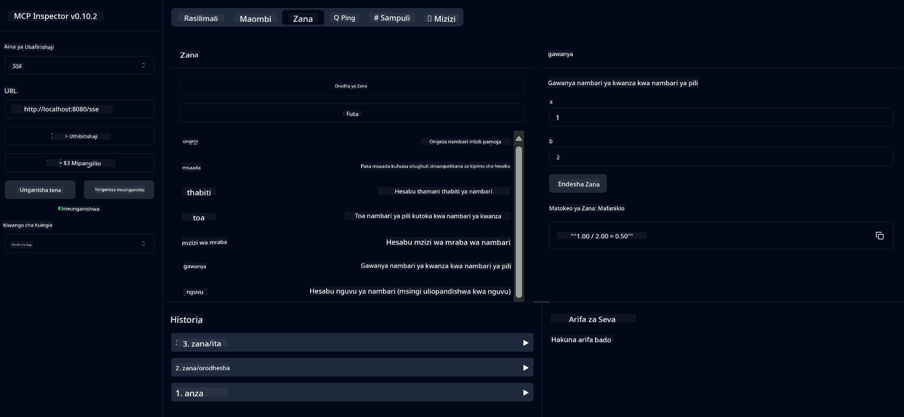

<!--
CO_OP_TRANSLATOR_METADATA:
{
  "original_hash": "ec11ee93f31fdadd94facd3e3d22f9e6",
  "translation_date": "2025-09-09T22:07:25+00:00",
  "source_file": "03-GettingStarted/01-first-server/README.md",
  "language_code": "sw"
}
-->
# Kuanza na MCP

Karibu katika hatua zako za kwanza na Model Context Protocol (MCP)! Ikiwa wewe ni mgeni kwa MCP au unatafuta kuimarisha uelewa wako, mwongozo huu utakusaidia kupitia mchakato muhimu wa usanidi na maendeleo. Utajifunza jinsi MCP inavyowezesha ujumuishaji rahisi kati ya mifano ya AI na programu, na jinsi ya kuandaa mazingira yako haraka kwa ajili ya kujenga na kujaribu suluhisho zinazotumia MCP.

> Kwa ufupi; Ikiwa unajenga programu za AI, unajua kuwa unaweza kuongeza zana na rasilimali nyingine kwenye LLM (large language model), ili kufanya LLM iwe na maarifa zaidi. Hata hivyo, ikiwa utaweka zana na rasilimali hizo kwenye seva, uwezo wa programu na seva unaweza kutumiwa na mteja yeyote akiwa na/asiwe na LLM.

## Muhtasari

Somu hili linatoa mwongozo wa vitendo juu ya jinsi ya kusanidi mazingira ya MCP na kujenga programu zako za kwanza za MCP. Utajifunza jinsi ya kusanidi zana na mifumo muhimu, kujenga seva za msingi za MCP, kuunda programu za mwenyeji, na kujaribu utekelezaji wako.

Model Context Protocol (MCP) ni itifaki ya wazi inayosawazisha jinsi programu zinavyotoa muktadha kwa LLMs. Fikiria MCP kama bandari ya USB-C kwa programu za AI - inatoa njia ya kawaida ya kuunganisha mifano ya AI na vyanzo mbalimbali vya data na zana.

## Malengo ya Kujifunza

Mwisho wa somu hili, utaweza:

- Kuseti mazingira ya maendeleo ya MCP kwa C#, Java, Python, TypeScript, na Rust
- Kujenga na kupeleka seva za msingi za MCP zenye vipengele maalum (rasilimali, maelekezo, na zana)
- Kuunda programu za mwenyeji zinazounganishwa na seva za MCP
- Kujaribu na kurekebisha utekelezaji wa MCP

## Kuseti Mazingira Yako ya MCP

Kabla ya kuanza kufanya kazi na MCP, ni muhimu kuandaa mazingira yako ya maendeleo na kuelewa mtiririko wa kazi wa msingi. Sehemu hii itakuongoza kupitia hatua za awali za usanidi ili kuhakikisha unapata mwanzo mzuri na MCP.

### Mahitaji ya Awali

Kabla ya kuanza maendeleo ya MCP, hakikisha una:

- **Mazingira ya Maendeleo**: Kwa lugha unayochagua (C#, Java, Python, TypeScript, au Rust)
- **IDE/Mhariri**: Visual Studio, Visual Studio Code, IntelliJ, Eclipse, PyCharm, au mhariri wowote wa kisasa wa msimbo
- **Wasimamizi wa Pakiti**: NuGet, Maven/Gradle, pip, npm/yarn, au Cargo
- **Vifunguo vya API**: Kwa huduma zozote za AI unazopanga kutumia katika programu zako za mwenyeji

## Muundo wa Msingi wa Seva ya MCP

Seva ya MCP kwa kawaida inajumuisha:

- **Usanidi wa Seva**: Kuweka bandari, uthibitishaji, na mipangilio mingine
- **Rasilimali**: Data na muktadha unaopatikana kwa LLMs
- **Zana**: Utendaji ambao mifano inaweza kuitumia
- **Maelekezo**: Violezo vya kuzalisha au kuunda maandishi

Hapa kuna mfano rahisi katika TypeScript:

```typescript
import { McpServer, ResourceTemplate } from "@modelcontextprotocol/sdk/server/mcp.js";
import { StdioServerTransport } from "@modelcontextprotocol/sdk/server/stdio.js";
import { z } from "zod";

// Create an MCP server
const server = new McpServer({
  name: "Demo",
  version: "1.0.0"
});

// Add an addition tool
server.tool("add",
  { a: z.number(), b: z.number() },
  async ({ a, b }) => ({
    content: [{ type: "text", text: String(a + b) }]
  })
);

// Add a dynamic greeting resource
server.resource(
  "file",
  // The 'list' parameter controls how the resource lists available files. Setting it to undefined disables listing for this resource.
  new ResourceTemplate("file://{path}", { list: undefined }),
  async (uri, { path }) => ({
    contents: [{
      uri: uri.href,
      text: `File, ${path}!`
    }]
  })
);

// Add a file resource that reads the file contents
server.resource(
  "file",
  new ResourceTemplate("file://{path}", { list: undefined }),
  async (uri, { path }) => {
    let text;
    try {
      text = await fs.readFile(path, "utf8");
    } catch (err) {
      text = `Error reading file: ${err.message}`;
    }
    return {
      contents: [{
        uri: uri.href,
        text
      }]
    };
  }
);

server.prompt(
  "review-code",
  { code: z.string() },
  ({ code }) => ({
    messages: [{
      role: "user",
      content: {
        type: "text",
        text: `Please review this code:\n\n${code}`
      }
    }]
  })
);

// Start receiving messages on stdin and sending messages on stdout
const transport = new StdioServerTransport();
await server.connect(transport);
```

Katika msimbo uliotangulia:

- Tumetumia madarasa muhimu kutoka kwa MCP TypeScript SDK.
- Tumeunda na kusanidi mfano mpya wa seva ya MCP.
- Tumesajili zana maalum (`calculator`) na kazi ya kushughulikia.
- Tumeanzisha seva ili kusikiliza maombi ya MCP yanayoingia.

## Kujaribu na Kurekebisha

Kabla ya kuanza kujaribu seva yako ya MCP, ni muhimu kuelewa zana zinazopatikana na mbinu bora za kurekebisha. Kujaribu kwa ufanisi kunahakikisha seva yako inafanya kazi kama inavyotarajiwa na husaidia kutambua na kutatua masuala haraka. Sehemu inayofuata inaelezea mbinu zinazopendekezwa za kuthibitisha utekelezaji wako wa MCP.

MCP inatoa zana za kukusaidia kujaribu na kurekebisha seva zako:

- **Zana ya Inspector**, kiolesura hiki cha picha hukuruhusu kuunganisha na seva yako na kujaribu zana, maelekezo, na rasilimali zako.
- **curl**, unaweza pia kuunganisha na seva yako kwa kutumia zana ya mstari wa amri kama curl au wateja wengine wanaoweza kuunda na kuendesha amri za HTTP.

### Kutumia MCP Inspector

[MCP Inspector](https://github.com/modelcontextprotocol/inspector) ni zana ya majaribio ya kuona inayokusaidia:

1. **Gundua Uwezo wa Seva**: Tambua rasilimali, zana, na maelekezo yanayopatikana kiotomatiki
2. **Jaribu Utendaji wa Zana**: Jaribu vigezo tofauti na uone majibu papo hapo
3. **Tazama Metadata ya Seva**: Chunguza taarifa za seva, schemas, na usanidi

```bash
# ex TypeScript, installing and running MCP Inspector
npx @modelcontextprotocol/inspector node build/index.js
```

Unapoendesha amri zilizo hapo juu, MCP Inspector itazindua kiolesura cha wavuti cha ndani kwenye kivinjari chako. Unatarajia kuona dashibodi inayoonyesha seva zako za MCP zilizosajiliwa, zana, rasilimali, na maelekezo yanayopatikana. Kiolesura hiki hukuruhusu kujaribu utendaji wa zana kwa njia ya mwingiliano, kuchunguza metadata ya seva, na kuona majibu papo hapo, hivyo kurahisisha uthibitishaji na kurekebisha utekelezaji wa seva zako za MCP.

Hapa kuna picha ya skrini ya jinsi inaweza kuonekana:


## Masuala ya Kawaida ya Usanidi na Suluhisho

| Tatizo | Suluhisho Linalowezekana |
|-------|--------------------------|
| Muunganisho umekataliwa | Hakikisha seva inaendesha na bandari ni sahihi |
| Makosa ya utekelezaji wa zana | Angalia uthibitishaji wa vigezo na utunzaji wa makosa |
| Kushindwa kwa uthibitishaji | Thibitisha funguo za API na ruhusa |
| Makosa ya uthibitishaji wa schema | Hakikisha vigezo vinavyolingana na schema iliyofafanuliwa |
| Seva haianzi | Angalia migogoro ya bandari au utegemezi unaokosekana |
| Makosa ya CORS | Sanidi vichwa sahihi vya CORS kwa maombi ya asili tofauti |
| Masuala ya uthibitishaji | Thibitisha uhalali wa tokeni na ruhusa |

## Maendeleo ya Ndani

Kwa maendeleo ya ndani na majaribio, unaweza kuendesha seva za MCP moja kwa moja kwenye mashine yako:

1. **Anzisha mchakato wa seva**: Endesha programu yako ya seva ya MCP
2. **Sanidi mtandao**: Hakikisha seva inapatikana kwenye bandari inayotarajiwa
3. **Unganisha wateja**: Tumia URL za muunganisho wa ndani kama `http://localhost:3000`

```bash
# Example: Running a TypeScript MCP server locally
npm run start
# Server running at http://localhost:3000
```

## Kujenga Seva Yako ya Kwanza ya MCP

Tumeshughulikia [Mafunzo ya Msingi](/01-CoreConcepts/README.md) katika somu la awali, sasa ni wakati wa kutumia maarifa hayo.

### Kile Seva Inaweza Kufanya

Kabla ya kuanza kuandika msimbo, hebu tukumbuke kile seva inaweza kufanya:

Seva ya MCP inaweza kwa mfano:

- Kupata faili za ndani na hifadhidata
- Kuunganishwa na APIs za mbali
- Kufanya mahesabu
- Kujumuishwa na zana na huduma nyingine
- Kutoa kiolesura cha mtumiaji kwa mwingiliano

Vizuri, sasa tunajua tunachoweza kufanya, hebu tuanze kuandika msimbo.

## Zoezi: Kuunda Seva

Ili kuunda seva, unahitaji kufuata hatua hizi:

- Sakinisha MCP SDK.
- Unda mradi na usanidi muundo wa mradi.
- Andika msimbo wa seva.
- Jaribu seva.

### -1- Unda Mradi

#### TypeScript

```sh
# Create project directory and initialize npm project
mkdir calculator-server
cd calculator-server
npm init -y
```

#### Python

```sh
# Create project dir
mkdir calculator-server
cd calculator-server
# Open the folder in Visual Studio Code - Skip this if you are using a different IDE
code .
```

#### .NET

```sh
dotnet new console -n McpCalculatorServer
cd McpCalculatorServer
```

#### Java

Kwa Java, unda mradi wa Spring Boot:

```bash
curl https://start.spring.io/starter.zip \
  -d dependencies=web \
  -d javaVersion=21 \
  -d type=maven-project \
  -d groupId=com.example \
  -d artifactId=calculator-server \
  -d name=McpServer \
  -d packageName=com.microsoft.mcp.sample.server \
  -o calculator-server.zip
```

Fungua faili ya zip:

```bash
unzip calculator-server.zip -d calculator-server
cd calculator-server
# optional remove the unused test
rm -rf src/test/java
```

Ongeza usanidi kamili ufuatao kwenye faili yako ya *pom.xml*:

```xml
<?xml version="1.0" encoding="UTF-8"?>
<project xmlns="http://maven.apache.org/POM/4.0.0"
    xmlns:xsi="http://www.w3.org/2001/XMLSchema-instance"
    xsi:schemaLocation="http://maven.apache.org/POM/4.0.0 http://maven.apache.org/xsd/maven-4.0.0.xsd">
    <modelVersion>4.0.0</modelVersion>
    
    <!-- Spring Boot parent for dependency management -->
    <parent>
        <groupId>org.springframework.boot</groupId>
        <artifactId>spring-boot-starter-parent</artifactId>
        <version>3.5.0</version>
        <relativePath />
    </parent>

    <!-- Project coordinates -->
    <groupId>com.example</groupId>
    <artifactId>calculator-server</artifactId>
    <version>0.0.1-SNAPSHOT</version>
    <name>Calculator Server</name>
    <description>Basic calculator MCP service for beginners</description>

    <!-- Properties -->
    <properties>
        <java.version>21</java.version>
        <maven.compiler.source>21</maven.compiler.source>
        <maven.compiler.target>21</maven.compiler.target>
    </properties>

    <!-- Spring AI BOM for version management -->
    <dependencyManagement>
        <dependencies>
            <dependency>
                <groupId>org.springframework.ai</groupId>
                <artifactId>spring-ai-bom</artifactId>
                <version>1.0.0-SNAPSHOT</version>
                <type>pom</type>
                <scope>import</scope>
            </dependency>
        </dependencies>
    </dependencyManagement>

    <!-- Dependencies -->
    <dependencies>
        <dependency>
            <groupId>org.springframework.ai</groupId>
            <artifactId>spring-ai-starter-mcp-server-webflux</artifactId>
        </dependency>
        <dependency>
            <groupId>org.springframework.boot</groupId>
            <artifactId>spring-boot-starter-actuator</artifactId>
        </dependency>
        <dependency>
         <groupId>org.springframework.boot</groupId>
         <artifactId>spring-boot-starter-test</artifactId>
         <scope>test</scope>
      </dependency>
    </dependencies>

    <!-- Build configuration -->
    <build>
        <plugins>
            <plugin>
                <groupId>org.springframework.boot</groupId>
                <artifactId>spring-boot-maven-plugin</artifactId>
            </plugin>
            <plugin>
                <groupId>org.apache.maven.plugins</groupId>
                <artifactId>maven-compiler-plugin</artifactId>
                <configuration>
                    <release>21</release>
                </configuration>
            </plugin>
        </plugins>
    </build>

    <!-- Repositories for Spring AI snapshots -->
    <repositories>
        <repository>
            <id>spring-milestones</id>
            <name>Spring Milestones</name>
            <url>https://repo.spring.io/milestone</url>
            <snapshots>
                <enabled>false</enabled>
            </snapshots>
        </repository>
        <repository>
            <id>spring-snapshots</id>
            <name>Spring Snapshots</name>
            <url>https://repo.spring.io/snapshot</url>
            <releases>
                <enabled>false</enabled>
            </releases>
        </repository>
    </repositories>
</project>
```

#### Rust

```sh
mkdir calculator-server
cd calculator-server
cargo init
```

### -2- Ongeza utegemezi

Sasa kwa kuwa umeunda mradi wako, hebu tuongeze utegemezi:

#### TypeScript

```sh
# If not already installed, install TypeScript globally
npm install typescript -g

# Install the MCP SDK and Zod for schema validation
npm install @modelcontextprotocol/sdk zod
npm install -D @types/node typescript
```

#### Python

```sh
# Create a virtual env and install dependencies
python -m venv venv
venv\Scripts\activate
pip install "mcp[cli]"
```

#### Java

```bash
cd calculator-server
./mvnw clean install -DskipTests
```

#### Rust

```sh
cargo add rmcp --features server,transport-io
cargo add serde
cargo add tokio --features rt-multi-thread
```

### -3- Unda faili za mradi

#### TypeScript

Fungua faili ya *package.json* na badilisha maudhui na yafuatayo ili kuhakikisha unaweza kujenga na kuendesha seva:

```json
{
  "name": "calculator-server",
  "version": "1.0.0",
  "main": "index.js",
  "type": "module",
  "scripts": {
    "start": "tsc && node ./build/index.js",
    "build": "tsc && node ./build/index.js"
  },
  "keywords": [],
  "author": "",
  "license": "ISC",
  "description": "A simple calculator server using Model Context Protocol",
  "dependencies": {
    "@modelcontextprotocol/sdk": "^1.16.0",
    "zod": "^3.25.76"
  },
  "devDependencies": {
    "@types/node": "^24.0.14",
    "typescript": "^5.8.3"
  }
}
```

Unda faili ya *tsconfig.json* yenye maudhui yafuatayo:

```json
{
  "compilerOptions": {
    "target": "ES2022",
    "module": "Node16",
    "moduleResolution": "Node16",
    "outDir": "./build",
    "rootDir": "./src",
    "strict": true,
    "esModuleInterop": true,
    "skipLibCheck": true,
    "forceConsistentCasingInFileNames": true
  },
  "include": ["src/**/*"],
  "exclude": ["node_modules"]
}
```

Unda saraka kwa msimbo wako wa chanzo:

```sh
mkdir src
touch src/index.ts
```

#### Python

Unda faili *server.py*

```sh
touch server.py
```

#### .NET

Sakinisha pakiti zinazohitajika za NuGet:

```sh
dotnet add package ModelContextProtocol --prerelease
dotnet add package Microsoft.Extensions.Hosting
```

#### Java

Kwa miradi ya Java Spring Boot, muundo wa mradi huundwa kiotomatiki.

#### Rust

Kwa Rust, faili ya *src/main.rs* huundwa kwa chaguo-msingi unapoendesha `cargo init`. Fungua faili na futa msimbo wa chaguo-msingi.

### -4- Unda msimbo wa seva

#### TypeScript

Unda faili *index.ts* na ongeza msimbo ufuatao:

```typescript
import { McpServer, ResourceTemplate } from "@modelcontextprotocol/sdk/server/mcp.js";
import { StdioServerTransport } from "@modelcontextprotocol/sdk/server/stdio.js";
import { z } from "zod";
 
// Create an MCP server
const server = new McpServer({
  name: "Calculator MCP Server",
  version: "1.0.0"
});
```

Sasa una seva, lakini haifanyi mengi, hebu turekebishe hilo.

#### Python

```python
# server.py
from mcp.server.fastmcp import FastMCP

# Create an MCP server
mcp = FastMCP("Demo")
```

#### .NET

```csharp
using Microsoft.Extensions.DependencyInjection;
using Microsoft.Extensions.Hosting;
using Microsoft.Extensions.Logging;
using ModelContextProtocol.Server;
using System.ComponentModel;

var builder = Host.CreateApplicationBuilder(args);
builder.Logging.AddConsole(consoleLogOptions =>
{
    // Configure all logs to go to stderr
    consoleLogOptions.LogToStandardErrorThreshold = LogLevel.Trace;
});

builder.Services
    .AddMcpServer()
    .WithStdioServerTransport()
    .WithToolsFromAssembly();
await builder.Build().RunAsync();

// add features
```

#### Java

Kwa Java, unda vipengele vya msingi vya seva. Kwanza, badilisha darasa kuu la programu:

*src/main/java/com/microsoft/mcp/sample/server/McpServerApplication.java*:

```java
package com.microsoft.mcp.sample.server;

import org.springframework.ai.tool.ToolCallbackProvider;
import org.springframework.ai.tool.method.MethodToolCallbackProvider;
import org.springframework.boot.SpringApplication;
import org.springframework.boot.autoconfigure.SpringBootApplication;
import org.springframework.context.annotation.Bean;
import com.microsoft.mcp.sample.server.service.CalculatorService;

@SpringBootApplication
public class McpServerApplication {

    public static void main(String[] args) {
        SpringApplication.run(McpServerApplication.class, args);
    }
    
    @Bean
    public ToolCallbackProvider calculatorTools(CalculatorService calculator) {
        return MethodToolCallbackProvider.builder().toolObjects(calculator).build();
    }
}
```

Unda huduma ya calculator *src/main/java/com/microsoft/mcp/sample/server/service/CalculatorService.java*:

```java
package com.microsoft.mcp.sample.server.service;

import org.springframework.ai.tool.annotation.Tool;
import org.springframework.stereotype.Service;

/**
 * Service for basic calculator operations.
 * This service provides simple calculator functionality through MCP.
 */
@Service
public class CalculatorService {

    /**
     * Add two numbers
     * @param a The first number
     * @param b The second number
     * @return The sum of the two numbers
     */
    @Tool(description = "Add two numbers together")
    public String add(double a, double b) {
        double result = a + b;
        return formatResult(a, "+", b, result);
    }

    /**
     * Subtract one number from another
     * @param a The number to subtract from
     * @param b The number to subtract
     * @return The result of the subtraction
     */
    @Tool(description = "Subtract the second number from the first number")
    public String subtract(double a, double b) {
        double result = a - b;
        return formatResult(a, "-", b, result);
    }

    /**
     * Multiply two numbers
     * @param a The first number
     * @param b The second number
     * @return The product of the two numbers
     */
    @Tool(description = "Multiply two numbers together")
    public String multiply(double a, double b) {
        double result = a * b;
        return formatResult(a, "*", b, result);
    }

    /**
     * Divide one number by another
     * @param a The numerator
     * @param b The denominator
     * @return The result of the division
     */
    @Tool(description = "Divide the first number by the second number")
    public String divide(double a, double b) {
        if (b == 0) {
            return "Error: Cannot divide by zero";
        }
        double result = a / b;
        return formatResult(a, "/", b, result);
    }

    /**
     * Calculate the power of a number
     * @param base The base number
     * @param exponent The exponent
     * @return The result of raising the base to the exponent
     */
    @Tool(description = "Calculate the power of a number (base raised to an exponent)")
    public String power(double base, double exponent) {
        double result = Math.pow(base, exponent);
        return formatResult(base, "^", exponent, result);
    }

    /**
     * Calculate the square root of a number
     * @param number The number to find the square root of
     * @return The square root of the number
     */
    @Tool(description = "Calculate the square root of a number")
    public String squareRoot(double number) {
        if (number < 0) {
            return "Error: Cannot calculate square root of a negative number";
        }
        double result = Math.sqrt(number);
        return String.format("√%.2f = %.2f", number, result);
    }

    /**
     * Calculate the modulus (remainder) of division
     * @param a The dividend
     * @param b The divisor
     * @return The remainder of the division
     */
    @Tool(description = "Calculate the remainder when one number is divided by another")
    public String modulus(double a, double b) {
        if (b == 0) {
            return "Error: Cannot divide by zero";
        }
        double result = a % b;
        return formatResult(a, "%", b, result);
    }

    /**
     * Calculate the absolute value of a number
     * @param number The number to find the absolute value of
     * @return The absolute value of the number
     */
    @Tool(description = "Calculate the absolute value of a number")
    public String absolute(double number) {
        double result = Math.abs(number);
        return String.format("|%.2f| = %.2f", number, result);
    }

    /**
     * Get help about available calculator operations
     * @return Information about available operations
     */
    @Tool(description = "Get help about available calculator operations")
    public String help() {
        return "Basic Calculator MCP Service\n\n" +
               "Available operations:\n" +
               "1. add(a, b) - Adds two numbers\n" +
               "2. subtract(a, b) - Subtracts the second number from the first\n" +
               "3. multiply(a, b) - Multiplies two numbers\n" +
               "4. divide(a, b) - Divides the first number by the second\n" +
               "5. power(base, exponent) - Raises a number to a power\n" +
               "6. squareRoot(number) - Calculates the square root\n" + 
               "7. modulus(a, b) - Calculates the remainder of division\n" +
               "8. absolute(number) - Calculates the absolute value\n\n" +
               "Example usage: add(5, 3) will return 5 + 3 = 8";
    }

    /**
     * Format the result of a calculation
     */
    private String formatResult(double a, String operator, double b, double result) {
        return String.format("%.2f %s %.2f = %.2f", a, operator, b, result);
    }
}
```

**Vipengele vya hiari kwa huduma inayofaa kwa uzalishaji:**

Unda usanidi wa kuanzisha *src/main/java/com/microsoft/mcp/sample/server/config/StartupConfig.java*:

```java
package com.microsoft.mcp.sample.server.config;

import org.springframework.boot.CommandLineRunner;
import org.springframework.context.annotation.Bean;
import org.springframework.context.annotation.Configuration;

@Configuration
public class StartupConfig {
    
    @Bean
    public CommandLineRunner startupInfo() {
        return args -> {
            System.out.println("\n" + "=".repeat(60));
            System.out.println("Calculator MCP Server is starting...");
            System.out.println("SSE endpoint: http://localhost:8080/sse");
            System.out.println("Health check: http://localhost:8080/actuator/health");
            System.out.println("=".repeat(60) + "\n");
        };
    }
}
```

Unda mtawala wa afya *src/main/java/com/microsoft/mcp/sample/server/controller/HealthController.java*:

```java
package com.microsoft.mcp.sample.server.controller;

import org.springframework.http.ResponseEntity;
import org.springframework.web.bind.annotation.GetMapping;
import org.springframework.web.bind.annotation.RestController;
import java.time.LocalDateTime;
import java.util.HashMap;
import java.util.Map;

@RestController
public class HealthController {
    
    @GetMapping("/health")
    public ResponseEntity<Map<String, Object>> healthCheck() {
        Map<String, Object> response = new HashMap<>();
        response.put("status", "UP");
        response.put("timestamp", LocalDateTime.now().toString());
        response.put("service", "Calculator MCP Server");
        return ResponseEntity.ok(response);
    }
}
```

Unda mshughulikiaji wa makosa *src/main/java/com/microsoft/mcp/sample/server/exception/GlobalExceptionHandler.java*:

```java
package com.microsoft.mcp.sample.server.exception;

import org.springframework.http.HttpStatus;
import org.springframework.http.ResponseEntity;
import org.springframework.web.bind.annotation.ExceptionHandler;
import org.springframework.web.bind.annotation.RestControllerAdvice;

@RestControllerAdvice
public class GlobalExceptionHandler {

    @ExceptionHandler(IllegalArgumentException.class)
    public ResponseEntity<ErrorResponse> handleIllegalArgumentException(IllegalArgumentException ex) {
        ErrorResponse error = new ErrorResponse(
            "Invalid_Input", 
            "Invalid input parameter: " + ex.getMessage());
        return new ResponseEntity<>(error, HttpStatus.BAD_REQUEST);
    }

    public static class ErrorResponse {
        private String code;
        private String message;

        public ErrorResponse(String code, String message) {
            this.code = code;
            this.message = message;
        }

        // Getters
        public String getCode() { return code; }
        public String getMessage() { return message; }
    }
}
```

Unda bango maalum *src/main/resources/banner.txt*:

```text
_____      _            _       _             
 / ____|    | |          | |     | |            
| |     __ _| | ___ _   _| | __ _| |_ ___  _ __ 
| |    / _` | |/ __| | | | |/ _` | __/ _ \| '__|
| |___| (_| | | (__| |_| | | (_| | || (_) | |   
 \_____\__,_|_|\___|\__,_|_|\__,_|\__\___/|_|   
                                                
Calculator MCP Server v1.0
Spring Boot MCP Application
```

#### Rust

Ongeza msimbo ufuatao juu ya faili ya *src/main.rs*. Hii inaingiza maktaba na moduli muhimu kwa seva yako ya MCP.

```rust
use rmcp::{
    handler::server::{router::tool::ToolRouter, tool::Parameters},
    model::{ServerCapabilities, ServerInfo},
    schemars, tool, tool_handler, tool_router,
    transport::stdio,
    ServerHandler, ServiceExt,
};
use std::error::Error;
```

Seva ya calculator itakuwa rahisi inayoweza kuongeza namba mbili. Hebu tuunde struct kuwakilisha ombi la calculator.

```rust
#[derive(Debug, serde::Deserialize, schemars::JsonSchema)]
pub struct CalculatorRequest {
    pub a: f64,
    pub b: f64,
}
```

Kisha, unda struct kuwakilisha seva ya calculator. Struct hii itashikilia router ya zana, ambayo hutumika kusajili zana.

```rust
#[derive(Debug, Clone)]
pub struct Calculator {
    tool_router: ToolRouter<Self>,
}
```

Sasa, tunaweza kutekeleza struct ya `Calculator` kuunda mfano mpya wa seva na kutekeleza mshughulikiaji wa seva kutoa taarifa za seva.

```rust
#[tool_router]
impl Calculator {
    pub fn new() -> Self {
        Self {
            tool_router: Self::tool_router(),
        }
    }
}

#[tool_handler]
impl ServerHandler for Calculator {
    fn get_info(&self) -> ServerInfo {
        ServerInfo {
            instructions: Some("A simple calculator tool".into()),
            capabilities: ServerCapabilities::builder().enable_tools().build(),
            ..Default::default()
        }
    }
}
```

Hatimaye, tunahitaji kutekeleza kazi kuu ili kuanzisha seva. Kazi hii itaunda mfano wa struct ya `Calculator` na kuuhudumia kupitia pembejeo/pato la kawaida.

```rust
#[tokio::main]
async fn main() -> Result<(), Box<dyn Error>> {
    let service = Calculator::new().serve(stdio()).await?;
    service.waiting().await?;
    Ok(())
}
```

Seva sasa imewekwa kutoa taarifa za msingi kuhusu yenyewe. Ifuatayo, tutaongeza zana ya kufanya hesabu.

### -5- Kuongeza zana na rasilimali

Ongeza zana na rasilimali kwa kuongeza msimbo ufuatao:

#### TypeScript

```typescript
server.tool(
  "add",
  { a: z.number(), b: z.number() },
  async ({ a, b }) => ({
    content: [{ type: "text", text: String(a + b) }]
  })
);

server.resource(
  "greeting",
  new ResourceTemplate("greeting://{name}", { list: undefined }),
  async (uri, { name }) => ({
    contents: [{
      uri: uri.href,
      text: `Hello, ${name}!`
    }]
  })
);
```

Zana yako inachukua vigezo `a` na `b` na inaendesha kazi inayozalisha jibu kwa fomu:

```typescript
{
  contents: [{
    type: "text", content: "some content"
  }]
}
```

Rasilimali yako inapatikana kupitia kamba "greeting" na inachukua kigezo `name` na kutoa jibu linalofanana na zana:

```typescript
{
  uri: "<href>",
  text: "a text"
}
```

#### Python

```python
# Add an addition tool
@mcp.tool()
def add(a: int, b: int) -> int:
    """Add two numbers"""
    return a + b


# Add a dynamic greeting resource
@mcp.resource("greeting://{name}")
def get_greeting(name: str) -> str:
    """Get a personalized greeting"""
    return f"Hello, {name}!"
```

Katika msimbo uliotangulia tumefanya:

- Tumefafanua zana `add` inayochukua vigezo `a` na `p`, vyote vikiwa namba kamili.
- Tumeunda rasilimali inayoitwa `greeting` inayochukua kigezo `name`.

#### .NET

Ongeza hii kwenye faili yako ya Program.cs:

```csharp
[McpServerToolType]
public static class CalculatorTool
{
    [McpServerTool, Description("Adds two numbers")]
    public static string Add(int a, int b) => $"Sum {a + b}";
}
```

#### Java

Zana tayari zimeundwa katika hatua ya awali.

#### Rust

Ongeza zana mpya ndani ya block ya `impl Calculator`:

```rust
#[tool(description = "Adds a and b")]
async fn add(
    &self,
    Parameters(CalculatorRequest { a, b }): Parameters<CalculatorRequest>,
) -> String {
    (a + b).to_string()
}
```

### -6- Msimbo wa mwisho

Hebu tuongeze msimbo wa mwisho tunaohitaji ili seva iweze kuanza:

#### TypeScript

```typescript
// Start receiving messages on stdin and sending messages on stdout
const transport = new StdioServerTransport();
await server.connect(transport);
```

Hapa kuna msimbo kamili:

```typescript
// index.ts
import { McpServer, ResourceTemplate } from "@modelcontextprotocol/sdk/server/mcp.js";
import { StdioServerTransport } from "@modelcontextprotocol/sdk/server/stdio.js";
import { z } from "zod";

// Create an MCP server
const server = new McpServer({
  name: "Calculator MCP Server",
  version: "1.0.0"
});

// Add an addition tool
server.tool(
  "add",
  { a: z.number(), b: z.number() },
  async ({ a, b }) => ({
    content: [{ type: "text", text: String(a + b) }]
  })
);

// Add a dynamic greeting resource
server.resource(
  "greeting",
  new ResourceTemplate("greeting://{name}", { list: undefined }),
  async (uri, { name }) => ({
    contents: [{
      uri: uri.href,
      text: `Hello, ${name}!`
    }]
  })
);

// Start receiving messages on stdin and sending messages on stdout
const transport = new StdioServerTransport();
server.connect(transport);
```

#### Python

```python
# server.py
from mcp.server.fastmcp import FastMCP

# Create an MCP server
mcp = FastMCP("Demo")


# Add an addition tool
@mcp.tool()
def add(a: int, b: int) -> int:
    """Add two numbers"""
    return a + b


# Add a dynamic greeting resource
@mcp.resource("greeting://{name}")
def get_greeting(name: str) -> str:
    """Get a personalized greeting"""
    return f"Hello, {name}!"

# Main execution block - this is required to run the server
if __name__ == "__main__":
    mcp.run()
```

#### .NET

Unda faili ya Program.cs yenye maudhui yafuatayo:

```csharp
using Microsoft.Extensions.DependencyInjection;
using Microsoft.Extensions.Hosting;
using Microsoft.Extensions.Logging;
using ModelContextProtocol.Server;
using System.ComponentModel;

var builder = Host.CreateApplicationBuilder(args);
builder.Logging.AddConsole(consoleLogOptions =>
{
    // Configure all logs to go to stderr
    consoleLogOptions.LogToStandardErrorThreshold = LogLevel.Trace;
});

builder.Services
    .AddMcpServer()
    .WithStdioServerTransport()
    .WithToolsFromAssembly();
await builder.Build().RunAsync();

[McpServerToolType]
public static class CalculatorTool
{
    [McpServerTool, Description("Adds two numbers")]
    public static string Add(int a, int b) => $"Sum {a + b}";
}
```

#### Java

Darasa lako kuu la programu kamili linapaswa kuonekana kama hili:

```java
// McpServerApplication.java
package com.microsoft.mcp.sample.server;

import org.springframework.ai.tool.ToolCallbackProvider;
import org.springframework.ai.tool.method.MethodToolCallbackProvider;
import org.springframework.boot.SpringApplication;
import org.springframework.boot.autoconfigure.SpringBootApplication;
import org.springframework.context.annotation.Bean;
import com.microsoft.mcp.sample.server.service.CalculatorService;

@SpringBootApplication
public class McpServerApplication {

    public static void main(String[] args) {
        SpringApplication.run(McpServerApplication.class, args);
    }
    
    @Bean
    public ToolCallbackProvider calculatorTools(CalculatorService calculator) {
        return MethodToolCallbackProvider.builder().toolObjects(calculator).build();
    }
}
```

#### Rust

Msimbo wa mwisho kwa seva ya Rust unapaswa kuonekana kama huu:

```rust
use rmcp::{
    ServerHandler, ServiceExt,
    handler::server::{router::tool::ToolRouter, tool::Parameters},
    model::{ServerCapabilities, ServerInfo},
    schemars, tool, tool_handler, tool_router,
    transport::stdio,
};
use std::error::Error;

#[derive(Debug, serde::Deserialize, schemars::JsonSchema)]
pub struct CalculatorRequest {
    pub a: f64,
    pub b: f64,
}

#[derive(Debug, Clone)]
pub struct Calculator {
    tool_router: ToolRouter<Self>,
}

#[tool_router]
impl Calculator {
    pub fn new() -> Self {
        Self {
            tool_router: Self::tool_router(),
        }
    }
    
    #[tool(description = "Adds a and b")]
    async fn add(
        &self,
        Parameters(CalculatorRequest { a, b }): Parameters<CalculatorRequest>,
    ) -> String {
        (a + b).to_string()
    }
}

#[tool_handler]
impl ServerHandler for Calculator {
    fn get_info(&self) -> ServerInfo {
        ServerInfo {
            instructions: Some("A simple calculator tool".into()),
            capabilities: ServerCapabilities::builder().enable_tools().build(),
            ..Default::default()
        }
    }
}

#[tokio::main]
async fn main() -> Result<(), Box<dyn Error>> {
    let service = Calculator::new().serve(stdio()).await?;
    service.waiting().await?;
    Ok(())
}
```

### -7- Jaribu seva

Anzisha seva kwa amri ifuatayo:

#### TypeScript

```sh
npm run build
```

#### Python

```sh
mcp run server.py
```

> Ili kutumia MCP Inspector, tumia `mcp dev server.py` ambayo huzindua Inspector kiotomatiki na hutoa tokeni ya kikao cha proxy inayohitajika. Ikiwa unatumia `mcp run server.py`, utahitaji kuanzisha Inspector mwenyewe na kusanidi muunganisho.

#### .NET

Hakikisha uko kwenye saraka ya mradi wako:

```sh
cd McpCalculatorServer
dotnet run
```

#### Java

```bash
./mvnw clean install -DskipTests
java -jar target/calculator-server-0.0.1-SNAPSHOT.jar
```

#### Rust

Endesha amri zifuatazo ili kuunda na kuendesha seva:

```sh
cargo fmt
cargo run
```

### -8- Endesha kwa kutumia Inspector

Inspector ni zana nzuri inayoweza kuanzisha seva yako na kukuruhusu kuingiliana nayo ili kuhakikisha inafanya kazi. Hebu tuanzishe:

> [!NOTE]
> Inaweza kuonekana tofauti katika sehemu ya "command" kwani inajumuisha amri ya kuendesha seva na runtime yako maalum.

#### TypeScript

```sh
npx @modelcontextprotocol/inspector node build/index.js
```

au ongeza kwenye faili yako ya *package.json* kama hivi: `"inspector": "npx @modelcontextprotocol/inspector node build/index.js"` kisha endesha `npm run inspector`

Python inafunika zana ya Node.js inayoitwa inspector. Inawezekana kuiita zana hiyo kama hivi:

```sh
mcp dev server.py
```

Hata hivyo, haitekelezi mbinu zote zinazopatikana kwenye zana hivyo unashauriwa kuendesha zana ya Node.js moja kwa moja kama ilivyo hapa chini:

```sh
npx @modelcontextprotocol/inspector mcp run server.py
```

Ikiwa unatumia zana au IDE inayokuruhusu kusanidi amri na vigezo vya kuendesha script, hakikisha kuweka `python` katika sehemu ya `Command` na `server.py` kama `Arguments`. Hii inahakikisha script inaendesha kwa usahihi.

#### .NET

Hakikisha uko kwenye saraka ya mradi wako:

```sh
cd McpCalculatorServer
npx @modelcontextprotocol/inspector dotnet run
```

#### Java

Hakikisha seva yako ya calculator inaendesha
Kisha endesha Inspector:

```cmd
npx @modelcontextprotocol/inspector
```

Katika kiolesura cha wavuti cha Inspector:

1. Chagua "SSE" kama aina ya usafirishaji
2. Weka URL kuwa: `http://localhost:8080/sse`
3. Bonyeza "Connect"


**Sasa umeunganishwa na seva**  
**Sehemu ya majaribio ya seva ya Java imekamilika sasa**

Sehemu inayofuata inahusu kuingiliana na seva.

Unapaswa kuona kiolesura cha mtumiaji kama ifuatavyo:


1. Unganisha na seva kwa kuchagua kitufe cha Unganisha  
   Mara tu unapounganisha na seva, unapaswa kuona yafuatayo:

   

1. Chagua "Vifaa" na "listTools", unapaswa kuona "Ongeza" ikionekana, chagua "Ongeza" na ujaze thamani za vigezo.

   Unapaswa kuona majibu yafuatayo, yaani matokeo kutoka kwa chombo cha "ongeza":

   

Hongera, umefanikiwa kuunda na kuendesha seva yako ya kwanza!

#### Rust

Kuendesha seva ya Rust na MCP Inspector CLI, tumia amri ifuatayo:

```sh
npx @modelcontextprotocol/inspector cargo run --cli --method tools/call --tool-name add --tool-arg a=1 b=2
```

### SDK Rasmi

MCP inatoa SDK rasmi kwa lugha mbalimbali:

- [C# SDK](https://github.com/modelcontextprotocol/csharp-sdk) - Inasimamiwa kwa ushirikiano na Microsoft  
- [Java SDK](https://github.com/modelcontextprotocol/java-sdk) - Inasimamiwa kwa ushirikiano na Spring AI  
- [TypeScript SDK](https://github.com/modelcontextprotocol/typescript-sdk) - Utekelezaji rasmi wa TypeScript  
- [Python SDK](https://github.com/modelcontextprotocol/python-sdk) - Utekelezaji rasmi wa Python  
- [Kotlin SDK](https://github.com/modelcontextprotocol/kotlin-sdk) - Utekelezaji rasmi wa Kotlin  
- [Swift SDK](https://github.com/modelcontextprotocol/swift-sdk) - Inasimamiwa kwa ushirikiano na Loopwork AI  
- [Rust SDK](https://github.com/modelcontextprotocol/rust-sdk) - Utekelezaji rasmi wa Rust  

## Mambo Muhimu

- Kuweka mazingira ya maendeleo ya MCP ni rahisi kwa kutumia SDK maalum za lugha  
- Kujenga seva za MCP kunahusisha kuunda na kusajili vifaa vyenye miundo wazi  
- Kupima na kurekebisha ni muhimu kwa utekelezaji wa MCP wa kuaminika  

## Sampuli

- [Java Calculator](../samples/java/calculator/README.md)  
- [.Net Calculator](../../../../03-GettingStarted/samples/csharp)  
- [JavaScript Calculator](../samples/javascript/README.md)  
- [TypeScript Calculator](../samples/typescript/README.md)  
- [Python Calculator](../../../../03-GettingStarted/samples/python)  
- [Rust Calculator](../../../../03-GettingStarted/samples/rust)  

## Kazi

Unda seva rahisi ya MCP na chombo unachopendelea:

1. Tekeleza chombo katika lugha unayopendelea (.NET, Java, Python, TypeScript, au Rust).  
2. Fafanua vigezo vya pembejeo na thamani za matokeo.  
3. Endesha chombo cha ukaguzi ili kuhakikisha seva inafanya kazi kama inavyotarajiwa.  
4. Jaribu utekelezaji na pembejeo mbalimbali.  

## Suluhisho

[Suluhisho](./solution/README.md)

## Rasilimali za Ziada

- [Jenga Mawakala kwa kutumia Model Context Protocol kwenye Azure](https://learn.microsoft.com/azure/developer/ai/intro-agents-mcp)  
- [MCP ya Mbali na Azure Container Apps (Node.js/TypeScript/JavaScript)](https://learn.microsoft.com/samples/azure-samples/mcp-container-ts/mcp-container-ts/)  
- [.NET OpenAI MCP Agent](https://learn.microsoft.com/samples/azure-samples/openai-mcp-agent-dotnet/openai-mcp-agent-dotnet/)  

## Nini kinachofuata

Inayofuata: [Kuanza na Wateja wa MCP](../02-client/README.md)

---

**Kanusho**:  
Hati hii imetafsiriwa kwa kutumia huduma ya kutafsiri ya AI [Co-op Translator](https://github.com/Azure/co-op-translator). Ingawa tunajitahidi kuhakikisha usahihi, tafadhali fahamu kuwa tafsiri za kiotomatiki zinaweza kuwa na makosa au kutokuwa sahihi. Hati ya asili katika lugha yake ya awali inapaswa kuzingatiwa kama chanzo cha mamlaka. Kwa taarifa muhimu, tafsiri ya kitaalamu ya binadamu inapendekezwa. Hatutawajibika kwa kutoelewana au tafsiri zisizo sahihi zinazotokana na matumizi ya tafsiri hii.