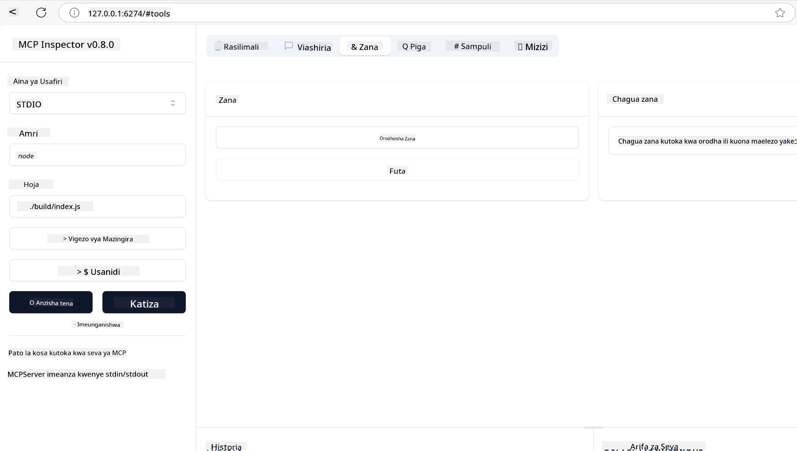
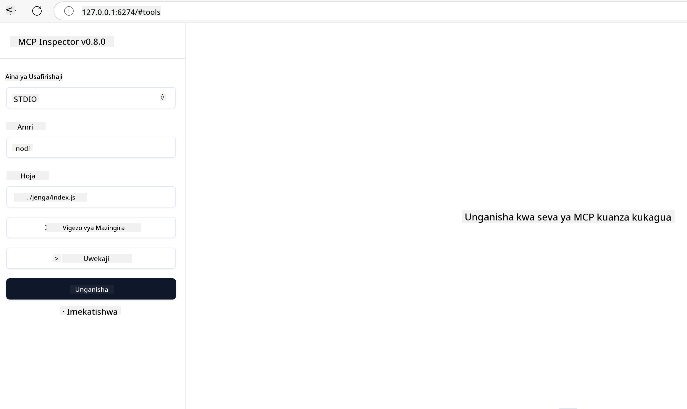
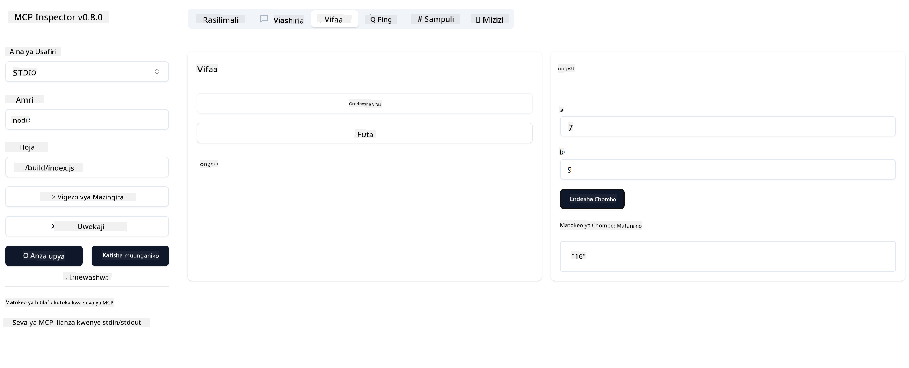

<!--
CO_OP_TRANSLATOR_METADATA:
{
  "original_hash": "5331ffd328a54b90f76706c52b673e27",
  "translation_date": "2025-05-17T08:49:34+00:00",
  "source_file": "03-GettingStarted/01-first-server/README.md",
  "language_code": "sw"
}
-->
# Kuanza na MCP

Karibu kwenye hatua zako za kwanza na Model Context Protocol (MCP)! Ikiwa wewe ni mgeni kwa MCP au unatafuta kuelewa zaidi, mwongozo huu utakupitisha katika mchakato muhimu wa kuanzisha na kuendeleza. Utagundua jinsi MCP inavyowezesha ujumuishaji wa haraka kati ya mifano ya AI na programu, na utajifunza jinsi ya kuandaa mazingira yako kwa haraka kwa ajili ya kujenga na kujaribu suluhisho zinazotumia MCP.

> Kwa kifupi; Ikiwa unajenga programu za AI, unajua kwamba unaweza kuongeza zana na rasilimali nyingine kwenye LLM (large language model), ili kufanya LLM iwe na ujuzi zaidi. Hata hivyo, ikiwa utaweka zana na rasilimali hizo kwenye seva, programu na uwezo wa seva vinaweza kutumiwa na mteja yeyote akiwa na/ bila LLM.

## Muhtasari

Somo hili linatoa mwongozo wa vitendo juu ya kuanzisha mazingira ya MCP na kujenga programu zako za kwanza za MCP. Utajifunza jinsi ya kuanzisha zana na fremu muhimu, kujenga seva za msingi za MCP, kuunda programu za mwenyeji, na kujaribu utekelezaji wako.

Model Context Protocol (MCP) ni itifaki ya wazi inayosawazisha jinsi programu zinavyotoa muktadha kwa LLMs. Fikiria MCP kama bandari ya USB-C kwa programu za AI - inatoa njia iliyosawazishwa ya kuunganisha mifano ya AI na vyanzo mbalimbali vya data na zana.

## Malengo ya Kujifunza

Mwisho wa somo hili, utaweza:

- Kuanzisha mazingira ya maendeleo kwa MCP katika C#, Java, Python, TypeScript, na JavaScript
- Kujenga na kupeleka seva za msingi za MCP zenye vipengele maalum (rasilimali, vidokezo, na zana)
- Kuunda programu za mwenyeji zinazounganisha na seva za MCP
- Kujaribu na kufuta hitilafu za utekelezaji wa MCP

## Kuanzisha Mazingira Yako ya MCP

Kabla ya kuanza kufanya kazi na MCP, ni muhimu kuandaa mazingira yako ya maendeleo na kuelewa mtiririko wa kazi wa msingi. Sehemu hii itakuongoza kupitia hatua za awali za kuanzisha ili kuhakikisha unapata mwanzo mzuri na MCP.

### Mahitaji

Kabla ya kuanza maendeleo ya MCP, hakikisha una:

- **Mazingira ya Maendeleo**: Kwa lugha uliyopendelea (C#, Java, Python, TypeScript, au JavaScript)
- **IDE/Mhariri**: Visual Studio, Visual Studio Code, IntelliJ, Eclipse, PyCharm, au mhariri wowote wa kisasa wa kodi
- **Wakili wa Vifurushi**: NuGet, Maven/Gradle, pip, au npm/yarn
- **Vifunguo vya API**: Kwa huduma zozote za AI unazopanga kutumia katika programu zako za mwenyeji

## Muundo wa Msingi wa Seva ya MCP

Seva ya MCP kawaida inajumuisha:

- **Usanidi wa Seva**: Kuweka bandari, uthibitishaji, na mipangilio mingine
- **Rasilimali**: Data na muktadha unaopatikana kwa LLMs
- **Zana**: Ufanisi ambao mifano inaweza kutumia
- **Vidokezo**: Violezo vya kuzalisha au kuunda maandishi

Hapa kuna mfano rahisi katika TypeScript:

```typescript
import { Server, Tool, Resource } from "@modelcontextprotocol/typescript-server-sdk";

// Create a new MCP server
const server = new Server({
  port: 3000,
  name: "Example MCP Server",
  version: "1.0.0"
});

// Register a tool
server.registerTool({
  name: "calculator",
  description: "Performs basic calculations",
  parameters: {
    expression: {
      type: "string",
      description: "The math expression to evaluate"
    }
  },
  handler: async (params) => {
    const result = eval(params.expression);
    return { result };
  }
});

// Start the server
server.start();
```

Katika kodi iliyotangulia tunafanya:

- Kuagiza madarasa muhimu kutoka SDK ya MCP TypeScript.
- Kuunda na kusanidi mfano mpya wa seva ya MCP.
- Kusajili zana maalum (`calculator`) na kazi ya mpangilio.
- Kuanza seva kusikiliza maombi ya MCP yanayoingia.

## Kujaribu na Kufuta Hitilafu

Kabla ya kuanza kujaribu seva yako ya MCP, ni muhimu kuelewa zana zinazopatikana na mbinu bora za kufuta hitilafu. Kujaribu kwa ufanisi kunahakikisha seva yako inafanya kazi kama inavyotarajiwa na husaidia kutambua na kutatua masuala haraka. Sehemu ifuatayo inaelezea mbinu zinazopendekezwa za kuthibitisha utekelezaji wako wa MCP.

MCP inatoa zana za kukusaidia kujaribu na kufuta hitilafu za seva zako:

- **Zana ya Ukaguzi**, interface hii ya kielelezo inakuruhusu kuunganisha na seva yako na kujaribu zana zako, vidokezo na rasilimali.
- **curl**, unaweza pia kuunganisha na seva yako ukitumia zana ya mstari wa amri kama curl au wateja wengine wanaoweza kuunda na kuendesha amri za HTTP.

### Kutumia MCP Inspector

[MCP Inspector](https://github.com/modelcontextprotocol/inspector) ni zana ya majaribio ya kuona inayokusaidia:

1. **Gundua Uwezo wa Seva**: Tambua moja kwa moja rasilimali zinazopatikana, zana, na vidokezo
2. **Jaribu Utekelezaji wa Zana**: Jaribu vigezo tofauti na uone majibu papo hapo
3. **Tazama Metadata ya Seva**: Chunguza taarifa za seva, schemas, na usanidi

```bash
# ex TypeScript, installing and running MCP Inspector
npx @modelcontextprotocol/inspector node build/index.js
```

Unapoendesha amri zilizo juu, MCP Inspector itazindua interface ya mtandao ya ndani kwenye kivinjari chako. Unaweza kutarajia kuona dashibodi inayoonyesha seva zako za MCP zilizosajiliwa, zana zao zinazopatikana, rasilimali, na vidokezo. Interface inakuwezesha kujaribu utekelezaji wa zana kwa njia ya maingiliano, kuchunguza metadata ya seva, na kuona majibu ya papo hapo, ikifanya iwe rahisi kuthibitisha na kufuta hitilafu za utekelezaji wa seva yako ya MCP.

Hapa kuna picha ya skrini ya jinsi inavyoweza kuonekana:



## Masuala ya Kawaida ya Usanidi na Suluhisho

| Tatizo | Suluhisho Linalowezekana |
|-------|-------------------|
| Muunganisho umekataliwa | Angalia kama seva inaendesha na bandari ni sahihi |
| Hitilafu za utekelezaji wa zana | Angalia uthibitishaji wa vigezo na utunzaji wa hitilafu |
| Kushindwa kwa uthibitishaji | Thibitisha funguo za API na ruhusa |
| Hitilafu za uthibitishaji wa schema | Hakikisha vigezo vinavyolingana na schema iliyofafanuliwa |
| Seva haianzi | Angalia migongano ya bandari au utegemezi unaokosekana |
| Hitilafu za CORS | Sanidi vichwa sahihi vya CORS kwa maombi ya asili tofauti |
| Masuala ya uthibitishaji | Thibitisha uhalali wa tokeni na ruhusa |

## Maendeleo ya Ndani

Kwa maendeleo ya ndani na majaribio, unaweza kuendesha seva za MCP moja kwa moja kwenye mashine yako:

1. **Anzisha mchakato wa seva**: Endesha programu yako ya seva ya MCP
2. **Sanidi mitandao**: Hakikisha seva inapatikana kwenye bandari inayotarajiwa
3. **Unganisha wateja**: Tumia URL za muunganisho wa ndani kama `http://localhost:3000`

```bash
# Example: Running a TypeScript MCP server locally
npm run start
# Server running at http://localhost:3000
```

## Kujenga Seva Yako ya Kwanza ya MCP

Tumeshughulikia [Mambo ya msingi](/01-CoreConcepts/README.md) katika somo la awali, sasa ni wakati wa kutumia maarifa hayo.

### Kile seva inaweza kufanya

Kabla ya kuanza kuandika kodi, hebu tukumbuke tu kile seva inaweza kufanya:

Seva ya MCP inaweza kwa mfano:

- Kufikia faili za ndani na hifadhidata
- Kuunganisha na APIs za mbali
- Kufanya hesabu
- Kujumuisha na zana na huduma nyingine
- Kutoa interface ya mtumiaji kwa maingiliano

Nzuri, sasa tunajua tunachoweza kufanya kwa hiyo, hebu tuanze kuandika kodi.

## Zoezi: Kuunda seva

Ili kuunda seva, unahitaji kufuata hatua hizi:

- Sakinisha SDK ya MCP.
- Unda mradi na uweke muundo wa mradi.
- Andika kodi ya seva.
- Jaribu seva.

### -1- Sakinisha SDK

Hii inatofautiana kidogo kulingana na muda wako uliochagua, kwa hivyo chagua moja ya muda ulio hapa chini:

AI ya kizazi inaweza kutoa maandishi, picha, na hata kodi.
Umepokea mafunzo kwenye data hadi Oktoba 2023.

### -2- Unda mradi

Sasa kwa kuwa umeweka SDK yako, hebu tuunde mradi ufuatao:

### -3- Unda faili za mradi

### -4- Unda kodi ya seva

### -5- Kuongeza zana na rasilimali

Ongeza zana na rasilimali kwa kuongeza kodi ifuatayo:

### -6- Kodi ya mwisho

Hebu tuongeze kodi ya mwisho tunahitaji ili seva ianze:

### -7- Jaribu seva

Anzisha seva kwa amri ifuatayo:

### -8- Endesha kwa kutumia ukaguzi

Ukaguzi ni zana nzuri ambayo inaweza kuanzisha seva yako na inakuruhusu kuingiliana nayo ili uweze kujaribu kwamba inafanya kazi. Hebu tuanze:

> [!NOTE]
> inaweza kuonekana tofauti katika sehemu ya "command" kwani inajumuisha amri ya kuendesha seva na muda wako maalum

Unapaswa kuona interface ifuatayo ya mtumiaji:



1. Unganisha na seva kwa kuchagua kitufe cha Unganisha
   Mara tu unapojiunganisha na seva, unapaswa kuona yafuatayo:

   

1. Chagua "Zana" na "listTools", unapaswa kuona "Ongeza" ikionekana, chagua "Ongeza" na ujaze thamani za vigezo.

   Unapaswa kuona jibu lifuatalo, yaani matokeo kutoka kwa zana ya "add":

   

Hongera, umefanikiwa kuunda na kuendesha seva yako ya kwanza!

### SDKs Rasmi

MCP inatoa SDKs rasmi kwa lugha kadhaa:
- [C# SDK](https://github.com/modelcontextprotocol/csharp-sdk) - Inadumishwa kwa ushirikiano na Microsoft
- [Java SDK](https://github.com/modelcontextprotocol/java-sdk) - Inadumishwa kwa ushirikiano na Spring AI
- [TypeScript SDK](https://github.com/modelcontextprotocol/typescript-sdk) - Utekelezaji rasmi wa TypeScript
- [Python SDK](https://github.com/modelcontextprotocol/python-sdk) - Utekelezaji rasmi wa Python
- [Kotlin SDK](https://github.com/modelcontextprotocol/kotlin-sdk) - Utekelezaji rasmi wa Kotlin
- [Swift SDK](https://github.com/modelcontextprotocol/swift-sdk) - Inadumishwa kwa ushirikiano na Loopwork AI
- [Rust SDK](https://github.com/modelcontextprotocol/rust-sdk) - Utekelezaji rasmi wa Rust

## Dondoo Muhimu

- Kuanzisha mazingira ya maendeleo ya MCP ni rahisi kwa SDKs maalum za lugha
- Kujenga seva za MCP kunahusisha kuunda na kusajili zana na schemas wazi
- Kujaribu na kufuta hitilafu ni muhimu kwa utekelezaji wa MCP wa kuaminika

## Sampuli

- [Java Calculator](../samples/java/calculator/README.md)
- [.Net Calculator](../../../../03-GettingStarted/samples/csharp)
- [JavaScript Calculator](../samples/javascript/README.md)
- [TypeScript Calculator](../samples/typescript/README.md)
- [Python Calculator](../../../../03-GettingStarted/samples/python)

## Kazi

Unda seva rahisi ya MCP na zana unayochagua:
1. Tekeleza zana katika lugha yako unayopendelea (.NET, Java, Python, au JavaScript).
2. Fafanua vigezo vya kuingiza na thamani za kurudi.
3. Endesha zana ya ukaguzi ili kuhakikisha seva inafanya kazi kama ilivyokusudiwa.
4. Jaribu utekelezaji na pembejeo mbalimbali.

## Suluhisho

[Suluhisho](./solution/README.md)

## Rasilimali za Ziada

- [Hifadhi ya GitHub ya MCP](https://github.com/microsoft/mcp-for-beginners)

## Nini kinachofuata

Inayofuata: [Kuanza na Wateja wa MCP](/03-GettingStarted/02-client/README.md)

**Kanusho**:  
Hati hii imetafsiriwa kwa kutumia huduma ya tafsiri ya AI [Co-op Translator](https://github.com/Azure/co-op-translator). Ingawa tunajitahidi kwa usahihi, tafadhali fahamu kuwa tafsiri za kiotomatiki zinaweza kuwa na makosa au kutokuwa sahihi. Hati asili katika lugha yake ya asili inapaswa kuzingatiwa kama chanzo rasmi. Kwa taarifa muhimu, tafsiri ya kitaalamu ya binadamu inapendekezwa. Hatutawajibika kwa kutokuelewana au tafsiri zisizo sahihi zinazotokana na matumizi ya tafsiri hii.